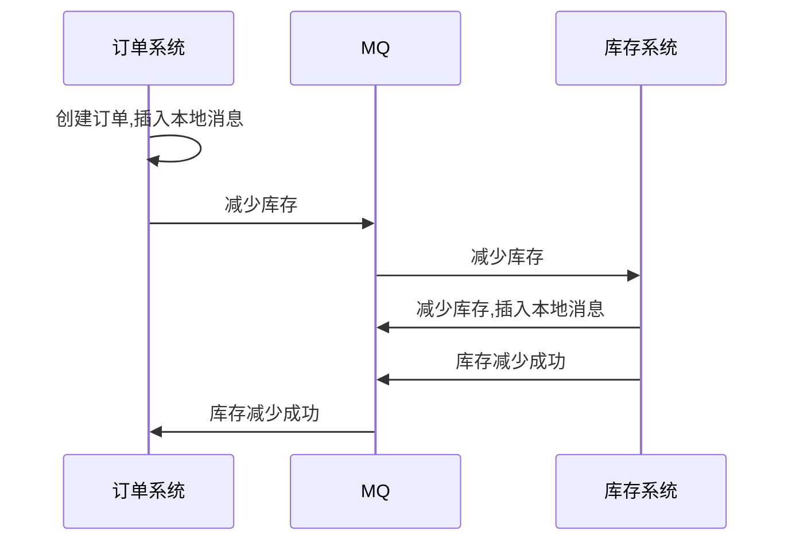
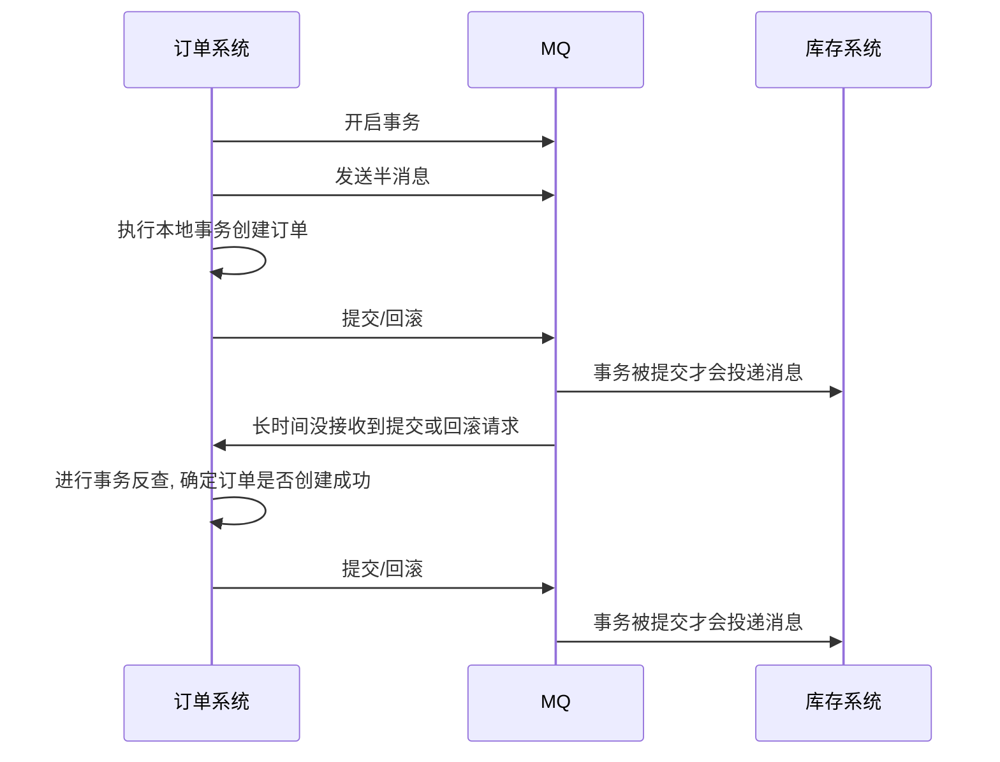

# 分布式事务

> 在分布式系统中一次操作由多个系统协同完成，这种一次事务操作涉及多个系统通过网络协同完成的过程称为分布式事务。

传统基于 XA 的分布式事务，许多 NoSQL 并不支持，同样为了保证较高的一致性，也必须牺牲可用性

## 柔性事务与刚性事务

- 柔性事务满足BASE理论（基本可用，最终一致）
- 刚性事务满足ACID理论

## 解决方案

### 两阶段提交(2PC)


准备阶段：协调者向参与者发起指令，参与者评估自己的状态，如果参与者评估指令可以完成，则会写redo或者undo日志，然后锁定资源，执行操作，但并不提交

提交阶段:如果每个参与者明确返回准备成功，则协调者向参与者发送提交指令，参与者释放锁定的资源，如何任何一个参与者明确返回准备失败，则协调者会发送中止指令，参与者取消已经变更的事务，释放锁定的资源。

准备阶段做了大量的工作，提交阶段是很轻量的，只要网络正常，成功的概率会非常高，分阶段把容易出错的工作和最终提交的步骤隔离开

- 优点：实现强一致性
- 缺点：整个事务的执行需要由协调者在多个节点之间去协调
  - 单点问题：协调者如果发生故障，参与者不能单方面决定是提交还是回滚，需要人工介入
  - 性能问题：所有事务参与者在等待其它参与者响应的时候都处于同步阻塞等待状态，无法进行其它操作
  - 一致性风险：当在提交阶段网络发生异常，只有部分参与者commit了消息，造成数据不一致 任意一个节点失败就会导致整个事务失败

常用的两阶段提交协议是XA

Percolator 对 2PC 做了一些改进：

1. 准备阶段，事务管理器向分片发送 Prepare 请求，包含了具体的数据操作要求，分片接到请求后要做两件事，写日志和添加私有版本，私有版本只有当前事务能够操作，通常其他事务不能读写这条记录，然后从参与事务的分片中随机选择出一个作为主锁
2. 提交阶段，事务管理器只需要和拥有主锁的分片通讯，发送 Commit 指令，后面会有异步的线程让其他分片的私有记录公开化

2PC 往往伴随着很大的延迟，为了缩短写操作的延迟：

- 缓存写提交：提交的写操作先统一缓存在某个节点，后面再一齐发送给其他节点，以此压缩多次写操作的延迟，这种方式的缺点是缓存会成为瓶颈，同时判断事务优先级的方式变成先提交获胜
- 管道：按照顺序将 SQL 转换为 K/V 操作并执行，但是并不等待返回结果，直接执行下一个 K/V 操作，这样延迟就取决于最慢的那次写
- 并行提交：将事务的准备阶段和提交阶段并行执行，写操作和事务状态记录的写入被并行执行，写入的事务状态包括一个新状态“Staging”，表示事务正在进行。客户端得到所有意向写的成功反馈后，可以直接返回调用方事务提交成功，后续再由异步线程确认事务的状态，并落盘维护状态记录

### 三阶段提交(3PC)

为了缓解2PC的缺点 3PC增加了一个询问阶段

询问阶段：协调者询问参与者是否可以完成指令，协调者只需要回答是还是不是，而不需要做真正的操作，这个阶段超时将导致事务中止

准备阶段

提交阶段

三段式提交对单点问题和回滚时的性能问题有所改善，但是它对一致性风险问题并未有任何改进

### 共享事务

通过多个服务共用一个数据源的方式来实现，不过这种方式很鸡肋，因为往往数据库才是整个系统的瓶颈

### 事务补偿(TCC)


- 优点：最终保证数据的一致性，在业务层实现事务控制，不依赖于数据库，灵活性好。
- 缺点：开发成本高，每个事务操作每个参与者都需要实现try/confirm/cancel三个接口，confirm和cancel接口需要是幂等的

### 使用消息队列实现最终一致性

利用[本地消息表](/中间件/消息队列/消息队列.md#消息可靠投递方案)：



在这种方案下，本地消息表是为了保证消息的可靠投递，如果只有事务的一部分成功，事务的其他部分如果失败后就不断重试，直至操作成功或者人工介入

支持事务的消息队列，本质上是TCC：



#### 最大努力通知方案

类似于第三方支付的支付回调 一直进行重试 直到成功为止

#### 本地消息表

- 在分布式事务操作的一方完成写业务数据的操作之后向本地消息表发送一个消息，本地事务能保证这个消息一定会被写入本地消息表中
- 之后将本地消息表中的消息转发到消息队列中，如果转发成功则将消息从本地消息表中删除，否则继续重新转发
- 分布式事务操作的另一方从消息队列中读取一个消息，并执行消息中的操作


#### 补偿的方式

- 生产者一定要将数据投递到MQ服务器中（消息确认机制）
- MQ消费者消息能够正确消费消息，采用手动ACK模式（当消费者消费消息失败，则不确认消息，消息进行重试）
- 当生产者出错回滚，发送到补偿队列的消息会检测生产者的数据是否提交成功，如果没有，则补偿队列的消费者会重新执行一遍生产者没有提交的事务


#### 一个通过消息队列实现最终一致性的案例

反诈项目目前有两个网，一个是公安网，一个是反诈内网，这两个互相隔离的网络，要想进行数据交互，就必须通过数据摆渡服务器来进行，泉州这边基础设施比较完善，可以通过 Kafka 来进行数据摆渡，像别的地方比较落后的，基本上都是通过 FTP 服务器来进行。

这个需求是这样的，数据需要从反诈内网的一个系统发送到公安网的另外一个系统。为了达到两边数据的一致性，就必须引入一些机制来保障。

消息队列使用的是 Kafka。

首先要考虑生产者的消息可靠性投递：

1. 向 Kafka 发送数据要等待 Kafka 的 ack 确认，保证 Kafka 那边接收到
2. 发送数据的同时通过本地事务写消息表，后续发送失败会通过这个消息表不断重试，成功后再删除消息记录

Kafka 需要保证的是数据不丢失，由于 Kafka 是先写到缓存后面再统一刷盘，所以极端情况下像断电是有可能导致 broker 丢数据，使用 min.insync.replicas 来进一步降低丢数据的风险。

最后是消费者的可靠性消费：

1. 配置手动签收数据，避免数据落库前消费者出现什么错误丢数据
2. 做好重复消息消费幂等性处理，这点是通过使用数据库的唯一约束来保障的，一旦唯一 ID 重复，异常就能被捕获，如果传递过来的数据没有 ID，这边就能通过 预警时间 + 手机号 + 数据来源的方式来唯一生成一个ID

除了以上机制外，生产者那边也会定期发送反诈内网的那边的数据总量，接入到公安网这边的监控系统，公安网这边会定期巡检，如果发现两边数据量不一致，就需要让人工介入排查了

### SAGA

（消息驱动的本地事务序列）

通过将事务拆分为一系列正向原子操作T1 T2 ... TN

与一系列的补偿原子操作：C1 C2 ... CN

这些操作都必须保证是幂等的，当事务发生失败，可以采取两种策略：

1. 正向恢复 不断重试T 直至成功
2. 反向恢复 反向执行补偿操作 将数据恢复至原始状态

#### 使用SAGA维护一致性


每一步所产生的子事务都会被写入数据库，必须通过补偿事务的方式来进行回滚。这样的事务缺少隔离性

#### 协作模式

协同式：事务的决策和执行逻辑分布在每个参与方中


编排式：决策和执行逻辑集中在编排器类，由该中心指挥各个参与方


为避免编排器类含有过多的业务逻辑，可通过设计只负责排序的编排器解决这个问题。

#### 实现隔离性

saga包含三种事务类型：

- 可补偿事务
- 关键性事务：执行成功，则saga将一直运行到完成
- 可重复事务

对策：

- 语义锁：通过对数据设置一个PENDING状态避免其他事务修改
- 交换式更新：类似于git版本管理，使用新增数据的方式撤销更新
- 悲观视图：对事务操作重排序，以降低脏读导致的风险
- 重读值：通过重读验证数据未被修改
- 版本文件：通过记录对数据执行的操作，以将不可交换的操作转换为可交换操作
- 业务风险评级：只在低风险业务应用saga

## LCN

### 原理


### 使用

- 启动tx-manager

#### 客户端

- 依赖

```xml
<dependency>
    <groupId>com.codingapi.txlcn</groupId>
    <artifactId>txlcn-tc</artifactId>
    <version>5.0.2.RELEASE</version>
</dependency>

<dependency>
    <groupId>com.codingapi.txlcn</groupId>
    <artifactId>txlcn-txmsg-netty</artifactId>
    <version>5.0.2.RELEASE</version>
</dependency>
```

- 配置

```java
@EnableDistributedTransaction
```

- 使用

发起者

```java
@LcnTransaction
@Transactional(rollbackFor = Exception.class)
public void consume(){
    jdbcTemplate.update("INSERT INTO tb_order VALUES(1,1,'test')");
    String result = producerRemote.home();
}
```

参与者

```java
@LcnTransaction
@Transactional(rollbackFor = Exception.class)
public String home() {
    jdbcTemplate.update("UPDATE stock SET stock = stock -1 WHERE product_id = 1");
    return name+port;
}
```

### 集群

- 启动多台tx-manager
- 发起者与参与者配置地址

```properties
tx-lcn.client.manager-address=127.0.0.1:8070,127.0.0.1:8071
```
