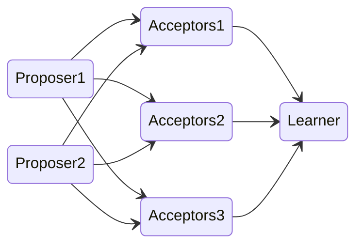
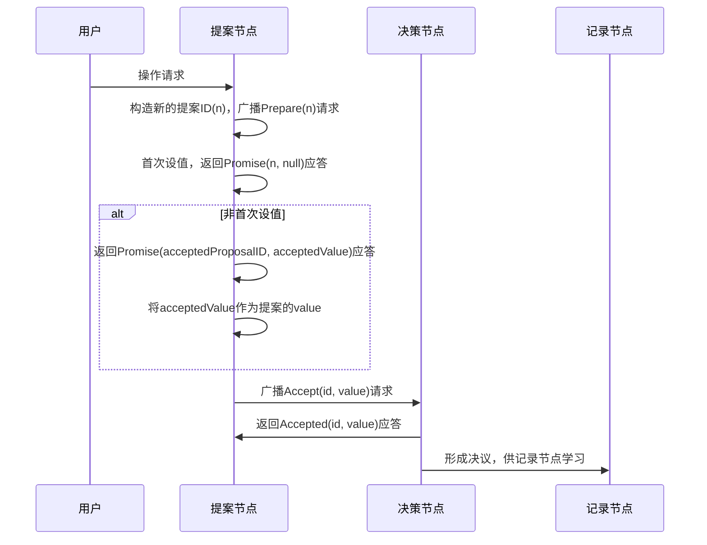
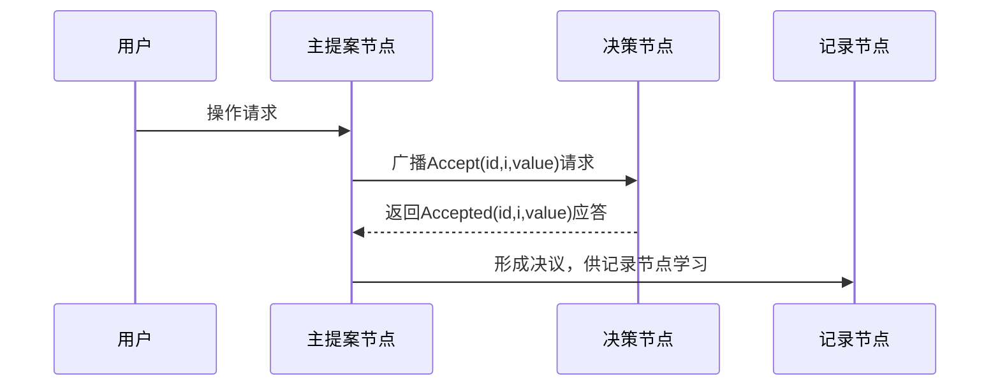
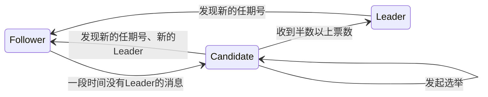

# 分布式共识算法

算法         | 拜占庭容错 | 一致性   | 性能 | 可用性
---------- | ----- | ----- | -- | ---
2PC        | 否     | 强一致性  | 低  | 低
TCC        | 否     | 最终一致性 | 低  | 低
Paxos      | 否     | 强一致性  | 中  | 中
ZAB        | 否     | 最终一致性 | 中  | 中
Raft       | 否     | 强一致性  | 中  | 中
Gossip     | 否     | 最终一致性 | 高  | 高
Quorum NWR | 否     | 强一致性  | 中  | 中
PBFT       | 是     | N/A   | 低  | 中
POW        | 是     | N/A   | 低  | 中

一份随时可能发生变化的数据如何在不同集群节点之间同步：

- 状态转移：通过全同步复制的方式，只有所有节点都完成更改，数据才算写入成功
- 操作转移：保证节点初始状态与接收到的操作序列一直 最终数据也能保持一致

一旦系统中过半数的节点中完成了状态的转换，就认为数据的变化已经被正确地存储在系统当中，这样就可以容忍少数（通常是不超过半数）的节点失联，使得增加机器数量对系统整体的可用性变成是有益的，这种思想在分布式中被称为“Quorum机制“

半数机制，如果遇到网络分区，网络分区少数的那一方就肯定不会产生 Leader，也是为了避免脑裂的产生

在分布式系统中，解决共识的复杂度在于：

1. 网络各个节点通讯不可靠 消息可能会延迟或者丢失
2. 系统对外提供的访问是可以并发的

当以下3个问题被同时解决，即达成共识：

- 如何选主
- 如何将数据复制到各个节点
- 如何保证过程安全

共识算法必须满足的性质：

- 协商一致性 所有节点都接受相同的提议
- 完整性  针对一项提议不能有 两次决定
- 有效性 如果决定了某一项提议 则该提议应该是某个节点提出来的
- 可终止性 节点如果不崩溃则最终一定可以达成决议

## 分布式互斥算法

分布式系统中，排他性的资源访问方式，叫作分布式互斥（Distributed Mutual Exclusion），而被互斥访问的共享资源就叫作临界资源（Critical Resource）

- 集中式算法：引入一个协调者程序，得到一个分布式互斥算法。每个程序在需要访问临界资源时，先给协调者发送一个请求，协调者通过后程序才能访问，否则进行排队
- 分布式算法：当一个程序要访问临界资源时，先向系统中的其他程序发送一条请求消息，在接收到所有程序返回的同意消息后，才可以访问临界资源
- 令牌环算法：所有程序构成一个环结构，令牌按照顺时针（或逆时针）方向在程序之间传递，收到令牌的程序有权访问临界资源，访问完成后将令牌传送到下一个程序；若该程序不需要访问临界资源，则直接把令牌传送给下一个程序

## 分布式选举算法

### Bully 算法

它的假设集群中每个节点均知道其他节点的 ID，选举过程：

1. 集群中每个节点判断自己的 ID 是否为当前活着的节点中 ID 最大的，如果是，则直接向其他节点发送 Victory 消息，宣誓自己的主权
2. 如果自己不是当前活着的节点中 ID 最大的，则向比自己 ID 大的所有节点发送 Election 消息，并等待其他节点的回复
3. 若在给定的时间范围内，本节点没有收到其他节点回复的 Alive 消息，则认为自己成为主节点，并向其他节点发送 Victory 消息，宣誓自己成为主节点；若接收到来自比自己 ID 大的节点的 Alive 消息，则等待其他节点发送 Victory 消息
4. 若本节点收到比自己 ID 小的节点发送的 Election 消息，则回复一个 Alive 消息，告知其他节点，我比你大，重新选举

## 拜占庭将军问题

### 口信模型

如果叛将人数为 m，将军人数不能少于 3m + 1，n 位将军，最多能容忍 (n - 1) / 3 位叛将

通过少数服从多数，并使用兜底预案来达成共识

### 签名机制

每个节点收到一条消息后，都在后面追加自己的签名，并把消息转发给所有其他不在还没签名的节点。最终，每一条消息，都会经过所有节点的签名，按约定的排序和选取算法，可靠节点会做出相同的选择

## Paxos

- 节点之间如何就某个值（提案 Value）达成共识

### 节点类型

- 提议者（Proposer）：提议一个值
- 决策者（Acceptor）：对每个提议进行投票，并存储接受的值
- 记录者（Learner）：被告知投票的结果，不参与投票过程，接受达成共识的值，存储保存

基本 Paxos 架构。许多提议者向接受者提出提议。当接受者接受一个值时，它会将结果发送给学习者节点

Paxos描述了这样一个场景，有一个叫做Paxos的小岛(Island)上面住了一批居民，岛上面所有的事情由一些特殊的人决定，他们叫做议员(Senator)。议员的总数(Senator Count)是确定的，不能更改。岛上每次环境事务的变更都需要通过一个提议(Proposal)，每个提议都有一个编号(PID)，这个编号是一直增长的，不能倒退。每个提议都需要超过半数((Senator Count)/2 +1)的议员同意才能生效。**每个议员只会同意大于当前编号的提议**，包括已生效的和未生效的。如果议员收到小于等于当前编号的提议，他会拒绝，并告知对方：你的提议已经有人提过了。这里的当前编号是每个议员在自己记事本上面记录的编号，他不断更新这个编号。整个议会不能保证所有议员记事本上的编号总是相同的。现在议会有一个目标：保证所有的议员对于提议都能达成一致的看法

一些paxos原型描述:<https://www.douban.com/note/208430424/>

最原先的Paxos被称为 Basic Paxos，但这个算法如果两个提案节点互不相让地争相提出自己的提案，抢占同一个值的修改权限，就会产生活锁问题

### 准备阶段

提议者分别向所有接受者发送包含提案编号的准备请求

接受者接受到这准备请求后，如果该编号大于当前接收者已经响应过的准备请求的编号，那么其就会将接受过的编号最大的提案（如果有的话）作为响应返回给提议者，同时该接受者承诺不再接受任何编号小于该编号的提案

### 接受阶段

如果提议者收到半数以上接受者对其发出的准备请求的响应，那么提议者就会发送一个针对[编号,V]提案的Accept请求给半数以上的接收者，V就是收到的响应中编号最大的提案的value，如果响应中不包含任何提案，那么V就由提议者自己决定

当接受者通过了一个提案时，就通知给所有的学习者。当学习者发现大多数的接受者都通过了某个提案，那么它也通过该提案

## Multi Paxos

Multi Paxos对Basic Paxos的核心改进是增加了“选主”的过程

一旦系统有了主节点，用户的操作请求都将直接在主提案节点上操作，通过减少非必须的协商步骤来提升性能：

这就跟zk的算法很像了

实现数据的复制同步只需达到节点总数的一半就可以提交 数据将会生效

许多说法都会提出为了防止产生网络分区导致的脑裂问题，也就是说节点之间网络不通，但节点是还能够向外提供服务，所以通过设置节点数不能小于总数的一半，但实际上这种情况十分少见。 本质上，容忍一半以下节点更多地是为了允许一定量的节点下线，是为了可用性

### Raft

- Replication and Fault Tolerant

分布式一致性协议，主要解决三个问题

让系统里始终有一个 Leader，所有的数据写入，都是发送到 Leader，Leader 需要把对应的数据写入复制到其他的服务器上，这就决定了 Raft 需要解决以下几个问题：

- 主节点竞选
- 日志复制
- 安全性问题

#### 主节点竞选

有三种节点：Follower、Candidate 和 Leader。

- Leader 会周期性的发送心跳包给 Follower。
- 每个 Follower 都设置了一个随机的竞选超时时间，一般为 150ms~300ms
- 如果在这个时间内没有收到 Leader 的心跳包，就会变成 Candidate，进入竞选阶段
- 竞选阶段Candidate会向其他节点发送投票请求，Follower同意投票则向该Candidate回复同意投票
- 当 Candidate获得超过半数票时，就成为Leader节点，如果有多个Candidate获得相同的票数，则重新开始投票

多个候选人同时发起选举，导致选票被瓜分，没有候选人获得半数选票，选举失败，所以每个节点设置的随机竞选超时时间不同，因此下一次再次出现多个 Candidate 瓜分选票的概率很低

每一任新的领导人出现，都会带有一个任期（term），任期是连续的整数，充当逻辑时钟。任期时长不确定，只要网络不发生大面积分区，而且超过半数的节点和 Leader 一直可以正常工作，这届任期可能就会非常长，通过任期可以比较各个节点的数据新旧、识别过期的 Leader 等。

如果一个候选人或者领导者，发现自己的任期编号比其他节点小，那么它会立即恢复成跟随者状态，如果一个节点接收到一个包含较小的任期编号值的请求，那么它会直接拒绝这个请求

#### 日志复制

- 为了解决多个节点的[复制状态机](/软件工程/架构/系统设计/分布式/分布式数据.md#复制)的一致性问题

Raft 对“已提交”的条件定义也很简单有效，如果一个日志被 Leader 复制到大多数节点，日志就算被提交了，这点跟[Kafka的生产者](/中间件/消息队列/Kafka/生产者.md#生产者)提交一样

#### 成员变更

当集群里的机器发生变更时，Raft 引入了一个过渡共识的状态，处于这个状态的算法：

- 所有的日志追加写入，都会复制到新老配置里所有的服务器
- 新老配置里的任何一个服务器，都有可能被选举成 Leader 节点
- 无论是选举，还是达成共识后提交日志，投票需要同时满足旧配置里半数以上服务器的通过，而且也需要新配置里半数以上服务器的通过

类似于数据迁移的双写策略

#### 数据同步

- 自客户端的修改都会被传入 Leader。此时该修改还未被提交，只是写入日志中
- Leader 会把修改复制到所有 Follower
- Leader 会等待大多数的 Follower 也进行了修改，然后才将修改提交
- 此时 Leader 会通知的所有 Follower 让它们也提交修改，此时所有节点的值达成一致

#### 安全性问题

通过给选举和日志复制增加一系列规则，来实现 Raft 算法的安全性

切换新 Leader 之后，新的 Leader 可能没有同步到最新的日志写入。而这可能会导致，新的 Leader 会尝试覆盖之前 Leader 已经写入的数据

想要确保 Leader 的日志是最新的，只需要在 Leader 选举的时候，让只有最新日志的 Leader 才能被选上就好，即当节点收到选举投票的时候，需检查候选者的最后一条日志中的任期号，若小于自己则拒绝投票。如果任期号相同，日志却比自己短，也拒绝为其投票

日志匹配：

- 不同日志中的两个记录，如果拥有相同的任期和索引，它们的内容相同。
- 不同日志中的两个记录，如果拥有相同的任期和索引，它们之前的内容也相同

如果某个日志条目在某个任期号中已经被提交，该记录必定出现在更大任期号的所有领导人中，限制 Candidate 提交选举请求的时候，必须至少和 Follower 的日志一样新，才可以获得选票

## Goossip协议

最终一致性的分布式共识协议

- 系统中不一致的状态有可能会在一定时间内被外部直接观察到

### 直接邮寄

直接发送更新数据，当数据发送失败时，将数据缓存下来，然后重传，可能会因为缓存队列满了而丢数据

### 反熵

- 全量同步数据

每隔段时间就随机选择某个其他节点，然后通过互相交换自己的所有数据来消除两者之间的差异，实现数据的最终一致性

### 传谣

- 只对外发送变更消息，周期性地联系其他节点发送新数据，直到所有的节点都存储了该新数据

## Quorum NWR

- N：表示集群中同一份数据有多少个副本
- W：成功完成 W 个副本更新，才完成写操作
- R：读取一个数据对象时需要读 R 个副本

- 当 W + R > N 的时候，W和R肯定会有重叠的副本，对于客户端来讲，整个系统能保证强一致性（客户端一致性，多了层筛选，每次都选最新的，这样对上层业务就是一致的了）
- W + R <= N 的时候，对于客户端来讲，整个系统只能保证最终一致性

## PBFT

前提：

1. 消息来源无法伪造
2. 基于大多数原则（2f + 1）实现共识 f为叛徒数

主节点叛变了怎么办？

如果恶意节点当选了主节点，此时无论忠诚节点数多少，忠诚节点们将都无法达成共识

当客户端发现主节点是叛徒时，就可以向其他可信节点发送指令，这些节点就可以在自己选举出新的可信主节点

## PoW

- 工作量证明，增加作恶的成本

请求方做了一些运算，解决了某个问题，然后把运算结果发送给验证方，进行核验，验证方根据运算结果，这个过程是不对称的，运算要耗费较多的资源，但易于验证

给定一个随机值，如果其哈希值满足特定形式，工作就完成，验证方验证变更的字符串是不是真的满足这个形式来验证通过

区块链的工作证明是通过对区块头执行 SHA256 哈希运算，得到小于目标值（动态调整的公共值，像比特币这个值现在正在越调越小）的哈希值，来证明自己的工作量，只有验证通过后，当前区块才会被加入链中

## 共识的局限性

- 投票节点数量是固定的
- 依赖超时机制
- 对网络问题敏感
