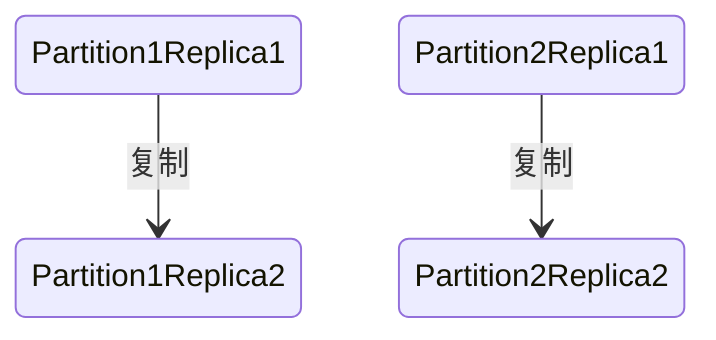

# 分布式数据存储

于各种各样的原因，将数据库分布到多台机器上：

- 可伸缩性：读取负载、写入负载超出单台机器的处理能力，可以将负载分散到多台计算机上
- 可用性：使用多台机器，以提供冗余。一台故障时，另一台可以接管
- 延迟：让每个用户可以从地理上最近的数据中心获取服务

共享架构：通过共享数据存储的方式来进行扩展

无共享架构：通过水平扩展来提升性能

## 复制

- 在多个节点保存相同数据的副本，每个副本具体的物理位置可能不尽相同

几乎所有的存储系统和数据库，都是用[复制状态机](https://en.wikipedia.org/wiki/State_machine_replication)这一套方法来解决备份恢复和数据复制问题

分片元数据的存储：

1. 静态分片：分片过程中，元数据不会发生变化的情况下，将元数据复制多份放在对应的工作节点上的分片方式
2. 动态分片：在寻址过程中会不断地更新分片元数据，促成各节点元数据达成一致

**如无必要，勿增副本**：避免人为引入不一致性

### 主从复制

同步复制的问题在于主库需要确认从库写入成功，才会响应客户写入成功

新从库加入：通过读取快照 + 追赶快照后的变更方式来达到可用性与一致性的折中

如果想追求强一致性，其必须使用"顺序投票"的方式来保证日志的一致性和正确性，每个节点必须按照一定的顺序将日志追加到本地的日志中，然后将其发送给其他节点进行复制。在这个过程中，如果有一个节点的复制过程出现了问题，比如网络故障或者节点故障，那么后续的节点都必须等待它完成复制，否则就会产生日志的空洞，所以不同的事务无法并行

tidb通过以下几点优化了raft:

1. 批操作（Batch）：Leader 缓存多个客户端请求，然后将这一批日志批量发送给 Follower
2. 流水线（Pipeline）：Leader 本地增加一个变量（NextIndex），每次发送一个 Batch 后，更新 NextIndex 记录下一个 Batch 的位置，然后不等待 Follower 返回，马上发送下一个 Batch
3. 并行追加日志（Append Log Parallelly）：Leader 将 Batch 发送给 Follower 的同时，并发执行本地的 Append 操作
4. 异步应用日志（Asynchronous Apply）：异步更新数据

#### 节点宕机恢复

1. 从库挂了：重连主库后追赶恢复
2. 主库挂了：故障切换
  - 使用超时判定主库是否宕机
  - [共识算法](/软件工程/架构/系统设计/分布式/分布式共识算法.md)选举出新主库
  - 老主库重新上线变成从库

故障切换带来的问题：

- 异步复制造成新老主库数据冲突
- 脑裂问题
- 丢弃写入内容造成一些其他问题

### 复制日志实现

- 基于语句的复制：直接发送SQL语句，但这种方式如果语句中含有非确定性函数或者副作用，则这种方式不能保证数据的正确性
- 传输预写式日志：直接传输字节序列，但这种方式跟具体的数据库引擎版本绑定 可能会引入数据不兼容
- 逻辑日志复制：使用独立的存储格式来表达数据的增删改
- 基于触发器的复制：开销更大

### 复制延迟

如果停止写入数据库并等待一段时间，从库最终会赶上并与主库保持一致。出于这个原因，这种效应被称为 [最终一致性](/软件工程/架构/系统设计/分布式/分布式理论.md#BASE)（eventually consistency）

为了保证读己之写一致性（read-your-writes consistency），使用这么样几个方法：

- 如果某些数据只能由用户自己更新，则这份数据直接从主库读取
- 用户记录最后一次写入时间戳，如果去读取从库，则要保证自这个时间戳之后的数据已经同步到从库
- 如果数据分布在多个数据中心，则要保证同一用户请求路由的同一性

#### 读写一致性

- 写后读一致性（Read after Write Consistency）

自己写入成功的任何数据，下一刻一定能读取到，其内容保证与自己最后一次写入完全一致

#### 单调读一致性

一个比强一致性（strong consistency）更弱，但比最终一致性（eventually consistency）更强的保证，保证每次读取的数据不会比上一次读取的老。

实现的一种方式是确保每个用户总是从固定的副本读取数据

#### 前缀读一致性（consistent prefix reads）

如果一系列写入按某个顺序发生，那么任何人读取这些写入时，也会看见它们以同样的顺序出现

#### 线性一致性

建立在事件的先后顺序之上的。在线性一致性下，整个系统表现得好像只有一个副本，所有操作被记录在一条时间线上，并且被原子化，这样任意两个事件都可以比较先后顺序

#### 因果一致性

这种一致性模型确保了系统的状态演变符合事件的因果顺序，即，如果一个操作A因果上影响了另一个操作B，那么系统中的所有节点必须在执行B之前看到A的结果

### 多主复制

应用场景：

- 数据中心
- 离线多客户端数据同步
- 协作编辑

#### 写入冲突

为了解决这个问题，写入时使用一个主库来避免冲突

如果无法避免冲突，则使用冲突合并：

1. 丢弃比较老的写入 也就是最后写入者获胜
2. 参考git，记录冲突并在应用层处理

冲突解决逻辑：

1. 写时执行：测到复制更改日志中存在冲突，就会调用冲突处理程序
2. 读时执行：当检测到冲突时，所有冲突写入被存储。下一次读取数据时，会将这些多个版本的数据返回给应用程序。应用程序可能会提示用户或自动解决冲突

#### 多主复制拓扑结构

前两种拓扑结构会出现单点故障，而最后一种虽然不会单点故障，但是如果不特别处理，很容易就会出现写入顺序不一致的问题

### 无主复制

客户端可以自由选择节点进行写入，这个被选择的节点充当协调者，将数据写入到自身或者其他节点

为了解决旧节点重新上线造成的新老节点数据不一致问题，不仅写需要写入到所有节点，同时读也要读多个节点，以此来判定数据的最新值

#### 读写quorum

- 法定票数读写

写操作只有法定票数节点成功才会认为最终写入成功，而读操作也通过读取所有，取法定票数的值作为最终结果 

这个值一般为过半 也就是如果有3个节点 则法定票数为2 当然为了性能可以降低法定票数 但可以容忍的故障节点就会降低

这种方式的一些问题：

- 无法监控到旧值落后

#### 检测并发写

- 最后写入胜利

为每个写入附加一个时间戳，挑选最“最近”的最大时间戳，并丢弃具有较早时间戳的任何写入。这种冲突解决算法被称为最后写入胜利（LWW, last write wins）

- 版本号

客户端写需要带上上次的版本号，当发现不是最新的，服务端返回最新版本的值由客户端进行合并

需要注意的是如果新版的数据增加值，那还好办，但是如果新版的数据是删除了数据，则需要引入墓碑机制，标志哪些数据被删掉了

- 版本矢量

版本号用来比较数据 版本矢量用来比较状态

## 分区

- 将大块数据拆分成较小子集，分配给不同节点

- 分区的策略：hash、range
- 分区的调度：动态、静态

### 键值数据分区

如果分区不公平，则会产生偏斜（skew），进而出现高负载的热点（hot spot）。避免这个问题的最简单方式是随机分配数据的节点，但这样的话必须并行查询所有节点以获取数据。

- 根据键的范围分区
- 根据键的散列值分区

如果单纯使用散列值进行分区会无法进行范围查询，所以一种折中的方式是使用多个列，主键进行散列，次键用来进行范围查找

哈希能有效帮助减少热点，但还不够，为了消除某些极端情况诸如单个键的数据热点，可以对散列键加上随机数，让其继续分布存储在不同的分区中。

普通哈希可以均衡数据分布，缺点就是扩展性不好，一致性哈希扩展性好，但是仍无法处理业务热点。

范围分区也只支持静态分片，虽然可以预估业务热点，但无法根据业务灵活调整

动态分区可以自动完成分裂与合并，也可以根据访问压力调度分片，只有动态了，才能自适应各种业务场景下的数据变化，平衡存储、访问压力、分布式事务和访问链路延时等多方面的诉求

对于 NewSQL 来说，分片是高可靠的最小单元；而对于 PGXC，分片的高可靠要依附于节点的高可靠，NewSQL 架构下，分片采用 Paxos 或 Raft 算法可以构成复制组，这种复制机制相比 PGXC 的主备节点复制，提供了更高的可靠性

### 二级索引

- 用来加速查询

基于分区的二级索引需要查询所有分区，再进行合并

基于词条则特定的索引都会在特定的分区，可避免查询所有分区

### 分区再平衡

将负载从集群中的一个节点向另一个节点移动的过程称为再平衡（reblancing）

几个最低要求：

- 平衡之后，负载在各个节点也要平衡
- 平衡时，应也能同时对外提供服务
- 节点之间只移动必须的数据，以便快速再平衡

#### 策略

##### 最差的方案

hash mod N 

这种方案一旦节点数量发生变化，所有数据都得全部移动

##### 固定数量分区

当新增节点时，每个节点分出一定的分区给新节点

当减少节点时：减少节点上的分区由剩下的节点分担

##### 动态分区

按键的范围进行分区的数据库会动态创建分区。当分区增长到超过配置的大小时，会被分成两个分区，每个分区约占一半的数据。与之相反，如果大量数据被删除并且分区缩小到某个阈值以下，则可以将其与相邻分区合并

##### 按节点比列分区

当一个新节点加入集群时，它随机选择固定数量的现有分区进行拆分，然后占有这些拆分分区中每个分区的一半，同时将每个分区的另一半留在原地

#### 自动化再平衡的问题

完全自动化的再平衡可能会出现问题，如某些节点过载被认为宕机，此时将其的负载分摊到其他节点上面，这可能会导致节点和网络造成额外的负载，从而使情况变得更糟。再平衡的过程中有人参与是一件好事。这比完全自动的过程慢，但可以帮助防止运维意外

### 请求路由

为了获取整个集群的元数据情况，有两种方式：

1. 通过如zk这样的元数据管理服务
2. 使用如gossip这种协议

### 透明性

数据对于用户来说如果是透明的：

- 分片透明性：用户不要求知道关系是如何分片
- 复制透明性：用户不需要知道数据有没有被复制，被复制到哪
- 位置透明性：用户无须知道数据的物理位置

实现上述透明性的方式是引入命名服务器，或者称之为元数据库
