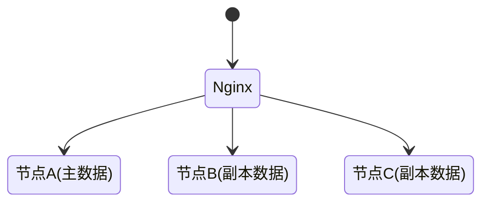
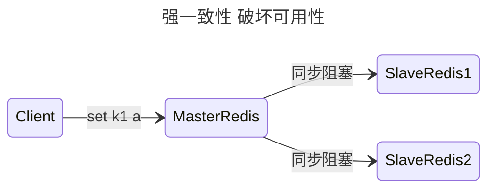
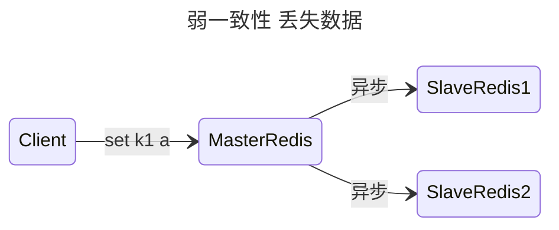
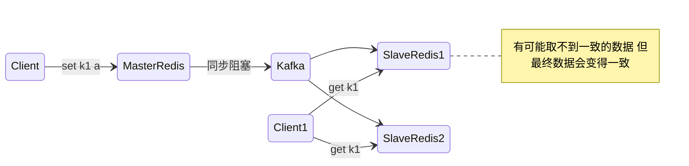

# 分布式理论

## CAP

> CAP定理中的一些概念与通常理解并不一致, 围绕CAP有很多的困扰和误解
> - CAP定理的适用场景是副本型分布式系统, CAP 关注的是对数据的读写操作，而不是分布式系统的所有功能
> - CAP中的一致性，是指线性读写一致性, 就是有一个全局的时间轴，每一个操作都对应到时间轴上的一个时间点，所有客户端看到的都是这个时间轴上的顺序
> - CAP中的可用性，是指在某一次读操作中，即便发现不一致，也要在合理时间内返回合理响应, 跟传统理解的可用性（自动摘除故障节点，即冗余）并不一样

- 一致性(Consistency)：服务A、B、C三个结点都存储了用户数据， 三个结点的数据需要保持同一时刻数据一致性。
  - 对系统的一个数据更新成功之后，如果所有用户都能够读取到最新的值，该系统就被认为具有强一致性
- 可用性(Availability)：服务A、B、C三个结点，其中一个结点宕机不影响整个集群对外提供服务，如果只有服务A结 点，当服务A宕机整个系统将无法提供服务，增加服务B、C是为了保证系统的可用性。
  - 对于用户的每一个操作请求总是能够在有限的时间内返回结果
- 分区容忍性(Partition Tolerance)：分区容忍性就是允许系统通过网络协同工作，分区容忍性要解决由于网络分区导致数据的不完整及无法访问等问题。
  - 网络分区是一种现象：不管是什么原因，可能是丢包，也可能是连接中断，还可能是拥塞所造成的系统之前无法通信

CAP针对的只是系统级别，落地到应用级别, 需要对不同的数据确定是要满足CP还是AP

- 如果放弃分区容错性（CA without P），意味着我们将假设节点之间通讯永远是可靠的。永远可靠的通讯在分布式系统中必定不成立的，除非不进行分布式
- 如果放弃可用性（CP without A），意味着我们将假设一旦网络发生分区，节点之间的信息同步时间可以无限制地延长
- 如果放弃一致性（AP without C），意味着我们将假设一旦发生分区，节点之间所提供的数据可能不一致

分布式系统中，分区容忍性必不可少，因为需要总是假设网络是不可靠的，所以CAP理论实际上是要在可用性和一致性之间做权衡，但分区容忍性又不是一直存在的，大部分时间网络是正常的，在正常的这段时间，是满足CA的

- 保证一致性（CP），不能访问未同步完成的节点，也就失去了部分可用性

> **脑裂**: 同时出现多台主节点

- 保证可用性（AP），允许读取所有节点的数据，但是数据可能不一致

只有在网络出现问题时，才会有AP 和 CP 二选一的情况

## BASE

CAP 理论是忽略延时的，而实际应用中延时是无法避免的，所以BASE是 AP 方案的一个补充

- BA：（Basically Available ），基本可用
  - 分布式系统在出现故障的时候，保证核心可用，允许损失部分可用性
- S：（ Soft State），软状态，状态可以在一段时间内不同步
  - 允许系统不同节点的数据副本之间进行同步的过程存在时延
- E：（Eventually Consistent ），最终一致，在一定的时间窗口内， 最终数据达成一致即可

### BASE与幂等性与[可用性](/软件工程/架构/系统设计/可用性.md)

通过无状态得到设计来实现幂等性，幂等性可保证请求可重试、数据的健壮性，从而能实现最终一致性

BASE能达到数据的最终一致性，以最新写入的数据为准还是以第一次写入的数据为准，

还需要通过错误修正来进行，其中这种错误可以在读时、写时，或者通过治理、监控进行异步巡检修正，从而达到正确的一致性

在设计分布式写入时，可以自定义写一致性级别，支持 All、Quorum、One、Any 4 种写一致性级别，满足不同的一致性要求

## Lease机制

- 是颁发者对一段时间内数据一致性的承诺
- 颁发者发出Lease后，不管是否被接收，只要Lease不过期，颁发者都会按照协议遵守承诺
- Lease的持有者只能在Lease的有效期内使用承诺