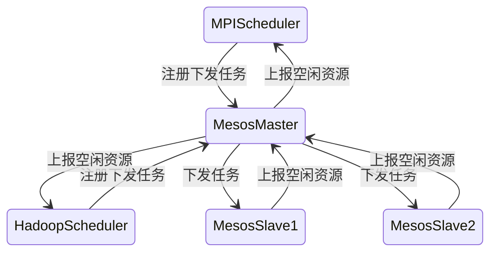
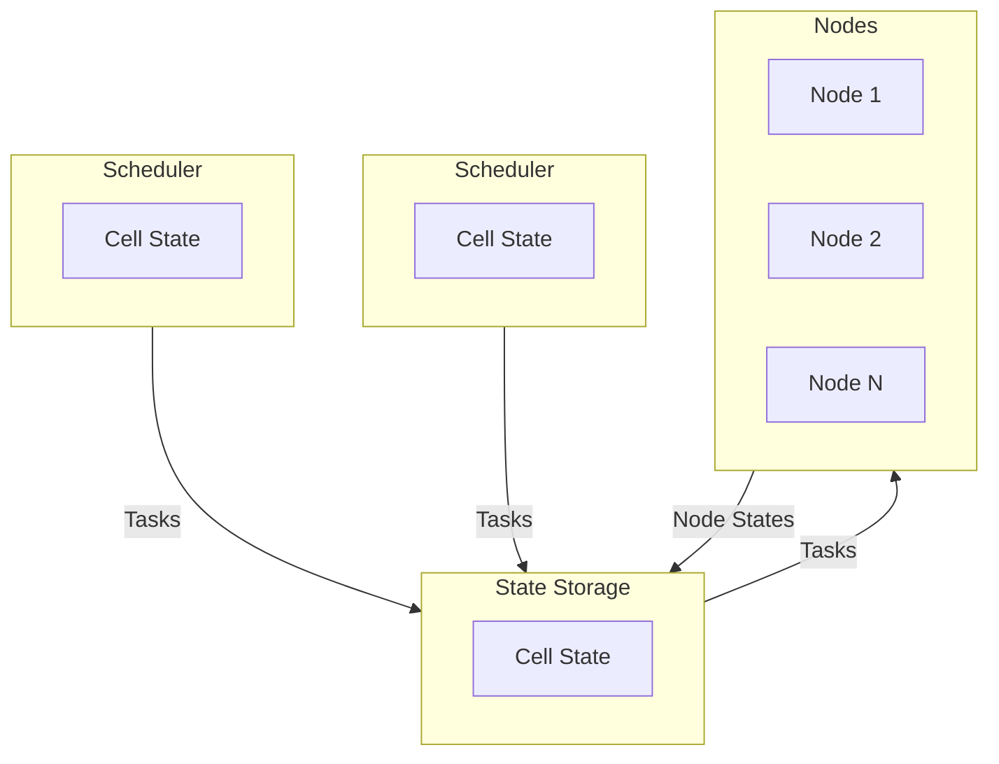

# 分布式系统

- 存储系统
  - GFS HDFS
- 计算系统
  - 批处理：MapReduce
  - 流处理：Storm
- 节点关系
  - 主从式
  - 对等式

## 网络硬件

分布式系统运行在网络之上

- [以太网](/计算机网络/链路层.md#以太网)
- [因特网](/计算机网络/计算机网络与因特网.md#因特网)

## 网络服务和协议

- 面向连接与无连接
- 数据流与数据包

## 前端技术

- MVC框架
- 反向代理
  - nginx
  - vanish
- 负载均衡
  - dns
  - 硬件：F5
  - 软件：LVS

## 分布式中间件

- 分布式同步服务中间件
  - 分布式一致性协议：paxos raft ark npc
  - chubby
  - zookeeper
- 关系型数据库访问中间件
  - 客户端转发
  - 服务端转发
  - mysql 代理
  - cobar
    - mycat
  - sharding jdbc
- 分布式服务调用中间件
  - dubbo dubbox
  - protocol buffers
    - 一个语言平台无关的序列化反序列化库
  - grpc
  - thrift
  - motan
- 分布式消息服务中间件
  - kafka
- 分布式跟踪服务中间件
  - dapper
  - zipkin
  - pinpoint
  - 鹰眼

## 分布式存储服务

### 分布式文件系统

业界的一些分布式文件系统

- GFS
  
- HDFS
  - 大文件
- TFS
  - 海量小文件

#### 设计

- 传输模式

- 目录层次

需要有一种唯一的目录文件命名方式，如 /server/path/file.txt

- 命名透明性
  - 位置透明性：文件以一个唯一的url暴露出去，但在服务器内部可以随意移动
  - 位置独立性：当文件在服务器之间转移时，url仍不必变化
- 文件共享语义 当文件被并发使用 需要考虑顺序一致性等问题

### NoSQL数据库

NoSQL 方案带来的优势，本质上是牺牲 ACID 中的某个或者某几个特性, NoSQL 只是 SQL 的一个有力补充

- 牺牲C 选择AP
- 基于键值对
  - LevelDB
  - Tair
  - Dynamo
  - Memcached
  - [Redis](/中间件/数据库/redis/Redis.md)
  - Berkeley DB
- 基于列 优势场景是在读取某列的所有数据时
  - Bigtable
  - HBase
  - Cassandra
- 基于文档 最大的特点就是 no-schema，可以存储和读取任意的数据
  - MongoDB
  - CouchDB
  - RethinkDB
- 全文搜索引擎
  - [ElasticSearch](/中间件/数据库/ElasticSearch.md)
  - Solr
- 基于图
  - Neo4j
- 时间序列
  - influxDB

### NewSQL

关系型数据库与NoSQL的融合

- Megastore
- Spanner
- F1
- OceanBase

## 分布式任务调度

1. 单体调度：一个集群中只有一个节点运行调度进程，该节点对集群中的其他节点具有访问权限，可以对其他节点的资源信息、节点状态等进行统一管理，同时根据用户下发的任务对资源的需求，在调度器中进行任务与资源匹配，然后根据匹配结果将任务指派给合适的节点

2. 两层调度：第一层调度器是一个经简化的中央调度器，通常放在分布式集群管理系统中，而第二层调度则是由各个应用程序框架完成。两层调度器的职责分别是：第一层调度器负责管理资源并向框架分配资源，第二层调度器接收分布式集群管理系统中第一层调度器分配的资源，然后根据任务和接收到的资源进行匹配

3. 共享状态调度：沿袭了单体调度器的模式，通过将单体调度器分解为多个调度器，每个调度器都有全局的资源状态信息，从而实现最优的任务调度，提供了更好的可扩展性

## 构建思想

- 云化
  - 虚拟化技术
  - 分布式
- 一切都可能失败与冗余思想
  - 多节点 主从架构 分片
- 水平扩展
  - 数据：分片
  - 服务： 集群 负载均衡
  - 数据中心：异地主从 异地多活
- 尽可能简单
  - 组件数量
  - 服务依赖
  - 架构
  - 设计
- 异步化削峰填谷解耦
- 最终一致性
- 微服务思想
- 服务跟踪
- 资源池化

## 思考

- 大型互联网公司架构共性

共性 | 描述
-|-
分层设计 | 大都有存储层、服务层、用户界面层和一些离线的数据分析系统
独立的集群管理系统|容器化、池化、资源管理与应用独立
存储层|根据需要，可以采用文件系统，也可以采用数据库系统，一般是两者都用 (1)文件系统，有的直接采用Apache HDFS，有的根据自己的需求开发了特定的系统，如存储大量小文件的TFS,既能存储大文件也能存储小文件的领英的Ambry等。(2)数据库系统 关系型数据库主要是开源的MySQL,少数也用Oracle，NoSQL数据库系统则大多根据自己的需要开发，有基于键值对的、基于文档的、基于图的、基于列存储的等
服务层|服务化，都有自己的RPC服务框架：支持服务注册（大都采用ZooKeeper或其变种）、查询负载均衡衡等。都采用消息服务中间件使调用异步化。都有自己的服务调用分析系统
数据分析|。实时数据与历史数据分开：一般都自行开发不同数据库之间的同步中间件，以将实时数据同步到历史数据库中。利用Hadoop集群对历史数据进行分析，利用流处理系统对在线数据进行分析
