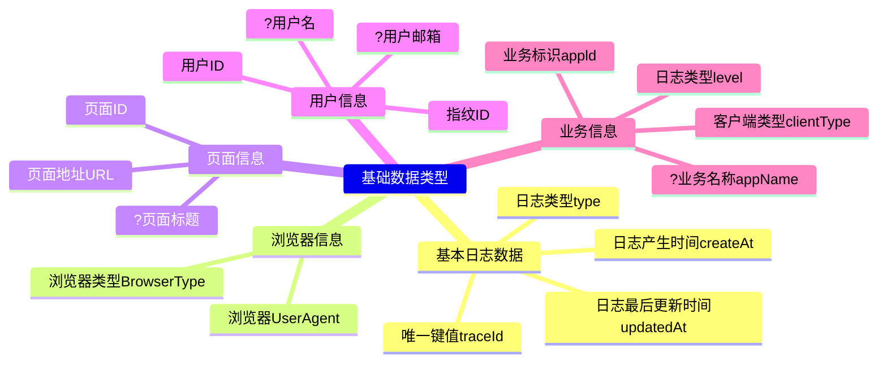
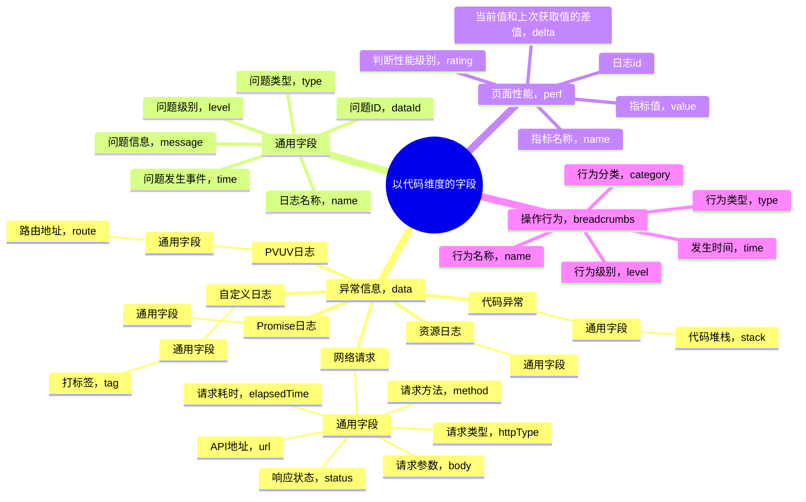

# 前端监控

## 指标

## WebVitals

- 网页加载速度指标 LCP（Largest Contentful Paint）：记录页面首屏可见区域中最大元素的呈现时间
- 网页可交互指标 FID（First Input Delay）：从用户首次和 Web 应用互动到浏览器实际开始处理事件或者处理脚本，响应用户互动的这段时间
- 网页视觉稳定性指标 CLS（Cumulative Layout Shift）：这个指标更多的是判断用户的视觉上的体验，也就是在浏览器可视区内现有元素发生位置的改变，触发布局偏移，是否影响用户的使用体验
- 首次内容绘制 FCP（Firs1t Contentful Paint）：记录页面首次渲染的时间
- 互动响应速度 INP （Interaction to Next Paint）：监听用户交互互动到页面响应的延迟时间
- 可交互时间 TTI （Time to Interactive）：衡量从网页开始加载到其主要子资源加载完成的时间
- 总阻塞时间 TBT (Total Blocking Time)：衡量页面渲染期间，主线程阻塞的时间，超过50ms的阻塞时间，会被记录下来，作为页面渲染的延迟
- 首字节时间 TTFB (Time to First Byte)：记录页面请求到响应的第一个字节的时间

指标|体验好|需要改进|体验差
-|-|-|-
LCP|<2.5s|2.5s LCP <4s|>4s
FID|<100ms|100ms < FID < 300ms|>300ms
CLS|<0.1|0.1 < CLS < 0.25| >0.25
FCP|<1.8s|1.8s < FCP < 3s|>3s
INP|<200ms|200ms < INP < 500ms|>500ms
TTFB|<800ms|800ms< TTFB< 1800ms|>1800ms

## 接口异常监听

通过拦截 ajax 请求接口，来实现如下目标：

- HTTP 响应码
- 请求中断
- 请求超时

## 资源脚本异常监听

通过全局的 onerror 监听或者框架提供的全局 errorHandle，实现全局的资源加载异常或脚本异常监听

## 全局操作监听

通过全局的 onxx 监听，实现全局的点击、键盘等事件监听，包括：

- 鼠标点击
- 键盘点击
- 触摸点击
- 触摸滑动
- ...

## 数据上报方式

- fetch/xhr
- beacon api
- 通过请求小图片在url中携带数据
