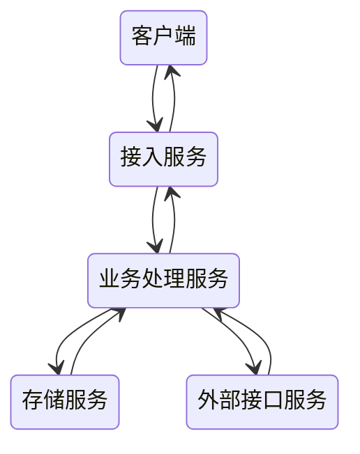

# 即时消息系统设计

- 接入服务：连接保持、协议解析、消息推送
- 业务处理服务：消息的存储、未读数变更、更新最近联系人等，这些内容都是业务处理的范畴
- 存储服务：账号信息、关系链，以及消息本身，都需要进行持久化存储
- 外部接口：消息推送接口 像苹果的APNs

## 收发架构

### 表结构

消息表：

- 消息id
- 消息内容
- 消息类型
- 消息时间

索引表：一般用于查询收发双方的历史聊天记录

- 索引用户id
- 索引另一方用户id
- 发信还是收信
- 消息id

联系人表：用于查询某一个人最近的所有联系人

- 索引用户id
- 索引另一方用户id
- 最新的一条消息id

### 通道

- 发：可以使用HTTP或者长连接发
- 收：自带的长连接推送或者手机厂商提供的推送服务

### 方式

1. 短轮询：多用在用户规模比较小，且不愿花费太多服务改造成本的小型应用上
2. 长轮询：适合对实时性要求比较高，但是整体用户量不大的场景
3. 长连接：WebSocket、XMPP、MQTT，每种协议都有自己的局限性，所以IM一般都使用TCP构建自己的私有协议来满足自己的业务需求

### 可靠投递

重传不可达问题前，这个可靠投递可以参考消息队列的[可靠投递方案](/中间件/消息队列/消息队列.md#消息可靠投递方案)

考虑重传不可达问题之后，就需要引入消息完整性校验，可以通过类似数据库事务并发控制的版本号来实现，本地维护一个最新版本号，每次拉取数据可以通过这个版本号来确定消息的完整性

### 时序性

为了保证相关消息之间的有序性，每条消息需要一个可以排序的id，这个id可以通过单点如redis自增生成，也可以使用一些分布式id生成算法如雪花算法来生成，值得注意的是，一般只需要保证消息在会话级别有序即可

为了避免乱序带来的影响，在本地可以直接根据这个id进行排序插入即可，但在服务端，为了避免一连串相关消息乱序带来的业务逻辑错误，可以将这一连串消息打包至同一个消息包，然后再进行排序处理

### 未读数

在消息未读数的实现上，一般需要针对用户维度有一个总未读数的计数，针对某一个具体用户需要有一个会话维度的会话未读的计数

## 消息安全

- 传输安全：域名解析安全（HTTPDNS）、链路安全（TLS）
- 存储安全：账户密码安全（单向散列）、内容存储安全（端到端加密）
- 内容安全：指针对消息内容的识别和传播的控制（敏感词汇、图片识别、外链识别、OCR）

## 心跳机制

- 使服务端能清除知道哪些连接失效，及时清理掉
- 使客户端发现掉线，及时重连
- 使TCP连接保活

方式：

- [TCP Keepalive](/计算机网络/运输层.md#保活)
- 应用层心跳：可更灵活调控心跳间隔，在节省网络流量和保活层面优势更明显

## 多终端漫游

1. 多端在线时，IM 服务端在收到消息后推给接收方的多台设备
2. 离线消息主动拉取
   1. 通过版本号来进行增量离线消息拉取
   2. 一般针对离线消息的下推会采用整体打包的方式来把多条消息合并成一个大包推下去，同时针对合并的大包还可以进一步进行压缩

## 负载均衡与扩缩容

大部分情况下，发送都不容易是瓶颈，所以发送可以使用短连接，在进行消息投递时，有两种选择：

1. 将消息精确投递到某个节点，这需要使用一个中央点来存储哪个客户在哪个节点
2. 将消息投递到所有节点，接待内部维护状态决定是否要发送

客户端先通过一个入口调度服务来查询本次连接应该连接的入口 IP，在进行缩容时，可以通知LB不再接受新请求，等到差不多了，可以强制断开所有连接，让这些连接重新均衡到其他连接点

