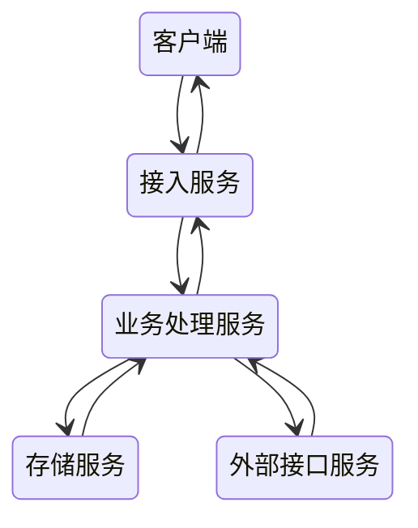

# 即时消息系统设计

- 接入服务：连接保持、协议解析、消息推送
- 业务处理服务：消息的存储、未读数变更、更新最近联系人等，这些内容都是业务处理的范畴
- 存储服务：账号信息、关系链，以及消息本身，都需要进行持久化存储
- 外部接口：消息推送接口 像苹果的APNs

## 收发架构

### 表结构

消息表：

- 消息id
- 消息内容
- 消息类型
- 消息时间

索引表：一般用于查询收发双方的历史聊天记录

- 索引用户id
- 索引另一方用户id
- 发信还是收信
- 消息id

联系人表：用于查询某一个人最近的所有联系人

- 索引用户id
- 索引另一方用户id
- 最新的一条消息id

### 收发通道

- 发：可以使用HTTP或者长连接发
- 收：自带的长连接推送或者手机厂商提供的推送服务

### 未读数

在消息未读数的实现上，一般需要针对用户维度有一个总未读数的计数，针对某一个具体用户需要有一个会话维度的会话未读的计数
