# 可用性


## 可靠性

- 给定时间间隔与条件 系统无故障持续运行的概率

可用性看重的是宕机时长、可靠性看重的宕机次数

## 稳定性

某个时间段内出错的概率，越高稳定性越差

性能是否逐渐劣化、软件每次的同样行为是否表现一致

## 本地可用

- 解决的是硬件、网络故障

[CAP](/软件工程/架构/系统设计/分布式/分布式理论.md#CAP)：

- CA：集群架构
- CP：
- AP：分布式架构

## 数据逻辑保护

大部分影响可用性的原因是人为操作的失误

- 预防：备份、变更审核
- 监控：系统异常行为监控

### 修复

- 版本回滚 数据恢复

### 数据变更流程

数据变更都需要被审核

- DBA -> 产品拥有者 -> 开发者

### 备份

- 冷备：成本低 实时性低不一致
- 热备
  - 同步热备
  - 主从热备 canal

、快照、CDP、事件溯源

## 容灾多活

### 技术路线

- 数据库（应用层）容灾：同构数据库下的数据同步 需要关注网络、主机资源问题
- SAN网络层容灾
- 存储层容灾：存储环境必须一致 依赖于特定厂商

### DRP规划

- 灾难恢复计划


业务影响分析：确定最核心业务

RTO RPO

### 容灾演练

根据文档内容进行测试与排练

在非生产环境进行模拟测试 在生产环境进行并行测试

中断测试

### BCP业务连续性计划

### 多活方案

- 双活
  - 成本 = 1/(N-1) * N
- 两地三中心

## 冗余

保证高可用的主要手段是使用冗余

- 对于计算服务器来说，保证是无状态的，就可以实现冗余
- 而对于存储服务器，需要通过主从复制来实现冗余
  - 存储高可用的难点不在于如何备份数据，而在于如何减少或者规避数据不一致对业务造成的影响

使用了冗余之后，如果出现了异常就要采取行动来保证高可用，就需要使用**状态决策**来保证系统高可用，但是通过冗余来实现的高可用系统，状态决策本质上就不可能做到完全正确，不管是一主多备，主备切换，还是多主选举都会出现不同程度的状态不一致，这是由于网络分区的存在导致的

### 高可用存储

#### 双机架构

##### 主备复制

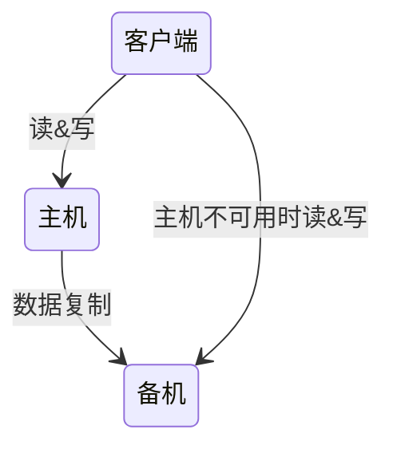

备机主要还是起到一个备份作用，并不承担实际的业务读写操作，如果要把备机改为主机，需要人工操作

这种方式浪费了备机资源，同时主机故障后人工介入操作，人工也是一种故障点

##### 主从复制

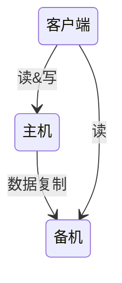

客户端需要感知主从关系，做[读写分离](/软件工程/架构/系统设计/高并发.md#总结：读写分离)将不同的操作发给不同的机器进行处理

##### 主主复制

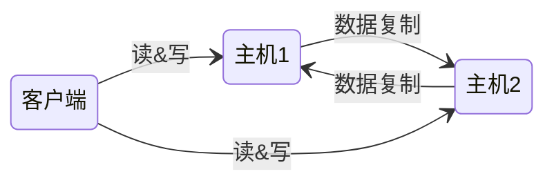

主主复制架构对数据的设计有严格的要求，一般适合于那些临时性、可丢失、可覆盖的数据场景

##### 双机切换

- 即出现故障时系统自动决定主机角色，并完成角色切换

需要考虑的点：

- 状态传递的渠道
- 状态检测的内容
- 切换时机
- 切换策略
- 自动程度
- 数据冲突解决

互连式：状态传递通道本身也是不可靠的

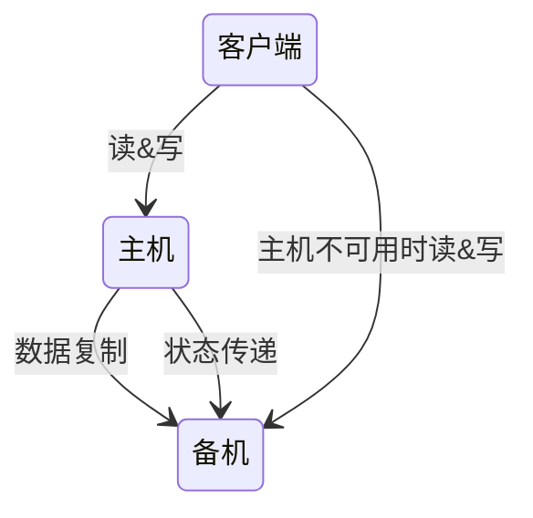

中介式：需要中介本身是高可用

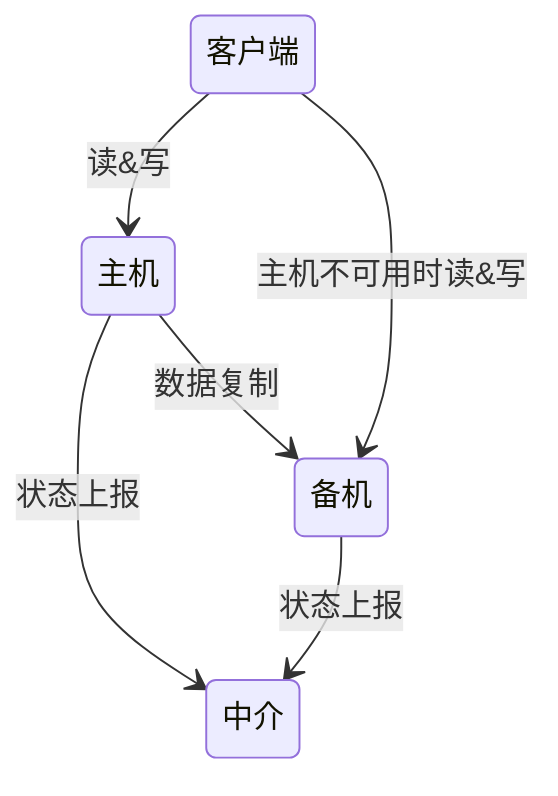

备机探测式：

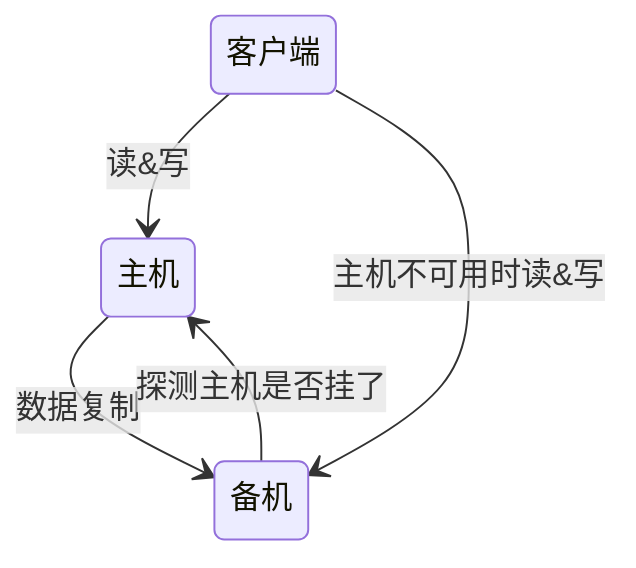

#### 数据集群

数据集中集群

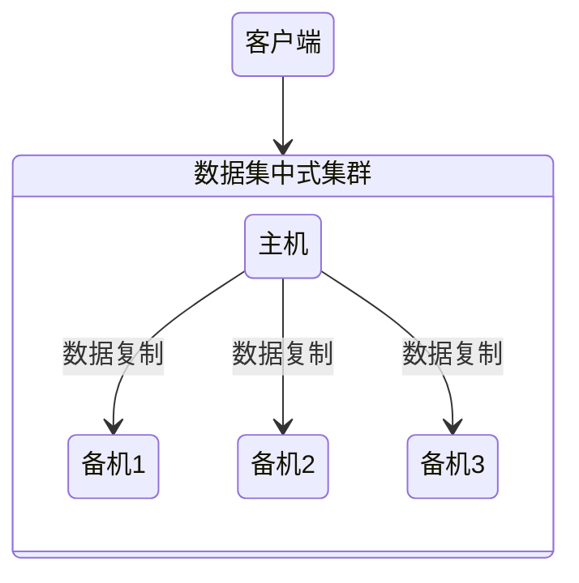

数据分散集群：每台服务器都会负责存储一部分数据，又会备份一部分数据


#### 数据分区

- 将数据按照一定的规则进行分区，不同分区分布在不同的物理位置上，物理区域之间可以通过复制来备份

集中式复制:

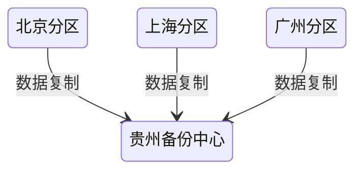

互备式复制：

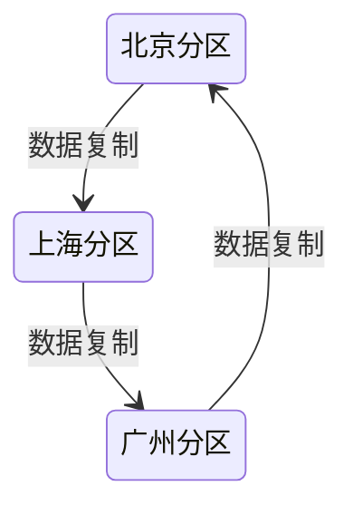

独立式复制：

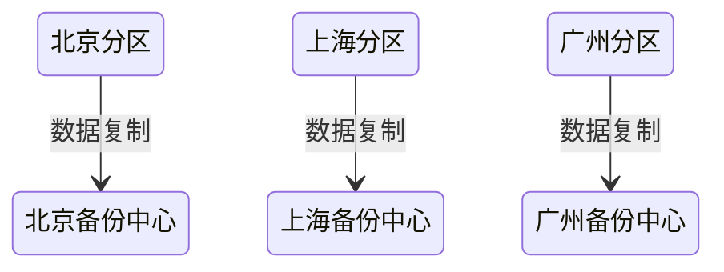

### 计算高可用

- 设计复杂度主要体现在任务管理方面，即当任务在某台服务器上执行失败后，如何将任务重新分配到新的服务器进行执行

#### 主备

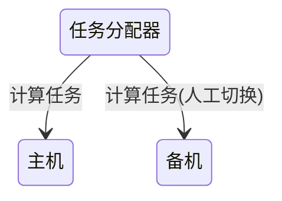

#### 主从

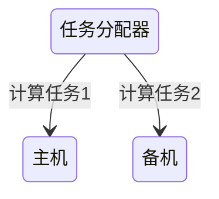

#### 集群式

- 调度集群：一个任务可能会在不同的机器上执行

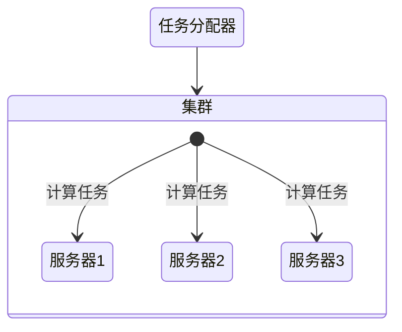

- 任务绑定集群：任务只会在集群特定的机器上执行 

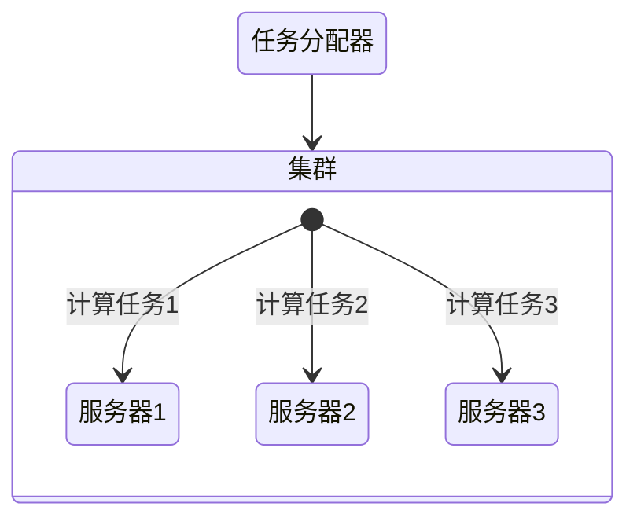

### 存储计算分离

> 将系统的存储职责和计算职责分离开，存储节点只负责数据存储，而计算节点只负责计算，计算节点是无状态的

## 隔离

指将系统或资源分隔开 在发生故障时尽可能缩小影响范围

- 物理隔离：机器 存储 网络...
- 逻辑隔离：请求 数据 消息...

### 线程隔离

主要是在多线程环境下，对线程池进行治理，把核心业务和非核心业务分割开。

使用线程池来进行隔离，不同线程池中的线程是互相隔离的

Tomcat 中的线程隔离：


**线程隔离，只能保证在分配线程这个资源上进行隔离，并不能保证整体稳定性**

### 进程隔离

java  cpu、内存这些资源可以通过不同的虚拟机进程来做隔离。

1. 集群式
2. 分布式

### 集群隔离

一些模块容易在并发量高的时候因为这种功能把整个模块占有的资源全部耗尽

解决方案

- 独立拆分模块
- 微服务化

### 机房隔离异地多活

把服务建立整体副本（计算服务、数据存储），在多机房内做异地多活或冷备份、是微服务数据异构的放大版

当在机房层面出现问题的时候，可以通过智能dns、httpdns、负载均衡等技术快速切换

- 同城异地
- 跨城异地 网络时延会导致短暂的数据不一致
- 跨国异地 主要是面向不同地区用户提供业务

#### 原则

- 优先保证核心业务的多活
- 保证核心数据的最终一致
- 多种手段同步数据
  - 存储中间件自带的同步机制 [MySQL主从复制](/中间件/数据库/mysql/复制.md) [Redis主从复制](/中间件/数据库/redis/复制.md)
  - 消息队列同步
  - 回源读取重试 在本中心无法获取数据时 去别的中心读取
- 保证大部分用户的多活

#### 实现

- 业务分级 确定哪些业务为核心业务 需要优先保障核心业务的多活
- 数据分类 确定哪些数据是不容许丢的，实时性要求高的 优先保障这些
- 异常处理 增加后备方案 避免单一通道
  - 多通道
  - 同步数据配合接口访问
  - 记录日志以供异常恢复
  - 用户补偿 最后的最后 真正无法恢复的异常

### 数据（读写）分离

通过主从模式，将mysql、redis等数据存储服务集群化，读写分离，那么在写入数据不可用的时候，也可以通过**重试机制**临时通过其他节点读取到数据。

多节点在做子网划分的时候，除了异地多活，还可以做数据中心，所有数据在本地机房crud 异步同步到数据中心，数据中心再去分发数据给其他机房

### 链路隔离

对于正式链路跟压测链路，为了尽量隔离开来，要确保正式链路与压测链路所使用的的数据库、中间件等隔离开来，避免线上压测影响到了正常的业务，这里的隔离主要是为了数据的隔离，避免压测数据跑到正常的业务场景中

### 动静分离

- cdn

### 爬虫隔离

有的系统有时候就会因为爬虫流量过高而导致资源耗尽，服务不可用

## 熔断

限流是服务方对自己的保护 熔断是调用方对自己的保护

- 某个接口请求失败率达到一定阈值 就直接熔断这个接口(调用方不再调用它)
- 或者响应时间达到阈值 也可以熔断

## 降级

为了保证整体系统可用性，可以牺牲一部分功能依旧提供**有损服务**

### 兜底数据

默认值: 设置安全的默认值，不会引起数据问题，比如库存为0

静态值:请求的页面或api无法返回数据，提供一套静态数据展示，比如加载失败提示重试，或默认菜单

缓存: 缓存无法更新便使用旧的缓存

### 降级原则

距离用户越近 造成损失越小 避免滚雪球效应

降级不是一种具体的技术手段 更多的与业务相关 需要根据业务来决定如何降级

- 主动降级：通过配置中心关闭非核心功能
- 多级降级：读缓存 -> 缓存压力过大 -> 返回默认值

所谓用户友好，就是尽量保证用户的无感知或者若感知，不影响他的功能使用

### 降级类型

- [限流](/软件工程/架构/系统设计/流量控制.md)降级
  - 当流量洪峰到达的时候，对于丢弃的用户可以提供友好的提示
- 超时降级
  - 对调用的数据设置超时时间，当调用失败，对服务降级
- 重试/自动处理
  - 当达到重试次数后，增加访问标记，服务降级，异步探测服务是否恢复(熔断器半开)
  - 注意幂等性
- 数据组装降级
  - 多库/多维度组装JSON/XML时，如果有一些不重要的数据无法获取或数据出错，可以忽略继续
- 爬虫降级
  - 分析机器人行为 引到到静态页或缓存页
- 读降级
  - 多级缓存架构下，后端缓存或db不可用，可以使用前端缓存或兜底数据
- 写降级
  - 高并发场景下，写入操作无法及时到达或抗压，可以异步消费数据/cache更新/log等方式
- 前端降级
  - js 埋点
  - 接入层降级 nginx
  - 应用层降级 hystrix sentinel
- 片段降级
  - 忽略js文件加载
- 静态化降级
  - 缓存静态化html 作为兜底数据

## [灰度发布与回滚](/运维/灰度发布.md)

## 监控与报警

监控体系：

- 资源监控 内存 CPU等
- 系统监控 接口请求信息 响应时间等等
  - 异常监控 通过异常日志得到
- 业务监控 订单交易数 支付成功率等等
  - 业务量阈值 基于历史数据评估得到
  - 偏移正常情况的数值

报警：

- 日志
- 即时通讯软件集成

### 预警响应流程

- 角色：一线开发人员 -> 团队领导 -> 最终BOSS
- 响应：预警 —> 预警确认 -> 确认问题 -> 修复

## 架构健康

### 应用健康

#### 应用质量

- 基础设施质量
- 代码质量

#### 健康指标

过低和过高都是不健康的

- 实际资源使用负载情况
- 服务质量 对外提供的稳定性与可用性

#### 应用规范

- 分级 差异化应用 差异化约束
- 解决大部分不确定性：代码规范 发布规范 部署规范
- 健康守护：健康红线 发布卡点
- 经验的沉淀：最佳实践

#### 应用治理

降本提效 增质减损

- 规范化研发与发布过程
- 专项问题治理提升 驱动团队不断进步

### 环境健康

保障环境稳定 拥有自治能力

对环境差异化管理 保持最优状态 进而可以持续升级

- 上云与自建的成本考量

开发、测试、预发布、线上等基础环境的建设，为了降低维护成本，使用镜像建成稳定可复用的基础环境，通过配置化来实现一套代码多处部署以降低不确定性，并且需要隔离来保护与约束不同环境

### 依赖健康

基础软件、三方包、二方包、链路上下游 问题出现概率由低到高，升级频率也是由低到高

#### 依赖管理

- SNAPSHOT治理：管理正式包与临时包
- 依赖版本升级：问题版本、漏洞版本
- 根据情况选择升级：能力升级、包废弃
- 冲突管理：简介依赖 循环依赖
- 依赖提供：保障向下兼容、稳定

#### 依赖保护

- 强弱依赖：对弱依赖做好降级的能力 避免其影响到整个系统
- 依赖降级：提供后备方案
- 问题逃逸：无法降级时，保证最大程度减少损失

## 可用性流程

- SRE文化
- 混沌工程
- SAP业务高可用评估
- 系统高可用评估
  - MTBF（Mean Time Between Failure），平均故障间隔
  - MTTR（Mean Time To Repair），故障的平均恢复时间
- CAT应用监控

```text
Availability = MTBF / (MTBF + MTTR)
```


### FMEA

- 故障模式与影响分析

当我们设计出一个架构后，再使用 FMEA 对这个架构进行分析，看看架构是否还存在某些可用性的隐患

功能点 | 故障模式      | 故障影响                      | 严重程度 | 故障原因                | 故障概率 | 风险程度 | 已有措施  | 规避措施    | 解决措施 | 后续规划
--- | --------- | ------------------------- | ---- | ------------------- | ---- | ---- | ----- | ------- | ---- | ---------
登录  | MySQL无法访问 | 当MC中无缓存时，用户无法登录，预计有60%的用户 | 高    | MySQL服务器断电          | 中    | 中    | 无     | 无       | 无    | 增加备份MySQL
登录  | MySQL无法访问 | 同上                        | 高    | Server到MySQL的网络连接中断 | 高    | 高    | 慢查询检测 | 重启MySQL | 无    | 不需要
