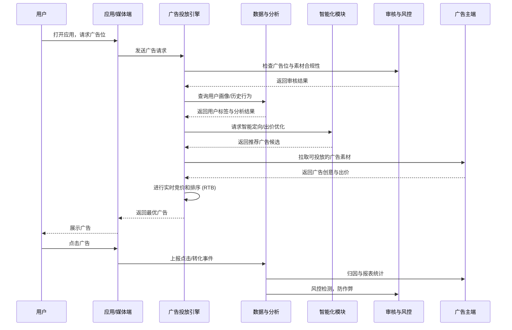
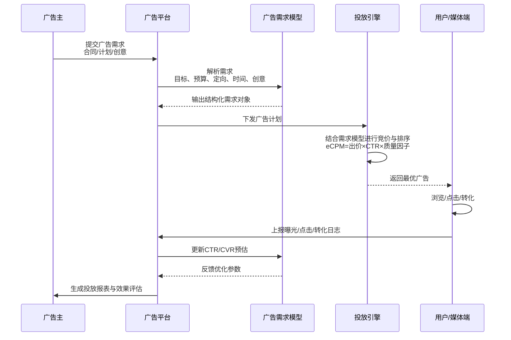
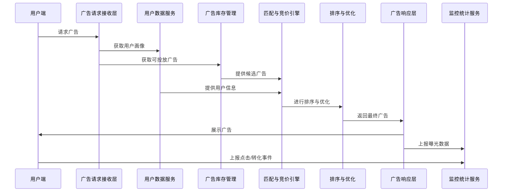

# 广告平台

## 模型

### 广告需求模型

广告需求模型 = 广告主意图的结构化表达 + 平台投放优化的需求强度预测

### 广告投放模型

广告需求模型：侧重于广告主的需求

广告投放模型：侧重于广告平台如何投放

包含：

1. 流量预测与定向
2. 点击率/转化率预估（CTR/CVR Prediction）
3. 出价与竞价策略
4. 投放控制
5. 效果反馈与优化

#### 计费模型

定义：广告主和平台之间如何结算费用

- CPC（Cost Per Click）：按点击收费
- CPM（Cost Per Mille）：每千次曝光收费
- CPA（Cost Per Action）：按转化（注册、下单等）收费
- CPT（Cost Per Time）：按时间段买断广告位（比如开屏广告一天 100 万）
- oCPX（Optimized Cost Per X）：平台通过智能投放，优化某个目标（点击、转化、留存）

## 广告投放引擎

### 广告投放引擎核心组件

1. **广告请求接收层 (Ad Request Handler)**

   * 接收用户页面或 APP 的广告请求。
   * 验证请求合法性和必需参数。

2. **用户/受众数据服务 (User Profile / Audience Service)**

   * 提供用户特征、兴趣、历史行为等数据。
   * 支撑定向投放。

3. **广告库存管理 (Ad Inventory / Campaign Service)**

   * 管理可投放的广告及广告预算。
   * 包含广告投放规则、投放时间、竞价信息等。

4. **匹配与竞价引擎 (Ad Matching & Bidding Engine)**

   * 根据广告请求 + 用户信息 + 广告库存进行匹配。
   * 支持实时竞价（RTB）或固定优先级投放。

5. **广告排序与优化 (Ranking & Optimization)**

   * 根据点击率预测 (CTR)、转化率预测 (CVR)、收益优化等对候选广告排序。

6. **广告决策输出 (Ad Decision / Response)**

   * 返回最终广告给前端展示。

7. **监控与统计 (Analytics / Reporting Service)**

   * 记录曝光、点击、转化等事件，用于优化和计费。

---

