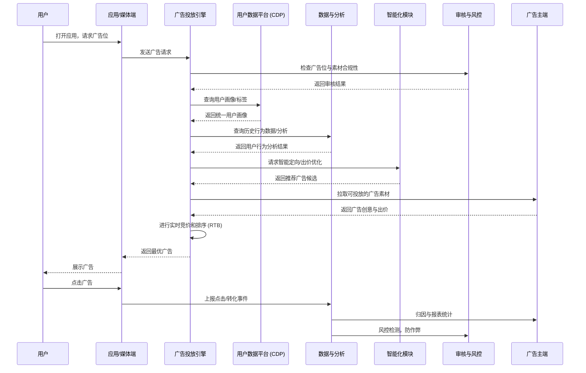

# 广告平台



## 模型

### 广告需求模型

广告需求模型 = 广告主意图的结构化表达 + 平台投放优化的需求强度预测


### 广告投放模型

广告需求模型：侧重于广告主的需求

广告投放模型：侧重于广告平台如何投放

包含：

1. 流量预测与定向
2. 点击率/转化率预估（CTR/CVR Prediction）
3. 出价与竞价策略
4. 投放控制
5. 效果反馈与优化

#### 计费模型

定义：广告主和平台之间如何结算费用

- CPC（Cost Per Click）：按点击收费
- CPM（Cost Per Mille）：每千次曝光收费
- CPA（Cost Per Action）：按转化（注册、下单等）收费
- CPT（Cost Per Time）：按时间段买断广告位（比如开屏广告一天 100 万）
- oCPX（Optimized Cost Per X）：平台通过智能投放，优化某个目标（点击、转化、留存）

## 广告投放引擎

### 广告投放引擎核心组件

1. **广告请求接收层 (Ad Request Handler)**

   * 接收用户页面或 APP 的广告请求。
   * 验证请求合法性和必需参数。

2. **用户/受众数据服务 (User Profile / Audience Service)**

   * 提供用户特征、兴趣、历史行为等数据。
   * 支撑定向投放。

3. **广告库存管理 (Ad Inventory / Campaign Service)**

   * 管理可投放的广告及广告预算。
   * 包含广告投放规则、投放时间、竞价信息等。

4. **匹配与竞价引擎 (Ad Matching & Bidding Engine)**

   * 根据广告请求 + 用户信息 + 广告库存进行匹配。
   * 支持实时竞价（RTB）或固定优先级投放。

5. **广告排序与优化 (Ranking & Optimization)**

   * 根据点击率预测 (CTR)、转化率预测 (CVR)、收益优化等对候选广告排序。

6. **广告决策输出 (Ad Decision / Response)**

   * 返回最终广告给前端展示。

7. **监控与统计 (Analytics / Reporting Service)**

   * 记录曝光、点击、转化等事件，用于优化和计费。

---


## 用户画像

1. **数据采集**

   * 来源：

     * **第一方数据**：用户在 App/网站上的浏览、搜索、点击、购买、停留时长
     * **第三方数据**：外部 DMP（Data Management Platform）提供的人群标签
     * **设备数据**：手机型号、操作系统、IP/位置、应用安装情况
   * 技术：埋点（埋 SDK/JS）、日志采集（Kafka）、CDP（客户数据平台）

2. **数据清洗与归一化**

   * 去重、填补缺失、异常值处理
   * 用户 ID 统一（cookie、设备号、登录账号 → 映射到统一 UID）

3. **特征构建**

   * **静态特征**：性别、年龄、地域、设备型号
   * **动态特征**：最近 7 天点击过的品类、近 30 天的消费能力、访问频次
   * **兴趣标签**：阅读新闻类/游戏类/母婴类内容 → 打兴趣分数
   * 技术：Flink / Spark Streaming 做实时特征更新

4. **用户建模**

   * **聚类**：K-means / DBSCAN，把相似用户分为一类（如“二次元群体”、“中产妈妈群体”）
   * **Embedding 表示**：用深度学习把用户行为序列转为向量（User Embedding）
   * **Look-alike**：找到和已转化用户相似的“潜在用户”

5. **标签系统落地**

   * 存储：

     * 实时查询：Redis / HBase / Cassandra（毫秒级查询）
     * 离线分析：Hive / ClickHouse
   * 标签示例：

     ```
     用户123:
       性别: 女
       年龄: 25-34
       兴趣: 美妆(0.87), 健身(0.62), 母婴(0.40)
       设备: iPhone 14 Pro
       最近购买: 运动鞋, 面膜
     ```

6. **持续更新**

   * 用户行为每天都在变 → 系统要支持 **实时更新**（Flink/Kafka） + **离线校正**（日/周批处理）。

---

用户画像 = **采集多源数据 → 清洗 → 构建特征 → 建模 → 存储 → 实时更新**。

## 审核与风控

### 1. **广告素材与内容审核**

* **目标**：保证广告创意合法、合规、不会伤害用户体验。
* **常见审核点**：

  * 违法违规内容（涉黄、涉毒、涉政）
  * 误导性营销（虚假宣传、夸大效果）
  * 版权合规（图片/音乐是否侵权）
  * 品类限制（如医疗、金融需特殊资质）
* **技术手段**：

  * NLP：敏感词检测（BERT、FastText）
  * CV（计算机视觉）：识别图片/视频内容（OCR、图像分类、Logo 检测）
  * 人工审核：机器过滤后，再交人工复核

---

### 2. **用户行为风控**

* **目标**：防止 **虚假流量、恶意点击、作弊安装**，保护广告主利益。
* **检测点**：

  * 点击作弊（刷点击、模拟器刷量）
  * 安装作弊（买量渠道刷激活）
  * 机器人流量（爬虫、脚本）
* **技术手段**：

  * 异常检测（同一 IP 短时间高频点击）
  * 设备指纹识别（IMEI、浏览器指纹）
  * 行为建模（正常用户行为 vs 异常模式）
  * 图模型（检测“作弊团伙”——一群设备互相点击）

---

### 3. **账号与财务风险防控**

* **广告主侧**：

  * 恶意广告主（投放几天跑路、不付账单）
  * 洗钱、套现行为
* **用户侧**：

  * 盗刷信用卡购买广告
* **技术手段**：

  * 信用评估模型（机器学习分类）
  * 黑名单/白名单（已知恶意广告主、IP、设备号）
  * 交易异常检测

---

### 4. **实时风控引擎**

* **目标**：保证风控不是事后追溯，而是 **实时拦截**。
* **实现**：

  * **流式处理**：Kafka + Flink（实时检测点击/安装异常）
  * **规则引擎**：Drools / 自研 DSL（业务规则配置）
  * **低延迟数据库**：Redis / Aerospike（秒级黑名单拦截）

---

### 5. **合规与政策适配**

* 不同国家/地区的 **法律合规**（GDPR、CCPA、广告法）
* 特殊行业广告（金融、医疗、游戏）必须有资质证书
* 风控模块负责 **动态更新规则**，确保投放合法

## 报表指标

广告主关心的指标大致分三层：

1. **流量层**：曝光、点击、CTR
2. **效果层**：转化、CVR、CPA
3. **收益层**：ROI/ROAS、分人群/渠道效果

### 1. **曝光量 (Impressions)**

* 广告被展示的次数。
* 关注点：投放是否覆盖到足够的目标人群。

### 2. **点击量 (Clicks) & 点击率 (CTR)**

* 点击量：广告被点击的次数。
* CTR = 点击量 ÷ 曝光量。
* 关注点：广告素材和定向是否有效，用户是否感兴趣。

### 3. **转化量 (Conversions) & 转化率 (CVR)**

* 转化：用户点击广告后完成的关键行为（注册、购买、下载）。
* CVR = 转化量 ÷ 点击量。
* 关注点：广告是否带来了真实的业务价值。

### 4. **花费 (Cost)**

* 广告主实际支出的费用。
* 常见计费方式：

  * CPM（千次曝光成本）
  * CPC（点击成本）
  * CPA（转化成本）

### 5. **平均成本指标**

* **CPC**：每次点击的平均成本 = 花费 ÷ 点击量
* **CPA**：每次转化的平均成本 = 花费 ÷ 转化量
* **CPM**：每千次曝光的平均成本 = 花费 ÷ (曝光量/1000)
* 广告主通常会盯着 **CPA**，因为它和 ROI 最相关。

### 6. **ROI / ROAS**

* ROI（投资回报率）：(转化产生的收入 - 广告花费) ÷ 广告花费
* ROAS（广告支出回报率）：收入 ÷ 广告花费
* 广告主最核心的指标，直接决定是否继续投放。

### 7. **人群和渠道维度指标**

* 分地域、性别、年龄、设备、媒体渠道来拆分曝光/点击/转化。
* 关注点：哪些人群最值钱，哪些渠道最有效。

### 8. **频次 (Frequency)**

* 平均每个用户看到广告的次数。
* 太高 = 烦扰用户，太低 = 转化不足。
