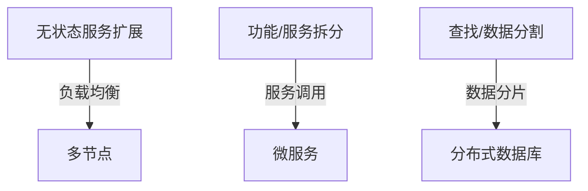

# 扩展性

## 1. 概述（Overview）

扩展性（Scalability）是软件系统设计的核心属性之一，指在系统添加新功能或处理能力提升时，**对现有系统和应用无不良影响**的能力。
它不仅涉及技术实现，还包括组织、流程、数据和业务层面的综合扩展能力。

**核心目标**：

* 支持系统增长（性能、功能、用户量）
* 保持系统稳定性与可维护性
* 兼顾成本、复杂度与业务耦合度

---

## 2. 本质（Essence）

扩展性设计的本质是**应对未来变化的不确定性**。
由于预测未来变化存在复杂性与不确定性，因此系统设计必须权衡以下原则：

| 原则     | 说明                       |
| ------ | ------------------------ |
| 不可全局考虑 | 不必在每个设计点都过度考虑扩展性，以避免过度设计 |
| 必须考虑   | 完全忽略扩展性会导致系统无法适应业务增长     |
| 有限预测   | 对未来变化的预测不宜过远，否则成本与复杂度不可控 |
| 分层隔离   | 使用分层架构降低变化耦合，提高局部扩展性     |

扩展性核心思想可概括为：**拆分（Decomposition）、隔离（Isolation）、弹性（Elasticity）**。

---

## 3. 模型（Model）

### 3.1 扩展维度（Dimensions of Scalability）

| 维度                           | 定义                       | 典型实现方式                            |
| ---------------------------- | ------------------------ | --------------------------------- |
| 横向扩展（Horizontal Scaling）     | 增加更多机器节点以提升系统吞吐量和处理能力    | 集群、负载均衡、无状态服务复制                   |
| 纵向扩展（Vertical Scaling）       | 增强单机资源（CPU、内存、存储）以提升单机性能 | 升级服务器硬件、优化单机服务                    |
| 数据扩展（Data Scaling）           | 分布式存储、分片、读写分离等           | 数据库分片、缓存集群                        |
| 应用扩展（Application Scaling）    | X/Y/Z模式组合实现功能扩展          | X: 无状态克隆、Y: 功能/服务拆分、Z: 查找/请求/数据分割 |
| 组织扩展（Organizational Scaling） | 团队分工与服务所有权匹配扩展模式         | XZ在团队内部，Y跨团队划分                    |
| 流程扩展（Process Scaling）        | 架构流程和业务流程优化支持扩展性         | ITIL、ITSM、CI/CD、ARB、JAD           |

### 3.2 应用扩展模式（X/Y/Z）

| 模式 | 核心思想      | 技术特点               | 与业务耦合 |
| -- | --------- | ------------------ | ----- |
| X  | 无状态服务水平克隆 | 容器、Serverless、负载均衡 | 低     |
| Y  | 功能或服务拆分   | 服务化、消息队列解耦         | 高     |
| Z  | 查找/数据分割   | 多副本、读写分离、数据分片      | 低     |

**示意图（Mermaid）**：



---

## 4. 能力体系（Capability System）

扩展性能力可以拆解为**技术能力、组织能力和流程能力**：

| 能力类别 | 核心能力      | 示例技术/方法            |
| ---- | --------- | ------------------ |
| 技术能力 | 无状态化      | 容器、Serverless、水平克隆 |
| 技术能力 | 数据分片与读写分离 | 分布式数据库、缓存          |
| 技术能力 | 服务解耦      | 消息队列、微服务           |
| 组织能力 | 团队扩展      | XZ模式内部扩展，Y模式跨团队划分  |
| 流程能力 | 架构流程      | JAD、ARB、CMMI、CI/CD |

---

## 5. 架构模型（Architecture Model）

扩展性架构的核心是**模块化和分层隔离**，结合X/Y/Z扩展模式形成完整体系：

```mermaid
graph TD
    Subgraph Horizontal & Vertical
        A[横向扩展] --> B[纵向扩展]
    end
    Subgraph Application
        X --> Y --> Z
    end
    Subgraph Data
        DB[数据分片/读写分离]
    end
    Subgraph Governance
        Process[流程扩展/架构评审]
    end
    B --> X
    Z --> DB
    X --> Process
```

---

## 6. 类型体系（Taxonomy）

扩展性分类体系总结：

1. **技术扩展**

   * 横向、纵向、应用、数据
2. **组织扩展**

   * 团队结构与服务所有权匹配
3. **流程扩展**

   * 架构流程（ARB/JAD）、业务流程（ITIL/ITSM/CI/CD）
4. **组合模式**

   * X/Y/Z模式，适配不同业务和技术需求

---

## 7. 边界与生态（Boundary & Ecosystem）

* **边界**：扩展性设计应限定在可控范围内（模块、团队、流程），避免全局过度设计。
* **生态**：技术、组织与流程形成协同生态，通过服务解耦、团队自治和标准化流程保证系统可持续扩展。

---

## 8. 治理体系（Governance System）

* **架构治理**：ARB架构评审会、JAD联合架构设计
* **流程治理**：ITIL、ITSM、6西格玛、CMMI软件成熟度模型
* **技术治理**：微服务约束、消息队列接口规范、容器/Serverless标准

---

## 9. 演进趋势（Evolution）

* 云原生架构增强横向弹性
* Serverless与函数计算降低扩展复杂度
* 微服务与领域驱动设计支持Y模式扩展
* 数据库分布式与智能分片优化Z模式性能
* 自动化CI/CD与流程优化加速扩展落地

---

## 10. 选型方法论（Selection Framework）

| 场景        | 优先模式 | 技术考虑      | 注意事项            |
| --------- | ---- | --------- | --------------- |
| 无状态、读操作多  | X    | 容器化、负载均衡  | 节点同构、弹性伸缩策略     |
| 功能拆分、业务增长 | Y    | 服务化、消息队列  | 高耦合业务需拆分，考虑团队协作 |
| 数据密集型、查找多 | Z    | 数据分片、读写分离 | 数据一致性策略、容量规划    |

**决策原则**：

1. 优先无状态化设计
2. 业务耦合高采用Y模式
3. 数据密集型采用Z模式
4. 横向扩展优先于纵向扩展（成本与弹性考量）

---

## 11. 总结（Conclusion）

* 扩展性是系统可持续演进的核心能力，涉及技术、组织、流程多个维度
* 核心策略是**拆分、隔离、弹性**
* X/Y/Z模式提供不同扩展方式，可组合使用
* 架构设计需结合治理体系、能力体系和演进趋势，以支持未来业务和技术增长
* 可视化模型、能力树和决策表是扩展性体系化管理的重要工具

## 关联内容（自动生成）

- [/软件工程/微服务/微服务.md](/软件工程/微服务/微服务.md) 微服务架构是扩展性设计的重要实现方式，通过服务拆分实现Y模式扩展
- [/软件工程/架构/系统设计/高并发.md](/软件工程/架构/系统设计/高并发.md) 高并发系统设计与扩展性密切相关，扩展性是应对高并发的关键手段
- [/软件工程/架构/系统设计/分布式/分布式系统.md](/软件工程/架构/系统设计/分布式/分布式系统.md) 分布式系统是实现扩展性的重要架构范式
- [/软件工程/架构/系统设计/缓存.md](/软件工程/架构/系统设计/缓存.md) 扩展性设计中，缓存是提升系统扩展能力的重要策略
- [/软件工程/架构/系统设计/可用性.md](/软件工程/架构/系统设计/可用性.md) 可用性和扩展性是系统非功能性需求的两个重要方面
- [/软件工程/架构/系统设计/伸缩性.md](/软件工程/架构/系统设计/伸缩性.md) 伸缩性与扩展性是相关但不完全相同的概念，伸缩性更关注资源的动态调整
- [/软件工程/架构/架构治理.md](/软件工程/架构/架构治理.md) 架构治理确保扩展性设计能够得到合理实施和有效管控
- [/软件工程/架构/系统设计/可观测性.md](/软件工程/架构/系统设计/可观测性.md) 系统扩展后需要相应的可观测性能力来保障系统稳定性
- [/中间件/消息队列/消息队列.md](/中间件/消息队列/消息队列.md) 消息队列是实现系统扩展性和解耦的重要中间件
- [/中间件/数据库/分库分表中间件.md](/中间件/数据库/分库分表中间件.md) 数据分片是实现数据扩展性的重要技术手段
- [/软件工程/架构/系统设计/网关.md](/软件工程/架构/系统设计/网关.md) API网关在微服务架构中提供统一入口，支持系统扩展
- [/软件工程/架构/系统设计/云原生.md](/软件工程/架构/系统设计/云原生.md) 云原生技术为系统扩展性提供了新的实现方式
- [/软件工程/架构/系统设计/流量控制.md](/软件工程/架构/系统设计/流量控制.md) 流量控制是保障系统在扩展过程中稳定性的关键技术
- [/软件工程/微服务/服务治理/服务治理.md](/软件工程/微服务/服务治理/服务治理.md) 服务治理是微服务架构下确保扩展性的重要手段
- [/软件工程/架构/系统设计/分布式/分布式数据.md](/软件工程/架构/系统设计/分布式/分布式数据.md) 分布式数据管理是实现数据扩展性的核心技术
