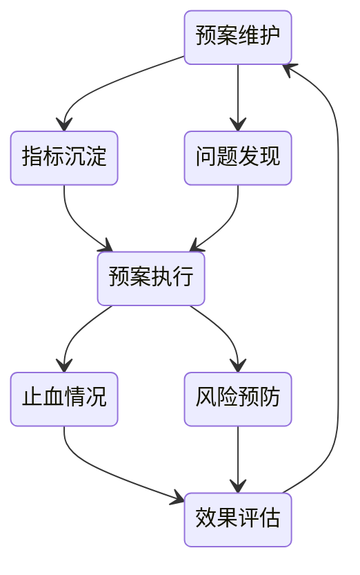

# 故障管理

故障发生 -> 故障发现 -> 故障处理 -> 故障复盘

## 故障场景

- 针对具体故障类型具体分析
- 根据重要程度、影响程度、影响范围对场景分级

场景关联：实际场景 -> 故障结果 -> 故障原因 -> 引发行为

### 资损

- 该收的钱没收到
- 导致客户损失的赔偿

解决：

- 追回
- 数据订正
- 流程补偿

### 设计缺陷

- 没考虑到

解决：

- SOP引导，让用户绕开产品缺陷
- 功能关闭，临时禁止用户使用
- 重新发版

### 流量故障

- 服务承载、数据库、基础设施能力不足

解决：

- 限流熔断降级
- 重启
- 扩容

### 环境故障

- 基础环境中间件等出现运维变更、使用不当、压力过高导致的故障

解决：

- 替换基础环境
- 重启
- 限流
- 针对使用不当的代码进行修复

### 应用故障

### 数据故障

- 一般是伴随着其他故障产生导致数据的不正确

发现：

- 业务监控
- 巡检对账
- 用户反馈

解决：

- 数据订正 使用SQL批量更新等
- 数据清洗 难以使用SQL订正 编写脚本清洗
- 修改导致错误的代码

### 发布故障

解决：回滚

### 安全故障

- 安全漏洞被利用

解决：

- 升级依赖
- 重新设计相关有漏洞功能
- 下线止血

### 研发故障

- 设计缺陷、代码错误
- 线上调整、数据变更

解决：

- 开关切换
- 回滚
- 发版解决

### 历史遗留故障

这种问题存在的比较久，所以容忍度一般比较高，先止血，然后慢慢修复

### 小概率故障

解决：

- 做好设计，在故障时逃逸
- 使用后备方案保证可用性

## 故障分级

根据场景、影响、持续的时间

等级上升：随着故障危害加大，也要进行等级上升

等级下降：故障产生的影响及时修复或者损失被追回

## 研发操作管理

### 风险定级

- 查询类：大批量数据查询仍有一定风险，小数据量基本无风险
- 变更类：根据影响范围不同风险不同

风险降级：

- 缩小范围
- 灰度发布
- 回滚预案
- 限流止血

### 发布监管

- 线上自由变更危害很大

通过系统记录相关操作，使用审批流程引入人来监控

发布前要有发布卡点，如代码扫描，自动化测试来保证基础质量

使用发布窗口限定时间，确保发布期间有人员值守

#### 发布窗口

- 避免散乱的发布
- 确保发布受到监管
- 避免临近节假日
- 避免影响用户使用

### [灰度发布](/运维/灰度发布.md)

### 发布前测试

发布提交（自动化测试） -> 发布流程（QA审批） -> 发布成功（QA验收）

## 故障监控发现

### 系统监控

### 业务监控

### 舆情监控

## 故障分析定位

### 系统诊断

根据现场得到现象，从而描述问题

根据输入输出定位分析是上游问题还是当前模块问题

根据已有日志或者指标判断是否是被上游错误影响、还是本身问题，亦或者与发布有关联、是否跟历史问题有关联

### 业务诊断

- 无明显异常，整体业务存在问题（业务指标异常）

确定是否真的有异常，确定业务是否有损失

### 日志诊断

- 被动诊断：发现问题查询日志
- 主动诊断：根据日志发现已经出现的异常或者潜在的异常

## 故障恢复

- 重启限流扩容移除
- 降级回滚切换

### 预案设定与执行

设定预案，发现线上问题自动报警并根据场景执行预警，以达到快速止血恢复的目的

## 故障复盘

### 过程

- 发现是否及时，是否及时触达相关人员
- 止血是否迅速有效，预案是否有用
- 恢复的过程

### 结果

- 最终产生的影响
- 故障的等级
- 故障的责任

### 后续

- 故障修复
- 损失追回

## 故障演练

突袭演练，多样化每次触发的故障类型，整个过程严格按照真实流程处理

### 面向处理时间提升的演练

- 熟练度
- 准确度

