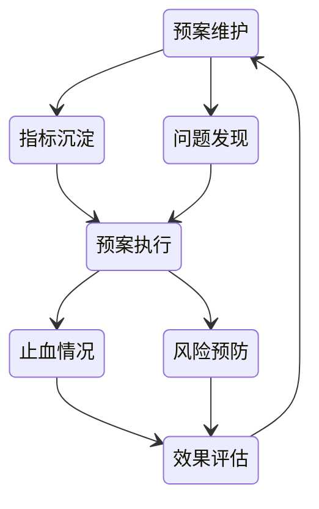

# 故障治理

## 故障治理的第一性原理

### 故障不可避免，但失控是可以避免的

* 软件系统 = 高复杂度 + 不完全认知
* 故障的本质不是"是否发生"，而是：

  * 是否可被**快速发现**
  * 是否能**限制影响范围**
  * 是否能**快速恢复**
  * 是否能**避免重复发生**

> 因此，故障治理关注的不是"零故障"，而是 **可控性（Controllability）**。

### 故障治理的核心目标模型

所有机制、流程、预案，最终都应服务于以下稳定目标：

1. **缩短 MTTR（平均恢复时间）**
2. **限制影响半径（Blast Radius）**
3. **降低重复故障概率**
4. **提升组织应对确定性**

## 度量：控制闭环的必要信息

故障治理的每个目标，都依赖于**度量**来验证是否达成。

**什么是度量**

度量是将黑盒事件转化为可评估数据的转换过程。没有度量，只能凭感觉判断"故障处理得好不好"，而不是确知。度量让不可见变为可见，让主观判断变为客观依据。

**为什么需要度量**

1. **控制的前提是感知**：你无法控制你看不见的东西。度量是感知故障、处理进度、改进效果的窗口。
2. **改进的起点是现状**：不知道现状就不知道从哪里下手。度量揭示瓶颈所在，指引资源投向。
3. **团队对齐需要共同语言**：当所有人用同一套数据评估"什么是好"，决策摩擦才能降低。
4. **系统性的问题需要系统性的视角**：个案无法说明问题，趋势数据才能暴露结构缺陷。

**度量的本质**

度量是一种**反馈机制**。它的价值在于数据能否驱动正确的决策。

如果一个度量数据没有被用于任何决策，它就是噪音。好的度量体系让人看到数据后知道该做什么。

> 度量的终极目标：让"故障处理得好不好"成为一个可回答的问题，而不是取决于谁说了算。

## 统一的故障生命周期模型

故障治理是一个闭环系统，而非线性处理流程：

> **发生 → 发现 → 判断 → 决策 → 执行 → 恢复 → 复盘 → 演进**

该模型强调：

* 决策与执行同等重要
* 复盘的目标是系统升级，而非个体追责

模型存在的意义是将故障处理从"靠人"变为"靠系统"——让任何人在任何时候做同一件事，结果一致。

## 故障的多维分类模型

单一维度的"故障类型"无法支撑治理，需要引入多维标签体系。

### 故障多维坐标系

| 维度   | 说明                               |
| ---- | -------------------------------- |
| 触发阶段 | 发布 / 运行 / 运维 / 外部依赖              |
| 根因类型 | 设计缺陷 / 实现错误 / 配置问题 / 容量不足 / 依赖异常 |
| 影响对象 | 用户体验 / 资金资产 / 数据正确性 / 合规安全       |
| 系统层级 | 基础设施 / 平台 / 应用 / 业务              |
| 可预防性 | 可预防 / 可缓解 / 不可控                  |

> **一次真实故障 = 多维标签的组合结果**，而不是单一分类。

维度不是目的，维度背后的治理策略差异化才是目的。

### 资损类故障

* 本质：系统未正确履行资金或权益承诺
* 常见根因：设计缺陷 / 并发异常 / 数据一致性问题

治理策略：

* 事中：止血、冻结、限制继续扩散
* 事后：追回、订正、流程补偿

### 流量与容量类故障

* 本质：系统承载能力 < 实际需求

治理策略：

* 限流 / 熔断 / 降级
* 弹性扩容
* 架构层削峰填谷

### 发布类故障

* 本质：系统状态在变更过程中失稳

治理策略：

* 灰度发布
* 快速回滚能力
* 发布窗口与值守机制

### 数据类故障

* 本质：系统状态与真实业务状态不一致

治理策略：

* 可审计的数据链路
* 订正、清洗与补偿机制
* 从源头修复错误写入逻辑

## 统一的故障处理认知模型

所有故障处理行为都可抽象为同一认知路径：

> **信号 → 判断 → 决策 → 动作 → 反馈**

这是控制论的基本反馈回路——任何系统要修正偏差，都必然经历这个路径。

| 阶段 | 本质 | 没有这一步会怎样 |
| --- | --- | --- |
| 信号 | 感知偏差存在 | 不知道有问题 |
| 判断 | 理解偏差含义 | 不知道问题是什么 |
| 决策 | 确定修正策略 | 不知道该怎么做 |
| 动作 | 执行修正行为 | 问题依然存在 |
| 反馈 | 验证修正效果 | 不知道修好了没有 |

### 信号（发现）

* 系统监控（资源、错误率、延迟）
* 业务监控（订单、资金、转化）
* 舆情与用户反馈

### 判断（定位）

* 系统诊断：上下游、发布关联、历史问题
* 业务诊断：是否真实影响业务目标
* 日志诊断：被动查询 + 主动异常发现

### 决策（止血策略）

* 是否需要立即止血
* 是否升级故障等级
* 是否切换预案

### 动作（执行）

* 重启 / 限流 / 扩容 / 降级
* 回滚 / 切换 / 开关控制

### 反馈（验证）

* 指标是否恢复
* 影响是否停止扩散

## 风险控制与变更治理体系

### 风险定级模型

风险定级是差异化管理的基础——不同风险需要匹配不同成本的控制手段

| 类型 | 特征 | 典型风险 |
| --- | --- | --- |
| 可控型 | 变更范围明确、可回滚 | 发布故障、配置错误 |
| 不可控型 | 范围不可知、不可逆 | 数据污染、状态漂移 |

**可控型风险**（范围明确、可回滚）的控制手段本质是 **管住源头**：

- 灰度发布：逐步放量，发现问题及时阻断
- 回滚预案：变更失败时可快速回退到已知稳定状态
- 变更窗口与值守：重要变更在人岗值守期间执行

**不可控型风险**（范围不可知、不可逆）的控制手段本质是 **箍住后果**：

- 限流止血：阻断继续扩大的请求量
- 熔断：快速失败，防止级联崩溃
- 隔离：问题区域与正常区域割开
- 阈值控制：量变达到阈值前触发自动动作

## 预案体系：从被动响应到主动治理

### 预案的本质

预案不是脚本，而是 **"确定性决策的固化"**，避免在故障发生时用低质量决策替代

### 预案闭环模型

```mermaid
stateDiagram-v2
预案维护 --> 指标沉淀
预案维护 --> 问题发现
指标沉淀 --> 预案执行
问题发现 --> 预案执行
预案执行 --> 风险预防
预案执行 --> 止血情况
止血情况 --> 效果评估
风险预防 --> 效果评估
效果评估 --> 预案维护
```

## 故障复盘：系统性学习机制

### 复盘关注点

* 是否及时发现与触达
* 止血是否有效
* 决策是否正确
* 系统是否诱发错误

### 复盘产出要求

* 根因分析（技术 + 组织）
* 系统性改进项
* 可复用的经验沉淀

> 复盘的目标不是追责，而是 **降低未来不确定性**。

### 根因分析

复盘的核心目的是找到真正根因，否则改进措施治标不治本。

**根因分析的本质**：

根因不是直接原因，而是导致直接原因成立的**系统层面缺陷**。故障发生时，人们容易看到"为什么服务挂了"（直接原因），但如果不追问"为什么这个缺陷存在"，就会遗漏真正的改进机会。

**根因分析的三大原则**：

1. **治本优于治标**：消除直接原因只能止血，消除系统缺陷才能防止复发
2. **系统性视角**：故障通常是多人、多系统、多流程交互失败的结果，而非单一失误
3. **组织因素优先**：技术缺陷背后往往藏着流程问题或知识缺失，技术根因是表，组织根因是里

**避免的误区**：

| 误区 | 问题 | 正确做法 |
|---|---|---|
| 归咎于"人没注意" | 停留表面，未追问为什么 | 继续追问"为什么人会忽略" |
| 止步于技术修复 | 修复了眼前的bug，但bug还会出现 | 识别流程/机制缺陷，从源头改进 |
| 多因归一 | 强行用单一根因解释复杂故障 | 识别主因+ 从因 |
| 复盘会追究责任 | 信息被掩盖，根因无法暴露 | 建立blameless文化是前提 |

根因分析的成本（时间+人力）应与故障影响匹配：

- P0/P1故障：必须深度分析，涵盖技术、组织、流程各维度
- P2故障：聚焦主要根因，不必穷举
- P3/P4故障：识别关键改进项即可

**改进闭环**：每个根因必须有对应改进项，改进项需追踪落地，形成闭环。

> 根因分析不是找到"凶手"，而是识别"系统性漏洞"。漏洞未修，下次还会以不同形式爆发。

## 故障演练：将不确定性前移

故障演练验证的是：故障发生时，"人+预案"的组合是否能按预期工作——这是将故障治理能力从"理论"变为"实践"的唯一检验方式。

### 演练原则

* 突袭式
* 多样化故障类型
* 全流程真实执行

### 演练评估指标

* 首次响应时间
* 决策耗时
* 恢复路径准确度
* 误操作率

## 总结：从"处理故障"到"治理不确定性"

故障治理的终极目标：

不是零故障，而是故障发生时的**行为确定性**。

这种确定性来自：
1. 统一的认知模型（信号→判断→决策→动作→反馈）
2. 固化的决策逻辑（预案）
3. 经验转化为机制（复盘→演进）

## 关联内容（自动生成）

- [/软件工程/架构/系统设计/可用性.md](/软件工程/架构/系统设计/可用性.md) 故障管理与可用性设计密切相关，可用性关注宕机时长、容灾多活、冗余等机制，直接关系到故障发生时系统的响应与恢复能力
- [/软件工程/架构/系统设计/可观测性.md](/软件工程/架构/系统设计/可观测性.md) 可观测性是故障发现与定位的基础，通过指标、日志、追踪等手段，实现对系统状态的全面掌握，支撑故障的快速发现与根因分析
- [/软件工程/架构/系统设计/混沌工程.md](/软件工程/架构/系统设计/混沌工程.md) 混沌工程是故障管理的前置实践，通过主动引入故障来验证系统的容错能力，提前发现潜在问题，增强系统韧性
- [/运维/SRE.md](/运维/SRE.md) SRE体系关注故障响应与处理，通过MTTR、SLI/SLO、错误预算等概念，建立系统化的故障处理与改进机制
- [/运维/运维.md](/运维/运维.md) 运维体系涵盖了故障管理的平台化、自动化、智能化实现，包括CMDB、监控告警、自愈系统等基础设施
- [/软件工程/架构/系统设计/流量控制.md](/软件工程/架构/系统设计/流量控制.md) 流量控制是故障预防与止血的重要手段，通过限流、熔断、降级等措施，限制故障影响范围
- [/软件工程/架构/系统设计/监控系统设计.md](/软件工程/架构/系统设计/监控系统设计.md) 监控系统是故障发现的第一道防线，提供指标收集、告警通知、问题定位等功能，支撑故障处理全流程
- [/软件工程/微服务/服务治理/服务容错.md](/软件工程/微服务/服务治理/服务容错.md) 服务容错机制是故障处理的核心技术手段，包括熔断、降级、重试等，确保单个服务故障不扩散到整个系统
- [/软件工程/架构/系统设计/分布式/分布式系统.md](/软件工程/架构/系统设计/分布式/分布式系统.md) 分布式系统中的故障处理面临网络分区、节点失效、数据一致性等特有问题，需要专门的容错机制和处理策略
- [/软件工程/安全生产.md](/软件工程/安全生产.md) 安全生产与故障管理高度关联，涵盖异常管控、故障演练、应急响应等实践，是故障治理的组织与文化保障
- [/软件工程/容量保障.md](/软件工程/容量保障.md) 容量类故障是本文档多维分类模型的重要组成部分，容量治理与故障预防、风险控制密切相关
