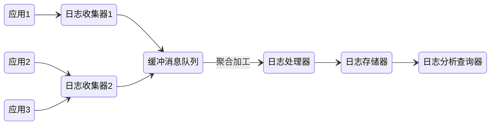

# 日志

- 记录操作
- 监控系统
- 回溯故障

## 日志规范

文件命名：appName_logType_logName.log

日志文件的保存时间衡量因素：

1. 重要程度
2. 文件大小
3. 磁盘空间

### 日志级别

- DEBUG 对调试有帮助的信息
- INFO 未发生错误 但对其他错误排查有指导作用
- WARN 偏向于此处有出现错误的可能
- ERROR 发生了错误需要被关注 但没有影响系统运行
- FATAL 严重错误 程序中断

### 日志类别

- 系统日志：可读性要求没那么高，日志中会包含代码的信息，比如在某个类的某一行打印了一个日志
- 操作日志：要求可读性比较强，因为它主要是给用户看的

## 日志实现

### 使用类似 Canal 的中间件监听数据变化 写日志

### 日志文件

- 操作人记录 使用 [ThreadLocal](/编程语言/JAVA/JAVA并发编程/并发工具类.md#ThreadLocal) 实现

```java
LoginUtil.setCurrentUser("cxk")
```

- 区分系统日志与操作日志

配置不同的logger

```java
private final Logger businessLog = LoggerFactory.getLogger("businessLog");
```

- 日志文案

```java
template = "用户 %s 做了 %s";
log.error(String.format(template, "cxk", "打篮球"))
```

### AOP方法注解

```java
// bizNo 业务唯一ID 方便进行日志搜索
// 通过使用自定义函数配合SpEL来分离业务逻辑与日志记录
@LogRecord(content = "修改了订单的配送员：从“{queryOldUser{#request.deliveryOrderNo()}}”, 修改到“{deveryUser{#request.userId}}”",
        bizNo="#request.deliveryOrderNo")
public void modifyAddress(updateDeliveryRequest request){
    // 更新派送信息 电话，收件人、地址
    doUpdate(request);
}
```


## 日志使用

### 预先判断日志级别

避免使用字符串的形式连接打印日志

```java
log.debug("user " + id + "create new order " + orderId) // bad

if (log.enableDebug){ // good
  log.debug(...)
}
log.debug('user {} create new order {}', id, orderId) // good
```

主要是防止无谓的字符串连接消耗系统资源

### 避免无效日志打印

对于debug log 等低级别的日志 一定要控制好输出量 避免磁盘空间被快速吞掉，

因为 String 字符串拼接会使用 StringBuilder 的 append () 方式，有一定的性能损耗。使用占位符可以有效提高性能

打印大文本日志非常影响性能,很多大文本对排查问题帮助不大，打印该信息的意义不大，因此尽量避免打印该内容或只截取一部分关键信息

### 区别对待错误日志

不能将所有错误一股脑归类为ERROR级别， ERROR 日志专门输出到一个 error.log 文件。调试时通过 `tail -f error.log` 随时监控出现的错误日志

ERROR级别就代表是需要人工介入处理的级别

- **ERROR** 日志的使用场景是：影响到程序正常运行或影响到当前请求正常运行的异常情况。比如打开配置失败、调用二方或者三方库抛出异常等
- **WARN** 日志 的使用场景是：不应该出现，但是不影响程序正常运行，不影响请求正常执行的情况。如找不到某个配置但是使用了默认配置，比如某些业务异常
- **INFO** 日志的使用场景是：需要了解的普通信息，比如接口的参数和返回值，异步任务的执行时间和任务内容等
- **DEBUG** 日志的使用场景是：所有调试阶段想了解的信息。比如无法进行远程 DEBUG 时，添加 DEBUG 日志在待研究的函数的某些位置打印参数和中间数据等
- **TRACE** 日志 的使用场景是：非常详细的系统运行信息，比如某个中间件读取配置，启动完成等

### 日志记录的内容

OpenTelemetry 推荐记录的日志内容

字段|描述
-|-
Timestamp|事件发生的时间
ObservedTimestamp|事件被记录的时间
Traceld|请求链路ID
SpanID|请求span ID
TraceFlags|W3C链路标记
SeverityText|日志级别
SeverityNumber|日志级别对应的数值
Body|日志内容
Resource|描述日志的来源
InstrumentationScope|描述发出日志的作用域
Attributes|有关该事件的其他信息

1. 一定要输出异常堆栈
2. 输出对象实例时 要确保对象重写了 toString 方法
3. 避免敏感信息
4. 避免引用到慢操作信息
5. 避免输出的信息有误导性

### 日志的追踪

对于没有链路追踪基础设施的单体应用，为了在大量的日志中找到自己所需的日志。就需要能以某种情况准确唯一标识日志，如

```java
log.info("业务上下文-事件xxx xxxx")
```

同时为了追踪执行流或者数据流，通常都需要在某条日志之前或之后追踪日志，此时可以使用日志纪录里的线程名称来明确整条执行链路，如下面的bussiness-task1/bussiness-task2...

```log
2022年1月21日20:30:21 INFO --- [-] [main] wang.ismy.xxx 日志内容1
2022年1月21日20:30:21 INFO --- [-] [bussiness-task1] wang.ismy.xxx 日志内容2
2022年1月21日20:30:21 INFO --- [-] [bussiness-task2] wang.ismy.xxx 日志内容3
...
```

### 日志的性能

单体在流量比较高的情况下，没有做好日志级别的控制，可能会狂打日志，这些大量的日志若没有使用专门的日志收集工具收集，大量打印不仅会消耗性能，同时大量的日志也会快速消耗磁盘空间，所以在做好日志级别控制的同时，也可以采取随机打印日志的方式

```java
if (random(0, 1000) == 3) {
  log.info("xx")
}
```

使用这种方式的目的在于观察代码路径是否覆盖，并且前提一定得是流量特别高的场景，否则会出现问题就没有日志可进行排查的境地

### 错误的日志形式

- e.printStackTrace()
- 参数类型错误导致占位符不生效
- 打印导致的空指针异常

## 日志实现


## 分布式日志体系



### 收集&缓冲

- Logstash
- Beats

为了缓解收集大量日志的压力 可以在收集器之前假设Kafka或者Redis作为缓冲层 面对突发流量

### 加工&聚合

- 将非结构化数据转为结构化数据

### 存储&查询

ES是这方面唯一的选择

日志有如下性质：

1. 写入后基本无需修改
2. 分为冷热数据 更早的日志价值更低
3. 日志可离线查询与实时查询
