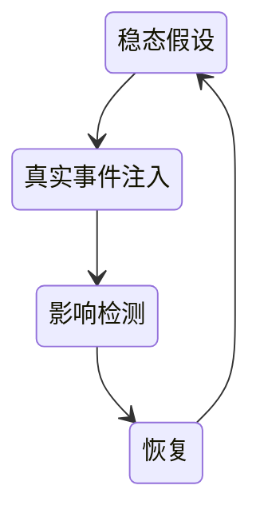
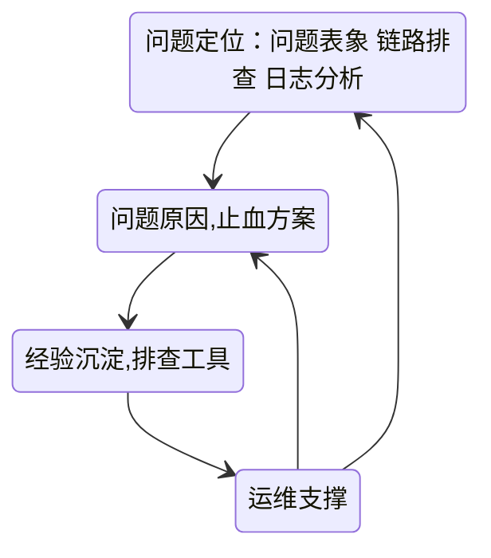

# 混沌工程

大型分布式系统跑在云上，一旦出错，错误难以预测，并且损失巨大，这就是引入混沌工程的原因

故障演练是属于混沌工程的一环，目的还是借事修人

混沌工程是在模块局部内确切的可控制的混乱

## 先决条件

- 弹性的系统空间：为故障预留一定可控空间，避免因为混沌产生真实的大故障
- 可集成的混沌工具：自动化、可干预、可恢复的故障生产与恢复
- 完善的故障响应流程
- 足够的团队应急能力

## 稳态定义与测量

- 先定义出系统的稳定状态，出了问题才可以对比

可以从场景化、现象化、指标化来定义出系统的稳定状态

根据现有的稳态，定义相关基线，通过监控测量相关指标偏离基线的情况来判断稳态是否变化

系统稳态的维持：

- 自治容灾，故障自愈
- 快速的监控告警，应急止血

## 事件

混沌工程的事件定义：

- 从真实故障中进行场景提炼

[理解分布式系统的8个谬误](https://cloud.tencent.com/developer/article/1370391)

### 基础设施事件

- 存储：不可读 不可写 存储满
- 系统：CPU满 内存满 延迟高
- 虚拟机：断电 宕机 被宿主杀死
- 网络：超时 丢包 断网
- ...

### 中间件事件

- 数据库： 链接慢 满SQL 主备延迟
- 缓存：热点 限流 丢失
- 队列：延迟 堆积 断连
- ...

### 应用事件

- 链路：依赖超时 依赖异常 重试风暴
- 环境：线程池满 进程被杀 线程竞争
- 应用：配置错误 包损毁 版本错乱
- ...

### 数据事件

## 最小化爆炸半径

事件的注入要不在线下的系统尽情搞

要不就在线上尽小的可控范围内进行注入

## 演练

目标：

- 故障发现能力考核
- 应急能力考核
- 恢复能力考核

### 执行

#### 场景

- 有代表性的场景具化
- 场景有价值
- 场景中的架构要有可证明的稳定状态及故障状态

#### 模式

- 验证性演练
- 突袭性演练

#### 角色

- 演练负责人：策划 通知
- 研发：确认 实施
- 测试：评估 复盘

#### 范围

- 红线场景
- 历史故障场景
- 可能的资损场景

### 观察

- 执行的进度、结果、时间观察及记录
- 事件的注入效果、指标的变化以及监控的报警状态
- 故障、指标、行为的恢复情况

### 恢复

- 事件移除：对植入的事件执行逆操作进行恢复
- 重置基础状态

### 过程结果分析

#### 时间分析

- 故障注入生效时间
- 监控发现告警时间
- 应急接手时间
- 止血恢复时间

#### 表现分析

维度\能力           | 容灾能力 | 发现能力 | 快速恢复能力
--------------- | ---- | ---- | ------
时间维度 是否快速及时     |      |
定量维度 问题数量是否可控   |      |
变化维度 变化幅度是否满足预期 |      |

#### 异常分析

演练过程中出现的异常和其特征分析

- 出现了什么异常
- 如何影响了系统
- 是否可控且可恢复

- 出现是否在预期之内
- 是否有预期之外的异常
- 异常的准确度与异常信息的完整度

### 改进分析

#### 稳定性提升

- 问题发现：预警 巡检 异常日志
- 异常控制：分级 清零 监控
- 系统保护：容灾 限流
- 系统治理：热点治理 漏洞治理 降级开关

#### 预案体系能力

- 场景覆盖能力
- 触发管理能力：指标变化触发人员或者预案
- 预案工具：预案开关 预案监控

#### 定位止血能力

- 问题定位能力：问题表象 链路排查 日志分析
- 问题原因
- 止血方案
- 经验沉淀 

#### 风险管控

需要明确的风险：

- 基础风险
- 环境风险
- 依赖风险
- 安全风险
- 流量风险

对抗风险：

- 研发流程把控
- 高危场景治理
- 热点瓶颈消除
- 安全漏洞清零
