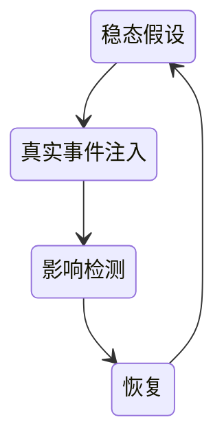

# 混沌工程

大型分布式系统跑在云上，一旦出错，错误难以预测，并且损失巨大，这就是引入混沌工程的原因

故障演练是属于混沌工程的一环，目的还是借事修人

混沌工程是在模块局部内确切的可控制的混乱

## 先决条件

- 弹性的系统空间：为故障预留一定可控空间，避免因为混沌产生真实的大故障
- 可集成的混沌工具：自动化、可干预、可恢复的故障生产与恢复
- 完善的故障响应流程
- 足够的团队应急能力

## 稳态定义与测量

- 先定义出系统的稳定状态，出了问题才可以对比

可以从场景化、现象化、指标化来定义出系统的稳定状态

根据现有的稳态，定义相关基线，通过监控测量相关指标偏离基线的情况来判断稳态是否变化

系统稳态的维持：

- 自治容灾，故障自愈
- 快速的监控告警，应急止血

## 事件

混沌工程的事件定义：

- 从真实故障中进行场景提炼

[理解分布式系统的8个谬误](https://cloud.tencent.com/developer/article/1370391)

### 基础设施事件

- 存储：不可读 不可写 存储满
- 系统：CPU满 内存满 延迟高
- 虚拟机：断电 宕机 被宿主杀死
- 网络：超时 丢包 断网
- ...

### 中间件事件

- 数据库： 链接慢 满SQL 主备延迟
- 缓存：热点 限流 丢失
- 队列：延迟 堆积 断连
- ...

### 应用事件

- 链路：依赖超时 依赖异常 重试风暴
- 环境：线程池满 进程被杀 线程竞争
- 应用：配置错误 包损毁 版本错乱
- ...

### 数据事件

## 最小化爆炸半径

事件的注入要不在线下的系统尽情搞

要不就在线上尽小的可控范围内进行注入

