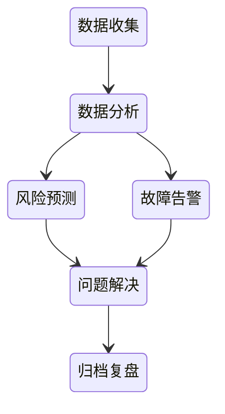
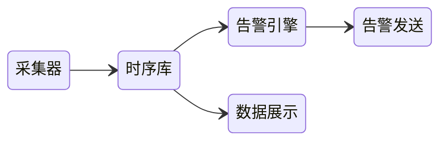

# 监控系统设计

- 为了实现[可观测性](/软件工程/架构/系统设计/可观测性.md)

## 目标

- 监控指标
- 数据聚合分析
- 厉害的dashboard
- 异常检测
- 异常告警 模板与渠道
- 可扩展 高可用

## 典型架构

## 监控维度

- 微服务层
- 机器层
- 中间件层
- 操作系统层

### 单服务单主机

主要监控主机的CPU、内存等数据以及服务所产生的日志

### 单服务多主机

如果所有主机都发生问题，那么可能是服务的问题

否则如果只是某一主机出现异常，问题定位就比较简单

同时，单一服务部署到多台主机，一般需要负载均衡器来分发请求，所以也要对负载均衡器进行监控

### 多服务多主机

此时问题定位就没那么容易了，必须收集到足够多的数据

## 监控范围

- 业务：指标成功率 红线 运行时异常
- 基础设施
- 流量：偏离 分布 攻击流量
- 综合性：防资损、数据巡检...

监控需要分层级，除了系统层级诸如 CPU 内存之类的数据，同时也要支持在需要时，能深入进程、线程级别的定向监控

## 方法

## 指标

### 黄金指标

USE（Utilization Saturation and Errors）法

- 使用率，表示资源用于服务的时间或容量百分比
- 饱和度，表示资源的繁忙程度，通常与等待队列的长度相关
- 错误数

以及 RED 法

- Rate（速率）：服务的请求速率
- Errors（错误）：服务的错误率
- Duration（延迟）：请求的持续时间，表示每个请求需要多长时间来完成

#### 延迟

- 服务请求所花费的时间

#### 流量

#### 错误

- 系统在处理请求时出错的比例

#### 饱和度

- 最能影响服务性能的资源，描述应用程序有多“满”

### 百分比指标

#### 中位值

#### 算数平均值

#### 四分位数

百分25 百分50 百分75

### 系统指标

#### 响应时间RT

#### RPS

#### TPS

#### QPS

#### 并发用户数

### 业务指标

## 监控述求

### 告警治理

#### 告警分级

- 严重：影响收入的、影响客户的，必须立刻处理
- 警告：无需立刻处理，但是如果不处理，时间久了就会演化为严重的问题，可以先放入TODO列表，手头上的紧急事务搞定之后就去处理
- 提示：每天下班前稍微看一眼，偶尔一两天忘了看也无伤大雅

#### 告警渠道

- 严重：电话、短信、即时消息、邮件
- 警告：短信、即时消息、邮件
- 提示：邮件

#### 告警规则

- 支持生效时间：不同时间段对稳定性的要求不同，有些时间段可以不要告警
- 告警规则支持分级和不同的触达渠道，避免告警等级与告警渠道强绑定
- 重复告警支持最大次数和发送频率，避免告警爆炸
- 告警聚合：根据接收人和时间两个维度做聚合，避免告警爆炸
- 告警屏蔽：一般就是在做一个预期的维护动作之前，提前把相关告警屏蔽掉，免得在维护期间又收到告警

#### 告警模板

#### 告警升级

在第一责任人收到告警之后没有及时响应，然后系统自动通知二线、三线人员的一种机制

#### 告警收敛

三级收敛，event -> alert -> incident

重复的告警、相关联的告警进行收敛聚合，以方面协作及信息同步

#### 故障协同

多团队协作共享信息共同解决复杂告警与故障的系统化机制

#### 告警自愈

检测到系统异常或故障时，通过自动化脚本或工具，无需人工干预就能自动采取修复措施

### 易用性

## 综合监控

通常可以对系统一些资源指标进行监控，判断实际值是否超出设定的阈值，但这些数据并不能直接说明服务是否能正常工作

### 语义监控

通过端到端的测试来监控服务的工作正常与否

## 标准化

无论是日志的格式，还是工具，都需要标准化

## 考虑受众

需要对日志的使用者，他们需要知道什么，想要什么以及如何消费数据等考虑清楚
