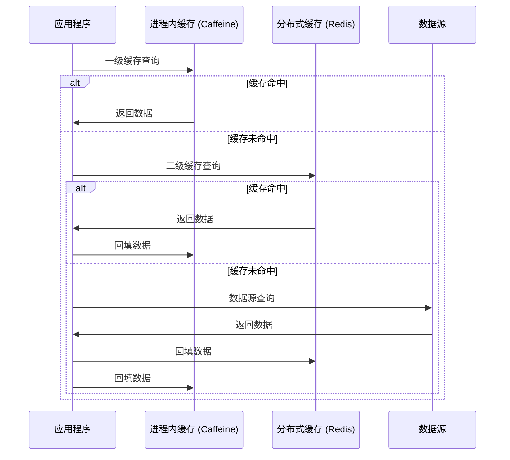
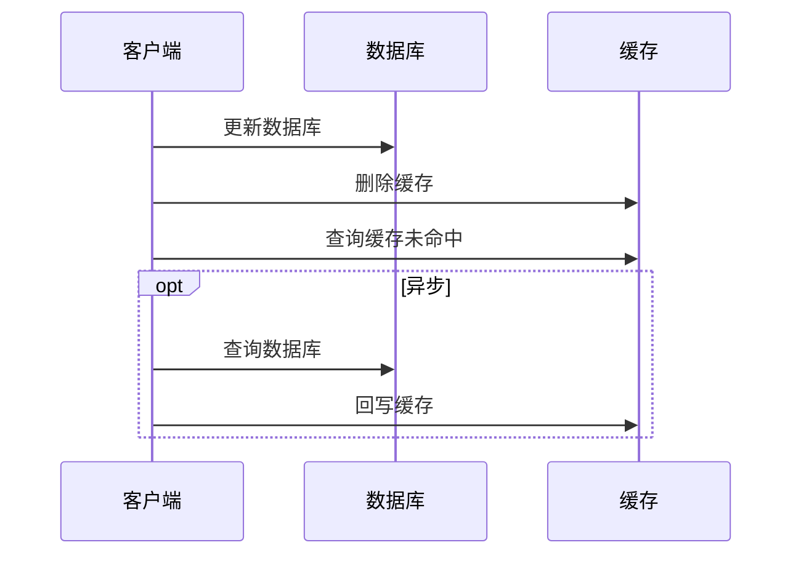
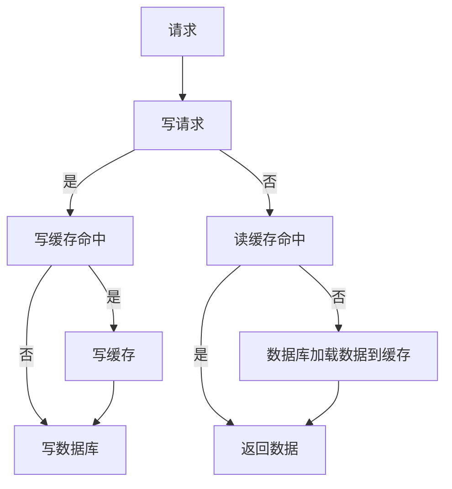
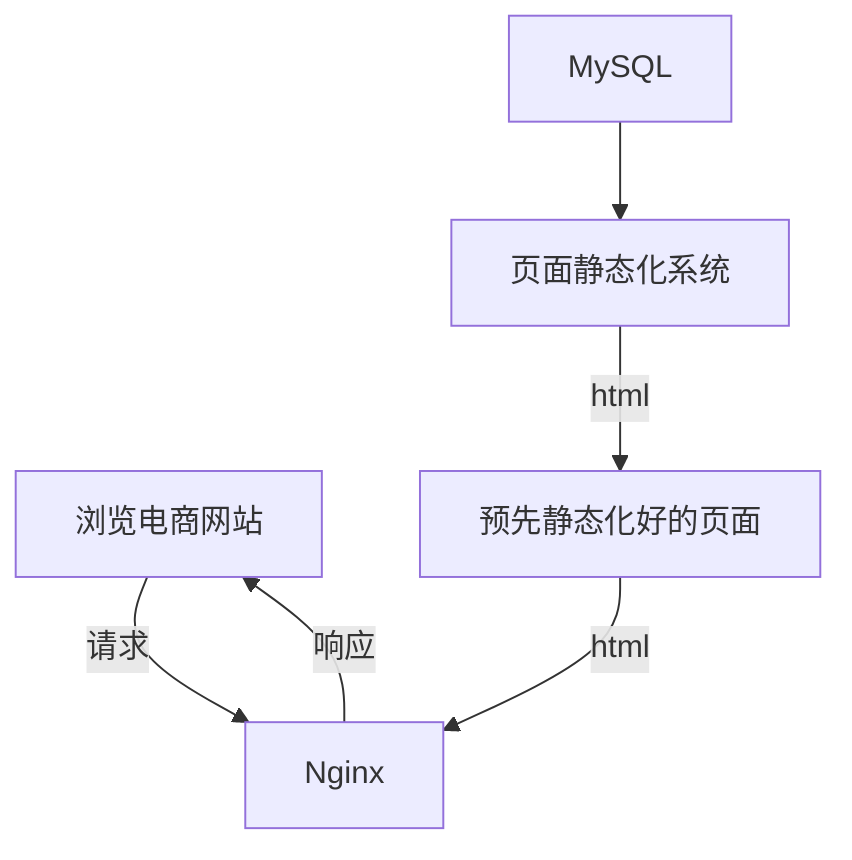
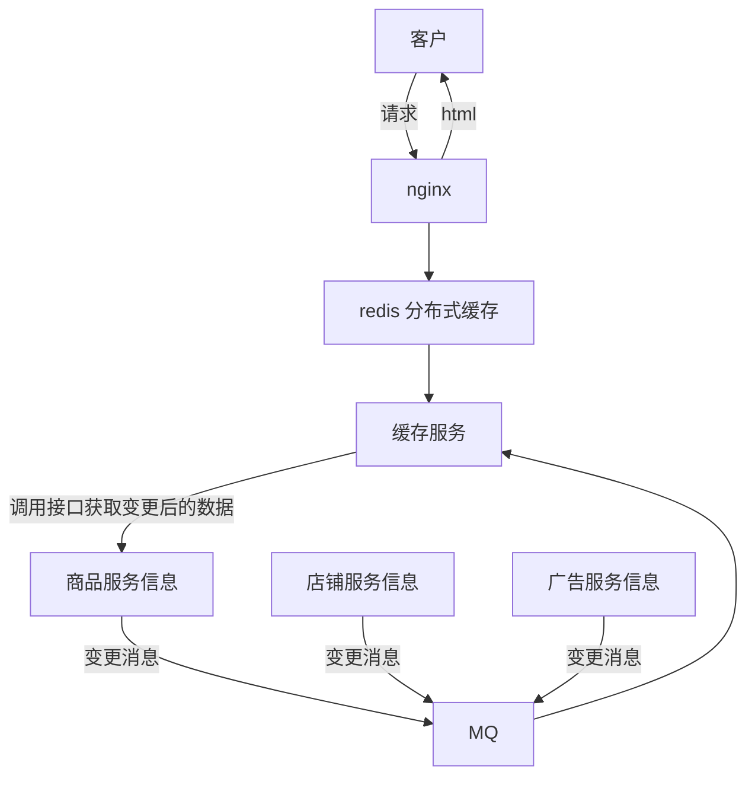

# 缓存

## 为什么使用

收益：

- 加速读写：缓存通常都是全内存的（缓解IO压力）
- 降低后端负载：帮助后端减少访问量和复杂计算（缓解CPU压力）

成本：

- 数据不一致性：缓存层和存储层的数据存在着一定时间窗口的不一致
- 代码维护成本：加入缓存后，需要同时处理缓存层和存储层的逻辑
- 运维成本：如Redis集群的加入 运维会更有难度

## 缓存方案设计考虑点

1. 什么数据应该缓存
2. 什么时机触发缓存和以及触发方式是什么
3. 缓存的层次和粒度（ 网关缓存如 nginx，本地缓存如单机文件，分布式缓存如redis cluster，进程内缓存如全局变量）
4. 缓存的命名规则和失效规则
5. 缓存的监控指标和故障应对方案
6. 可视化缓存数据如 redis 具体 key 内容和大小

### 数据特征对缓存设计的影响

- 不变性数据：优先考虑使用缓存的数据类型，不变性意味着实现一致性会非常容易
- 弱一致性数据：对一致性的要求比较低，只要能保证最终一致性就行
- 强一致性数据：这类数据在使用缓存时会比较复杂，而且很容易会引入新的问题

## 特征

性能评估模型：$$AMAT = Thit + MR * MP$$

- AMAT（Average Memory Access Time），代表的是平均内存访问时间
- Thit，是指命中缓存之后的数据访问时间
- MR，是指访问缓存的失效率
- MP，是指缓存失效后，系统访问缓存的时间与访问原始数据请求的时间之和

### 吞吐量

使用OPS值（每秒操作数，Operations per Second，ops/s）来衡量，反映了对缓存进行并发读、写操作的效率

在并发读写的场景下， 避免竞争是最关键的

### 命中率

某个请求能够通过访问缓存而得到响应时，称为缓存命中率

缓存命中率越高，缓存的利用率也就越高

### 最大空间

缓存的利用空间是有限的

当缓存存放的数据量超过最大空间时，就需要淘汰部分数据来存放新到达的数据

### 分布式支持

缓存可分为“进程内缓存”和“分布式缓存”两大类

- 复制式缓存：每个节点里面都存在有一份副本，读取数据时无需网络访问，直接从当前节点的进程内存中返回，当数据发生变化时，就必须遵循复制协议，将变更同步到集群的每个节点中，这种复制性能随着节点的增加呈现平方级下降，变更数据的代价十分高昂
- 集中式缓存：是目前分布式缓存的主流形式，集中式缓存的读、写都需要网络访问，其好处是不会随着集群节点数量的增加而产生额外的负担，其坏处自然是读、写都不再可能达到进程内缓存那样的高性能。由于对象更新一个字段可能也会导致整个对象的序列化传输，所以集中式缓存更提倡缓存原始类型

使用多级缓存同时得到两种类型的优点：

在JVM进程内一级的缓存若过大 可能会造成GC压力过大 此时使用堆外内存分配能有效提升性能

#### 集中式缓存高可用

1. 客户端方案：在客户端完成缓存分片、负载均衡等操作
2. 中间代理层：读写请求都是经过代理层完成的。代理层是无状态的，主要负责读写请求的路由功能，并且在其中内置了一些高可用扩展，Facebook 的Mcrouter，Twitter 的Twemproxy，豌豆荚的Codis
3. 服务端方案：一般就是缓存中间件自带的，[Redis的哨兵](/中间件/数据库/redis/哨兵.md)，[Redis的集群](/中间件/数据库/redis/集群.md)

### 扩展功能

#### 更新策略

当缓存使用量超过了预设的最大值时候 FIFO（先进先出）  LRU（最久未使用） LFU（最少使用） 等算法用来剔除部分数据 数据一致性最差（因为数据的过期完全取决于缓存） 但基本没有维护成本

针对LRU的一些缺点，出现了一些算法，这些算法在某些条件下往往有更好的表现：

- TinyLFU：会用少量的样本数据来估计全体数据的特征，并且每隔一段时间，便会把计数器的数值减半，以此解决“旧热点”数据难以清除的问题
- W-TinyLFU：用来解决TinyLFU无法应对稀疏突发访问的问题

超时剔除通过给缓存数据设置过期时间，让其在过期时间后自动删除 段时间窗口内（取决于过期时间长短）存在一致性问题 维护成本不高 只需要设置一个过期时间

应用方对于数据的一致性要求高，需要在真实数据更新后，立即主动更新缓存数据 一致性很高 但是维护成本也是最高的

#### 缓存粒度

究竟是缓存全部属性还是只缓存部分重要属性呢 从三个维度判断：

- 通用性：缓存全部数据比部分数据更加通用 但是数据具有热点 一般只有几个属性用的比较多
- 空间带宽。缓存全部数据要比部分数据占用更多的空间及带宽
- 代码维护：部分数据一旦要加新字段需要修改业务代码

## 位置

- 浏览器缓存
- CDN
- ISP缓存
  - ISP是网络访问的第一跳，这个地方有缓存能大大加快用户的访问速度
- 反向代理缓存
- 本地缓存
  - 这里指的是将缓存存放在服务器进程内
- 分布式缓存
  - 使用专门的服务器集群来存放缓存
- 数据库缓存
  - 一般数据库都有自己的缓存机制
- CPU缓存

## 读写策略

### 旁路

### 读穿写穿

### 写回

在写入数据时只写入缓存，并且把缓存块标记为“脏”的。而脏块只有被再次使用时才会将其中的数据写入到后端存储中

这种策略不能被应用到常用的数据库和缓存的场景中，主要是因为一旦缓存机器掉电，就会造成原本缓存中的脏块数据丢失，是底层中如磁盘或者页缓存使用的

## 缓存风险

### 缓存雪崩

在高并发的情况下，由于于数据没有被缓存中或者缓存都采用了相同的过期时间，导致缓存在某一时刻同时失效，请求全部发到数据库，数据库瞬时压力过重

解决方案：

- 锁
  - 比如对某个key只允许一个线程数据库查询数据和写缓存，其他线程等待。但是这样就只能限制同一时间只能有一个线程访问数据库，吞吐量还是不行
- 消息中间件
  - 缓存中间件没有命中的情况下，生产者将缓存更新请求通过MQ发送给消费者，消费者通过自身的串行处理可以实现对缓存只写一次，后续的请求可以忽略掉
- 使用多级缓存以及分布式缓存
- 分析用户的行为，尽量让缓存失效的时间均匀分布（将过期时间上下浮动一定范围）
- 缓存预热：对于可预见的热点数据 进行缓存预先加载 避免突发大流量压垮数据库

概括：

- 保证缓存层服务的高可用
- 对后端服务进行限流降级 一旦后端服务不可用 直接降级返回一个友好结果

### 热点key

- 也叫做缓存击穿

对于一些设置了过期时间的key，如果这些key可能会在某些时间点被超高并发地访问，是一种非常“热点”的数据。这个时候，需要考虑一个问题：缓存被“击穿”的问题：

如果这个key的计算不能在短时间完成，那么在这个 key 在效的瞬间，大量的请求就击穿了缓存，直接请求数据库，就像是在一道屏障上凿开了一个洞

解决方案：

- 锁
  - 在重建缓存时 只允许一个线程重建 其他线程必须等待
- 不设置过期时间，而将过期时间设置在数据中，如果检测到数据过期了，再清除掉 或者当发现超过逻辑过期时间后，会使用单独的线程去构建缓存
- 读写分离 使用 CDC 中间件从数据库同步数据到缓存

### 缓存穿透

指用户查询数据，在数据库没有，自然在缓存中也不会有。这样就导致用户查询的时候，在缓存中找不到，请求穿透到了数据库，然后返回空。这样就会导致每次查询不存在的数据都会绕过缓存去查询数据库

解决:

1. 把空结果，也给缓存起来，这样下次同样的请求就可以直接返回空了，即可以避免当查询的值为空时引起的缓存穿透。这种方案对空值做了缓存，意味着缓存层中存了更多的键，需要更多的内存空间 同时也会有一定的数据不一致性
2. 也可以使用布隆过滤器直接对这类请求进行过滤。这种方法适用于数据命中不高、数据相对固定、实时性低（通常是数据集较大）的应用场景

### 缓存一致性

缓存中的数据与真实数据源中的数据不一致的现象

解决：

- 当数据更新的同时立即去更新缓存。将读请求和写请求串行化
- 读缓存之前判断缓存是否是最新，否则先进行更新缓存
- 更新数据时，先更新数据库，再删除缓存（旁路写策略）。为什么要删除缓存，而非更新缓存，如果缓存采用更新的方式，可能这个缓存压根就不会被用到，应该是用到缓存才去写入缓存

保证缓存一致性需要付出很大的代价，缓存数据最好是那些对一致性要求不高的数据，允许缓存数据存在一些脏数据。或者直接使用 CDC 同步的方式，直接同步数据库，这样不仅能解耦业务代码，也能拥有最终一致性

### 缓存无底洞

随着缓存节点数目的增加，键值分布到更多的节点上，导致客户端一次批量操作会涉及多次网络操作

解决：

- 优化细粒度的远程调用
- 减少网络通信次数
- 使用长连接或者连接池

方案|优点|缺点|网络IO
-|-|-|-
串行命令|编程简单，如果少量keys,性能可以满足要求|大量keys请求延迟严重|O(keys)
串行IO|编程简单，少量节点时性能满足要求|大量node延迟严重|O(nodes)
并行IO|延迟取决于最慢的节点|编程复杂|O(max_slow(nodes))
hash_tag|性能最高|维护成本高,容易出现数据倾斜|O(1)

## 客户端缓存

### [浏览器缓存](/计算机网络/http/HTTP.md#缓存)

### 应用缓存

分为手机APP和Client以及是否遵循http协议

在没有联网的状态下可以展示数据

流量消耗过多

- 漂亮的加载过程
- 提前下发  避免秒杀时同时下发数据造成流量短时间暴增
- 兜底数据 在服务器崩溃和网络不可用的时候展示
- 临时缓存  退出即清理
- 固定缓存  展示框架这种，可能很长时间不会更新，可以随客户端下发
- 父子连接 页面跳转时有一部分内容不需要重新加载，可用从父菜单带过来
- 预加载     某些逻辑可用判定用户接下来的操作，那么可用异步加载那些资源
- 异步加载 先展示框架，然后异步加载内容，避免主线程阻塞

## 静态化

### 全量静态化

将网站的所有页面预先生成静态页面，对于小型网站，页面不多，可以采用这个方式

### 按需静态化

当数据发生变更，往MQ推送一条消息，消费者消费数据并进行渲染

### 优化策略

1. 增量更新：只更新发生变化的页面，减少全量更新的开销。
2. 分片静态化：将页面划分为多个部分，分别进行静态化，提高更新效率。
3. 批量更新：将多次数据变更合并为一次静态化操作，减少频繁更新的成本

### 运维监控

1. 页面生成时间
2. 缓存命中率
