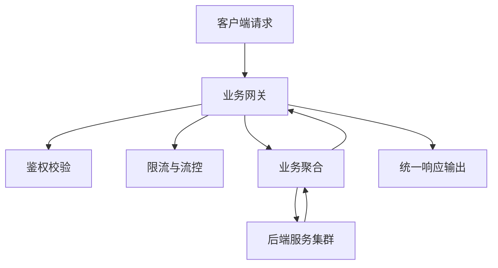
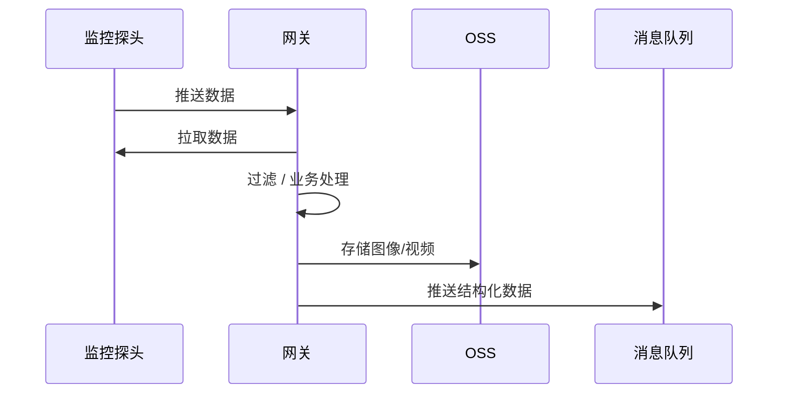
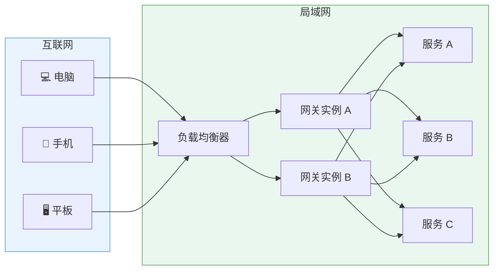
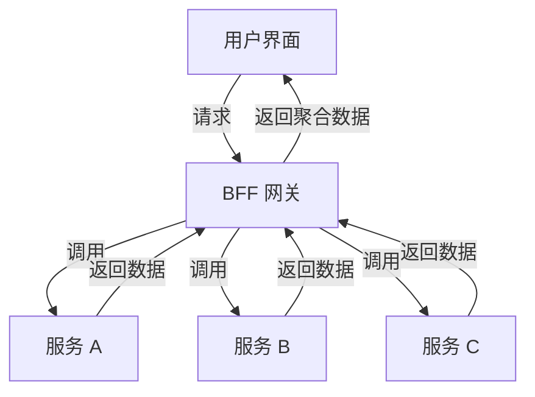

# 网关（Gateway）

## 一、网关的本质

网关是系统的**边界层组件**，负责在**外部访问**与**内部服务**之间建立一条受控、可治理的通道。

> 可以理解为：“流量的入口 + 策略的执行点 + 协议的转换层”。

在本质上，网关承担了两类职能：

| 职能        | 说明                            |
| --------- | ----------------------------- |
| **路由器职能** | 将外部请求按照规则转发至内部服务，决定“流量去向”     |
| **过滤器职能** | 在流量经过时执行一系列策略，如鉴权、限流、日志、安全检测等 |

当仅关注**转发性能**时，可在四层（TCP/IP）操作；
当需要**识别请求内容、分析协议特征**时，则需在七层（HTTP/HTTPS、gRPC、MQTT 等）操作。

---

## 二、网关的设计原则

1. **轻量化**：
   网关不宜承担复杂的业务逻辑，应聚焦于流量治理、协议适配与安全控制。
   过重的逻辑会导致可用性与可维护性下降。

2. **可扩展性**：
   网关应可水平扩展，支持负载均衡与动态注册。
   在高并发环境下，通过多实例或集群模式扩容。

3. **高可用性**：
   通过健康检查、限流熔断、超时重试等机制，保证网关本身的稳定。

4. **可观测性**：
   网关作为流量的第一个落点，应提供监控指标、日志与追踪能力，支持全链路可视化。

5. **策略统一性**：
   所有接入策略（认证、路由、过滤、限流）应可配置、集中管理，形成“策略中心”。

---

## 三、核心功能

| 分类         | 说明                                |
| ---------- | --------------------------------- |
| **流量接入**   | 统一入口，接收来自客户端或外部系统的请求              |
| **API 管理** | 统一定义、注册、发布、下线接口；实现 API 生命周期治理     |
| **流量控制**   | 限流、负载均衡、重试、熔断、降级等治理策略             |
| **安全防护**   | 认证授权、防攻击、防扫描、协议校验、黑白名单            |
| **监控与统计**  | 日志记录、请求统计、延迟分析、可视化仪表盘             |
| **协议适配**   | 实现不同协议（HTTP、MQTT、WebSocket 等）间的转化 |
| **缓存与聚合**  | 支持响应缓存与多后端结果聚合，提升性能               |

---

## 四、类型划分

### 1. 流量网关（Traffic Gateway）

面向网络层与安全层，关注“请求的安全性与健康性”。

* 全局限流与流量调度
* 请求日志与统计分析
* SQL 注入与 XSS 防护
* Web 攻击防御与扫描屏蔽
* 黑白名单、IP 与地域过滤
* 协议与版本适配（HTTP ↔ HTTPS、HTTP ↔ MQTT）

> 通常与防火墙、WAF、CDN 协同工作。

---

### 2. 业务网关（Business Gateway）

面向应用层与服务层，关注“请求的语义与业务聚合”。

* 请求接入：所有 API 请求的统一入口
* 业务聚合：多个服务结果的合并、转化与裁剪
* 策略中介：认证、鉴权、过滤、流控、缓存
* 生命周期管理：统一配置与灰度策略

---

### 3. 探测与数据型网关（Monitoring/Data Gateway）

> 常见于 IoT、视频监控、工业控制等场景。

---

## 五、网关部署架构

> 区别：
>
> * **反向代理（如 Nginx）** 面向服务器，处理静态资源、负载均衡。
> * **应用网关** 面向服务，处理请求解析、鉴权与业务策略。

---

## 六、BFF（Backend for Frontend）模式

BFF 是一种**面向前端体验的网关模式**，在前后端之间增加一个专属层，用于聚合后端服务，裁剪数据结构，简化前端接口。

优势：

* 降低前端与后端的耦合；
* 提供针对不同终端（Web、App、小程序）的定制化 API；
* 可作为流量隔离层。

---

## 七、架构演进与选型趋势

| 阶段          | 特点          | 代表组件                           |
| ----------- | ----------- | ------------------------------ |
| **单体时代**    | 静态路由、简单反向代理 | Apache、Nginx、HAProxy           |
| **微服务时代**   | 动态路由、流量治理   | Nginx、Kong、Traefik             |
| **云原生时代**   | 动态发现、统一治理   | Kubernetes Ingress、Envoy、Istio |
| **前后端分离时代** | 定制化聚合层      | BFF Gateway、GraphQL Gateway    |

---

## 八、网关的观察与治理维度

| 维度       | 关注点            | 典型手段                         |
| -------- | -------------- | ---------------------------- |
| **流量治理** | 限流、熔断、降级、重试    | Token Bucket、Circuit Breaker |
| **安全治理** | 身份认证、权限控制、攻击防御 | JWT、OAuth2、WAF               |
| **服务治理** | 动态发现、负载均衡      | 注册中心、健康检查                    |
| **可观测性** | 指标、日志、追踪       | Metrics、Tracing、ELK          |
| **配置治理** | 动态配置、灰度发布      | Config Center、Feature Toggle |

---

## 九、总结

网关不仅是**流量的中转点**，更是**系统稳定性治理的重要边界**。
一个优秀的网关体系，应同时具备：

* **安全性**（防御外部威胁）
* **稳定性**（应对高并发流量）
* **扩展性**（支持新协议与多租户）
* **治理性**（统一策略、统一观测）

> 网关是系统的“咽喉”，但不应成为“瓶颈”。
