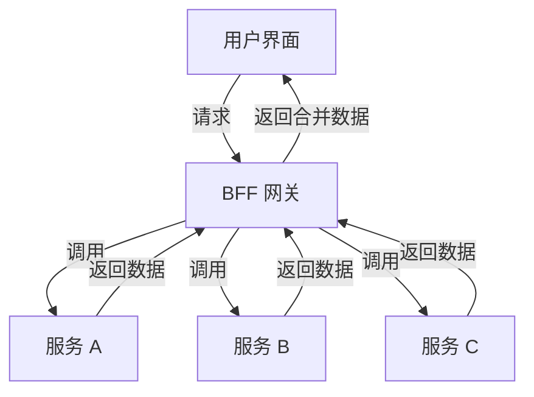

# 网关

网关的职责：网关 = 路由器（基础职能） + 过滤器（可选职能）

对于路由：如果需要对流量的特征进行分析，那必须是要在七层操作，否则直接在四层直接进行流量转发就可以了

不同的网关采用的网络IO模型不同 性能表现也不同

网关的可用性考虑：

1. 网关应该轻量 达到功能性与可用性的平衡 职责过多是很危险的
2. 选择成熟的网关产品
3. 在网关之间加上负载均衡器或者路由器 以便让网关也能进行扩展

## 主要功能点

- 流量出入口
- API管理中心
- 流量管理
- 认证授权

## 流量网关

- 全局性流控
- 日志统计
- 防止 SQL 注入
- 防止 Web 攻击
- 屏蔽工具扫描
- 黑白名单控制
- 协议适配

## 业务网关

- 请求接入：作为所有 API 接口服务请求的接入点，管理所有的接入请求；
- 业务聚合：作为所有后端业务服务的聚合点，所有的业务服务都可以在这里被调用；
- 中介策略：实现安全、验证、路由、过滤、流控，缓存等策略，进行一些必要的中介处理；
- 统一管理：提供配置管理工具，对所有 API 服务的调用生命周期和相应的中介策略进行统一管理。

## 网关部署架构


- nginx面向服务器
- 网关面向服务

## BFF( Backend for frontend)网关



## Spring Cloud Zuul


### 使用

- 添加依赖

```xml
<dependency>
    <groupId>org.springframework.cloud</groupId>
    <artifactId>spring-cloud-starter-netflix-eureka-client</artifactId>
</dependency>
<dependency>
    <groupId>org.springframework.cloud</groupId>
    <artifactId>spring-cloud-starter-netflix-zuul</artifactId>
</dependency>
```

- 配置

```properties
server.port=8010
spring.application.name=gateway

# 这里的配置表示，访问/bd/** 直接重定向到http://baidu.com/**
zuul.routes.baidu.path=/bd/**
zuul.routes.baidu.url=http://baidu.com/

eureka.client.serviceUrl.defaultZone=http://localhost:8001/eureka/
```
```java
@EnableZuulProxy
```

### 默认路由规则

<http://ZUUL_HOST:ZUUL_PORT/微服务在Eureka上的serviceId/**>

比如访问<http://localhost:8010/producer/>

则gateway就会把请求转发到producer服务上面去

### 简化路由配置

```yml
zuul:
  routes:
    user-service: /user-service/** # 这里是映射路径
```

### Zuul的核心

- Fliter
- 场景
  - 请求鉴权：一般放在pre类型，如果发现没有访问权限，直接就拦截了
  - 异常处理：一般会在error类型和post类型过滤器中结合来处理。
  - 服务调用时长统计

### 自定义Filter

- 实现ZuulFilter

```java
@Component
public class MyFilter extends ZuulFilter {

    @Override
    public String filterType() {return FilterConstants.PRE_TYPE;}

    @Override
    public int filterOrder() {return FilterConstants.PRE_DECORATION_FILTER_ORDER;}

    @Override
    public boolean shouldFilter() {return true;}

    @Override
    public Object run() throws ZuulException {

        RequestContext ctx = RequestContext.getCurrentContext();
        HttpServletRequest request = ctx.getRequest();

        String token = request.getParameter("token");
        if ("my".equals(token)){
            ctx.setSendZuulResponse(true);
            ctx.setResponseStatusCode(200);
            ctx.set("isSuccess",true);
        }else{
            ctx.setSendZuulResponse(false);
            ctx.setResponseStatusCode(400);
            ctx.setResponseBody("error token");
            ctx.set("isSuccess",false);

        }
        return null;
    }
}
```

这样当通过网关访问服务时，不符合条件的请求将会被过滤掉

### 整合配置中心

- 依赖

```xml
<dependency>
    <groupId>org.springframework.cloud</groupId>
    <artifactId>spring-cloud-starter-config</artifactId>
</dependency>
<dependency>
    <groupId>org.springframework.boot</groupId>
    <artifactId>spring-boot-starter-actuator</artifactId>
</dependency>
```

- 手动配置zuul配置对象

```java
@RefreshScope
@ConfigurationProperties("zuul")
public ZuulProperties zuulProperties() {
    return new ZuulProperties();
}
```

### 进行跨域配置

```java
@Configuration
public class CorsConfig {
    @Bean
    public CorsFilter corsFilter() {
        final UrlBasedCorsConfigurationSource source = new UrlBasedCorsConfigurationSource();
        final CorsConfiguration config = new CorsConfiguration();
        config.setAllowCredentials(true); // 允许cookies跨域
        config.addAllowedOrigin("*");// #允许向该服务器提交请求的URI，*表示全部允许，在SpringMVC中，如果设成*，会自动转成当前请求头中的Origin
        config.addAllowedHeader("*");// #允许访问的头信息,*表示全部
        config.setMaxAge(18000L);// 预检请求的缓存时间（秒），即在这个时间段里，对于相同的跨域请求不会再预检了
        config.addAllowedMethod("*");// 允许提交请求的方法，*表示全部允许
        source.registerCorsConfiguration("/**", config);
        return new CorsFilter(source);
    }
}
```

### 忽略

```properties
# 忽略该服务
zuul.ignored-services: upload-servie 
```

### 路由熔断

- 自定义fallback

```java
@Component
public class MyFallback implements FallbackProvider {
    @Override
    public String getRoute() {
        return "producer";
    }

    @Override
    public ClientHttpResponse fallbackResponse(String route, Throwable cause) {

        cause.printStackTrace();


        return new ClientHttpResponse() {
            @Override
            public HttpStatus getStatusCode() throws IOException {
                return HttpStatus.valueOf(500);
            }

            @Override
            public int getRawStatusCode() throws IOException {
                return 500;
            }

            @Override
            public String getStatusText() throws IOException {
                return "SERVER ERROR";
            }

            @Override
            public void close() {

            }

            @Override
            public InputStream getBody() throws IOException {
                return new ByteArrayInputStream("service is unavailable".getBytes());
            }

            @Override
            public HttpHeaders getHeaders() {
                HttpHeaders headers = new HttpHeaders();
                headers.setContentType(MediaType.TEXT_PLAIN);
                return headers;
            }
        };
    }
}
```

当producer挂掉时，将会返回相关信息

### 路由重试

- 添加依赖

```xml
<dependency>
    <groupId>org.springframework.retry</groupId>
    <artifactId>spring-retry</artifactId>
</dependency>
```

- 配置

```properties
#是否开启重试功能
zuul.retryable=true
#对当前服务的重试次数
ribbon.MaxAutoRetries=2
#切换相同Server的次数
ribbon.MaxAutoRetriesNextServer=0
```

当相同的服务挂掉一部分后，如果多次请求不成功，则接下来的请求则会转发到其他服务上

> 也就是说,自动的寻找到正确响应的服务上去.错误的实例被抛弃

### zuul高可用

- 启动两个网关实例8000和7000
- 配置nginx负载均衡

```nginx
upstream gateway {
        server 127.0.0.1:8000;
        server 127.0.0.1:7000;
}
server {
        listen 6060;
        location / {
                proxy_pass http://gateway;
                proxy_connect_timeout 1s;
                proxy_send_timeout 1s;
                proxy_read_timeout 1s;
        }
}
```


## Spring Cloud Gateway

- 路由
- 断言
- 过滤器


### 配置

```xml
<dependency>
    <groupId>org.springframework.cloud</groupId>
    <artifactId>spring-cloud-starter-gateway</artifactId>
</dependency>
```

#### 定义路由规则

```java
@Bean
public RouteLocator customRouteLocator(RouteLocatorBuilder builder) {
    return builder.routes()
            .route("path_route", r -> r.path("/hi")
                    .uri("http://localhost:8503"))
            .build();
}
```

- 通过时间匹配

```java
builder.routes()
       .route("path_route", r -> r.before(ZonedDateTime.now())
               .uri("http://localhost:8503"))
       .build();
```

- 通过Cookie匹配

```java
builder.routes()
       .route("path_route", r -> r.cookie("key","value")
               .uri("http://localhost:8503"))
       .build();
```

- 通过header属性匹配
- 通过Host匹配
- 通过请求方式匹配
- 通过请求路径匹配
- 通过请求参数匹配
- 通过请求IP匹配

### 服务化

- 依赖

```xml
<dependency>
    <groupId>org.springframework.cloud</groupId>
    <artifactId>spring-cloud-starter-netflix-eureka-client</artifactId>
</dependency>
```

- 配置

```yml
server:
  port: 8888
spring:
  application:
    name: gateway
  cloud:
    gateway:
      discovery:
        locator:
          enabled: true
eureka:
  client:
    service-url:
      defaultZone: http://localhost:8001/eureka/
logging:
  level:
    org.springframework.cloud.gateway: debug
```

- 默认转发规则

<http://网关/服务serviceId/具体的url>

### Filter

- PRE

> 这种过滤器在请求被路由之前调用。我们可利用这种过滤器实现身份验证、在集群中选择请求的微服务、记录调试信息等

- POST

> 这种过滤器在路由到微服务以后执行。这种过滤器可用来为响应添加标准的 HTTP Header、收集统计信息和指标、将响应从微服务发送给客户端等

#### 简单过滤器实例

- 配置

```yml
server:
  port: 8888
spring:
  application:
    name: gateway
  cloud:
    gateway:
      routes:
      - id: add_request_parameter_route
        uri: http://localhost:9003
        filters:
        - AddRequestParameter=name, my
        predicates:
          - Method=GET
      discovery:
        locator:
          enabled: true

eureka:
  client:
    service-url:
      defaultZone: http://localhost:8001/eureka/
logging:
  level:
    org.springframework.cloud.gateway: debug
```

在上面的配置中，添加了一个路由过滤规则：对9003端口的get请求添加一个请求参数name:my

- 服务化配置

改成`uri: lb://producer` 则路由配置只会对producer服务生效

#### 修改路径的过滤器

- StripPrefix Filter

```yml
- id: nameRoot
  uri: lb://producer
  predicates:
    - Path=/name/**
  filters:
    - StripPrefix=2
```

如果访问/name/my/hello，网关就会将路径修改为/hello

- PrefixPath Filter

```yml
- id: prefixpath_route
  uri: lb://producer
  predicates:
  - Path=*
  filters:
  - PrefixPath=/mypath
```

自动给URL加上mypath前缀

#### 自定义Filter

```java
@Component
public class TokenFilter implements GlobalFilter {
    @Override
    public Mono<Void> filter(ServerWebExchange exchange, GatewayFilterChain chain) {
        var token = exchange.getRequest().getQueryParams().get("token");
        if (!CollectionUtils.isEmpty(token)){
            return chain.filter(exchange);
        }
        ServerHttpResponse response = exchange.getResponse();
        response.setStatusCode(HttpStatus.FORBIDDEN);
        return response.writeWith(
                Mono.just(
                        response.bufferFactory().wrap("token is null".getBytes())
                )
        );
    }
}
```

#### 限速路由器

#### 熔断路由器

- 依赖

```xml
<dependency>
    <groupId>org.springframework.cloud</groupId>
    <artifactId>spring-cloud-starter-netflix-hystrix</artifactId>
</dependency>
```

```yml
- id: hystrix_route
  uri: http://localhost:9001
  predicates:
    - Path=/*
  filters:
    - Hystrix=myCommandName
```

#### 重试路由器

## 比较

网关                   | 限流                                                        | 鉴权                           | 监控                                                       | 易用性                           | 可维护性                    | 成熟度
:------------------- | :-------------------------------------------------------- | :--------------------------- | :------------------------------------------------------- | :---------------------------- | :---------------------- | :------------------
Spring Cloud Gateway | 可以通过IP，用户，集群限流，提供了相应的接口进行扩展 ,gateway不依赖servlet api，所以性能更强
gateway的转发是在tcp层     | 普通鉴权、auth2.0                                              | Gateway Metrics Filter       | 简单易用                                                     | spring系列可扩展强，易配置 可维护性好        | spring社区成熟，但gateway资源较少
Zuul2                | 可以通过配置文件配置集群限流和单服务器限流亦可通过filter实现限流扩展                     | filter中实现                    | filter中实现                                                | 参考资料较少                        | 可维护性较差                  | 开源不久，资料少
OpenResty            | 需要lua开发                                                   | 需要lua开发                      | 需要开发                                                     | 简单易用，但是需要进行的lua开发很多           | 可维护性较差，将来需要维护大量lua脚本    | 很成熟资料很多
Kong                 | 根据秒，分，时，天，月，年，根据用户进行限流。可在原码的基础上进行开发                       | 普通鉴权，Key Auth鉴权，HMAC，auth2.0 | 可上报datadog，记录请求数量，请求数据量，应答数据量，接收于发送的时间间隔，状态码数量，kong内运行时间 | 简单易用，api转发通过管理员接口配置，开发需要lua脚本 | "可维护性较差，将来需要维护大量lua库    | 相对成熟，用户问题汇总，社区，插件开源


### 不同技术栈网关选型

- 单体时代： apache nginx haproxy
- 微服务： nginx kong
- spring cloud： gateway zuul
- k8s： ingress nginx traefik
- service mesh： envoy mosn istio
