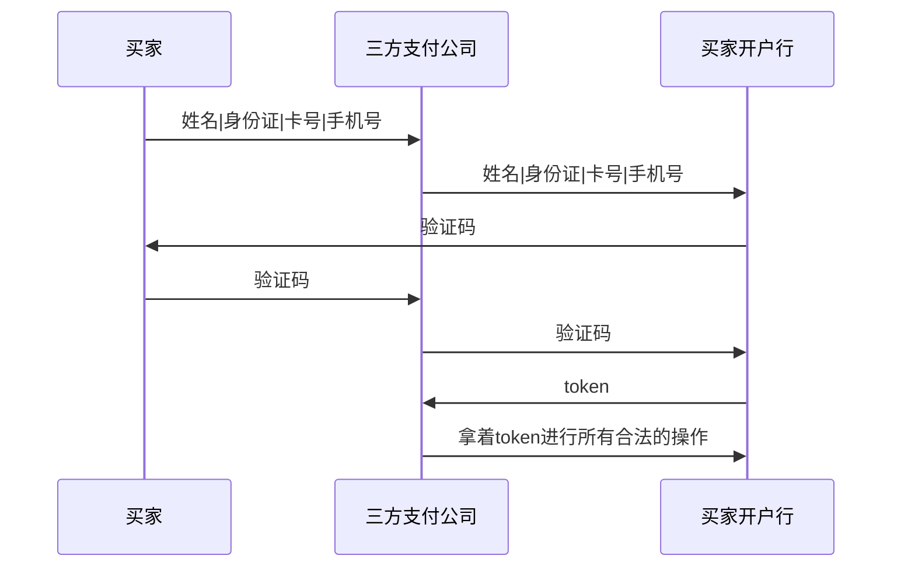
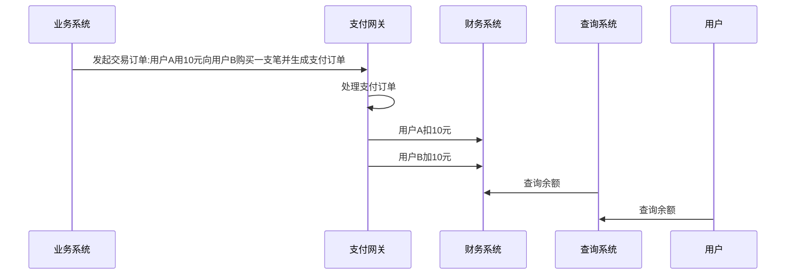

# 金融系统

## 金融业务

- 交易类
- 信贷类

### 系统特点

#### 场内交易

- 一级市场：公司股东之间的私下交易，信息不对称，靠人脉，实时性要求不高
- 二级市场：公开交易市场能发现合理的价格信息，对信息系统有很高的要求，低延时，高吞吐，为了实现这两个目标，开发一般都使用C和FPGA等硬件，谁的系统速度快，谁就更有可能发现赚钱的先机

#### 场外交易

绝大部分的金融交易都发生在交易所外，也叫场外交易

金融资产一旦被资产证券化，也属于场外交易

在场外交易的时候没法被动地发现价格，那么就只能主动发现价格了。所以对于场外交易的金融产品来说，你需要独立计算出合同的价格

#### 信贷类

- 传统信贷类：将利息低买高卖，交易频率低，实时性要求不高
- 资产证券化：将贷款再打包出售，所以贷款违约率就是数学上的概率，在计算风险时，不仅计算复杂，数据量也很大

### C端支付业务

#### 鉴权

#### 拉取支付状态

#### 跨行本币代收/代付

- 存款准备金：在这个新的第三方机构里放足够多的钱，两家银行之间需要转账的时候，第三方机构在内部搬运一下就好
- 央行：信用级别最高的金融机构就是国家的中央银行，解决了真实资金的转移问题
- 轧差：在白天只做记录，不进行任何实质性的跨行转账。等每天结束的时候计算一下两个银行之间交易金额的差额是多少，最后通过央行进行一笔跨行转账
- 清算机构：记录白天跨行转账细节和晚上进行交易轧差的第三方机构，银联及网联，以及国外的万事达都是清算机构

#### 汇总

外汇做市商，一般是巨型的跨国商业银行，跨国商业银行有不同国家的大量储户，手上就拥有不同币种的巨额存款，做市商之间通过交换不同币种的大额固定利息存折来实现外汇交易，但为了对冲外汇市场可能会有的波动导致的账面亏损，机构都会处理外汇相关的市场风险，比如用期货、期权等衍生品来对冲风险

### C端支付核心组件

信息流与资金流分离，资金使用权的转移过程就是信息流，资金所有权的转移过程就是资金流

- 实时清算：如果资金流和信息流不分离，可以实时保证信息流和资金流一致，但对软件系统的吞吐量和延时要求非常高，同时还要求所有参与的支付公司都具有实时清结算能力

支付环节的非银行参与者只能产生信息流，不能产生资金流

资金流和信息流分开之后，这两者将以不同速度在不同时间的不同主体分开流转，这意味着支付系统从本质上是一个异步处理系统，资金流和信息流的统一具有最终一致性

资金流和信息流最终需要同步，即需要一个核算系统来确认同步过程准确无误

#### 点券系统

- 资金流和信息流是一致的

#### 支付系统

异步系统对接时的架构设计原则：将同步系统的一次调用拆分成三个步骤：异步调用、轮询和对账

- 支付网关还需要实现路由能力，将内部资产和外部资产两种操作，分发给不同的资产处理组件
- 金融网关：会对接多家第三方支付公司或者银行，这样可以根据三方支付公司可用情况、费率等进行只能路由
- 外部资产管理系统需要对接第三方支付公司来完成银行卡转账业务
- 信息流是通过记账方式来保存的，需要财务系统来进行交易数据保存
- 如果轮询失败，需要在晚上与第三方支付公司进行对账，由核算系统来完成

#### 第三方支付系统

不能管理实际资金，因此都是信息流的处理系统

- 流量支持：月底的大量交易或者是电商大促的大量交易，都需要一些高并发处理手段来撑住这些流程
- 备付金资金池：将属于用户的钱都放在一个大的池子里。池子里的钱不分你我，将资金池看作一个整体来操作的，如果在不同银行准备资金池，不仅能实现跨行转账实时到账，同时也能省下跨行交易费用，有了支付牌照之后，第三方公司才可以建立用户的备付金资金池
- 清结算能力：处理的是多家银行之间的跨行转账，清算中心把自己当作一个外人，对资金池之间的转账交易进行清结算工作

## 正确性

### 输入正确

- 内容正确：用双时序数据库来保证我们能查询到正确时间的数据以保证使用的数据是正确的，使用完整性校验、版本号来处理数据损坏及系统升级的场景
- 顺序正确：和 TCP 完全一样的乱序解决方案，也就是通过自增 ID 和消息缓冲区来解决乱序，至少一次、至多一次：消息的[可靠投递](/中间件/消息队列/消息队列.md#可靠性)

金融系统的一些外部数据如通货膨胀率率公布后可能会更新，一些业务建立在这些外部数据的计算上，要如何保证选择正确时间的数据

发生时间指的是数据的真实事件时间，记录时间则是这条数据记录到系统的时间

数据的查询也需要同时提供两个时间，也是发生时间和记录时间，查询的是离当前查询时间点最近（当有多个数据都是合理的时候，选择发生时间最晚的数据）的合理数据（数据既存在，且有意义）

双时序数据库保证了数据不可变、并且是唯一的

### 过程正确

使用事件溯源架构

- 函数式编程：数据都不可以被修改，所有函数也不允许有随机性以保证确定性
- 计算精度问题

#### 基本概念

- 命令：系统收到的外部指令
- 事件：命令检查的结果就是事件，由于事件是正确性检查后的结果，事件的执行一定不会出问题
- 状态：事件执行的结果是改变状态

#### 队列

所有的命令或者事件的处理都要有确定的顺序

#### 执行事件和改变状态

- 自动机执行：将事件队列当作一个有始无终的磁带。你会从头开始依次读取每个事件。读取之后按事件内的指示来改变内存状态，在执行事件的过程中不能有任何随机行为，不要有真随机数、不要有IO，这样才能保证计算可重复以避免不确定性
- 时光机：重置自动机状态，然后把事件一个一个执行，直到运行到指定的时间点，就能得到该时间点的状态
- 系统快照：金融系统里有一个日切的概念。日切指的是在每天晚上 12 点的时候，你需要对当天的所有业务进行清点，确认无误后再开始下一天的工作，即12点打一个快照

#### 查询

- 历史状态查询：先找到距离查询时间最近的快照，然后从这个快照开始执行事件，直到碰到查询时间点

#### 正确性的本质

任何一个时间点的状态等于之前所有事件效果的累积

$$\sum_{i=0}^{n-1}ei$$

- 自动机是没有随机性的，原因是在数学里所有的数学函数都没有随机性
- 记录事件的时候要求事件之间有顺序，这是因为自动机对应的函数一般是不可交换的（Non-commutative）
- 数据之间是线性序列（Linear Order）的关系。这个线性序列关系是选择用 FIFO 队列的存储队列的原因

### 结果正确

验证：选择不同的计算环境，这样才能降低和之前计算结果的相关性

在极其重要的场景，一般会验证 3 次，只有在至少 3 个结果完全一样的情况下才会向外输出结果

- 实时验证：验证通过之后再往外公布计算结果
- 异步验证：公布结果之后再择机进行验证，可能会对外造成不好的影响，因此需要业务有事后补偿的能力

## 数据传输

### 交易数据

既要保证顺序的正确性，也要保证消息处理的一次性

使用限流手段来保护自身的服务器容量不被击穿，一旦上下游之间做了限流，那么整个系统就需要假设数据会丢失

### 非实时市场数据

- 对延时要求不是特别高的使用场景

非实时数据的传输方式分为订阅发布（Pub/Sub）和消息（Messaging）两大类。在订阅发布的情况下，每个消息的消费者是互相独立的，每个人都需要处理所有消息，并且每个人处理消息的顺序必须是一样的。消息则刚好相反。所有人之间共享所有消息

历史数据是有时效性的，如果所有历史数据对你的价值都是一样高，那么一般来说数据需要尽量完整。相反，如果越接近现在的数据对你的价值越高，那么数据则有可能允许丢失

### 实时市场数据

- 对延时要求非常高的数据场景，能支持的用户数有限，所以一般都需要收席位费

由于对延迟要求高，所以不能采用拉消息的模式，像Kafka的消费模式就不行

同时对消息的编解码效率要求也要很高，相比JSON、XML，二进制编解码协议的效率更高，如金融行业使用的FIX通讯协议，只需要传输数据变动的部分

## 数据存储

- 图数据库：一般都出现那些跟数据分析相关的部门，在和客户进行业务往来之前先要对客户进行背景调查（KYC，Know Your Customer），或者查看用户是否存在洗钱行为（AML，Anti-Money Laundering）
- 时序数据库
- KDB：是个列存储的数据库，配套使用编程语言Q和K，适用的数据量范围是 GB～TB 之间
- 双时序数据库：不适合吞吐量特别高的业务，适合交易量稍小一些的场外交易类业务
- 关系型数据库：编程模型与存储模型不同，即[阻抗不匹配](/软件工程/架构/数据系统.md#数据模型)
- 树状数据存储，NewSQL，虽然解决了对象存储的问题，但没有完美解决对象的查询问题

## 系统优化

### 吞吐量优化

互联网里的“快”，指的是服务器集群的处理能力快，能同时处理很多东西，即吞吐量大

使用[高并发](/软件工程/架构/系统设计/高并发.md#高并发)的优化手段

### 延迟优化

吞吐量优化是系统能力的横向扩展，是宏观资源的调配。而延时是系统能力的纵向扩展，是微观资源的调配

- 单机优化：减少进程上下文切换，比如让进程独享单个CPU，提升内存读写速度
- 网络优化：减少内核态与用户态切换开销

### 特殊优化

#### 合并存储

把事件和前后两个状态都保存在一起，历史查询就变得非常简单。由于现在每个事件都有对应的前后状态，我们只需要寻找离查询时间最近的事件就可以了。找到了对应的事件，我们就可以找到对应的状态

#### 对账优化

1. 前一个事件的最终余额等于下一个事件的初始余额
2. 每个事件的最终余额等于这个事件的初始余额加上事件变动金额

这样对于任何一个用户的任何一个状态，我们都可以顺着链条找到所有金额变动的过程，并对这个过程进行校验
