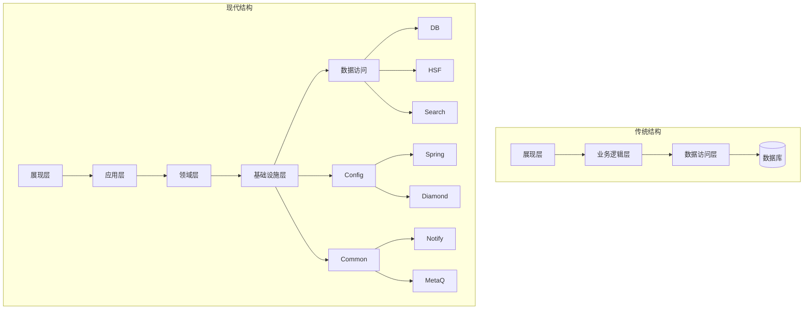
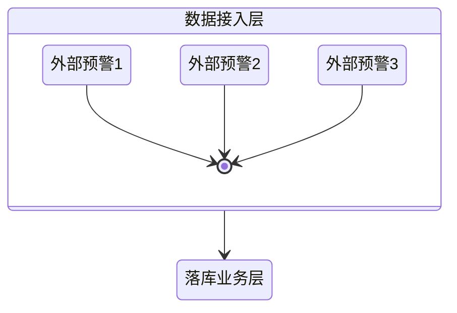
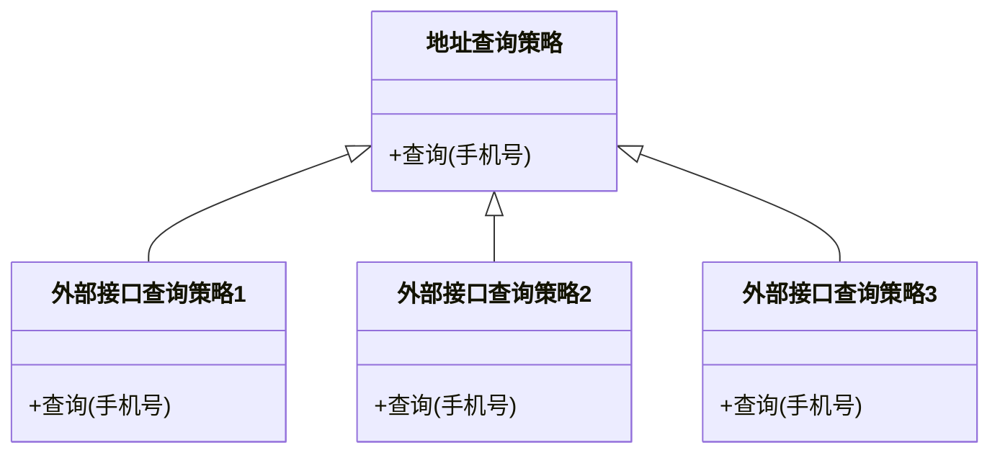
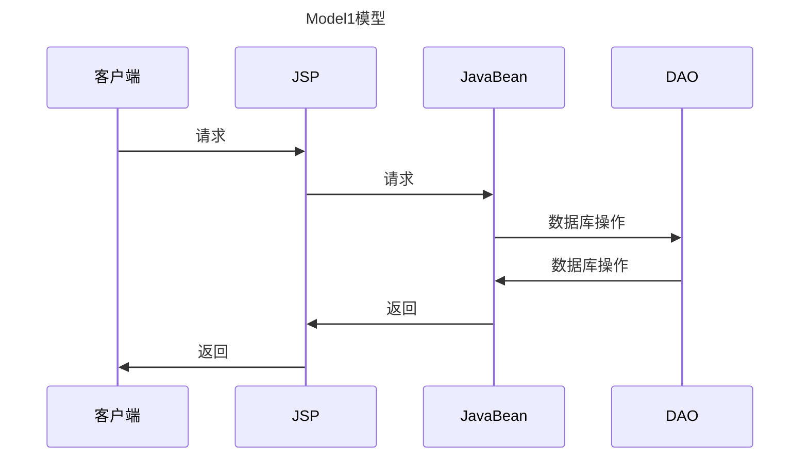
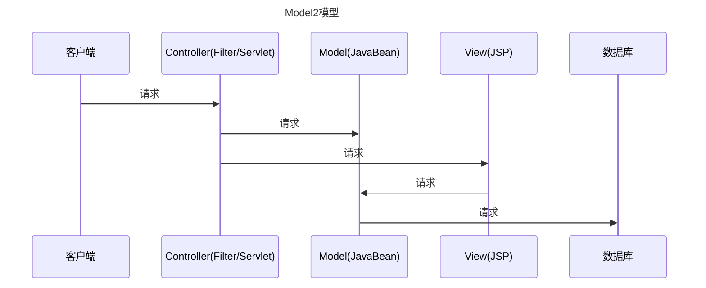
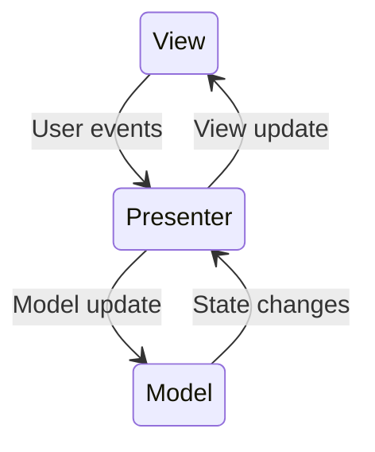
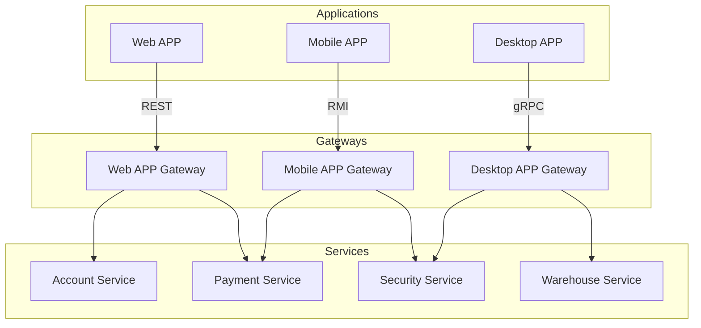

# 分层架构

[软件架构设计分层模型和构图思考](https://juejin.cn/post/6945261185344208933)

将系统按照职责拆分和组织，上层依赖于下层定义的各种服务，下层对上层隐藏下下层的细节，最核心的一点就是需要保证各层之间的差异足够清晰，边界足够明显

层次并不能封装所有东西，有时会带来级联修改，过多的层次也会影响性能

- OSI七层模型
- CS/BS架构
- 企业应用分层
  - 表现层
  - 领域层
  - 数据源层

## 为何分层

### 关注点分离（降低复杂度）

- 每个层中的组件只会处理本层的逻辑，在扩展某层时，其他层是不受影响的，通过这种方式可以支撑系统在某层上快速扩展

### 隔离变化/错误

- 提炼变化层与稳定层隔离变化

- 提炼抽象层与实现层

### 扩展性伸缩性
### 可测试性

## 分层的问题

- 性能开销：通信、数据转化
- 开发成本

## 分层架构设计

- [依赖原则](/软件工程/架构/架构.md#依赖关系规则)
- 定义职责：职责分离 高层抽象
- 层技术栈选择：每层需求自定 参考成功架构 适合自己组织
- 集成：单层内部的单元测试 -> 层之间的集成测试

## 分层架构模型

### MVC

随着前后端分离以及后端微服务化的不断发展，传统的MVC已不适合现在的纯后端系统，Controller其实也是API，它代表了服务对外提供的接口，是一种合约

- model:模型代表一个存取数据的对象或 JAVA POJO。它也可以带有逻辑，在数据变化时更新控制器
- view:视图代表模型包含的数据的可视化
- controller:控制器作用于模型和视图上。它控制数据流向模型对象，并在数据变化时更新视图。它使视图与模型分离开

- 视图与模型关注点不同，视图侧重于可视化界面，而模型侧重于业务逻辑
- 同样的模型可以有不同的视图
- 模型更容易测试

当系统有了一些不可见的逻辑时，就需要注意模型与视图分离

**优势**

- 清晰的职责划分
- 组件独立，代码重用
- 后期维护方便
- 适合任何项目

**弊端**

- 展示数据慢（针对jsp）
- 对开发者架构设计能力要求高
- 异步交互不方便

#### 控制器类型

1. 页面控制器，为特定页面或动作处理请求的对象。控制器通过绑定请求来实现与用户的交互。其从请求中提取参数，对输入进行处理，执行业务逻辑，选择适当的视图以呈现结果。
2. 前端控制器：处理所有请求的控制器，执行一些通用的行为，如身份验证和日志记录，并且这些行为可以在运行时动态修改
3. 应用控制器：一个处理程序流的集中控制点，负责协调页面控制器与前端控制器之间的交互，确保请求在应用中的流转符合预期

#### Model

业务数据模型，Model层是高层策略，是技术无关逻辑的封装

#### View

当有用户的行为触发操作时，由控制器更新模型，并通知视图进行更新

#### Controller

主要是接收用户请求，并负责协调Model与View

### MVP

- Presenter较为复杂 可以脱离view进行测试

### [MVVM](/编程语言/JavaScript/Vue/nav.md#MVVM)

### BFF

- 为前端而生的后端服务

