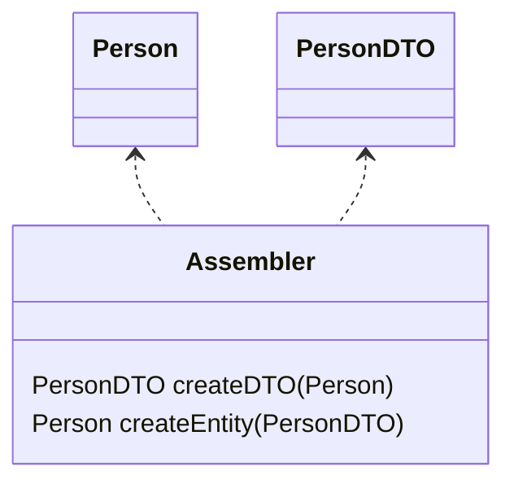

# 分布模式

## 远程外观

对细粒度接口对象进行封装，提供粗粒度接口，提高网络传输效率

进程内调用的开销比进程外的小

远程外观的设计都是基于特定客户的需要

## 数据传输对象（DTO）

传输数据的对象

一般都只用在跨进程的调用当中，跟现在所使用的DTO基本可以等同为同一个东西，现在的DTO也广泛在系统各层之间传输数据使用

DTO中的域应该都是非常原始和简单的，主要是要求可被序列化

### 如何序列化

- 自动化
- 传输双方保持一致

### 组装器

组装器对象负责将领域对象转为DTO

