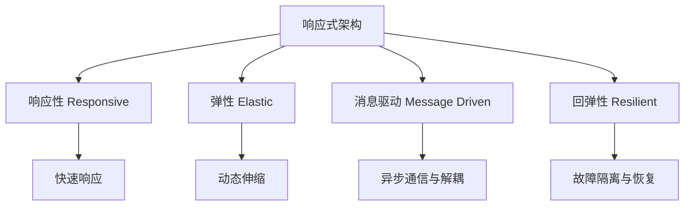

# 响应式架构

## 概述（Overview）

响应式架构（Reactive Architecture）是一种面向现代分布式系统的设计哲学与架构模式，核心目标是构建**能够快速、持续、可靠响应外部事件和用户请求的系统**。其核心特征是基于**异步消息驱动、事件驱动和解耦组件设计**，实现系统的实时性、高可用性、弹性伸缩和容错能力，从而在动态负载下提供一致的用户体验。

响应式架构不仅是技术实现的集合，更是一种系统设计思维方法，强调**组件自治、边界明确、消息流控制**，是现代微服务、云原生和事件驱动系统的重要基础。

---

## 本质（Essence）

响应式架构的本质是**面向事件的弹性系统设计方法论**，用于解决分布式系统中的以下核心问题：

1. **响应性（Responsiveness）**：保证系统在任何负载或故障状态下都能快速、稳定地响应请求。
2. **弹性（Elasticity）**：系统能够根据工作负载动态伸缩，保持性能和可用性。
3. **消息驱动（Message Driven）**：通过异步消息传递实现组件解耦和边界隔离。
4. **回弹性（Resilience）**：系统能够在局部故障发生时保持整体可用性，并快速恢复。

其核心设计理念包括：

* **组件自治**：系统由独立、可组合的组件构成，每个组件可独立扩展和恢复。
* **异步通信**：避免阻塞调用，降低系统耦合度。
* **流量控制与背压**：确保系统在高负载情况下仍能稳定运行。
* **事件驱动**：事件作为系统信息载体，实现数据与行为的解耦。

---

## 核心概念（Core Concepts）

| 概念                    | 定义                   | 作用             |
| --------------------- | -------------------- | -------------- |
| 响应性 (Responsive)      | 系统能够及时对请求做出一致和可靠的响应  | 保证用户体验和业务连续性   |
| 弹性 (Elastic)          | 系统在负载变化时动态伸缩而不影响响应能力 | 提高资源利用率、适应流量波动 |
| 消息驱动 (Message Driven) | 组件通过异步消息传递进行通信       | 松耦合、支持扩展性与容错   |
| 回弹性 (Resilient)       | 系统在局部故障时保持整体可用性      | 提供容错能力、保障业务连续性 |

### 响应式宣言四大特征模型

---

## 能力体系（Capability System）

1. **快速响应能力**

   * 实时处理请求与事件
   * 一致且可预测的响应时间
   * 服务可用性保障机制

2. **弹性伸缩能力**

   * 动态资源调度（CPU、内存、实例数）
   * 分布式负载均衡与中央瓶颈避免
   * 支持高并发与峰值负载

3. **消息驱动能力**

   * 异步消息通信机制
   * 组件间边界清晰、低耦合
   * 支持事件流、命令流和状态更新流

4. **容错回弹性**

   * 故障隔离与熔断机制
   * 自动恢复与自愈能力
   * 数据一致性与系统稳定性保障

---

## 架构模型（Architecture Models）

### 事件驱动模型（Event-Driven Model）

* 事件作为系统通信与状态变化的载体
* 支持异步事件流和消息队列
* 实现业务逻辑解耦和实时处理

### 异步消息处理模型（Asynchronous Messaging Model）

* **生产者-消费者模式**：解耦消息生成与处理
* **发布-订阅模式**：支持多订阅方同时响应事件
* **CQRS（命令查询责任分离）**：读写分离，提高可伸缩性

### 弹性扩展模型（Elastic Scaling Model）

* 微服务化拆分，实现独立部署与扩展
* 容器化和云原生部署，支持水平扩展
* 自动调度与弹性伸缩策略

---

## 类型体系（Classification）

### 按数据流特性

* 流式处理架构（实时流处理）
* 批处理架构（定期批量处理）
* 混合处理架构（流批一体）

### 按部署模型

* 微服务响应式架构
* 事件驱动架构（EDA）
* CQRS 架构

### 按消息传递模式

* 点对点消息传递（P2P）
* 发布/订阅模式（Pub/Sub）
* 请求-响应模式（Request-Reply）

---

## 边界与生态（Boundaries & Ecosystem）

### 相关技术

* **响应式编程**：Reactor、RxJava，实现异步非阻塞操作
* **事件驱动架构（EDA）**：Kafka、Pulsar等事件流平台
* **微服务架构**：实现服务拆分和自治
* **领域驱动设计（DDD）**：明确消息边界与事务边界

### 技术边界

* 避免传统同步阻塞模式
* 不等同于消息队列，强调整体响应性
* 与事件溯源结合可增强系统可靠性，但非必需

---

## 治理体系（Governance）

### 架构治理

* 组件边界与有界上下文划分（DDD）
* 消息协议与事件格式规范
* 异步错误处理与恢复策略

### 质量保障

* 实时监控：响应时间、吞吐量、错误率
* 异步测试方法与工具：单元测试、集成测试、契约测试
* 性能调优：背压控制、资源优化、负载均衡策略

---

## 演进趋势（Evolution Trends）

1. **云原生响应式架构**

   * 容器编排与Serverless集成
   * 混合云和多区域部署

2. **智能化运维**

   * AI驱动的弹性伸缩与预测性故障检测
   * 自动化容量规划与自愈

3. **边缘计算响应式架构**

   * 分布式边缘系统响应低延迟事件
   * 本地离线处理与数据同步机制

---

## 选型方法论（Selection Methodology）

### 适用场景

* 高并发、低延迟系统
* 高可用、弹性要求场景
* 业务逻辑复杂且需要解耦的系统

### 技术选型

* **消息中间件**：Kafka、RabbitMQ、Apache Pulsar
* **响应式框架**：Reactor、Akka、Vert.x
* **监控工具**：Prometheus、Grafana、Jaeger

### 实施策略

* 渐进式迁移：从关键业务路径开始
* 技术栈评估：匹配团队技能与业务需求
* 组织能力建设：培训团队异步系统设计与运维能力

---

## 总结（Conclusion）

响应式架构是一套面向分布式系统的现代设计方法论，通过**响应性、弹性、消息驱动和回弹性**四大原则，实现系统高可用、高性能和可扩展的目标。成功的响应式系统设计不仅依赖技术选型，还需要完善的**架构治理、质量保障和运维策略**，并结合业务需求与团队能力制定演进路线。

## 关联内容（自动生成）

- [/软件工程/微服务/微服务.md](/软件工程/微服务/微服务.md) 微服务架构与响应式架构密切关联，微服务提供服务自治和弹性伸缩能力，是响应式系统的重要实现方式
- [/编程语言/编程范式/响应式编程.md](/编程语言/编程范式/响应式编程.md) 响应式编程是响应式架构的重要实现手段，通过数据流和变化传播实现异步非阻塞处理
- [/中间件/消息队列/消息队列.md](/中间件/消息队列/消息队列.md) 消息队列是响应式架构中消息驱动和解耦的关键组件，提供异步通信和背压机制
- [/软件工程/架构/系统设计/分布式/分布式系统.md](/软件工程/架构/系统设计/分布式/分布式系统.md) 响应式架构主要应用于分布式系统，解决网络通信、一致性、可用性等分布式挑战
- [/编程语言/并发模型.md](/编程语言/并发模型.md) 响应式架构依赖于特定的并发模型如Actor模型和Reactor模式，实现消息驱动和事件驱动
- [/软件工程/架构/系统设计/可用性.md](/软件工程/架构/系统设计/可用性.md) 响应式架构强调回弹性，与系统可用性设计密切相关，包含容错、故障恢复等机制
- [/软件工程/架构/系统设计/伸缩性.md](/软件工程/架构/系统设计/伸缩性.md) 响应式架构的弹性特征与系统伸缩性设计直接相关，支持动态资源调度和负载均衡
- [/软件工程/架构/系统设计/云原生.md](/软件工程/架构/系统设计/云原生.md) 云原生环境是响应式架构的重要部署平台，容器化和微服务为响应式系统提供弹性基础设施
- [/软件工程/架构/系统设计/可观测性.md](/软件工程/架构/系统设计/可观测性.md) 响应式系统复杂的异步通信需要完善的可观测性支持，包括监控、日志和链路追踪
- [/软件工程/架构/Web前端/前后端分离.md](/软件工程/架构/Web前端/前后端分离.md) 前后端分离架构天然支持事件驱动和异步通信，与响应式架构理念相契合
- [/数据技术/流处理.md](/数据技术/流处理.md) 流处理技术是响应式架构处理实时数据流的核心组件，支持事件驱动的数据处理
- [/编程语言/JAVA/框架/Dubbo.md](/编程语言/JAVA/框架/Dubbo.md) 微服务框架Dubbo的集群容错策略与响应式架构的回弹性设计原则相互补充
- [/软件工程/微服务/服务治理/服务容错.md](/软件工程/微服务/服务治理/服务容错.md) 服务容错机制是响应式架构回弹性的重要体现，包括熔断、限流、降级等策略
- [/软件工程/架构模式/架构模式.md](/软件工程/架构模式/架构模式.md) 响应式架构与其他架构模式如事件驱动架构、分层架构形成互补关系，共同构成系统架构体系
- [/编程语言/JAVA/框架/SpringBoot.md](/编程语言/JAVA/框架/SpringBoot.md) Spring Boot和Spring Cloud提供了响应式编程和微服务的实现框架，支持响应式架构落地
- [/软件工程/架构/系统设计/网关.md](/软件工程/架构/系统设计/网关.md) API网关在响应式系统中承担流量控制、服务治理等功能，是系统弹性和可用性的关键组件
- [/软件工程/架构/系统设计/流量控制.md](/software工程/架构/系统设计/流量控制.md) 流量控制是响应式架构弹性的核心机制，通过限流、背压等手段维持系统稳定
- [/软件工程/架构/系统设计/混沌工程.md](/software工程/架构/系统设计/混沌工程.md) 混沌工程用于验证响应式系统的回弹性，通过引入故障提升系统韧性
- [/software工程/架构/演进式架构.md](/软件工程/架构/演进式架构.md) 演进式架构理念与响应式架构的弹性、适应性特征相呼应，均强调系统的持续演化能力
- [/software工程/微服务/ServiceMesh/ServiceMesh.md](/软件工程/微服务/ServiceMesh/ServiceMesh.md) Service Mesh为微服务间通信提供异步、可观察、弹性的基础设施，支撑响应式架构实现