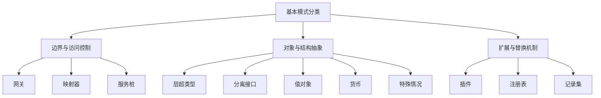
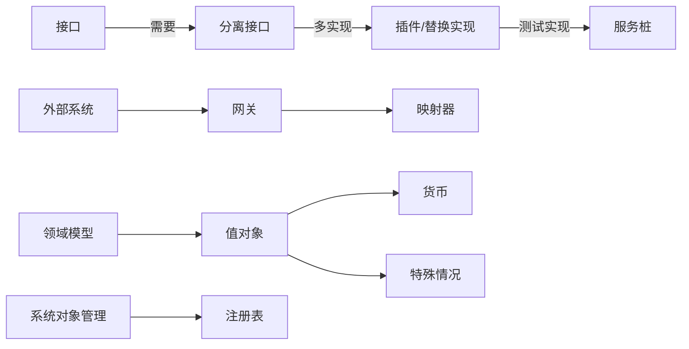

# 基本模式

## 概述

基本模式（Fundamental Architectural Patterns）是软件系统设计中最底层、最细粒度、最普适的结构性设计单元。它们独立于特定技术框架，主要关注对象组织方式、系统间通信机制、跨模块抽象、一致性约束以及可扩展性边界等内在结构问题。

这些模式不是特定架构风格（如分层、微服务、DDD）的专属组件，而是可在任何架构体系内被组合、复用和扩展，用于增强系统的可维护性、可理解性、演进性与耦合管理能力。

---

## 本质 / 定义

基本模式的本质包括以下三点：

**抽象一致性（Abstraction Consistency）**
提供跨模块、公用、可复用的抽象结构，使系统概念与代码结构保持一致。

**边界控制（Boundary Control）**
通过模式化的边界封装实现低耦合、高内聚，有效隔离变化源。

**替换性与稳定性（Replaceability & Stability）**
通过接口化、不可变对象等手段，使组件可独立演进，从而提高系统长期稳定性。

---

## 核心概念（Core Concepts）

下表概述了本知识体系涉及的所有基本模式：

| 模式                        | 核心目标         | 作用域    | 核心特性           |
| ------------------------- | ------------ | ------ | -------------- |
| 网关（Gateway）               | 封装外部资源       | 系统边界   | 统一访问接口，屏蔽外部差异  |
| 映射器（Mapper）               | 连接两个独立对象/系统  | 子系统之间  | 双向或单向转换，通信隔离   |
| 层超类型（Layer Supertype）     | 定义跨层通用行为     | 层级内部   | 公共超类，减少重复代码    |
| 分离接口（Separated Interface） | 解耦接口与实现的依赖位置 | 服务边界   | 不跨层依赖实现，利于模块化  |
| 注册表（Registry）             | 全局查找服务对象     | 系统对象管理 | 命名查询，替代直接引用    |
| 值对象（Value Object）         | 表示无身份的一致性值   | 业务模型   | 不可变、值相等决定对象相等  |
| 货币（Money）                 | 表示金额、币种、精度   | 领域概念   | 值对象特例，内含精度保护   |
| 特殊情况（Null Object）         | 去除显式条件分支     | API与流程 | 返回安全默认对象       |
| 插件（Plugin）                | 运行时可切换实现模块   | 扩展机制   | 条件绑定/工厂动态加载    |
| 服务桩（Service Stub）         | 替代外部服务进行测试   | 测试环境   | 与插件机制一致，提供测试实现 |
| 记录集（Record Set）           | 结构化表格数据的内存表示 | 数据访问   | 游标式或离线式数据模型    |

---

## 分类体系（Taxonomy）

可将上述模式根据其结构目标归入以下三大类：

---

## 应用场景（Use Cases / Applications）

#### 网关（Gateway）

* 外部服务访问统一化（支付、物流、消息队列）
* 跨协议访问屏蔽（REST → RPC、HTTP → TCP）
* SDK 封装

#### 映射器（Mapper）

* DTO ↔ Domain 转换（如 DDD 中的 Anti-corruption Layer）
* 子系统模型差异隔离
* 事件模型与内部模型适配

#### 层超类型（Layer Supertype）

* Web 层共有控制器基类
* Repository 抽象基类（统一分页处理、异常转换）
* 实体基类（如审计字段）

#### 分离接口（Separated Interface）

* 微服务 API 模块独立发布（API jar、proto 定义）
* 跨团队协作接口管理
* 模块化系统的契约外置

#### 注册表（Registry）

* 组件查找总线（虽被 DI 容器替代，但在游戏引擎、插件系统中依旧常见）
* 元数据中心，如规则引擎注册表
* 跨插件资源查询

#### 值对象（Value Object）

* 金额、数量、重量、区间等领域对象
* 消除字符串、数字的原子类型贫血问题
* 提高业务表达能力与安全性

#### 货币（Money）

* 金额运算统一（舍入、精度）
* 跨币种换算
* 金融系统交易模型

#### 特殊情况（Null Object）

* 避免 null 判定逻辑
* DSL、领域服务返回默认对象
* 流程引擎默认策略

#### 插件（Plugin）

* 环境驱动实现（Dev/Prod）
* 模块动态替换（如算法策略、内容过滤器）
* 基于注解/配置的条件化实现

#### 服务桩（Service Stub）

* 隔离外部 API 测试
* 回归测试环境快速 mocking
* 本地联调模拟服务响应

#### 记录集（Record Set）

* JDBC ResultSet
* 离线数据操作（缓存、报表、ETL）
* 流式数据遍历

---

## 关联关系（Relations / Dependencies）

| 模式关系       | 说明                       |
| ---------- | ------------------------ |
| 插件 ↔ 注册表   | 插件机制可依赖注册表查找实现           |
| 网关 ↔ 映射器   | 网关通常包含映射器以适配外部数据结构       |
| 值对象 ↔ 特殊情况 | 可为值对象提供 Null Value 以消除判空 |
| 分离接口 ↔ 插件  | 插件机制要求接口分离以支持多实现         |
| 服务桩 ↔ 插件   | 测试实现通常作为插件的一种选型形式        |

下面给出概念关系模型：

---

## 发展趋势（Evolution / Trends）

**解构化与组合化趋势**
现代框架（Spring, NestJS, Micronaut）将注册表、分离接口、插件化系统作为基础能力，弱化其显式存在。

**微服务与云原生推动接口契约独立化**
分离接口成为标准（OpenAPI、protobuf），促进跨团队协作与模块独立部署。

**不可变对象与值导向模型（Value-oriented Modeling）崛起**
函数式编程、事件溯源推动值对象模式扩展。

**动态扩展机制增强**
插件机制成为服务网格、A/B 测试、策略路由的重要基础模型。

**映射器工具化**
Mapper 工具（MapStruct、AutoMapper）成为主流，提高模型转换一致性。

---

## 总结（Conclusion）

基本模式构成软件架构的“微结构”，是所有架构风格的共同基石。
它们解决的问题不在于宏观的系统划分，而在于微观的对象关系、跨模块边界与可替换性。掌握这些模式可以获得以下收益：

* 模型表达能力增强
* 稳定边界的构建与变化隔离
* 易测试、易替换、易演进的系统结构
* 跨团队协作的契约清晰化
* 更规范的架构设计语言

## 关联内容（自动生成）

- [/软件工程/架构模式/架构模式.md](/软件工程/架构模式/架构模式.md) 基本模式是架构模式的细粒度组成部分，共同构成软件系统设计的结构化解决方案
- [/软件工程/架构/架构治理.md](/软件工程/架构/架构治理.md) 基本模式的选择与应用是架构治理的重要内容，关系到系统长期的可维护性与稳定性
- [/软件工程/架构/系统设计/扩展性.md](/软件工程/架构/系统设计/扩展性.md) 基本模式如插件、注册表等直接支撑系统的可扩展性设计
- [/软件工程/设计模式/设计模式.md](/软件工程/设计模式/设计模式.md) 基本模式与设计模式同为软件结构化经验的体现，设计模式更偏向面向对象层面
- [/软件工程/架构/系统设计/架构设计.md](/软件工程/架构/系统设计/架构设计.md) 在架构设计过程中，基本模式是实现特定架构目标的结构性手段
- [/软件工程/架构/系统设计/可观测性.md](/软件工程/架构/系统设计/可观测性.md) 基本模式如注册表、网关等与可观测性系统的构建密切相关
- [/软件工程/架构/架构.md](/软件工程/架构/架构.md) 基本模式是构成软件架构的基本单元，与架构的本质、能力模型等密切相关
- [/软件工程/架构/系统设计/网关.md](/软件工程/架构/系统设计/网关.md) 网关是基本模式中的一种，专门用于封装外部资源访问
- [/软件工程/架构模式/对象关系模式.md](/软件工程/架构模式/对象关系模式.md) 对象关系模式与基本模式同属架构模式范畴，都关注对象组织与结构问题
- [/软件工程/架构/系统设计/分布式/分布式系统.md](/软件工程/架构/系统设计/分布式/分布式系统.md) 分布式系统中广泛使用基本模式如网关、注册表等来处理服务间通信和管理
- [/软件工程/微服务/微服务.md](/软件工程/微服务/微服务.md) 微服务架构中大量应用基本模式，如网关模式用于服务统一入口
- [/软件工程/架构/演进式架构.md](/软件工程/架构/演进式架构.md) 基本模式的选择影响架构的演进能力，如插件模式提升系统可替换性与稳定性
- [/软件工程/领域驱动设计.md](/软件工程/领域驱动设计.md) 基本模式如值对象、映射器等在领域驱动设计中发挥重要作用
- [/软件工程/架构/系统设计/缓存.md](/软件工程/架构/系统设计/缓存.md) 缓存系统设计中可能应用基本模式如注册表来管理缓存实例
- [/软件工程/架构/系统设计/流量控制.md](/软件工程/架构/系统设计/流量控制.md) 流量控制策略的实现可借助基本模式如网关、插件等
- [/软件工程/架构/系统设计/可用性.md](/软件工程/架构/系统设计/可用性.md) 基本模式如特殊情况（Null Object）等有助于提高系统的可用性设计
- [/软件工程/软件设计/代码质量/防御式编程.md](/软件工程/软件设计/代码质量/防御式编程.md) 防御式编程中使用基本模式如特殊情况模式来处理异常情况
- [/软件工程/架构/Web前端/前后端分离.md](/软件工程/架构/Web前端/前后端分离.md) 前后端分离架构中，API网关作为基本模式的一种发挥重要作用
- [/数据技术/数据存储.md](/数据技术/数据存储.md) 数据存储系统中应用基本模式如映射器来处理对象与关系间的转换
- [/中间件/消息队列/消息队列.md](/中间件/消息队列/消息队列.md) 消息队列系统中使用基本模式如注册表来管理生产者与消费者的注册与发现

