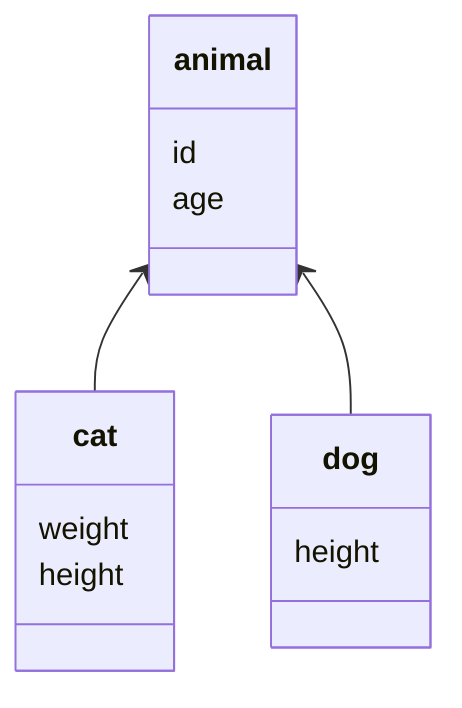

# 对象关系模式

## 对象-关系行为模式

### 工作单元

维护受影响的对象列表，并协调对象的修改以及解决并发问题

```java
interface WorkUnit {
    new(Object),Dirty(Object),Clean(Object)
}
```

工作单元会将被修改的对象变化记录下来，存储到数据库

工作单元解决的基本问题是记录各种操作过的对象

- 调用者注册：修改之后调用者手动提交来保存对象
- 对象注册：将注册方法置于对象中
- 工作单元控制器：查询时返回一个拷贝对象，提交时比较拷贝对象与原有的对象，进行有选择的更新

工作单元可以保证更新顺序，并且按照相同的数据更新表可以很少地减少死锁

### 标识映射

通过给每个对象指定一个标识，避免重复加载，当需要对象时，通过映射来找到对象

无论需要一个什么对象，先检查标识映射，看需要的对象是否在其中

- 键的选择：数据库主键
- 显式的标识映射可以利用编译时检查的优点
- 标识映射与会话相绑定

#### 使用

- 管理对象
- 做缓存

### 延迟加载

一个不包含所需要的所有数据但知道如何获取这些数据的对象

- 延迟初始化：每次获取都判断是否为空，如果空就去获取数据
- 虚代理：一个获取数据的代理对象，类可以把它当做真实的对象
- 值保持器：包装某个对象的对象，但是缺点是不如虚代理，类必须知道这个保持器的存在
- 重影：首次加载只加载ID，当需要某个域时，则会加载入全部的域

使用的最佳时机：需要额外的调用，并且当主对象被使用时，额外加载的数据没被使用的时候

## 对象-关系结构模式

### 标识域

在对象中保存的一个数据库标识域

#### 键的选择

- 有意义键与无意义键
  - 危险在于有意义键由人指定，可能会发生错误
- 简单键与组合键
  - 组合键的好处在于当处于多个表相关的上下文时，更容易使用
- 表唯一键与数据库唯一键

#### 键的表示

对于组合键，最好的方式是建立一个键类，来存放基本类型键值

#### 键的生存

- 自动生成域：不断递增
- 数据库计数器：没有统一的标准，并非所有数据库都支持
- GUID：保证了同一时空的所有机器生成的GUID都是不唯一的，但是生成的串比较大
- 键表，通过在数据库保存下一个有效值来生成键

### 外键映射

把对象的之间的关联映射到表之间的外键关联

### 关联表映射

将多对多的对象关联映射为数据库中的关联表

### 依赖映射

一个类为依赖它的类执行数据库映射

### 嵌入值

把对象映射成另一个对象表的一部分

### 序列化LOB

将小对象之间的关系保存到大对象中，并将大对象保存序列化到数据库

### 类表映射



#### 单表继承

将类的整个继承层次表示为一张表

```sql
CREATE TABLE {
  DB_TYPE
  id
  age
  weight
  height
}
```

加载数据的时候需要决定用哪个类来实例化这些数据

- 类名
- 代码域

#### 类表继承

一个类一张表

```sql
CREATE TABLE animal{
  id
  age
}
CREATE TABLE dog{
  id
  age
  weight
}
CREATE TABLE cat{
  id
  age
  height
}
```
将数据映射成对象需要比较复杂的方案

### 具体表继承

一个层次一张表

### 继承映射器

一种可以处理继承层次的数据库映射器

子类调用父类映射器加载数据后，再加载子类的特有数据

## 对象-关系元数据映射模式

### 元数据映射

把关系对象映射的信息保存到元数据中(meta data)

#### 代码生成

输入元数据，输出实现类的源代码，这种方式是现有的很多快速开发框架所具备

通过读入数据库表结构，就能快速生成后端的controller、service、dao代码以及前端的一个简单增删改查模板

#### 反射程序

在运行时读入元数据产生动态行为

这种方式的优点在于灵活性够高，相较于代码生成的源文件，一旦元数据发生变更，代码就得重新生成，并且手动修改这些生成的源文件可能会发生难以预料的错误

但反射的缺点就是性能问题

### 查询对象

一个描述一次数据库查询的对象

*解释器模式*

许多ORM框架都提供了通过宿主语言的方式来描述SQL查询的API

- spring data jpa中的对象查询以及JPQL
- mybatis plus 的queryWrapper

```java
queryWrapper.eq ("a.del_flag", 0 )
```

### 资源库(Repository)

在使用查询对象的基础上，协调领域层与数据源层，使用类似集合的接口访问领域对象

```java
List<Person> findPersonList(QueryWrapper<Person> qw);
```

资源库提供了一个更符合面向对象观点的持久层实现