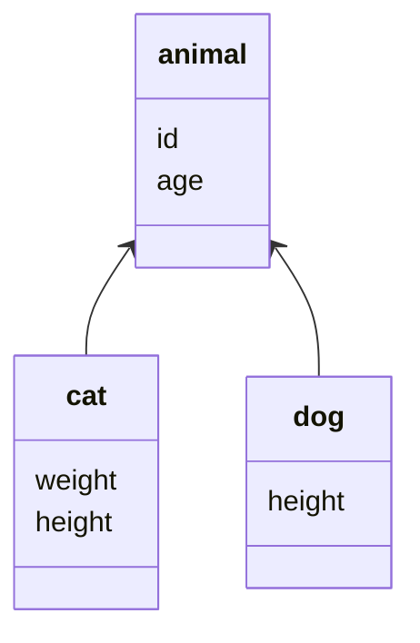

# 对象-关系结构模式

## 标识域

在对象中保存的一个数据库标识域

### 键的选择

- 有意义键与无意义键
  - 危险在于有意义键由人指定，可能会发生错误
- 简单键与组合键
  - 组合键的好处在于当处于多个表相关的上下文时，更容易使用
- 表唯一键与数据库唯一键

### 键的表示

对于组合键，最好的方式是建立一个键类，来存放基本类型键值

### 键的生存

- 自动生成域：不断递增
- 数据库计数器：没有统一的标准，并非所有数据库都支持
- GUID：保证了同一时空的所有机器生成的GUID都是不唯一的，但是生成的串比较大
- 键表，通过在数据库保存下一个有效值来生成键

## 外键映射

把对象的之间的关联映射到表之间的外键关联

## 关联表映射

将多对多的对象关联映射为数据库中的关联表

## 依赖映射

一个类为依赖它的类执行数据库映射

## 嵌入值

把对象映射成另一个对象表的一部分

## 序列化LOB

将小对象之间的关系保存到大对象中，并将大对象保存序列化到数据库

## 类表映射



### 单表继承

将类的整个继承层次表示为一张表

```sql
CREATE TABLE {
  DB_TYPE
  id
  age
  weight
  height
}
```

加载数据的时候需要决定用哪个类来实例化这些数据

- 类名
- 代码域

### 类表继承

一个类一张表

```sql
CREATE TABLE animal{
  id
  age
}
CREATE TABLE dog{
  id
  age
  weight
}
CREATE TABLE cat{
  id
  age
  height
}
```
将数据映射成对象需要比较复杂的方案

## 具体表继承

一个层次一张表

## 继承映射器

一种可以处理继承层次的数据库映射器

子类调用父类映射器加载数据后，再加载子类的特有数据


