# 架构模式

- 企业应用架构模式

一般来说，企业应用指的是大型系统

企业应用的特点：

- 持久化数据
- 大量数据
- 高并发
- 大量数据展示操作页面
- 多个系统集成
- 业务逻辑复杂

## 分层架构


[软件架构设计分层模型和构图思考](https://juejin.cn/post/6945261185344208933)

将系统按照职责拆分和组织，上层依赖于下层定义的各种服务，下层对上层隐藏下下层的细节，最核心的一点就是需要保证各层之间的差异足够清晰，边界足够明显

层次并不能封装所有东西，有时会带来级联修改，过多的层次也会影响性能

- OSI七层模型
- CS/BS架构
- 企业应用分层
  - 表现层
  - 领域层
  - 数据源层

### 为何分层

#### 关注点分离（降低复杂度）

- 每个层中的组件只会处理本层的逻辑，在扩展某层时，其他层是不受影响的，通过这种方式可以支撑系统在某层上快速扩展

#### 隔离变化/错误

- 提炼变化层与稳定层隔离变化

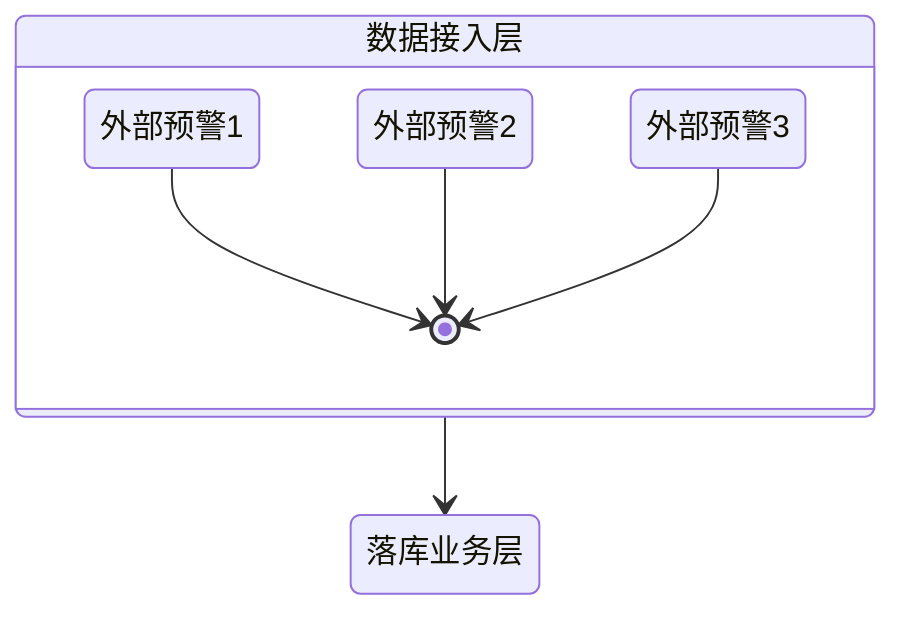

- 提炼抽象层与实现层

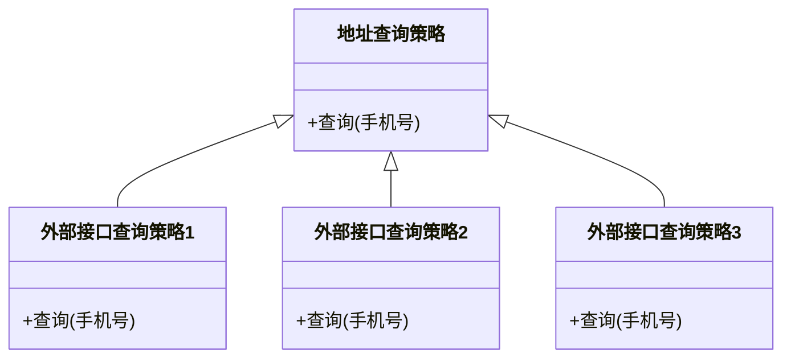

#### 扩展性伸缩性
#### 可测试性

### 分层的问题

- 性能开销：通信、数据转化
- 开发成本

### 分层架构设计

- [依赖原则](/软件工程/架构/架构.md#依赖关系规则)
- 定义职责：职责分离 高层抽象
- 层技术栈选择：每层需求自定 参考成功架构 适合自己组织
- 集成：单层内部的单元测试 -> 层之间的集成测试

### 分层架构模型

#### MVC

随着前后端分离以及后端微服务化的不断发展，传统的MVC已不适合现在的纯后端系统，Controller其实也是API，它代表了服务对外提供的接口，是一种合约

- model:模型代表一个存取数据的对象或 JAVA POJO。它也可以带有逻辑，在数据变化时更新控制器
- view:视图代表模型包含的数据的可视化
- controller:控制器作用于模型和视图上。它控制数据流向模型对象，并在数据变化时更新视图。它使视图与模型分离开

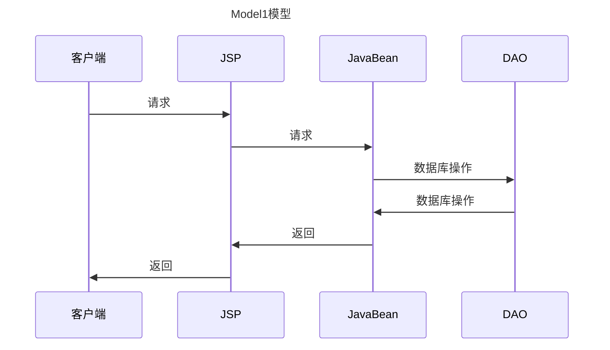

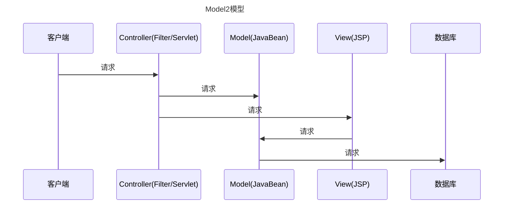

- 视图与模型关注点不同，视图侧重于可视化界面，而模型侧重于业务逻辑
- 同样的模型可以有不同的视图
- 模型更容易测试

当系统有了一些不可见的逻辑时，就需要注意模型与视图分离

**优势**

- 清晰的职责划分
- 组件独立，代码重用
- 后期维护方便
- 适合任何项目

**弊端**

- 展示数据慢（针对jsp）
- 对开发者架构设计能力要求高
- 异步交互不方便

##### 控制器类型

1. 页面控制器，为特定页面或动作处理请求的对象。控制器通过绑定请求来实现与用户的交互。其从请求中提取参数，对输入进行处理，执行业务逻辑，选择适当的视图以呈现结果。
2. 前端控制器：处理所有请求的控制器，执行一些通用的行为，如身份验证和日志记录，并且这些行为可以在运行时动态修改
3. 应用控制器：一个处理程序流的集中控制点，负责协调页面控制器与前端控制器之间的交互，确保请求在应用中的流转符合预期

##### Model

业务数据模型，Model层是高层策略，是技术无关逻辑的封装

##### View

当有用户的行为触发操作时，由控制器更新模型，并通知视图进行更新

##### Controller

主要是接收用户请求，并负责协调Model与View

#### MVP

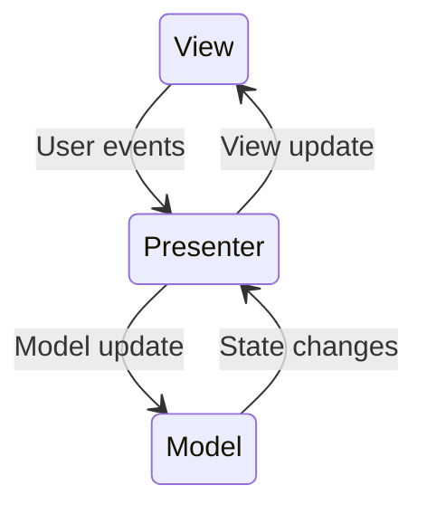

- Presenter较为复杂 可以脱离view进行测试

#### [MVVM](/编程语言/JavaScript/Vue/nav.md#MVVM)

#### BFF

- 为前端而生的后端服务

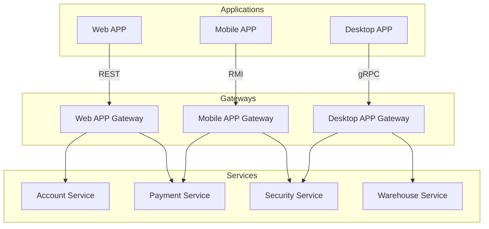

## 事件驱动架构

- 异步分发事件
  - 发生的事件
  - 变化的状态
- 耦合较低 灵活 扩展较容易
- 由于异步与细粒度的处理单元 正常情况下性能较高 但在出现异常重试时性能会降低
- **集成测试、维护很难**

### 两种模式

#### Mediator


- Event Queue：只关注事件的接收和发送
- Event Mediator：将原始事件转化成业务事件
- Event Channel：业务事件的聚合 由感兴趣的processor监听
- Event Processor：业务事件执行单元

#### Broker


- 无中心编排控制点
- 无业务逻辑的消息分发

两种模式的processor都是单一职责的最小执行单元

## 微内核架构

- 也被称为插件化架构，是一种面向功能进行拆分的可扩展的架构


系统核心的作用在于资源封装与插件规范定义

插件为在核心提供的接口上实现其单一的功能 插件之间应避免依赖 不能影响核心

**优点**

- 符合开闭原则 核心稳定 插件可扩展
- 内核与插件之间的解耦与隔离
- 针对核心的统一管理及插件的管理带来的性能优势
- 动态插件带来的部署上的优势

**缺点**

- 开发难度高
  - 功能位于核心还是插件难以划分
  - 热插拔
  - 注册协议 通信协议
- 难以伸缩

### 设计关键点

- 插件管理：核心系统要知道当前哪些插件可用、如何加载这些插件、什么时候加载这些插件
- 插件连接：核心系统必须制定插件和核心系统的连接规范
- 插件通信：设计的插件间是完全解耦的，但是实际应用中，必然存在某个业务需要多个插件协作，这要求插件间进行通信

#### 系统核心

核心的功能为MVP 所有核心能实现的接口都要经过核心

#### 开放规范

- 版本兼容
- 上下文、环境参数规范
- 回调 钩子 事件
- 业务集成规范

#### 注册规范

标识、功能、位置、依赖、权限

#### 通信机制

- 同步异步
- 本地远程
- 数据格式

#### 插件装载

- 知道插件在哪
- 何时 启动期 运行期
- 何地 本地 远程

## 生产者消费者模式

平衡问题：数据不堆积、不浪费消费者资源 调度算法

EDA关注的是事件触发、传递整体流程 生产者消费者关注的数据的传递与存储处理具体流程

**优点**

- 三者之间低耦合、异步
- 天生可以分布式
- 协调生产与消费速度不一致
- 生产数据与消费数据的分离

**缺点**

### 生产者

系统运转的动力来源 重点关注发送数据到容器 与消费者彻底解耦

- 发送确认
- 重试机制
- 同步异步
- 序列化
- 异常处理

### 消费者

获取数据-业务逻辑处理 要向容器确认数据被消费

- 消费方式 poll push
- 分发方式 queue topic
- 消费策略
- 消费幂等性
- 反序列化
- 多消费者
  - 复制
  - 非复制

### 容器

保管数据

- 存多久（时效性） 存哪里
- 如何调度数据给消费者
- 消费保证
  - at least once
  - at most once
  - exactly once 成本很高

#### 数据单元

- 传输的数据基本单位

具备业务含义、传输过程保证数据单元完整性、尽量保证单元之间无依赖

## 领域逻辑组织

- 编写业务逻辑的以什么形式存在、协作

### 事务脚本

> 使用过程来组织业务逻辑，每个过程处理来自表现层的单个请求

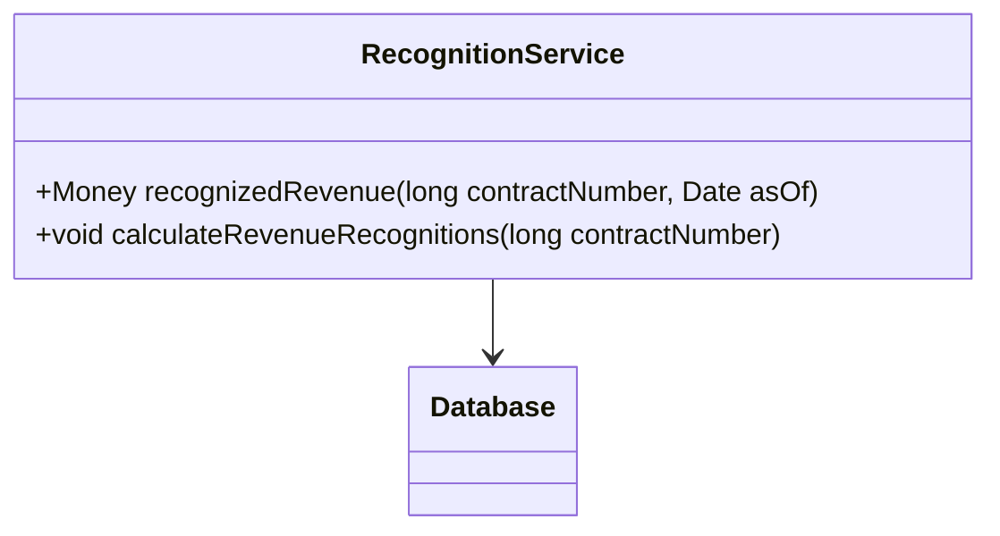

优点

- 易于理解
- 能与简单数据源层很好合作
- 事务边界容易划分

缺点

- 业务复杂导致代码冗余复杂

#### 事务脚本的组织

- 将同一主题的事务脚本放到同一个类当中
- 一个脚本对应一个类

当业务逻辑变得越来越复杂时，这一模式很难继续保持良好的设计，许多问题本身是简单的，一个简单的解决方案可以加快开发速度

### 领域模型

> 使用面向对象的方法，合并了行为和数据

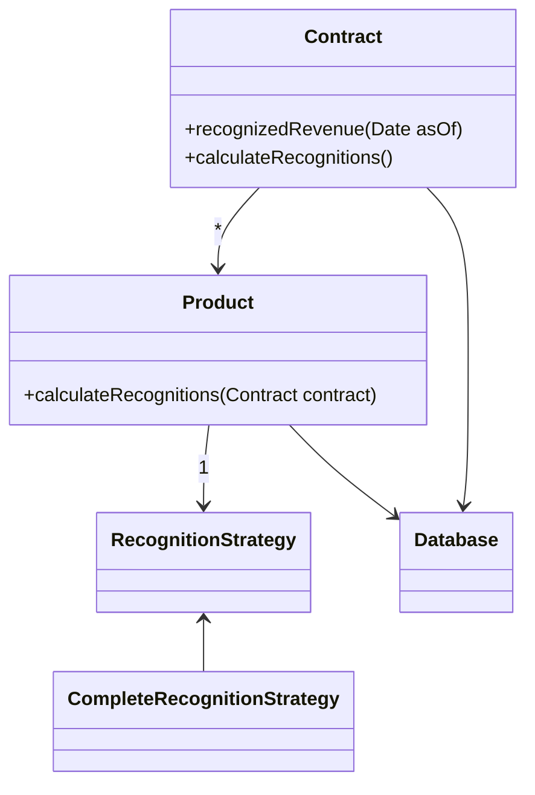

开销来源于使用复杂以及数据源的复杂，还要面对将领域模型映射到数据库的问题

#### 领域模型组织

- 实体bean
- ORM

当使用领域模型时，使用数据映射器有助于保持领域模型与数据库的独立性

领域模型的要点在于隐藏数据库的存在，使其对于上层不可见

### 表模块

> 围绕表组织领域逻辑，处理数据库中表或视图中所有行的业务逻辑的一个封装

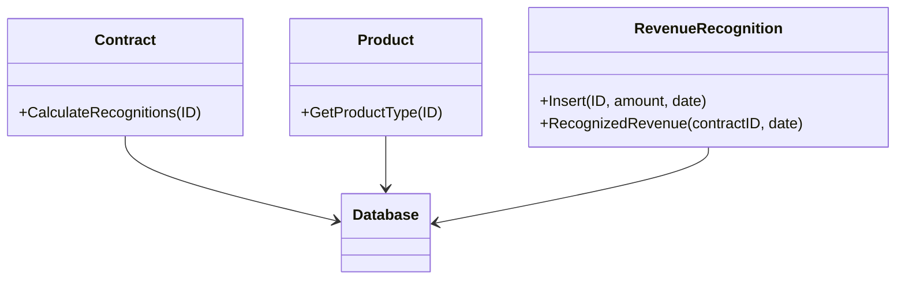

表模块与事务脚本的区别在于表模块的所有操作都是围绕表来进行，而事务脚本则是围绕事务过程来进行。

#### 表模块组织

表模块以一个类对应数据库中的一个表来组织领域逻辑，仅使用一个单一实例，表模块很大程度依赖于以表方式组织的数据

### 服务层

- 将领域层再拆为两层，服务层提供简单的API接口

通过服务层提供一组可用的操作集合给外部使用

服务层定义了应用程序的边界和从接口客户层角度所看到的的系统

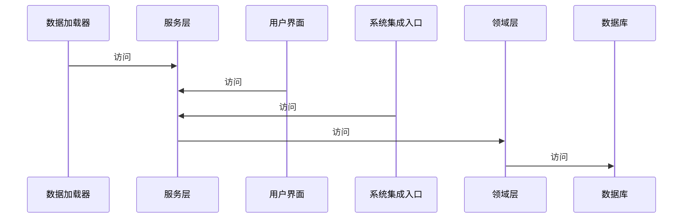

#### 业务逻辑的种类

- 领域逻辑
- 应用逻辑

#### 实现

- 领域外观
  - 做的事不多，属于瘦客户端
- 操作脚本
  - 拥有较多的业务逻辑，对领域层进行操作

#### 服务识别与操作

服务层操作的起点是用例模型以及用户界面

如果系统只有一种用户，那可能不需要使用服务层

定义服务层的考虑就是为了复用

## 映射到关系数据库

### 架构模式

- 活动记录
  - 类似于JAVA Bean
- 数据映射器
  - ORM

### 行为

如何保证对领域对象的修改能及时存储到数据库

- 标志映射
  - 保证相同的对象只被加载一次
- 延迟加载

### 读取数据

### 结构映射模式

#### 关系的映射

- 外键映射一对多
- 关联表映射多对多

#### 继承

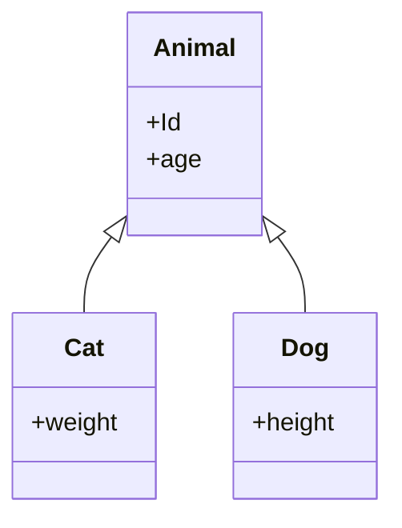

- 单表继承
  - 多个层次共享同一张表

```sql
CREATE TABLE Animal (
  DB_TYPE
  id,
  age,
  weight,
  height
)
```

- 具体表继承
  - 一个层次一张表

```sql
CREATE TABLE Animal (
  id,
  age
)
CREATE TABLE Cat (
  id,
  weight
)
CREATE TABLE Dog (
  id,
  height
)
```

- 类表继承
  - 一个类一张表

```sql
CREATE TABLE Animal (
  id,
  age
)
CREATE TABLE Cat (
  id,
  age
  weight
)
CREATE TABLE Dog (
  id,
  age
  height
)
```

### 建立映射

将数据库设计看做一种持久化对象数据的方法

- 双向映射
  - 将对象-数据库以及数据库-对象两种映射分开设计

### 元数据

- 通过元数据的描述自动生成代码

### 数据库连接

- 使用连接池管理连接
- 将连接与事务绑定在一起

## web表现层

### 模板视图

以 jsp php 为代表的模板文件，通过在HTML标记一些数据，来让处理器渲染

缺点在于，很容易被插入复杂的逻辑，变得难以测试

### 转换视图

如 json 为代表

转换视图把领域数据作为输入，HTML作为输出

与模板视图的区别是转换视图侧重于数据的输入，而模板视图更侧重于输出

### 两阶视图

1. 生成一个逻辑视图
2. 再将逻辑视图对应到html

类似于编译，把业务数据转换为一种中间表示，再从中间表示渲染视图，两步视图的价值来源于分离了第一阶段与第二阶段，使改变更加容易

## 并发

### 本质问题

- 更新丢失
- 不一致读

### 执行语境

- 一个请求对应一个会话，可以使进程，也可以是线程，但创建进程耗费资源，使用线程又会导致线程安全问题
- 数据库中的语境是事务

### 方案

- 隔离：划分数据，一片数据只能被一个工作单元访问
- 不变：不变的数据是线程安全的

#### 乐观锁与悲观锁

- 使用读写控制
- 死锁

### 事务

事务是一个又边界的工作序列，开始和结束都有明确定义

- 事务的特性

#### 事务资源

横跨多个请求的被称为长事务

锁升级：一个事务锁住了许多行，则直接升级到对整个表的锁

#### 减少事务隔离提高灵活性

可串行化：当并发执行的结果与以某种顺序一致时

#### 系统事务与业务事务

#### 离线并发控制

只有在数据提交失败的时候才能发现

### 应用服务器并发

使用每会话一个进程的方式来避免处理线程的麻烦

## 会话保存

无状态服务不需要在服务端存储会话信息

存储会话信息的一些方法：

- 客户端存储
  - cookie
  - 注意会话数据大小以及数据安全性完整性
- 服务器存储
  - session
- 数据库存储
  - 将会话信息存储在数据库中

### 客户会话状态

将会话状态保存在客户端

这样服务器就可以是无状态的 可以构建性能强大的服务器集群

为了避免安全问题，将会话状态保存在诸如Cookie等客户端数据上的时候，需要对其加密，如JWT就是其中的一个代表，但这样会带来一定的性能损失

另外一种方式是SessionId为代表的用来保存标识号的技术，这种方式通过一个散列的随机字符串来标识用户，但这样服务器就不再是无状态了，除非引入统一Session服务器，否则服务器还是必须得存储用户的状态

### 服务器会话状态

将会话状态保存到服务端

- 会话状态的持久化以及序列化所带来的字段兼容问题

### 数据库会话状态

将会话状态保存到数据库中

### 会话迁移

会话可以在服务器集群之间转移

## 分布式

进程内的过程调用非常快，而远程调用则涉及网络延迟和数据序列化等开销

何时必须使用分布对象：

- 客户机与服务器之间
- 服务器与数据库之间
- web系统之间
- 使用软件包，当系统中有多个模块或服务时，通过定义良好的接口来实现模块间的交互

注意远程调用的边界：明确哪些操作可以在本地执行，哪些必须远程调用

许多现代分布式系统中，XML和HTTP被广泛用于数据交换和远程过程调用

#### 远程外观

对细粒度接口对象进行封装，提供粗粒度接口，提高网络传输效率

进程内调用的开销比进程外的小

远程外观的设计都是基于特定客户的需要

### 数据传输对象（DTO）

传输数据的对象

一般都只用在跨进程的调用当中，跟现在所使用的DTO基本可以等同为同一个东西，现在的DTO也广泛在系统各层之间传输数据使用

DTO中的域应该都是非常原始和简单的，主要是要求可被序列化

### 如何序列化

- 自动化
- 传输双方保持一致

#### 组装器模式

组装器对象负责将领域对象转为DTO

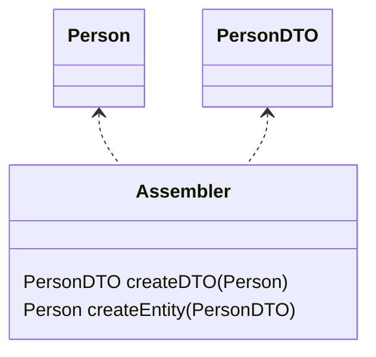
