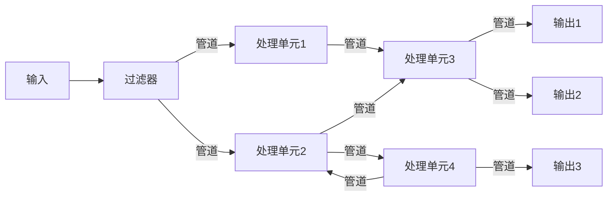
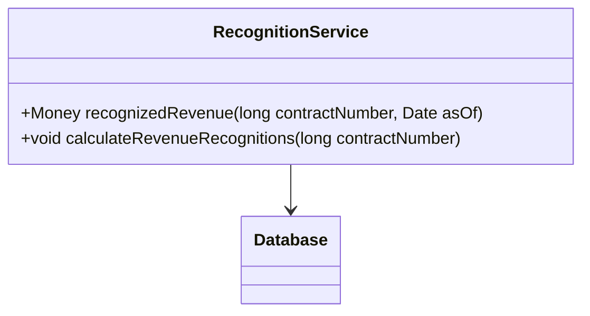
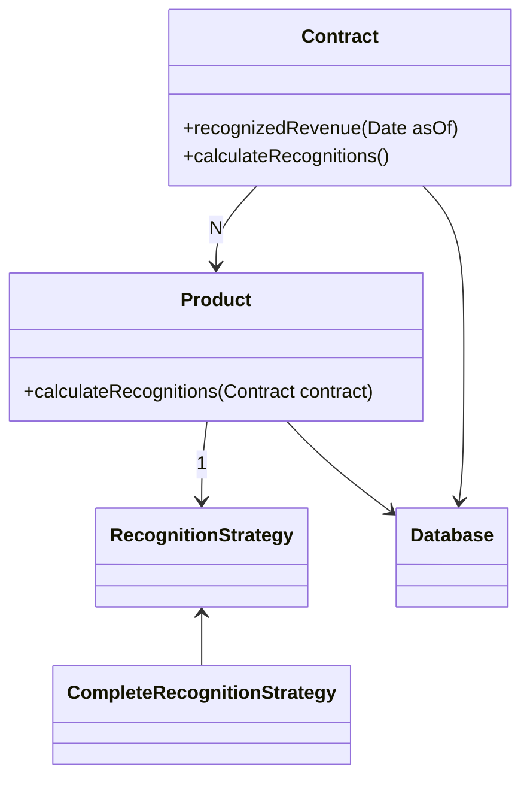
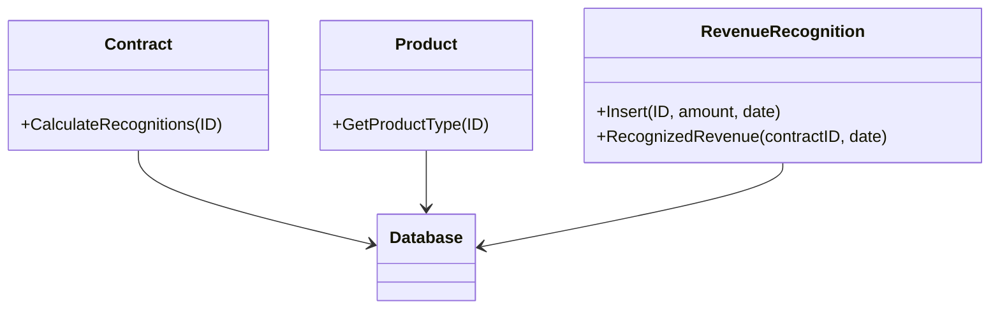
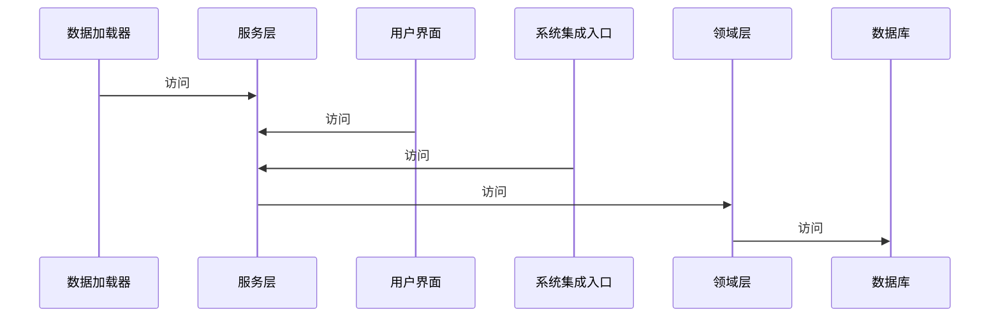
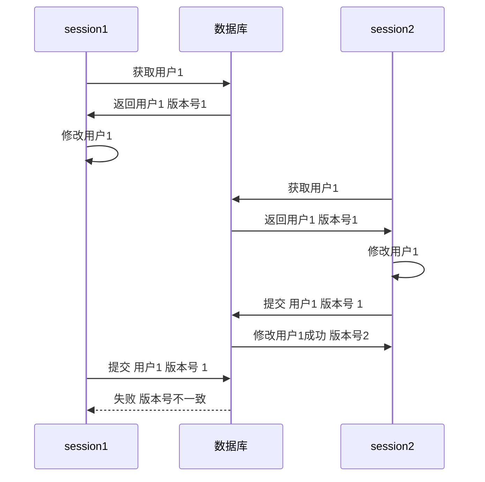
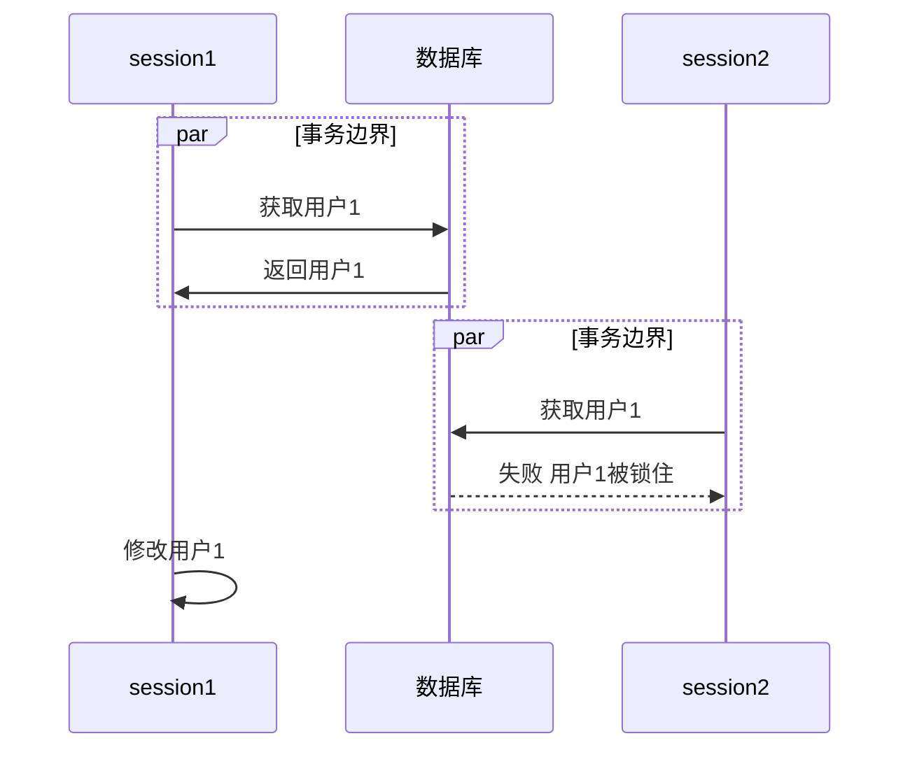
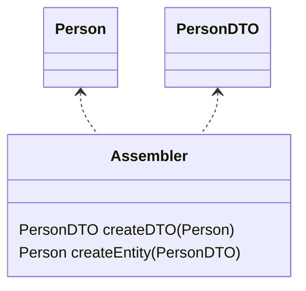

# 架构模式

## 数据流风格

所有的数据按照流的形式在执行过程中前进，不存在结构的反复和重构，数据在流水线的各个节点上被加工。每完成一个环节，数据流都会被送入下一个环节，最终输出处理后的完整结果

该风格的特点就是

- 解耦
- 复用
- 高吞吐

### 批处理

特点：

- 强时间顺序：只有当前一步的计算任务处理完成后，后一步处理才能开始。计算任务前后顺序明确。
- 强完整性：数据传送在计算单元之间通过指定的数据交互方式传递。每一步要确保数据完整，才可以向下一步发起数据传送。
- 强控制力度：有独立的顺序控制和时间把控机制，并辅以数据检查等功能。

### 管道过滤

从用户或者上游管道获得输入数据，进行数据的变换及增量计算，处理完成后，通过下游管道传递给另一个过滤器



## 调用返回风格（请求响应）

指在系统中增加了调用与返回机制。利用调用和返回，实现分而治之，将一个复杂的大系统分解为一些子系统，以便降低复杂度，并且增加可修改性

### 主程序/子程序

- 对应于面向过程开发

### 面向对象风格

- 面向对象编程

### 层次结构风格

每一层可以独立设计、开发，只要满足和上下层的接口定义即可。层间解耦

## 独立构件风格

描述了在一个应用系统中，各个构件是如何进行通信的

### 进程通信

通常以同步调用为主，辅以异步交互式通信方式

### 事件驱动架构


基于事件的隐式调用风格，构件不直接调用一个过程，而是触发或广播一个或多个事件。后续执行过程会被注册在一个或多个事件，当对应的事件被触发或者广播时，系统会自动调用该事件中注册的过程，执行相应的模块功能

- 异步分发事件
  - 发生的事件
  - 变化的状态
- 耦合较低 灵活 扩展较容易
- 由于异步与细粒度的处理单元 正常情况下性能较高 但在出现异常重试时性能会降低
- **集成测试、维护很难**

#### 两种模式

##### Mediator


- Event Queue：只关注事件的接收和发送
- Event Mediator：将原始事件转化成业务事件
- Event Channel：业务事件的聚合 由感兴趣的processor监听
- Event Processor：业务事件执行单元

##### Broker


- 无中心编排控制点
- 无业务逻辑的消息分发

两种模式的processor都是单一职责的最小执行单元

## 虚拟机风格

### 解释器

可以仿真硬件的执行过程和一些关键应用，通常被用来弥合程序语义与硬件语义之间的差异。其缺点是执行效率较低

### 基于规则的系统

规则的细节被引擎所解析，来决定业务、监控等策略和措施的制定

- 大数据/人工智能


## 仓库风格

关注的重点是数据的存储和共享方式，最偏重数据共享的一种风格

### 数据库系统

### 超文本系统

- 是用于共享静态网页

CMS

### 黑板

用于记录组织推理步骤、控制状态数据和问题求解之领域知识的框架。它将问题的解空间组织成一个或多个应用相关的分级结构。这些分级结构将由不同的专家（系统），通过不同知识表达方法、推理框架和控制机制的组合来形成各自的知识源


## 微内核架构

- 也被称为插件化架构，是一种面向功能进行拆分的可扩展的架构


系统核心的作用在于资源封装与插件规范定义

插件为在核心提供的接口上实现其单一的功能 插件之间应避免依赖 不能影响核心

**优点**

- 符合开闭原则 核心稳定 插件可扩展
- 内核与插件之间的解耦与隔离
- 针对核心的统一管理及插件的管理带来的性能优势
- 动态插件带来的部署上的优势

**缺点**

- 开发难度高
  - 功能位于核心还是插件难以划分
  - 热插拔
  - 注册协议 通信协议
- 难以伸缩

### 设计关键点

- 插件管理：核心系统要知道当前哪些插件可用、如何加载这些插件、什么时候加载这些插件
- 插件连接：核心系统必须制定插件和核心系统的连接规范
- 插件通信：设计的插件间是完全解耦的，但是实际应用中，必然存在某个业务需要多个插件协作，这要求插件间进行通信

#### 系统核心

核心的功能为MVP 所有核心能实现的接口都要经过核心

#### 开放规范

- 版本兼容
- 上下文、环境参数规范
- 回调 钩子 事件
- 业务集成规范

#### 注册规范

标识、功能、位置、依赖、权限

#### 通信机制

- 同步异步
- 本地远程
- 数据格式

#### 插件装载

- 知道插件在哪
- 何时 启动期 运行期
- 何地 本地 远程

## 领域逻辑组织

- 编写业务逻辑的以什么形式存在、协作

### 事务脚本

> 使用过程来组织业务逻辑，每个过程处理来自表现层的单个请求



优点

- 易于理解
- 能与简单数据源层很好合作
- 事务边界容易划分

缺点

- 业务复杂导致代码冗余复杂

#### 事务脚本的组织

- 将同一主题的事务脚本放到同一个类当中
- 一个脚本对应一个类

当业务逻辑变得越来越复杂时，这一模式很难继续保持良好的设计，许多问题本身是简单的，一个简单的解决方案可以加快开发速度

### 领域模型

> 使用面向对象的方法，合并了行为和数据



开销来源于使用复杂以及数据源的复杂，还要面对将领域模型映射到数据库的问题

#### 领域模型组织

- 实体bean
- ORM

当使用领域模型时，使用数据映射器有助于保持领域模型与数据库的独立性

领域模型的要点在于隐藏数据库的存在，使其对于上层不可见

### 表模块

> 围绕表组织领域逻辑，处理数据库中表或视图中所有行的业务逻辑的一个封装



表模块与事务脚本的区别在于表模块的所有操作都是围绕表来进行，而事务脚本则是围绕事务过程来进行。

#### 表模块组织

表模块以一个类对应数据库中的一个表来组织领域逻辑，仅使用一个单一实例，表模块很大程度依赖于以表方式组织的数据

### 服务层

- 将领域层再拆为两层，服务层提供简单的API接口

通过服务层提供一组可用的操作集合给外部使用

服务层定义了应用程序的边界和从接口客户层角度所看到的的系统



#### 业务逻辑的种类

- 领域逻辑
- 应用逻辑

#### 实现

- 领域外观
  - 做的事不多，属于瘦客户端
- 操作脚本
  - 拥有较多的业务逻辑，对领域层进行操作

#### 服务识别与操作

服务层操作的起点是用例模型以及用户界面

如果系统只有一种用户，那可能不需要使用服务层

定义服务层的考虑就是为了复用

## 与关系数据库的映射

为了保证对领域对象的修改能及时存储到数据库，需要考虑如下问题：

1. 标志映射，保证相同的对象只被加载一次
2. 延迟加载，当对象附带着引用的对象，在需要时才加载

### 表数据入口

一个实例代表处理一张表中所有的行，通常是无状态的

```java
interface Person {
    RecordSet find(int id);
    RecordSet findWithXXX(...);
    void update(...);
}
```

表数据入口可能是最简单的数据库接口模式

### 行数据入口

一个实例代表一条记录 内存对象的数据与数据库操作混杂在一起会带来一些麻烦 如不好测试 并会增加复杂度

```java
class Person {
    name,age;
    insert();
    update();
}
interface PersonFinder {
    Person find(...);
}
```

### 活动记录

一个包装表或视图中某一行的对象，封装了对数据库的操作访问

```java
class Person {
    name,age;
    insert();
    delete();

    bool isAudlt();
}
```

活动记录的本质是一个领域模型

活动记录的数据结构应该与数据库完全吻合

活动记录与行数据入口的区别在于行数据入口只有数据访问，而活动记录封装了一些逻辑

- 活动记录适用于不太复杂的逻辑
- 活动记录使对象与数据库的耦合过紧

### 数据映射器

随着ORM框架的发展，前面3种方式已逐渐过时，使用数据映射器的方式可以很好地处理大型应用下的数据源使用

在对象和数据库之间的一个中间层，数据映射器自身不被领域层所察觉

```java
interface PersonMapper {
    Person select(...);
    update(Person);
}
```

当需要分离对象与数据库时，使用数据映射器

### 元数据模式

可以通过表结构为代表的元数据来自动生成代码，这在一些快速开发框架中很常见

### 数据库连接

涉及到数据库肯定也涉及到数据库连接，对于连接的管理，可以采用如下方式

- 使用连接池管理连接
- 将连接与事务绑定在一起

## web表现层

### 模板视图

以 jsp php 为代表的模板文件，通过在HTML标记一些数据，来让处理器渲染

缺点在于，很容易被插入复杂的逻辑，变得难以测试

### 转换视图

如 json 为代表

转换视图把领域数据作为输入，HTML作为输出

与模板视图的区别是转换视图侧重于数据的输入，而模板视图更侧重于输出

### 两阶视图

1. 生成一个逻辑视图
2. 再将逻辑视图对应到html

类似于编译，把业务数据转换为一种中间表示，再从中间表示渲染视图，两步视图的价值来源于分离了第一阶段与第二阶段，使改变更加容易

## 并发模式

在应用于数据库的并发处理中，本质问题是

1. 更新丢失：多个工作单元对同一个数据进行修改，导致数据不一致
2. 不一致读：读取数据时，数据可能被其他工作单元修改，导致两次读数据不一致

工作单元执行在执行语境中，执语境可以是线程，也可以是进程

- 一个请求对应一个会话，可以是进程，也可以是线程，但创建进程耗费资源，使用线程又会导致线程安全问题
- 数据库中的语境是事务

为了保证并发安全，有一些方案：

- 隔离：划分数据，一片数据只能被一个工作单元访问
- 不变：不变的数据是线程安全的

### 乐观离线锁

使用冲突检测与事务回滚来防止事务冲突

- 验证一个提交的修改不会与其他修改发生冲突

通过版本号来实现



```sql
UPDATE users WHERE id = 1 AND version = 1;
```

这种乐观的离线锁是针对具体领域的解决方案

### 悲观离线锁

每次只允许一个会话访问数据



尽可能早检测出冲突

锁的类型：

- 独占写锁
  - 当编辑数据时，需要对数据加锁
- 独占读锁
  - 当读取数据时，需要加锁
- 读写锁
  - 读锁与写锁是互斥的
  - 可以进行并发地读

锁管理：如何管理锁与锁的持有者？实现尽可能简单，可以使用散列表映射锁及锁的持有者

### 粗粒度锁

- 获取与释放锁的代价很小

用锁锁住一组相关的对象，DDD中的[聚合根](/软件工程/领域驱动设计.md#聚合)就可以代表是锁的入口点

### 隐含锁

将加锁的任务交给父类或者框架，避免繁琐的客户编程加锁释放锁导致出现的问题

## 会话保存

无状态服务不需要在服务端存储会话信息

存储会话信息的一些方法：

- 客户端存储
  - cookie
  - 注意会话数据大小以及数据安全性完整性
- 服务器存储
  - session
- 数据库存储
  - 将会话信息存储在数据库中

### 客户会话状态

将会话状态保存在客户端

这样服务器就可以是无状态的 可以构建性能强大的服务器集群

为了避免安全问题，将会话状态保存在诸如Cookie等客户端数据上的时候，需要对其加密，如JWT就是其中的一个代表，但这样会带来一定的性能损失

另外一种方式是SessionId为代表的用来保存标识号的技术，这种方式通过一个散列的随机字符串来标识用户，但这样服务器就不再是无状态了，除非引入统一Session服务器，否则服务器还是必须得存储用户的状态

### 服务器会话状态

将会话状态保存到服务端

- 会话状态的持久化以及序列化所带来的字段兼容问题

### 数据库会话状态

将会话状态保存到数据库中

### 会话迁移

会话可以在服务器集群之间转移

## 分布式

进程内的过程调用非常快，而远程调用则涉及网络延迟和数据序列化等开销

何时必须使用分布对象：

- 客户机与服务器之间
- 服务器与数据库之间
- web系统之间
- 使用软件包，当系统中有多个模块或服务时，通过定义良好的接口来实现模块间的交互

注意远程调用的边界：明确哪些操作可以在本地执行，哪些必须远程调用

许多现代分布式系统中，XML和HTTP被广泛用于数据交换和远程过程调用

#### 远程外观

对细粒度接口对象进行封装，提供粗粒度接口，提高网络传输效率

进程内调用的开销比进程外的小

远程外观的设计都是基于特定客户的需要

### 数据传输对象（DTO）

传输数据的对象

一般都只用在跨进程的调用当中，跟现在所使用的DTO基本可以等同为同一个东西，现在的DTO也广泛在系统各层之间传输数据使用

DTO中的域应该都是非常原始和简单的，主要是要求可被序列化

### 如何序列化

- 自动化
- 传输双方保持一致

#### 组装器模式

组装器对象负责将领域对象转为DTO


