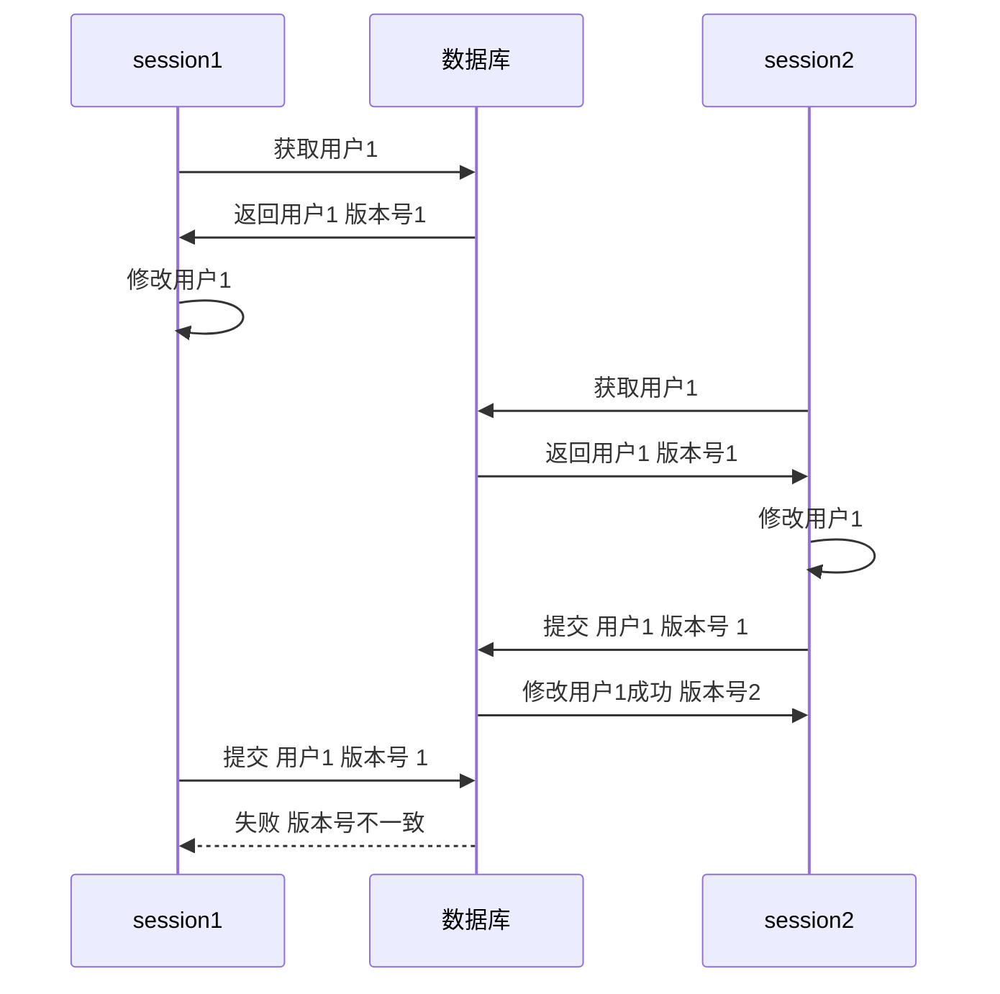
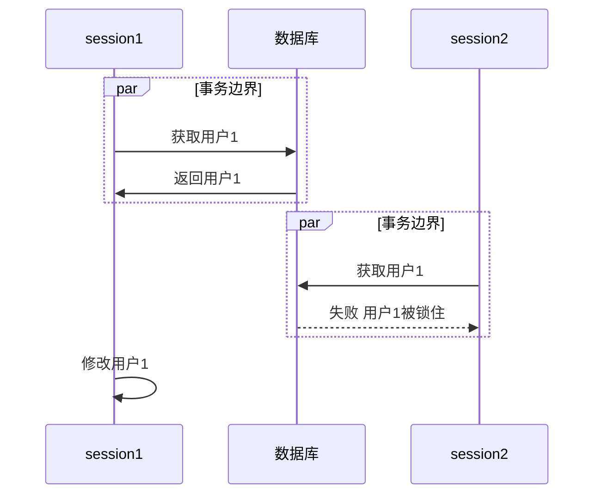

# 离线并发模式

## 乐观离线锁

使用冲突检测与事务回滚来防止事务冲突

- 验证一个提交的修改不会与其他修改发生冲突

通过版本号来实现



```sql
UPDATE users WHERE id = 1 AND version = 1;
```

这种乐观的离线锁是针对具体领域的解决方案

## 悲观离线锁

每次只允许一个会话访问数据



尽可能早检测出冲突

锁的类型：

- 独占写锁
  - 当编辑数据时，需要对数据加锁
- 独占读锁
  - 当读取数据时，需要加锁
- 读写锁
  - 读锁与写锁是互斥的
  - 可以进行并发地读

### 锁管理对象

如何管理锁与锁的持有者？

实现尽可能简单，使用散列表映射锁及锁的持有者

## 粗粒度锁

- 获取与释放锁的代价很小

用锁锁住一组相关的对象，DDD中的[聚合根](/软件工程/领域驱动设计.md#聚合)就可以代表是锁的入口点

## 隐含锁

将加锁的任务交给父类或者框架，避免繁琐的客户编程加锁释放锁导致出现的问题
