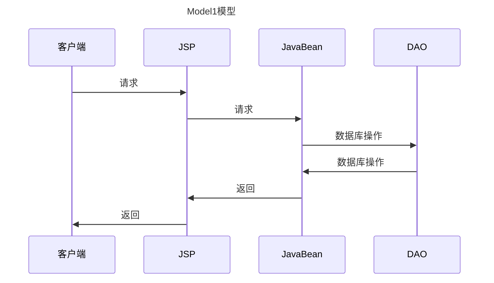
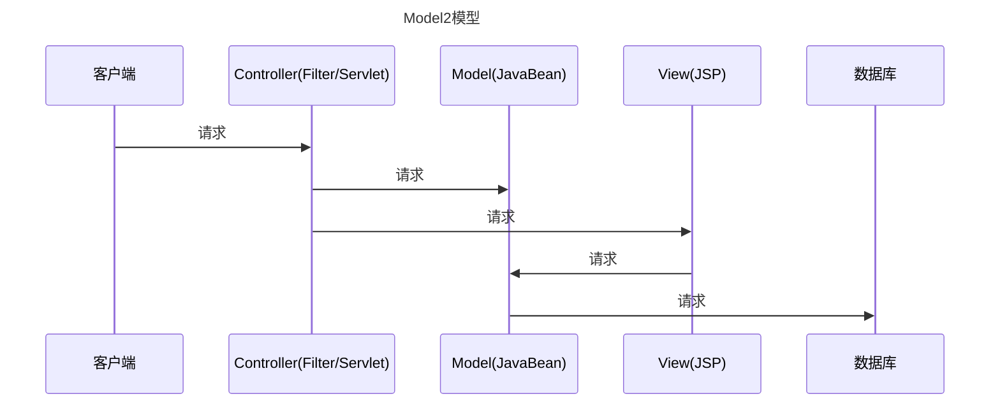
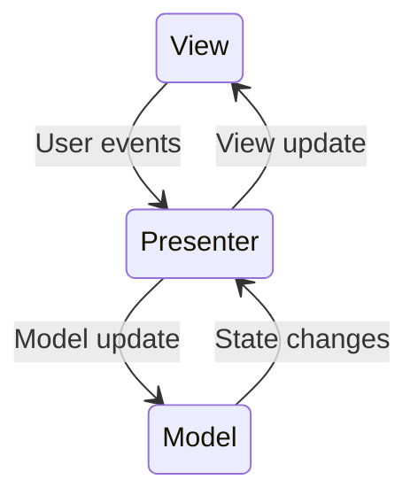
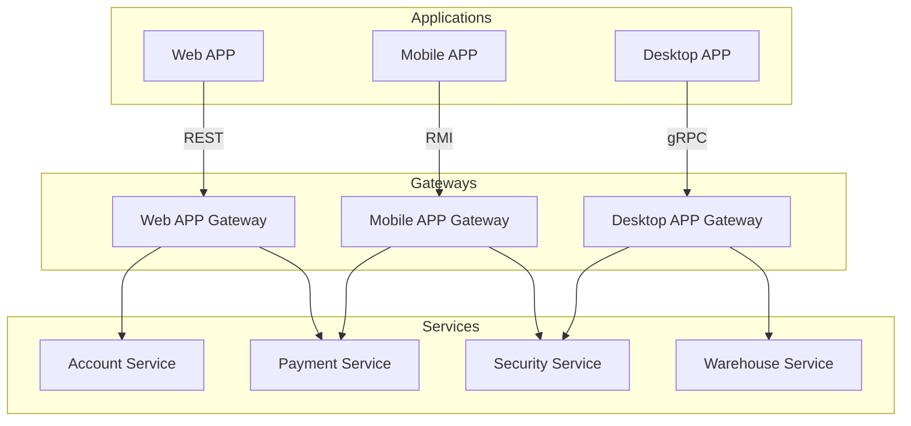
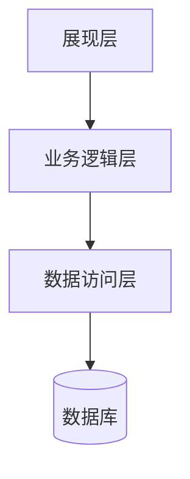
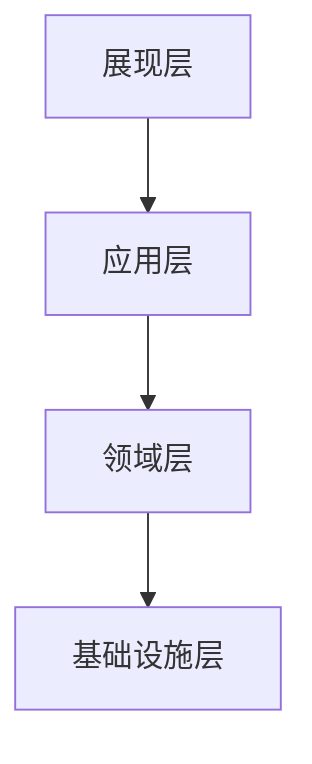

# 表现层

表现层（Presentation Layer）是软件架构中最上层的部分，主要负责处理用户界面和用户交互。它也被称为展现层或UI层，是用户与系统交互的接口。

## 定义与职责

表现层的主要职责包括：

- 接收用户输入并将其传递给下层处理
- 将下层处理的结果以适当的形式展示给用户
- 控制用户界面的流程和导航
- 处理用户界面事件

在分层架构中，表现层通常依赖于业务逻辑层（或应用层）来获取数据和执行业务操作，对用户隐藏了系统内部的复杂性。

## 主要模式

### MVC（Model-View-Controller）

随着前后端分离以及后端微服务化的不断发展，传统的MVC已不适合现在的纯后端系统，Controller其实也是API，它代表了服务对外提供的接口，是一种合约

- **Model**: 模型代表一个存取数据的对象或 JAVA POJO。它也可以带有逻辑，在数据变化时更新控制器
- **View**: 视图代表模型包含的数据的可视化
- **Controller**: 控制器作用于模型和视图上。它控制数据流向模型对象，并在数据变化时更新视图。它使视图与模型分离开

#### MVC模型演变

**Model1模型**

**Model2模型**

#### MVC的优势与弊端

**优势**
- 清晰的职责划分
- 组件独立，代码重用
- 后期维护方便
- 适合任何项目

**弊端**
- 展示数据慢（针对jsp）
- 对开发者架构设计能力要求高
- 异步交互不方便

#### 控制器类型

1. **页面控制器**: 为特定页面或动作处理请求的对象。控制器通过绑定请求来实现与用户的交互。其从请求中提取参数，对输入进行处理，执行业务逻辑，选择适当的视图以呈现结果。

2. **前端控制器**: 处理所有请求的控制器，执行一些通用的行为，如身份验证和日志记录，并且这些行为可以在运行时动态修改

3. **应用控制器**: 一个处理程序流的集中控制点，负责协调页面控制器与前端控制器之间的交互，确保请求在应用中的流转符合预期

#### Model（业务数据模型）
业务数据模型，Model层是高层策略，是技术无关逻辑的封装

#### View（视图）
当有用户的行为触发操作时，由控制器更新模型，并通知视图进行更新

#### Controller（控制器）
主要是接收用户请求，并负责协调Model与View

### MVP（Model-View-Presenter）

- Presenter较为复杂，可以脱离view进行测试

### MVVM（Model-View-ViewModel）

MVVM是MVC模式的进一步演变，特别适用于现代前端开发，如Vue.js等框架。

### BFF（Backend for Frontend）

- 为前端而生的后端服务

## 与分层架构的关系

在传统的分层架构中，表现层是系统架构的最上层，通常与业务逻辑层、数据访问层和数据库层形成依赖关系：

在现代架构中，表现层与应用层、领域层和基础设施层形成更复杂的交互关系：

## 视图与模型关系

- 视图与模型关注点不同，视图侧重于可视化界面，而模型侧重于业务逻辑
- 同样的模型可以有不同的视图
- 模型更容易测试

当系统有了一些不可见的逻辑时，就需要注意模型与视图分离。

## 关联内容（自动生成）

- [/软件工程/架构模式/分层架构.md](/软件工程/架构模式/分层架构.md) 分层架构是表现层所处的更大架构背景，表现层作为分层架构的最上层，与业务逻辑层、数据访问层之间有着明确的依赖关系
- [/软件工程/架构模式/Web框架.md](/软件工程/架构模式/Web框架.md) Web框架通常采用MVC、MVP、MVVM等模式实现表现层，是表现层理论的具体实现
- [/编程语言/JAVA/框架/Spring/SpringMVC.md](/编程语言/JAVA/框架/Spring/SpringMVC.md) Spring MVC是MVC模式在JAVA中的典型实现，体现了表现层架构的具体应用
- [/软件工程/架构/Web前端/前后端分离.md](/软件工程/架构/Web前端/前后端分离.md) 前后端分离架构改变了传统表现层的实现方式，BFF模式成为新的表现层形态
- [/软件工程/架构/Web前端/Web前端.md](/软件工程/架构/Web前端/Web前端.md) 前端技术是现代表现层的重要组成部分，CSS作为表现层语言直接影响用户界面
- [/软件工程/架构/系统设计/网关.md](/软件工程/架构/系统设计/网关.md) BFF（Backend for Frontend）作为面向前端的后端服务，是表现层架构的一种新模式
- [/软件工程/微服务/集成.md](/软件工程/微服务/集成.md) 在微服务架构中，表现层与后端服务的集成方式对系统架构有重要影响
