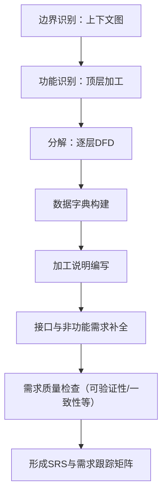
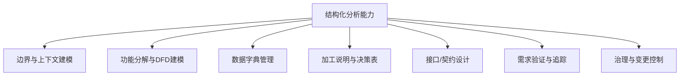

# 结构化分析方法

## 本质与定义

结构化分析（Structured Analysis）是一套以数据流为中心，通过自顶向下分解系统功能与数据转换，建立明确的功能模型、数据模型与接口契约的系统分析方法论。其本质是“把系统视为信息（数据）在加工单元之间流动与变换的组合”，强调过程分解、数据约定、可验证的需求表达，以及与结构化设计/程序化设计的衔接。

重要特征（抽象）：

* 以“信息流 + 加工”为核心的系统观；
* 自顶向下的分解与层次化模型（可控复杂度）；
* 强调可验证、可追溯、与设计/实现解耦的需求表达；
* 以正式化的模型（DFD、数据字典、加工说明）作为规范契约。

## 历史背景与演进趋势

### 1. 历史起源：对“软件危机”的直接回应

结构化分析方法并非技术的自然积累，而是二十世纪六十年代为了应对“软件危机”而诞生的学科产物。

* 诞生契机：1968年北约软件工程会议首次提出“软件工程”概念，旨在通过严谨的工程化方法解决成本超支、进度延误及质量失控问题。
* 掌握过程时代（1968–1982）：这是结构化方法的黄金时代。软件工程的重心从“掌握机器”转向“掌握过程”，SREM、SADT和SSADM等结构化分析方法相继出现，试图通过形式化模型降低开发风险。
* 早期的局限：早期分析重点在于硬件资源优化，且形式化模型在面对大规模复杂系统时，往往因缺乏自动化工具支持而变得难以管理。

### 2. 范式转移：从功能分解到对象协作

随着计算能力的增长，软件工程进入新的演进阶段，结构化分析的地位也随之改变：

* 掌握复杂度时代（1983–1992）：个人电脑的普及使软件规模迅速膨胀，原本相互独立的“数据建模”与“功能建模”逐渐收敛，最终促成了面向对象技术的崛起。
* 工业化与质量监控（1993–2001）：互联网兴起推动软件进入分布式时代，引入了CMMI等质量监控体系，更加强调过程与产品的有效分离。

### 3. 现代视角：回归与融合

在当代软件工程实践中，结构化分析并未消亡，而是在现代软件开发生命周期中找到了新的生态位：

* 高合规领域的压舱石：在航空航天、医疗器械等安全至上的受监管行业，结构化模型因其文档详尽、质量可追溯的特性，依然保有独特价值。
* 需求工程的升维：面对全球化的合规与监管要求，现代SDLC强调高精度文档化。结构化分析提供的“跨抽象层映射能力”，成为合规性映射的重要技术支撑。

### 4. 未来演进趋势

结构化分析方法正朝着自动化、智能化和混合化的方向演进：

* 从手工图表到模型驱动：将DFD、加工说明等转化为机器可读模型（如YAML/JSON），以支持自动化的模型校验、代码生成与测试生成。
* 混合建模实践：一种主流趋势是“外部看结构，内部看领域”——利用结构化分析定义系统边界与外部接口契约，而利用领域驱动设计实现核心内部业务逻辑。
* 可观测性嵌入：在分析设计阶段就纳入指标、日志与链路契约，使系统在运行时能够持续验证设计阶段的假设。
* AI原生的重构：随着AI工具大量承担常规编码工作，人类工程师的精力将进一步回归到“需求定义”与“系统架构”层。结构化分析作为结构化认知的重要手段，将帮助开发者更好地进行系统化建模与校验。

## 核心概念与要素

下表列出结构化分析的核心概念、定义与作用。

| 概念                                       |                  定义（抽象） | 作用 / 价值                 |
| ---------------------------------------- | ----------------------: | ----------------------- |
| 数据流（Data Flow）                           | 在系统边界或处理节点间传递的信息单元或消息集合 | 描述信息移动、触发与依赖，定位接口与触发条件  |
| 加工（Process / Transformation）             | 对输入数据进行计算、校验、转换或路由以产生输出 | 划分行为边界、定义功能单元并为后续设计提供契约 |
| 数据存储（Data Store）                         |        持久或暂存的信息保管点（逻辑上） | 描述状态、持久化需求与并发访问约束       |
| 外部实体（External Entity / Data Source/Sink） | 系统外的发送或接收信息的对象（人、系统、设备） | 定义边界、接口与责任归属            |
| 数据字典（Data Dictionary）                    |       对所有数据项、记录及结构的规范说明 | 统一语义，支持一致性校验与接口定义       |
| 加工说明（Process Specification）              | 对每个加工的细粒度逻辑与规则的文字或伪代码说明 | 支持可验证性、测试用例生成与设计映射      |
| 分解（Decomposition）                        |       自顶向下把复杂加工拆为更细粒度加工 | 控制复杂度并为模块化设计提供基础        |
| 需求规格（SRS）要素                              |      对功能、接口、性能、约束的结构化陈述 | 提供可测试、可验证的需求契约          |

## 模型与表达工具

结构化分析的主要模型与表达工具：

* 数据流图（DFD）

  * 角色：功能与数据流的可视化骨架
  * 约束：每层应满足数据流与数据存储的一致性（平衡）

* 数据字典

  * 角色：系统共同语义库（字段、记录、约束、来源）
  * 内容：数据项名称、类型、取值域、来源、用途、生命周期、敏感性

* 加工说明（Pseudocode / Decision Table / State Table）

  * 角色：把图形化的加工节点转为可执行的逻辑规范
  * 形式：结构化自然语言、伪代码、决策表、状态机

* 接口规范（API / UI / HW interface）

  * 角色：将DFD中的数据流具体化为调用契约（消息格式、交互序列、错误处理）

## 结构化分析过程模型

以“从需求到可验证SRS”为目的的典型流程：

关键活动说明：

* 边界识别：确定系统上下文、外部实体与主要数据流；
* 功能识别：从业务价值或用例提炼顶层加工（过程）；
* 分解：对功能进行自顶向下逐层分解，直到单元可实现/可测试；
* 数据字典：逐步补全，确保每一数据项语义唯一且可校验；
* 加工说明：对每个最小加工写清楚输入/输出/逻辑/错误路径；
* 接口补全：把数据流映射到具体接口协议、消息格式与时序；
* 质量检查：按SRS质量属性进行验证与修正。

## 需求规格（SRS）结构化要点

SRS不只是文本，而是“结构化契约集合”。关键组成与每项的抽象要求：

* 引言：目标、范围、定义（边界与成功准则）
* 概述：上下文图、主要用例、高层功能视图
* 功能需求：以加工/DFD节点为组织单元，含输入/输出/副作用/前提/后置条件
* 约束与前提：技术约束、法规、安全/隐私约束
* 数据需求：数据字典摘录、数据生命周期、备份/恢复需求
* 接口需求：外部实体交互协议、消息格式、错误码
* 性能需求：吞吐、延迟、并发与可扩展性目标（量化）
* 非功能属性：安全、可维护性、可观测性、可部署性
* 其他需求：本地化、合规、部署环境

## 需求验证标准（质量属性）

针对SRS的验证维度：

* 正确性
* 无歧义性
* 完整性
* 可验证性
* 一致性
* 可理解性
* 可修改性
* 可追踪性
* 设计无关性
* 注释与文档

## 交付物模板（示例片段）

示例数据字典条目（表格形式）：

| 字段名     |       描述 |      类型/长度 |            约束 |   来源 |     敏感性 |
| ------- | -------: | ---------: | ------------: | ---: | ------: |
| orderId | 业务订单唯一标识 | string(36) |        唯一, 非空 | 下单服务 |  PII:NO |
| userId  |     用户ID |     bigint | FK -> user.id | 用户服务 | PII:YES |

加工说明模板（伪结构）：

* 加工标识：P_XXX（唯一）
* 输入：{数据项A, 数据项B}
* 输出：{数据项C}
* 前置条件：用户登录，订单状态=待付款
* 处理逻辑：描述或决策表/伪代码
* 错误处理：异常类型与返回码
* 性能约束：平均响应 < 200ms

## 决策/选型：何时使用结构化分析

结构化分析适用与不适用场景的决策表：

| 判断维度           | 倾向使用结构化分析 | 倾向其他方法 |
| -------------- | --------: | -----: |
| 业务以信息流/批处理为核心  |         强 |      弱 |
| 需求稳定且强调流程明细    |         强 |      弱 |
| 系统以事务/数据处理为主   |         强 |      弱 |
| 领域复杂、行为与状态驱动   |         中 |      强 |
| 需要强接口契约与可追溯性   |         强 |      中 |
| 快速探索性原型或 UX 驱动 |         弱 |      强 |

## 体系化能力树

## 与其他方法的关系

* 与结构化设计/结构化程序设计：结构化分析产出是结构化设计输入；
* 与面向对象/DDD：可用于外部接口与系统交互建模；
* 与敏捷：结构化模型可在迭代中逐步细化；
* 与形式化方法：加工说明可进一步用于模型校验。

## 治理、质量与演进要点

治理建议：

* 契约优先治理；
* 数据字典作为共享元数据仓库；
* SRS质量看板；
* 变更影响分析。

## 实用检查表

* 上下文图存在且已审阅
* DFD平衡
* 加工说明完整
* 数据字典完备
* 接口已定义
* 性能指标量化
* 追踪矩阵已建立

## 总结

结构化分析是一种面向信息流与加工的分析范式，通过形式化模型与契约化表达，为复杂系统提供可验证、可追溯的需求基础，并在现代工程方法中持续发挥价值。

## 关联内容（自动生成）

- [/软件工程/理论/结构化设计方法.md](/软件工程/理论/结构化设计方法.md) 结构化分析的输出（DFD、数据字典、加工说明）是结构化设计的输入，在思想上保持一致（分解、模块化、信息隐藏）
- [/软件工程/理论/软件需求.md](/软件工程/理论/软件需求.md) 结构化分析是需求分析的重要方法，通过数据流图和数据字典等工具实现需求规格说明（SRS）的构建
- [/软件工程/领域驱动设计.md](/软件工程/领域驱动设计.md) 结构化分析侧重信息流与过程，领域驱动设计侧重领域模型和业务逻辑封装，两者可以结合使用
- [/软件工程/理论/UML.md](/软件工程/理论/UML.md) UML和结构化分析都是建模方法，UML提供更现代的可视化建模语言，而结构化分析提供了数据流和加工分解的思维框架
