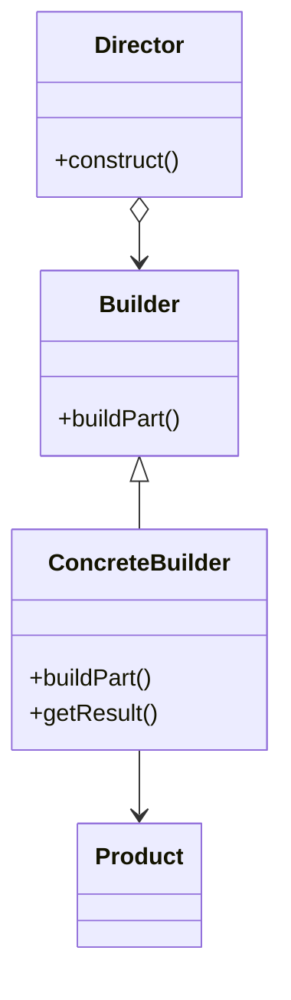
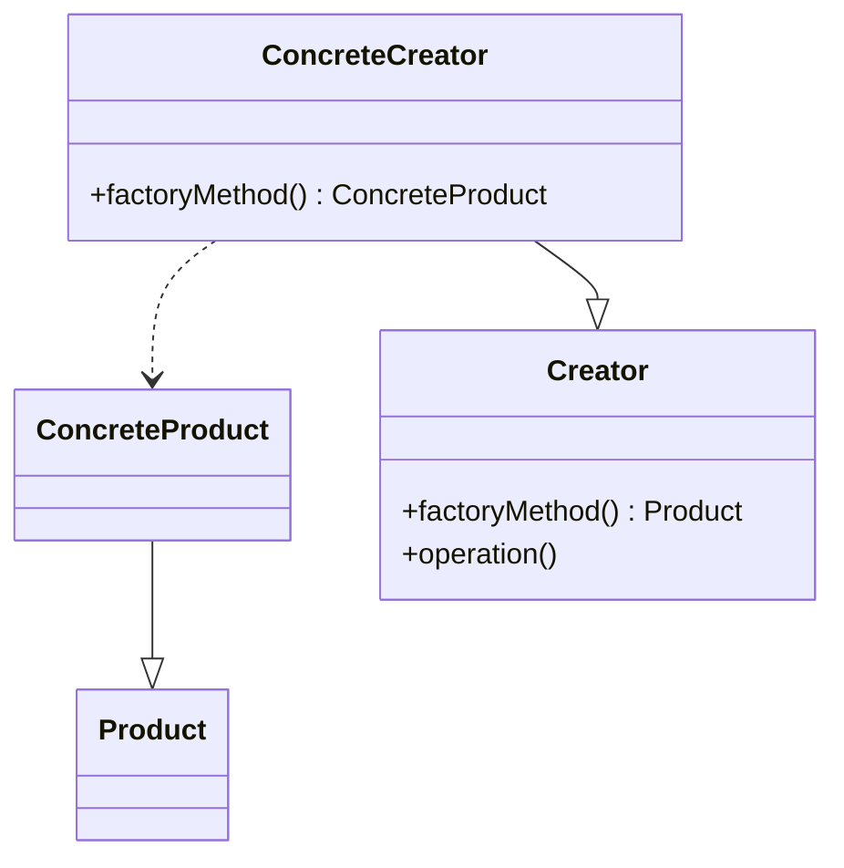
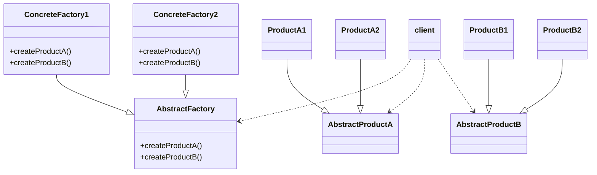
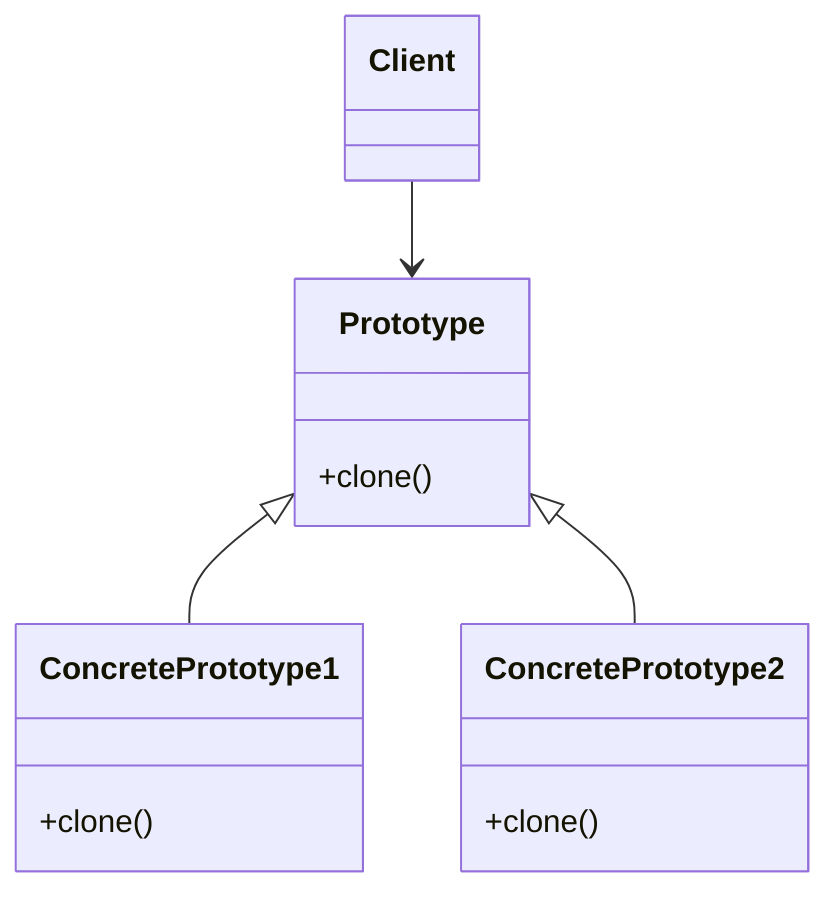

# 创建型模式

- 封装了系统使用哪些类
- 隐藏了这些类类的实例是如何创建和放在一起的

## 建造者

> 将复杂对象的构建与表示相分离，同样的构建过程可以创建不同的表示

为了应对在对象创建过程中，构造函数参数过多、参数间有依赖关系或约束条件、以及对象希望不可变等复杂场景。通过Builder模式，能够将对象的创建逻辑集中在一个单独的Builder类中，避免了构造函数参数过长、校验逻辑难以安放、以及对象处于无效状态等问题



- 可以改变一个产品内部表示
- 构造代码与表示代码分离
- 对构造进行更细粒度的控制

```java
interface Builder{
    Builder process1();
    Builder process2();
    Builder process3();
    Product build();
}
class ConcreteBuilder implements Builder{
    // 方法实现...
}
class ProductDirector{
    public Product constructProduct(Builder builder){
        builder.process1();
        builder.process2();
        builder.process3();
        return builder.build();
    }
}
// 使用
ProductDirector director = new ProductDirector();
Product product = director.constructProduct(new ConcreteBuilder());
```

## 工厂模式

- 封装变化：创建逻辑有可能变化，封装成工厂类之后，创建逻辑的变更对调用者透明。
- 代码复用：创建代码抽离到独立的工厂类之后可以复用。
- 隔离复杂性：封装复杂的创建逻辑，调用者无需了解如何创建对象。
- 控制复杂度：将创建代码抽离出来，让原本的函数或类职责更单一，代码更简洁。

### 简单工厂

客户无需知道具体产品的名称，只需要知道产品类所对应的参数即可

```java
class Factory{
    public Product get(int condition){
        switch(condition){
            case 1:
                return new Product1();
            case 2:
                return new Product2();
        }
        return null;
    }
}
```

但是工厂的职责过重，而且当类型过多时不利于系统的扩展维护

### 工厂方法

> 定义一个接口，让子类创建该接口的实例，也就是将实例化延迟到工厂的子类



- 工厂方法模式适合于构造同属于同一个类别的不同产品，所有的产品属于同一个系列中

模板方式和工厂模式的核心思想非常类似， 都是把一些操作留给子类去实现。模板方法经常使用工厂方法作为其算法的一部分

```java
abstract class AbstractCreator{
    abstract Product get();

    public void doSomething(){
        // do something
        Product product = get();
        // do something
    }
}
class Creator1 extends AbstractCreator{
    Product get(){...}
}
class Creator2 extends AbstractCreator{
    Product get(){...}
}
// 使用
Factory factory = new Creator2();
Product product = factory.doSomething();
```

### 抽象工厂

> 提供一个创建一系列相关或相互依赖对象的接口，而无需指定具体类



- 分离了具体的类
- 使得产品改变变得容易
- 利于维护产品的一致性
- **扩展产品种类困难**

```java
abstract class Factory{
    abstract Product get(int condition);
}
class ProductAFactory extends Factory{
    ProductA get(int condition){...}
}
class ProductBFactory extends Factory{
    ProductB get(int condition){...}
}
// 使用
Factory factory = new ProductAFactory();
Product product = factory.get(condition);
```

在实践中，每个工厂一般都会是单例。工厂内部可使用原型模式来实现

## 原型

>通过一个原型对象创建新的对象

为了应对创建成本较高的对象，尤其是当同类对象之间差异不大时。原型模式通过复制（或拷贝）现有对象来创建新对象，从而节省时间和资源



- 可以在运行时刻动态改变产品种类
- 改变值或结构就能获得新对象
- 动态配置

```java
class Product {
    Part1 part1;

    @Override
    protected Object clone() throws CloneNotSupportedException {
        Product product = (Product) super.clone();
        product.part1 = (Part1)part1.clone();
        return product;
    }
}
```

## 单例

>一个类仅有一个实例，并只拥有一个全局访问点

问题：谁来销毁单例对象？什么时候销毁？

- 单例模式适用于生命周期很长的对象 一般不会显式销毁
- 使用SingletonDestroyer在程序关闭时进行销毁
    - 对于相互依赖的单例对象 需要注意顺序

### 饿汉式

- 类初始化时,会立即加载该对象，线程天生安全,调用效率高

```java
public class Singleton {
    private static final Singleton SINGLETON = new Singleton();
    private Singleton() { }
    
    public static Singleton getInstance(){
        return SINGLETON;
    }
}
```

### 懒汉式

- 类初始化时,不会初始化该对象,真正需要使用的时候才会创建该对象,具备懒加载功能

```java
public class Singleton {
    private static Singleton SINGLETON ;
    private Singleton() { }

    // 线程不安全
    public static Singleton getInstance(){
        if (SINGLETON == null){
            SINGLETON = new Singleton();
        }
        return SINGLETON;
    }
}
```

### 静态内部类方式

- 结合了懒汉式和饿汉式各自的优点，真正需要对象的时候才会加载，加载类是线程安全的

```java
public class Singleton {
    
    private Singleton() { }

    private static class SingletonClass{
        public static final Singleton SINGLETON = new Singleton();
    }
    
    public static Singleton getInstance(){
        return SingletonClass.SINGLETON;
    }
}
```

### 枚举单例

- 使用枚举实现单例模式 优点:实现简单、调用效率高，枚举本身就是单例，由jvm从根本上提供保障!避免通过反射和反序列化的漏洞， 缺点没有延迟加载

```java
public class Singleton {

    private Singleton() { }

    private enum  SingletonEnum{
        INSTANCE;
        private Singleton singleton;

        SingletonEnum() {
            singleton = new Singleton();
        }

        public Singleton getSingleton() {
            return singleton;
        }
    }

    public static Singleton getInstance(){
        return SingletonEnum.INSTANCE.getSingleton();
    }
}
```

### 双重检测加锁

```java
public class Singleton {

    private static volatile Singleton SINGLETON; // 如果没有volatile JVM的指令重排序很有可能导致实例化多个对象

    private Singleton() { }

    public static Singleton getInstance(){
        if (SINGLETON == null){
            synchronized (Singleton.class){
                if (SINGLETON == null){
                    SINGLETON = new Singleton();
                }
            }
        }
        return SINGLETON;
    }
}
```


```java
// SINGLETON = new Singleton() 可以分解为以下三个步骤
1 memory=allocate();// 分配内存 相当于c的malloc
2 ctorInstanc(memory) //初始化对象
3 s=memory //设置s指向刚分配的地址

// 上述三个步骤可能会被重排序为 1-3-2，也就是：
1 memory=allocate();// 分配内存 相当于c的malloc
3 s=memory //设置s指向刚分配的地址
2 ctorInstanc(memory) //初始化对象
```

### 单例的问题

1. 对 OOP 特性的支持不友好：单例模式对面向对象编程（OOP）的抽象、继承和多态特性支持不足。它违背了“基于接口而非实现”的设计原则，导致代码在需求变化时需要大范围修改，并且单例类的继承和多态实现也会使代码的可读性和扩展性降低。
2. 隐藏类之间的依赖关系：单例模式直接调用类方法，而不需要通过构造函数或参数传递依赖关系。这种隐式依赖使得代码难以阅读和理解，尤其在代码复杂时，难以清晰地识别类与类之间的依赖关系。
3. 对代码的扩展性不友好：单例模式只允许一个实例对象，当系统需求变化需要多个实例时，单例模式难以适应，可能导致大范围的代码修改
4. 对代码的可测试性不友好：单例模式的硬编码方式难以进行依赖注入或替换，导致代码难以进行单元测试。同时，单例类如果持有可变全局变量，还会导致测试用例之间的相互影响。
5. 不支持有参数的构造函数：单例模式通常不支持传递参数来创建实例，限制了其灵活性。虽然可以通过 init() 方法或其他方式来绕过这一限制，但这些方法可能引发新的问题，如参数无效而未提示用户的问题
