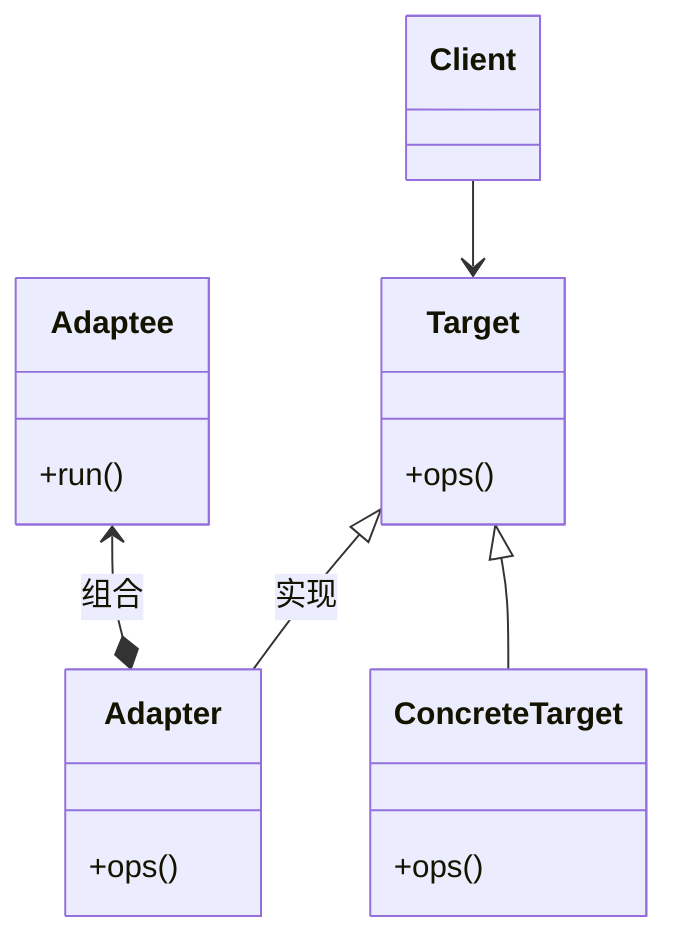
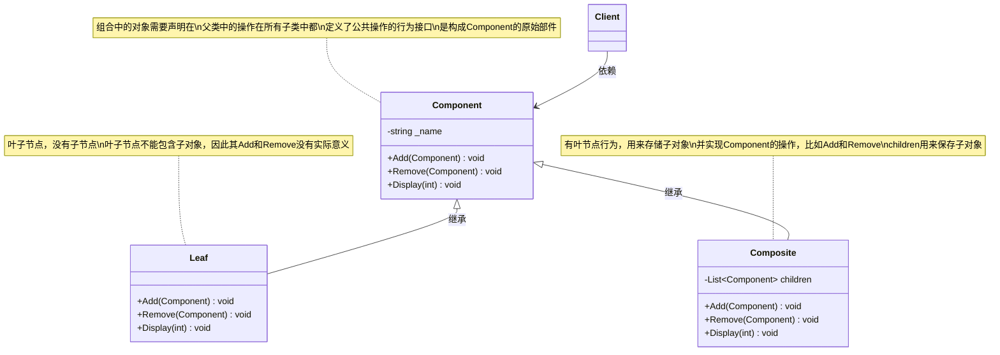
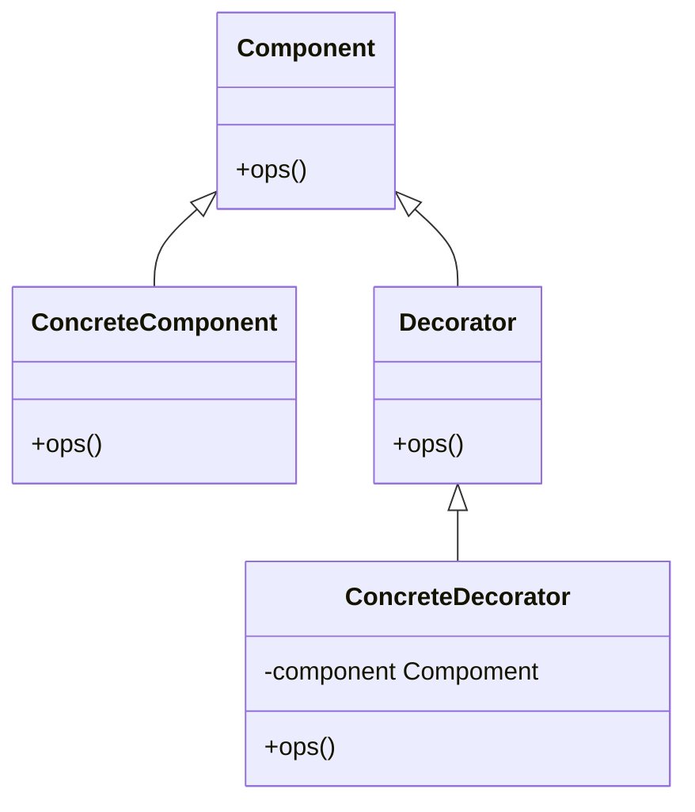
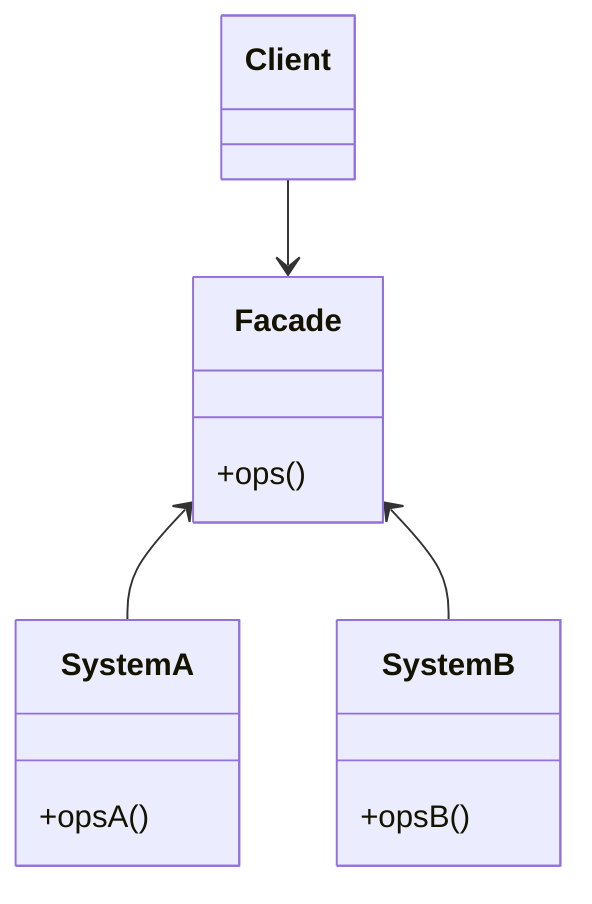
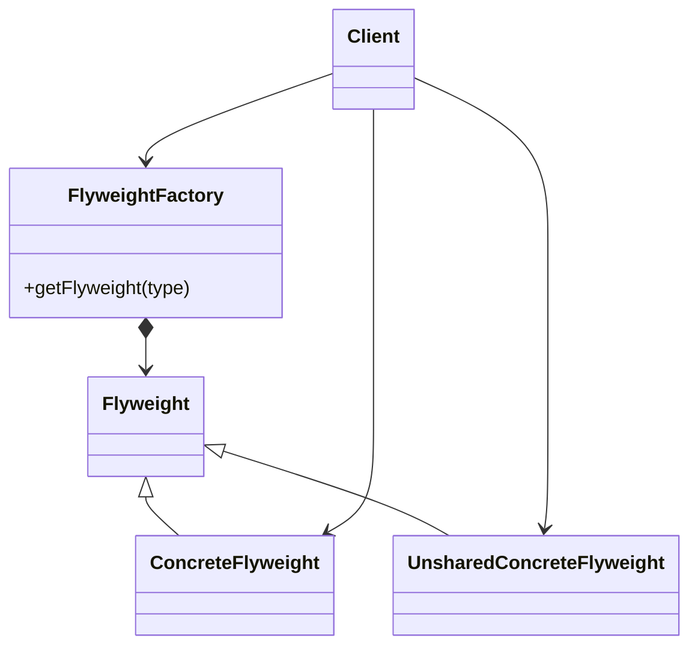
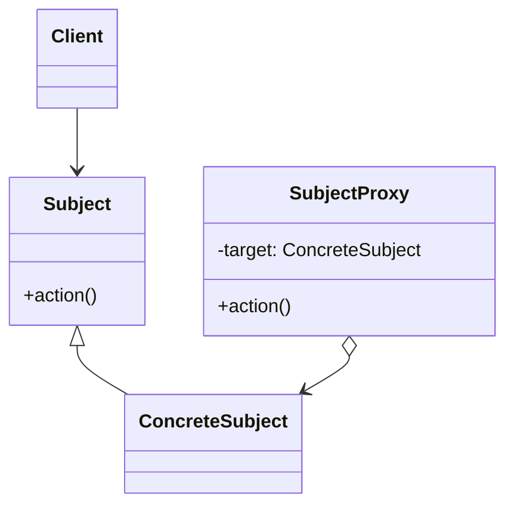
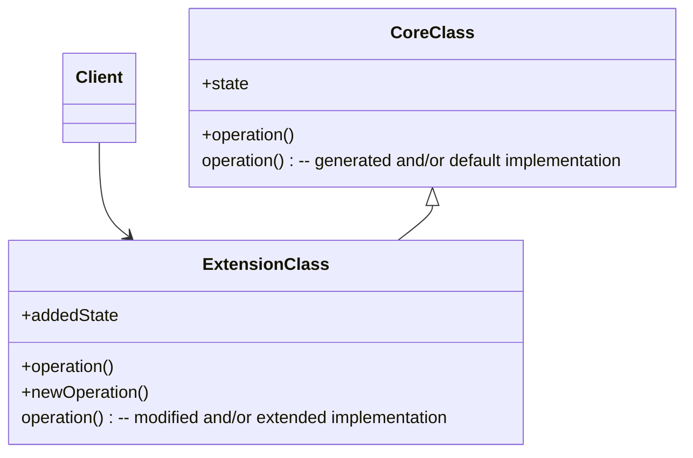

# 结构型模式

- 如何组合类和对象以获得更大的结构

## 适配器

> 将一个接口转换成另一个接口，通过使用适配器模式，不兼容的类可以一起工作

1. 解决接口不兼容问题：当现有的类接口与预期接口不匹配时，适配器模式可以通过转换接口，解决不兼容问题，让不同接口的类能够协同工作。
2. 提高代码复用性：适配器模式通过封装现有类的接口，使其符合预期接口，从而避免了对现有代码的修改和重写，大大提高了代码的复用性。
3. 系统扩展性：通过适配器模式，可以在不修改已有代码的情况下扩展系统功能，增强系统的灵活性



- 双向适配器

```java
interface Target{
    void ops();
}

class Adaptee{
    public void run() { }
}

class Adapter implements Target{
    private Adaptee adaptee;
    public Adapter(Adaptee adaptee) {
        this.adaptee = adaptee;
    }

    @Override
    public void ops() {
        // do something
        adaptee.run();
    }
}
// 使用
Target target = new Adapter(new Adaptee());
target.ops();
```

分类：

- 类适配器：适配器类继承自一个已有的类（即要适配的类），并实现一个目标接口（即客户端期望的接口）
- 对象适配：适配器类中持有一个对要适配对象的引用，通过组合的方式将不兼容的接口转换为兼容的接口。适配器类实现了目标接口，并在内部通过调用适配对象的方法来完成所需的功能
- 接口适配方式

## 桥接

> 将抽象部分与实现部分分离,使它们都可以独立地变化

1. 解决多维度变化的问题：当一个类存在多个独立变化的维度时，直接使用继承会导致类的数量呈指数级增长。例如，如果一个图形类既需要支持不同的形状（如圆形、方形）又需要支持不同的颜色（如红色、蓝色），使用继承会导致类的组合数量急剧增加。
2. 提高系统的灵活性和可维护性：通过桥接模式，抽象部分和实现部分可以独立演化，减少了它们之间的耦合。这使得系统更易于扩展和维护，因为修改一个部分不会直接影响到另一个部分。
3. 支持动态变化：桥接模式通过组合关系替代继承关系，使得在运行时可以动态地改变实现部分，而不需要修改抽象部分的代码。这为系统带来了更大的灵活性

```java
abstract class Window {
    //...
    abstract setMenu(Menu menu)
}
interface Menu{}

class LinuxWindow extends Window{...}
class MacWindow extends Window{...}

class PlainMenu implements Menu{...}
class RichMenu implements Menu{...}
```

## 组合

>将对象组合成树形结构的部分-整体层次结构，使得客户使用单个对象或组合对象都有一致性



```java
interface Route {
    Route segement1, segement2;
} // 路线
class NationalHighway implements Route{} // 国道
class CountryRoad implements Route {} // 乡道
```

组合模式很重要的一点就是客户端使用所有节点的方式都相同，同时这些节点内部又以组合的方式组合其他节点。组合模式特别适合那些能够用树形结构表示的数据，例如文件系统、组织架构等

## 装饰器

> 给一个对象添加额外的职责

为了应对继承关系过于复杂的问题。通过装饰器模式，可以通过组合替代继承，从而简化代码结构，并为原始类添加增强功能。如果仅使用继承的方式来扩展功能，可能会导致类的数量爆炸，继承层次变得复杂且难以维护



装饰器与被装饰的对象都拥有同一个接口，所以说，装饰器对客户来说是透明的

```java
abstract class InputStream{...}
class FileInputStream extends InpurStream{...}
```

## 外观

> 为子系统中的一组接口提供一个统一的高层接口，使子系统更容易使用




```java
class Facade{
    private SubSystem1 subSystem1;
    private SubSystem2 subSystem2;

    void ops(){
        subSystem1.ops1();
        subSystem2.ops2();
    }
}
// 使用
Facade facade = new Facade();
facade.ops();
```

外观模式解决的是接口易用性问题，通过封装减少使用者需要了解的信息

## 享元

> 共享系统中大量的细粒度对象

- 提高性能



- FlyweightFactory：主要是用来确保合理地共享Flyweight,当用户请求一个Flyweight时，FlyweightFactory 会返回一个已有或者创建享元对象
- UnsharedConcreteFlyweight：不需要共享的Flyweight子类。因为Flyweight
接口共享成为可能，但它并不强制共享

```java
class MessageFactory{
    Message getHeartBeatMeessage();
}
interface Message{...}
class HeartBeatMessage implements Message{...}
```

## 代理

>为其他对象提供一个代理访问控制

代理模式的主要作用是通过引入代理类，在不改变原始类代码的情况下，为原始类添加附加功能。代理模式可以帮助将非业务功能（如监控、日志、缓存等）与核心业务逻辑解耦，简化代码维护和开发。动态代理则进一步解决了静态代理中需要为每个类单独创建代理类的问题，动态地在运行时生成代理类，大大减少了重复代码和开发成本

- 又称为委托模式



### 静态代理

- 结构简单，代码繁琐

```java
interface Subject{
    void run();
}
class Proxy implements Subject{
    private Subject realObject = new RealSubject();
    void run(){
        //before
        realObject.run();
        //after
    }
}

// 使用
Subject subject = new Proxy();
subject.run();
```

### 动态代理

- JDK动态代理

```java
SubjectImpl impl = new SubjectImpl();
Subject proxy = (Subject) Proxy.newProxyInstance(impl.getClass().getClassLoader(), 
                impl.getClass().getInterfaces(), (proxy1, method, args1) -> {
    System.out.println("pre invoke");
    return method.invoke(impl, args1);
});
proxy.request();
```

如果多个接口重名，则调用接口方法以第一个接口为主

- cglib动态代理

```java
Enhancer enhancer = new Enhancer();
Object target = new Object();
enhancer.setSuperclass(Object.class);
enhancer.setCallback((MethodInterceptor) (obj, method, args1, proxy) -> {
    System.out.println(method+" invoke");
    return method.invoke(target, args1);
});
Object o = enhancer.create();
System.out.println(o.hashCode());
```

## generation gap（生成模式）

该模式会生成代码导出行为 再通过编程来丰富程序行为 只修改或扩展一次 而可以生成代码多次 win下的GUI设计好像就这么做的



问题：

需求变化导致生成代码的变化

解决方式一是警告禁止修改 二是计算代码差异重新生成 三则是隐藏生成的代码的细节 隔离变与不变
