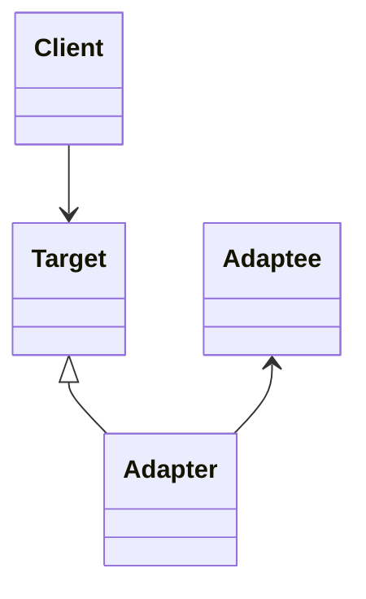
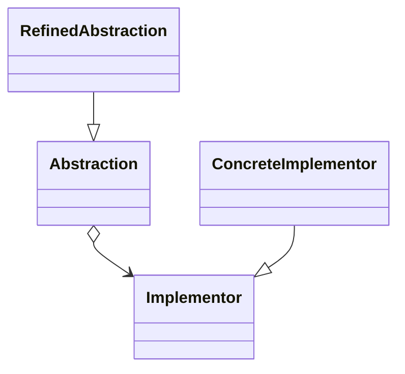
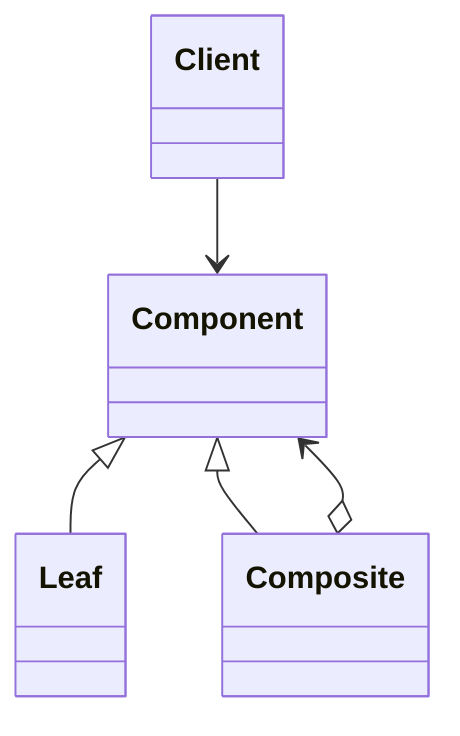
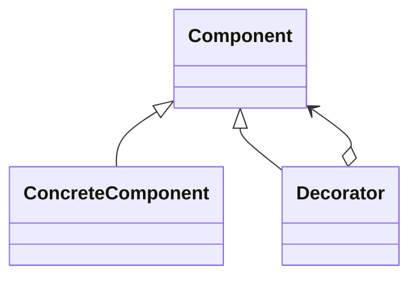
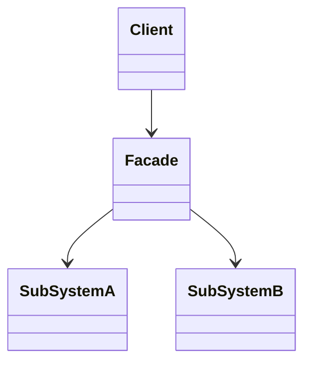
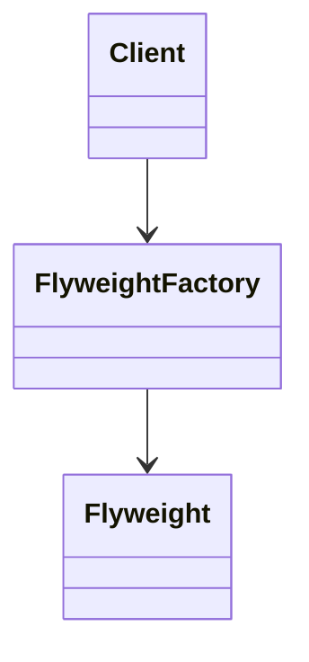
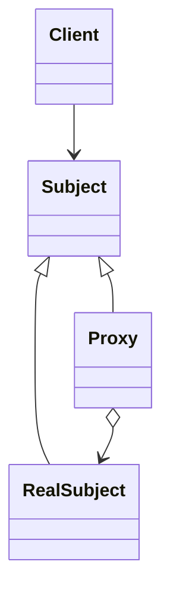

# 结构型模式

**——对象关系复杂度的结构化管理哲学**

---

## 一、结构型模式的本质（先于具体模式）

### 1. 结构型模式解决的根问题是什么？

在软件系统中，复杂性并非只来源于"逻辑"，更多来自于：

* 对象数量的增加
* 对象关系的交织
* 变化在结构中的传播

**结构型模式的核心使命只有一个：**

> **在不破坏系统稳定性的前提下，组织对象之间的关系，以控制复杂度与变化的扩散。**

---

### 2. 结构型模式的三大不变关注点（稳定知识）

| 不变关注点  | 说明                 |
| ------ | ------------------ |
| 接口一致性  | 客户是否能用"统一方式"使用不同对象 |
| 结构组合方式 | 对象如何形成更大的结构单元      |
| 间接层设计  | 是否通过中间层隔离变化与控制依赖   |

> 结构型模式不是"加功能"，
> 而是 **重新组织关系**。

---

### 3. 结构型模式的抽象分类（升维视角）

| 抽象维度    | 对应模式   |
| ------- | ------ |
| 接口转换与统一 | 适配器、外观 |
| 抽象与实现解耦 | 桥接     |
| 递归结构建模  | 组合     |
| 行为叠加    | 装饰器    |
| 间接访问与控制 | 代理、享元  |

---

## 二、适配器模式（Adapter）

### 1. 模式本质（第一性原理）

> **通过引入中间转换层，隔离接口不兼容带来的变化。**

适配器并不改变已有对象的能力，只改变**访问方式**。

---

### 2. 适配器解决的核心矛盾

* 现实系统中：

  * 新接口 ≠ 旧接口
  * 第三方代码不可修改
* 直接修改原有类：

  * 破坏稳定性
  * 增加回归风险

**适配器 = 变化的缓冲区**

---

### 3. 稳定结构模型

* Client 只依赖 Target（稳定接口）
* Adapter 吸收不兼容变化
* Adaptee 保持不变

---

### 4. 分类（本质而非语法）

| 类型    | 本质差异             |
| ----- | ---------------- |
| 类适配器  | 通过继承完成接口转换（耦合较高） |
| 对象适配器 | 通过组合完成接口转换（推荐）   |
| 接口适配  | 解决"接口过大"的适配问题    |

---

### 5. 与外观模式的根本区别

| 对比点    | 适配器   | 外观   |
| ------ | ----- | ---- |
| 目标     | 解决不兼容 | 简化使用 |
| 是否改变接口 | 是     | 否    |
| 使用动机   | 被动    | 主动   |

---

## 三、桥接模式（Bridge）

### 1. 模式本质

> **将"抽象维度"与"实现维度"解耦，使它们可以独立演化。**

桥接模式不是为了解耦类，
而是为了解耦 **变化的维度**。

---

### 2. 根问题：多维度变化导致的继承爆炸

当一个类同时沿多个维度变化时：

* 继承 = 维度乘法
* 类数量指数增长
* 系统不可维护

---

### 3. 稳定结构模型

* 抽象只依赖接口
* 实现可以自由替换
* 变化被隔离在各自维度中

---

### 4. 与策略模式的边界

| 对比点  | 桥接     | 策略    |
| ---- | ------ | ----- |
| 关注点  | 结构维度解耦 | 行为选择  |
| 生命周期 | 长期结构设计 | 运行期决策 |

---

## 四、组合模式（Composite）

### 1. 模式本质

> **通过递归一致性，使单个对象与对象组合对客户端透明。**

组合模式解决的不是"树"，
而是 **一致性问题**。

---

### 2. 三个不可动摇的原理

1. 统一接口（Leaf 与 Composite 等价）
2. 递归结构（组合中包含组合）
3. 客户端透明性（Client 无需区分节点类型）

---

### 3. 稳定结构模型

---

### 4. 适用场景的抽象表达

* 文件系统
* UI 组件树
* 组织结构
* 路由 / 流程编排

---

## 五、装饰器模式（Decorator）

### 1. 模式本质

> **在不改变对象接口与语义的前提下，叠加对象能力。**

装饰器不是"代理"，
而是 **能力增强机制**。

---

### 2. 为什么不用继承？

* 继承：

  * 静态
  * 类爆炸
* 装饰器：

  * 动态组合
  * 按需叠加

---

### 3. 稳定结构模型

---

### 4. 与代理模式的分界线

| 对比点    | 装饰器  | 代理    |
| ------ | ---- | ----- |
| 目的     | 增强能力 | 控制访问  |
| 是否改变语义 | 否    | 否     |
| 关注点    | 功能叠加 | 权限/治理 |

---

## 六、外观模式（Facade）

### 1. 模式本质

> **为复杂子系统提供一个认知友好的统一入口。**

外观模式解决的是：
**"系统可用性"而非"系统能力"**。

---

### 2. 稳定结构模型

---

### 3. 设计哲学

* 子系统可以复杂
* 对外接口必须简单
* 降低认知成本

---

## 七、享元模式（Flyweight）

### 1. 模式本质

> **通过分离可共享状态与不可共享状态，降低对象数量成本。**

---

### 2. 核心思想

* 内部状态：可共享、不变
* 外部状态：不可共享、由客户端维护

---

### 3. 稳定结构模型

---

## 八、代理模式（Proxy）

### 1. 模式本质

> **通过引入间接层，控制对象的访问方式与访问时机。**

---

### 2. 代理关注的不是"功能"，而是"治理"

* 权限控制
* 延迟加载
* 日志监控
* 远程访问

---

### 3. 稳定结构模型

---

## 九、Generation Gap（生成-扩展隔离模式）

### 1. 正确定位（非 GoF 正统结构型模式）

> 这是一个 **工程演进与代码生成隔离模式**，
> 而非经典结构型模式。

---

### 2. 模式本质

> **通过继承层次隔离"生成代码"与"手写代码"的变化。**

---

### 3. 核心矛盾与解决思路

| 问题      | 应对策略   |
| ------- | ------ |
| 生成代码被修改 | 禁止修改   |
| 需求变化    | 差异计算   |
| 频繁再生成   | 隐藏生成细节 |

---

## 十、结构型模式的决策矩阵（工程视角）

| 模式  | 解决核心问题 | 是否改变接口 | 是否增强能力 |
| --- | ------ | ------ | ------ |
| 适配器 | 接口不兼容  | 是      | 否      |
| 外观  | 使用复杂   | 否      | 否      |
| 桥接  | 多维变化   | 否      | 否      |
| 组合  | 结构一致性  | 否      | 否      |
| 装饰器 | 能力扩展   | 否      | 是      |
| 代理  | 访问控制   | 否      | 可选     |
| 享元  | 性能/内存  | 否      | 否      |

## 关联内容（自动生成）

- [/软件工程/设计模式/设计模式.md](/软件工程/设计模式/设计模式.md) 设计模式体系的总体介绍，与结构型模式共同构成设计模式的完整理论框架
- [/软件工程/设计模式/创建型模式.md](/软件工程/设计模式/创建型模式.md) 与结构型模式并列的设计模式分类，创建型模式关注对象创建，结构型模式关注类和对象的组合
- [/软件工程/设计模式/行为模式.md](/软件工程/设计模式/行为模式.md) 设计模式的第三大类，与结构型模式共同构成完整的GoF设计模式体系
- [/软件工程/架构模式/对象关系模式.md](/软件工程/架构模式/对象关系模式.md) 深入探讨对象间关系的模式，与结构型模式中的组合、代理等模式有密切关联
- [/软件工程/架构/系统设计/缓存.md](/软件工程/架构/系统设计/缓存.md) 缓存系统的设计与实现体现了多种设计模式的应用，如适配器模式等
- [/软件工程/架构/系统设计/网关.md](/软件工程/架构/系统设计/网关.md) 网关作为协议与能力的组合与编排层，体现了多种结构型模式的应用
- [/软件工程/微服务/ServiceMesh/ServiceMesh.md](/软件工程/微服务/ServiceMesh/ServiceMesh.md) Service Mesh中的Sidecar代理模式是代理模式在微服务架构中的具体应用
- [/软件工程/架构模式/分层架构.md](/软件工程/架构模式/分层架构.md) 分层架构中的端口-适配器模式与结构型模式中的适配器模式密切相关
- [/计算机网络/网络安全/安全架构.md](/计算机网络/网络安全/安全架构.md) 安全架构中应用了多种设计模式，包括适配器模式以支持多种认证方式
- [/编程语言/编程范式/面向对象.md](/编程语言/编程范式/面向对象.md) 面向对象设计原则与设计模式密切相关，特别是组合优于继承的原则