# 行为模式

- 主要涉及到算法和对象之间的职责分配

## 责任链

> 使多个对象都有机会处理请求，避免发送者与接受者之间的耦合

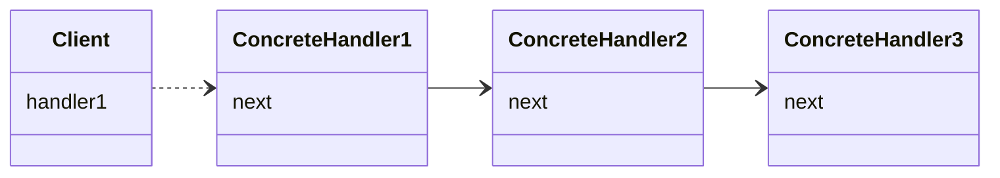

- 拥有动态添加职责的灵活性
- **不保证被接受**

```java
public interface Filter {

    void doFilter(ServletRequest var1, ServletResponse var2, FilterChain var3) throws IOException, ServletException;
}
public class LoggingFilter implements Filter {
    @Override
    public void doFilter(ServletRequest servletRequest, ServletResponse servletResponse, FilterChain filterChain) throws IOException, ServletException {
        //...
    }
}
```

在GOF的书中描述的责任链每个节点都有一个后继节点，前驱节点可根据特定的逻辑来将请求传递到后继节点来进行处理，代表着一种责任的转移。

另外一种责任链的变体模式：

1. 引入一个责任链实体，即责任链节点编排器：

```java
public class Chain {
    void process(){
        for(var chainNode : chain) {
            if (!chainNode.process()) {
                break;
            }
        }
    }
}
```

2. 责任链节点可通过传回一个布尔值或者抛出异常来终止整个流程。

这种方式的问题在于无法实现类似于Web Filter的对Response的过滤处理。上述的Filter可以在后继Filter处理完毕后回来处理后继Filter处理过的Response，而通过引入一个第三方编排校色的方式则无法实现。

## 命令

> 将请求封装为对象

该模式解耦了调用请求的对象与知道如何处理该请求的对象

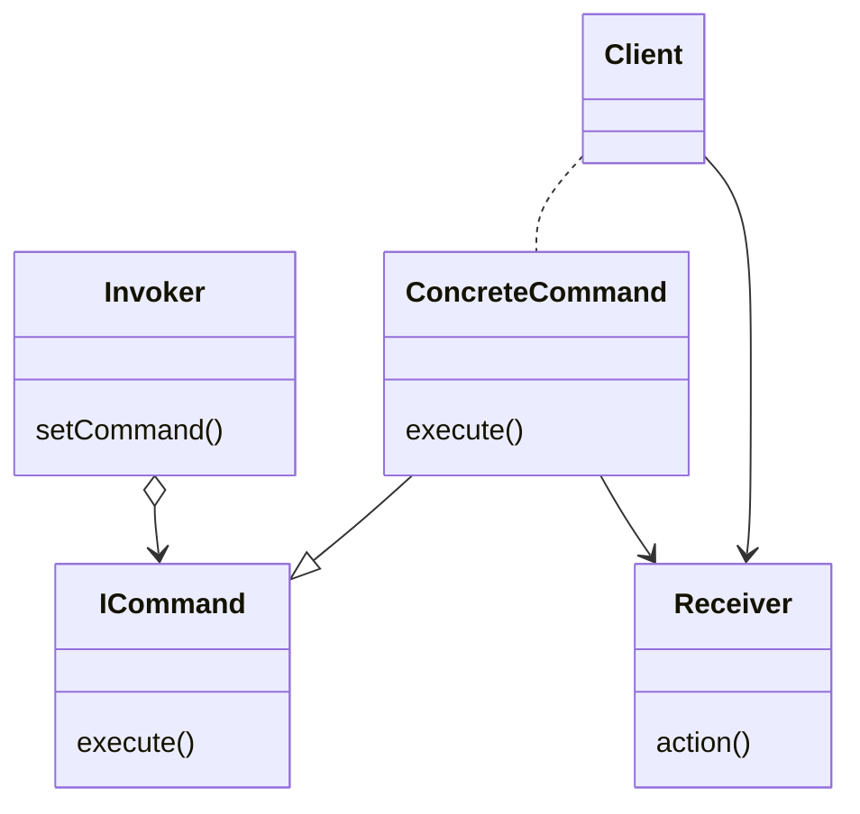

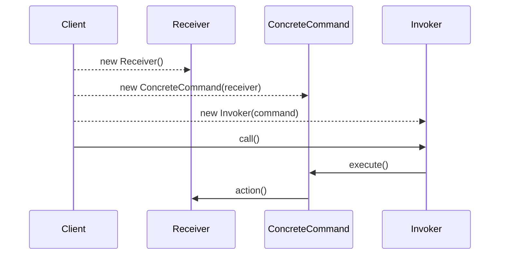

```java
interface Command {
    void execute();
}
class ConcreteCommand1 implements Command {
    Reveiver reveiver;
    void execute() {
        reveiver.action(); // do something
    }
}
class ConcreteCommand2 implements Command {...}

class Invoker {
    void invoke(){
        Command command;
        command.execute();
    }
}
```

在该模式的实现中，一个很重要的一点是可以考虑在Invoker记录该命令的操作历史，定义另外一个接口unexecute 来实现对命令撤销。

## 解释器

> 定义一个文法，定义一个解释器，解释器解释执行做一些操作

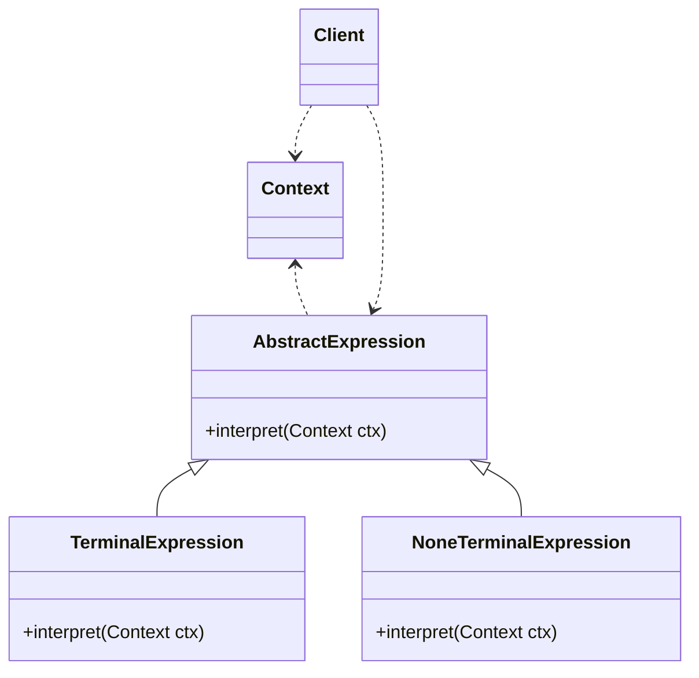

- AbstractExpression：声明了抽象的解释操作
- Context：它用于存储解释器之外的一些全局信息

## 迭代器

> 提供一种顺序访问对象中的各个元素，并不暴露内部表示

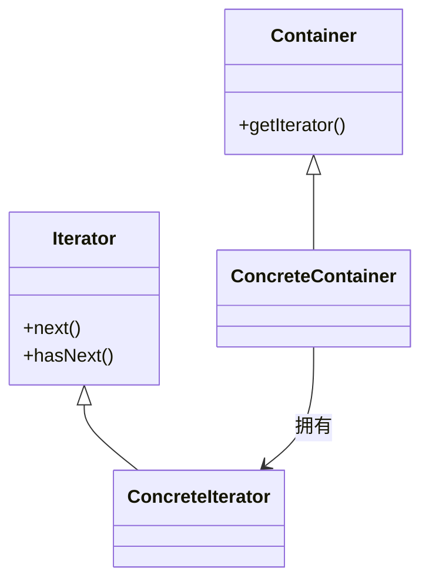

- 外部迭代与内部迭代的区别在于是由客户控制还是迭代器控制迭代

```java
interface Iterator{
    hasNext();
    next();
}
class ArrayListItr implements Iterator{...}
```

## 中介者

> 用一个中介对象封装一系列对象之间的交互

- 与外观模式不同之处在于中介模式的交互是双向的，而外观模式只是从外观对象到子系统之间的单向协议

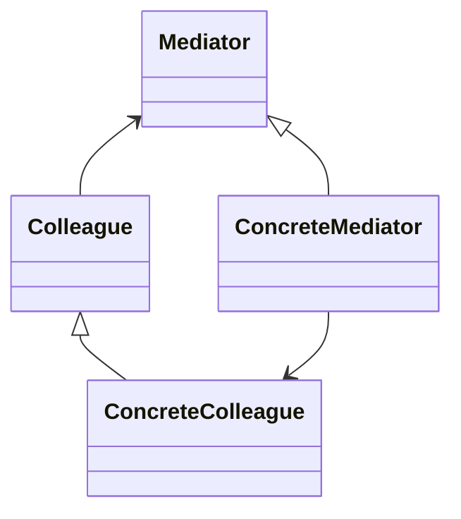
- Mediator：定义了中介者与具体同事的接口
- ConcreteColleague：只知道自己的行为跟中介者的存在，不知道其他同事的具体行为
- ConcreteMediator：需要知道具体的同事，并与具体的同事交互

## 备忘录

> 不破坏封装性的情况下，保存一个对象的内部状态

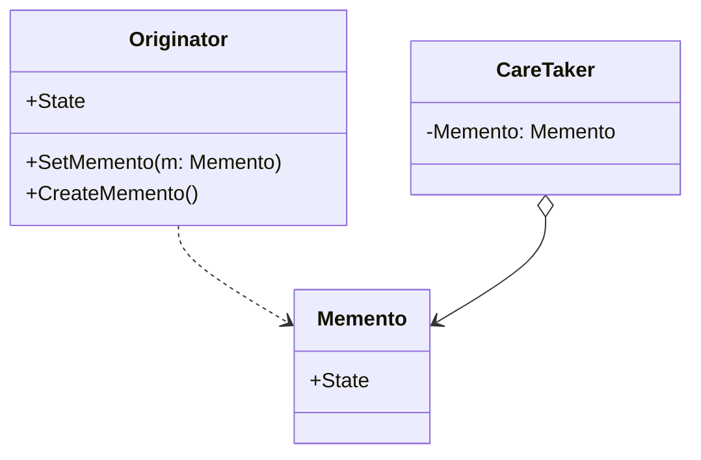

- Memento：负责存储 Originator 对象的内部状态，并可防止除了 Originator 之外的对象访问备忘录 Memento
- Originator：负责创建一个备忘录 Memento，用以记录它当前的内部状态，并可使用备忘录恢复内部状态
- CareTaker：负责保存备忘录

## 观察者

>定义对象间一对多的依赖关系，依赖它的对象都会得到通知并自动更新

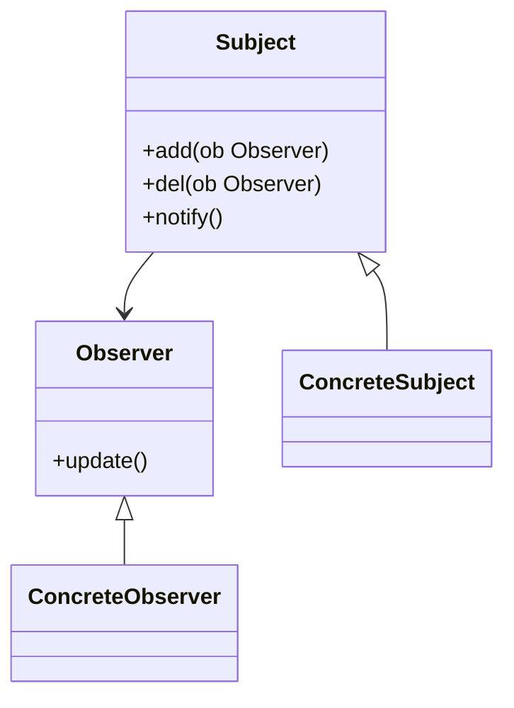

- 具体目标与具体观察者之间是抽象耦合
- 广播通信
- 推模型与拉模型

```java
abstract class Subject{
    add(Observer ob);
    del(Observer ob);
    notify();
}
interface Observer{
    update();
}
class ConcreteSubject{
    notify(){
        obServerlist.forEachNotify();
    }
}
class ConcreteObserver implements Observer{
    ...
}
```

## 状态

> 允许一个对象在其内部状态改变时改变它的行为

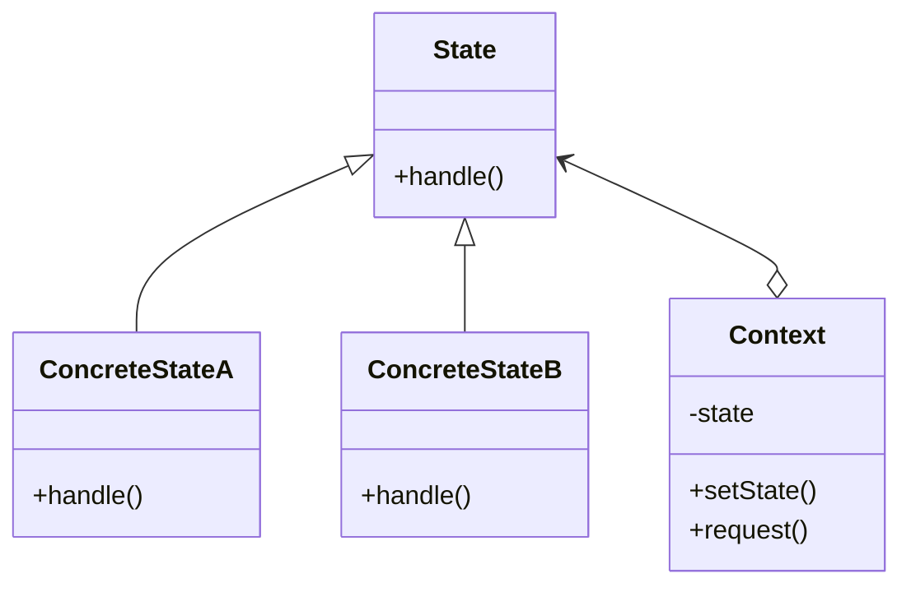

- 对象就是一个状态机，当从一个状态转移到另外一个状态，其行为就会发生改变

```java
class LoginContext{
    private UserState state;
    login(){
        state.login()
    }
}
interface UserState{
    login();
}
class UserNormalState{
    login(){
        if (loginFailCount == 5){
            context.state = new UserBannedState();
        }
        print "login success";
    }
}
class UserBannedState{
    login(){
        print "you are banned";
    }
}
```

## 策略模式

> 封装一系列算法，以使它们可以互相替换

- 策略模式与状态模式之间的区别在于状态模式的各个状态之间是有联系的

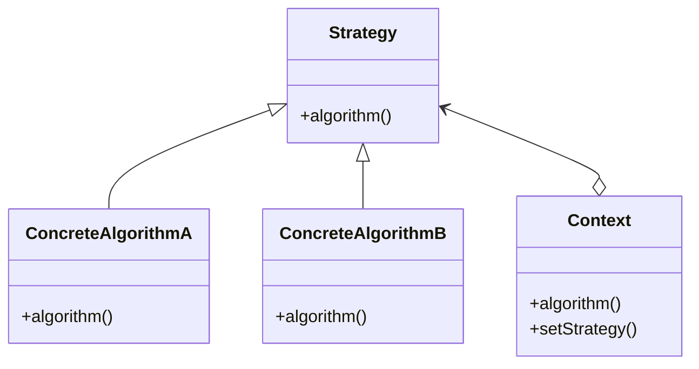

```java
interface Strategy{
    void execute(..);
}

class Context {
    private Strategy strategy;

    public Context(Strategy strategy) {
        this.strategy = strategy;
    }
    
    void execute(){
        strategy.execute(..);
    }
}

class StrategyA implements Strategy{
    // 具体实现
}
// 使用
Context context = new Context(new StrategyA());
context.execute();
```

策略模式要求客户代码必须了解不同策略模式的差异，也就是客户必须针对具体实现进行编码。

另外一个要考虑的是不同策略所需要的参数不同，虽然可以一股脑将全部参数传递给具体策略，但为了降低性能开销，某些策略并不需要用到那么多参数，此时可以传递一个Context的引用给具体策略，让具体策略按需索取，但这种方式则对Context接口的粒度做了过细的要求。

**组合模式 + 策略模式**

可以通过组合多个策略得到一个新的策略：

```java
class CompositeStrategy implements Strategy{
    void execute(){
        StrategyA...
        StrategyB...
    }
}
```

## 模板方法

> 在父类当中定以算法骨架，将一些步骤延迟到子类当中实现

实现一些操作时，整体步骤很固定，但是呢。就是其中一小部分容易变，这时候可以使用模板方法模式，将容易变的部分抽象出来，供子类实现

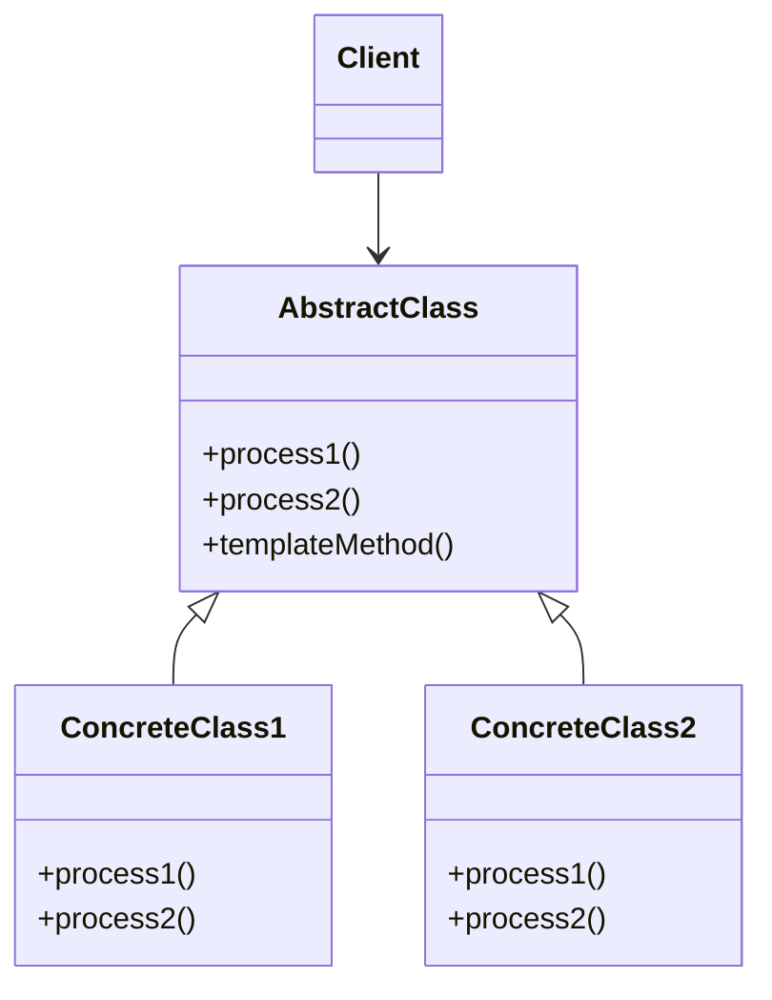

- 钩子操作

```java
abstract class BaseAlgorithm{
    void process(){
        process1();
        process2();
    }
    abstract void process1();
    abstract void process2();
}
class ConcreteAlgorithm extends BaseAlgorithm{
    // 实现方法
}
// 使用
BaseAlgorithm algorithm = new ConcreteAlgorithm();
algorithm.process();
```

## 访问者

> 表示一个作用于对象结构中的各元素的操作

识图避免新功能的引入造成接口的修改

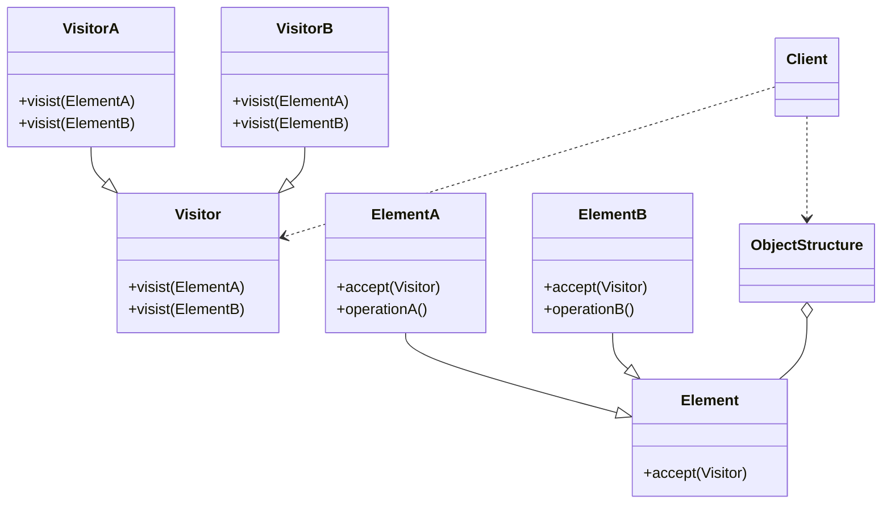

```java
class Visitor {
    visit(ElementA);
    visit(ElementB);
}
class VisitorA extends Visitor {
    visit(ElementA){...}
    visit(ElementB){...}
}
class VisitorB extends Visitor {
    visit(ElementA){...}
    visit(ElementB){...}
}
class Element{
    accept(Vistor);
}
class ElementA extends Element {
    accept(Vistor) {
        Visitor.visit(this)
    }
}
...
```

访问者设计模式提出的根本原因是为了在不修改类的前提下 增加类的行为。

在这里，当需要增加新的行为时，就将新增一个具体的Vistor 然后传递给响应的Element。

该模式适合在对象数据结构稳定，不会变更且经常需要定义新操作的场景下使用。
