# 质量工程

符合需求即质量

预防产生质量 检验不能产生质量

质量是相对的，不能脱离具体的人谈软件质量

## 为什么要

- 快速变化的世界
- 愈发复杂的软件
- 团队扩大 成员流动快

## 做什么

- 高质量架构 小步快跑 全链路持续交付
- 全方面质量管理 故障管理
- 质量规范 流程
- 知识沉淀与传承

## 质量思维

### 高可用性

- 在SLA预设下考虑系统的建设

### 架构师立场

架构师决定着架构的基因

#### 质量经济学

- 要与不要 是个问题
  - 新增功能可以带来收益吗
- 成本与收益

#### 质量满意度

- 客户与老板的满意

#### 适用的架构

### 正负反馈

反馈环中的因果循环，有的破坏是不可逆的（方向问题）

小步试错，积极调整 建立小正循环，推动正反馈

项目新增输入导致熵增，需要加以控制，控制住熵的增长，为控制系统性偏差，要建立起反馈的可能性，通过细微的、及时的反馈来达到控制的目的

架构师需要基于当前的信息做出决策，并将决策得到的结果作为前一步的信息继续做出决策，每次的调整都是为了修正熵回到正常状态

### 止损

- 理清现状
- 盘点数据
- 价值分析

#### 派别

- 保守治疗
- 刮骨疗伤

#### 断臂求生

#### 告别

## 度量体系

- 用数据证明质量的进步

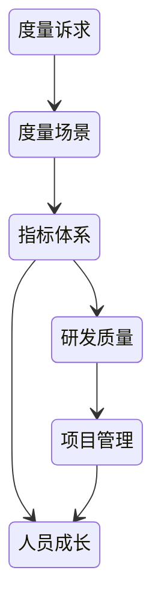

### 需求管理

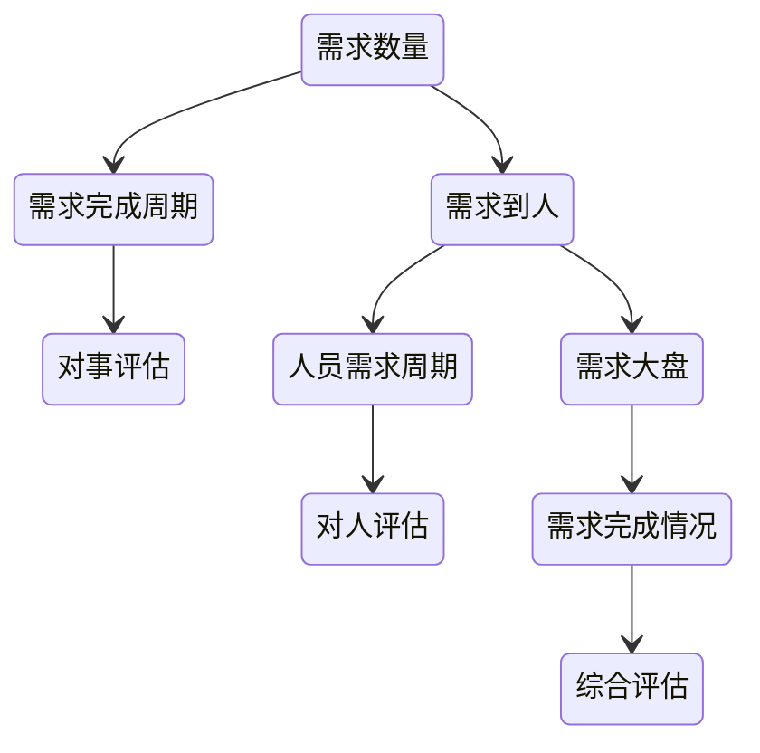

#### 需求的全生命周期

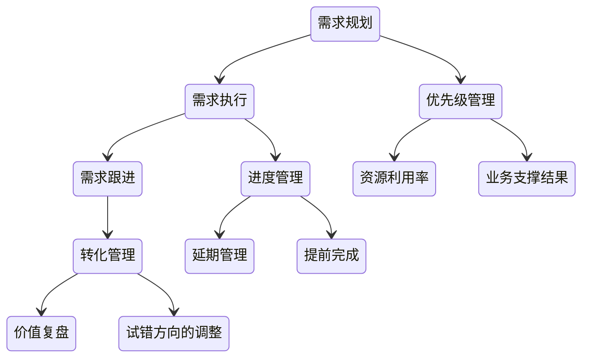

#### 需求复盘

合理性：

- 设计合理性
- 资源消耗合理性
- 优先级合理性

完成度：

- 整体完成度
- 完成周期、延期情况
- 需求是否偏差

价值：

- 带来的效果
- 实际产生的价值
- 投入产出比

#### 问题治理

需求质量：设立准入门槛

实现质量：专项治理

流程问题：改进流程

人的问题：定向培养

### 缺陷管理

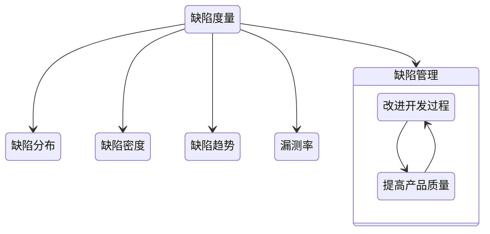

缺陷分布：各类缺陷数目

缺陷密度：已知缺陷数量/产品规模 千行代码缺陷率

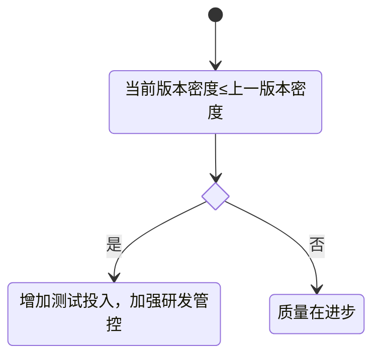

缺陷趋势：各种状态缺陷的数量

漏测率：非QA测试缺陷数/QA发现的缺陷数

#### 缺陷状态

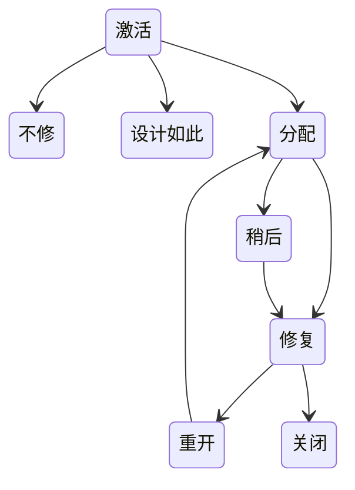

### 代码跟踪

人：提交人、评审人

量：提交量、注释量

质量：复杂度、不合规范数、单测覆盖率

### 发布跟踪

#### 发布度量

发布次数、发布成功率、回滚次数、灰度接入率、灰度回滚次数、紧急发布次数、非发布变更次数

可以反馈出因研发质量不足而导致的异常流程数

#### 准入度量

接入率、卡点阻塞数、跳过数

限制风险因素发布到生产

## 持续交付

- 尽早发现问题解决问题

单测是第一道防线

快速（自动化）、迭代（版本控制）、持续（[DevOps](/软件工程/DevOps.md)）

构建自动化、测试自动化、流程编排、持续继承、部署自动化

### 版本控制

需求任务关联、版本开发规范、语义化版本

开发代码版本：多人多版本

持续交付版本：存于仓库的唯一版本

线上版本

二方版本：提供给其他依赖方的版本

多版本开发：

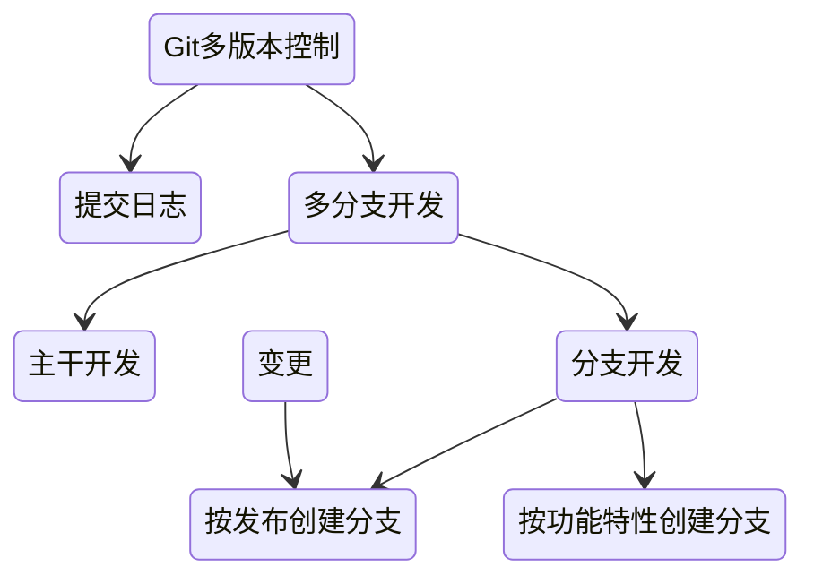

### 需求周期

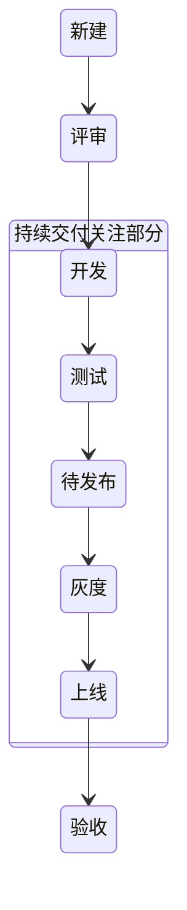

为了缩短交付周期，可以使用流水线，一个需求完了之后就可以丢到交付流水线

交付过程的单一迭代时间、交付的质量、流程的科学性及需求本身的质量都会影响需求能不能快速进入开发状态

### 交付质量

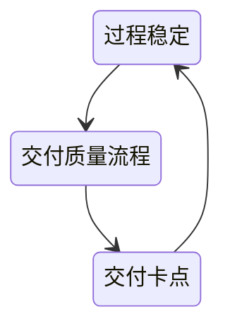

#### 质量红线

偏离：

- 实现偏离
- 验收不重复

故障：

- 代码问题
- 数据问题
- 配置问题
- 环境问题

### 开发模式

#### 主干开发模式

基于主干开发，基于分支发布，使用功能开关来保证功能切换

#### gitlab flow开发模式

新分支基于主干，不同环境不同分支，发布合并到主干

#### 分支开发模式

基于分支开发，分支合并主干，feature基于分支

#### 持续交付开发模式

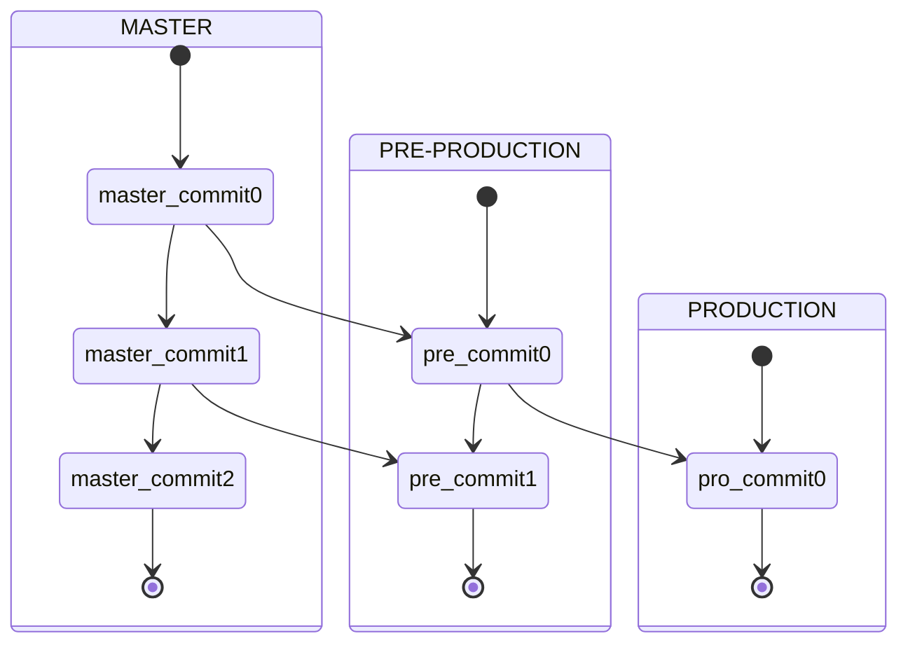

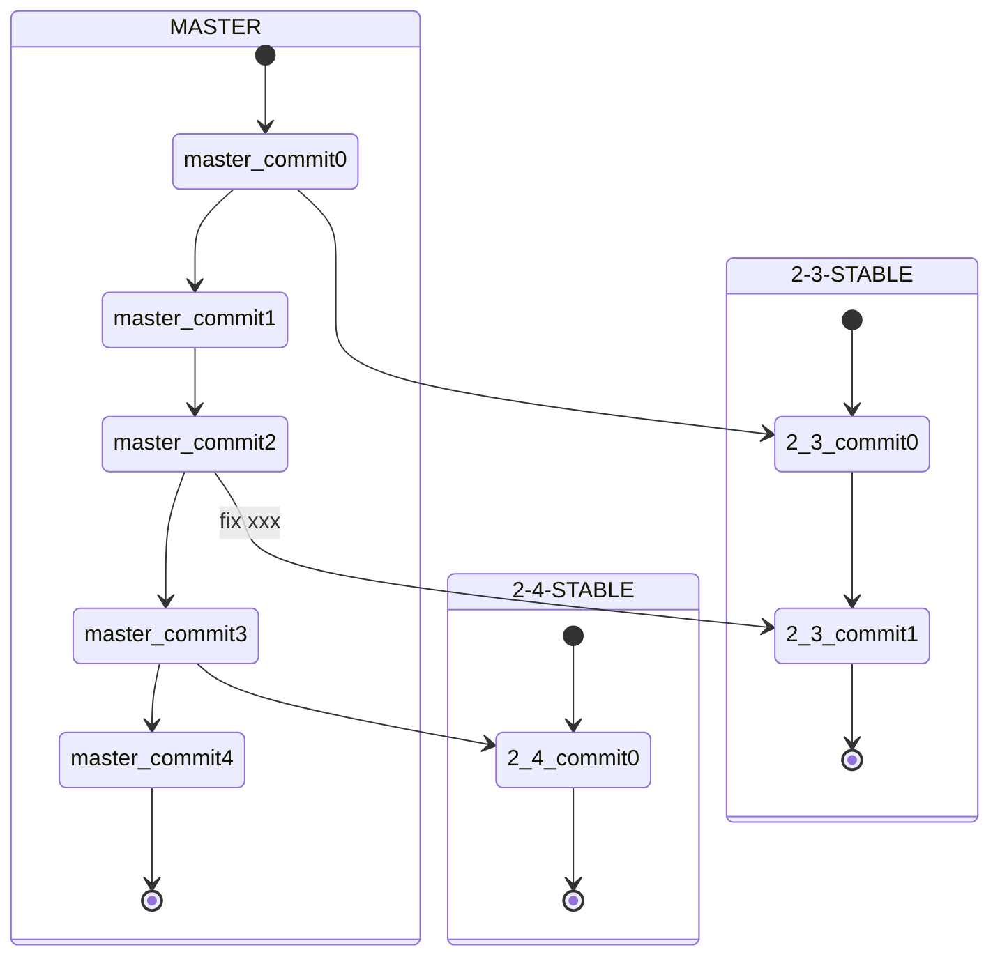

### 变更发布

自动触发部署：测试环境、内部环境

手动触发：正式环境、完成流程化审批

发布人员：

需求方 -> 开发方 -> 执行人 -> 验收方

度量：

发布跟踪里的发布度量
