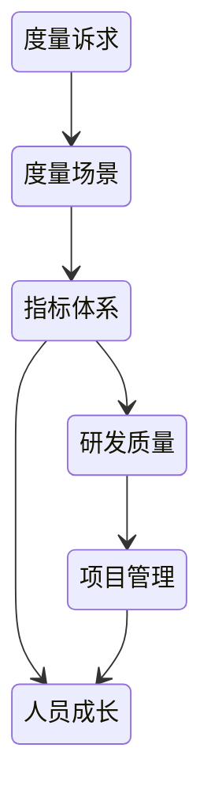
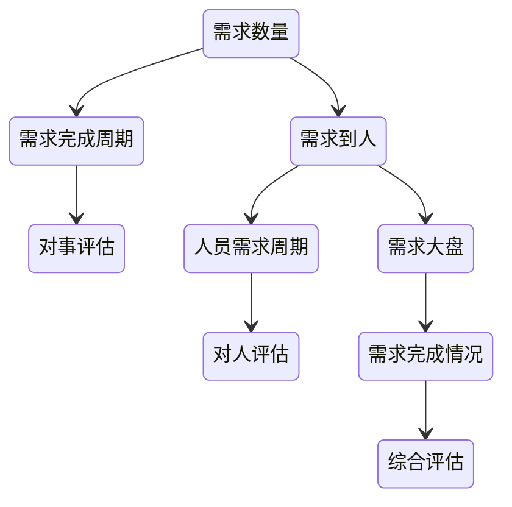
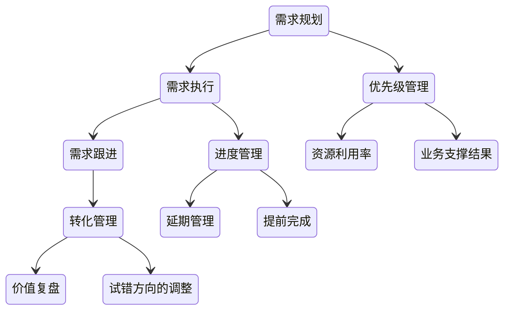
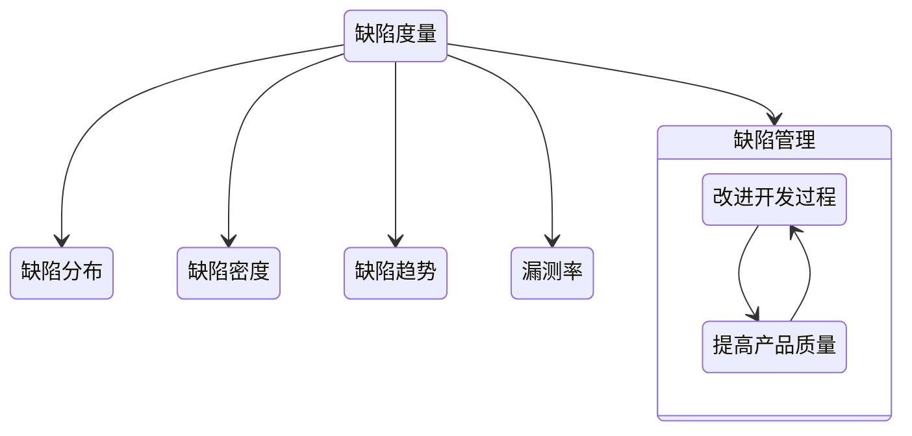
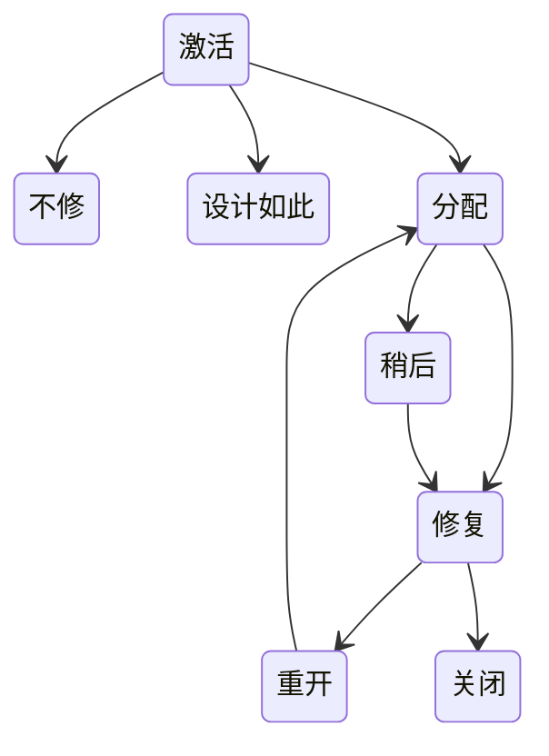
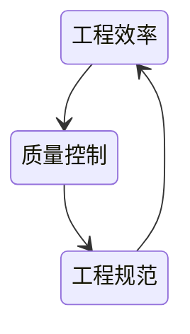
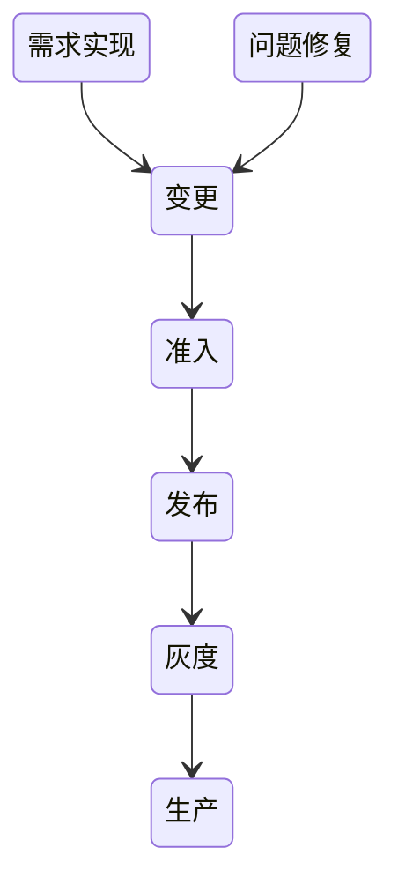

# 质量工程

符合需求即质量

预防产生质量 检验不能产生质量

质量是相对的，不能脱离具体的人谈软件质量

## 为什么要

- 快速变化的世界
- 愈发复杂的软件
- 团队扩大 成员流动快

## 做什么

- 高质量架构 小步快跑 全链路持续交付
- 全方面质量管理 故障管理
- 质量规范 流程
- 知识沉淀与传承

## 质量思维

### 高可用性

- 在SLA预设下考虑系统的建设

### 架构师立场

架构师决定着架构的基因

#### 质量经济学

- 要与不要 是个问题
  - 新增功能可以带来收益吗
- 成本与收益

#### 质量满意度

- 客户与老板的满意

#### 适用的架构

### 正负反馈

反馈环中的因果循环，有的破坏是不可逆的（方向问题）

小步试错，积极调整 建立小正循环，推动正反馈

项目新增输入导致熵增，需要加以控制，控制住熵的增长，为控制系统性偏差，要建立起反馈的可能性，通过细微的、及时的反馈来达到控制的目的

架构师需要基于当前的信息做出决策，并将决策得到的结果作为前一步的信息继续做出决策，每次的调整都是为了修正熵回到正常状态

### 止损

- 理清现状
- 盘点数据
- 价值分析

#### 派别

- 保守治疗
- 刮骨疗伤

#### 断臂求生

#### 告别

## 度量体系

- 用数据证明质量的进步

### 需求管理

#### 需求的全生命周期

#### 需求复盘

合理性：

- 设计合理性
- 资源消耗合理性
- 优先级合理性

完成度：

- 整体完成度
- 完成周期、延期情况
- 需求是否偏差

价值：

- 带来的效果
- 实际产生的价值
- 投入产出比

#### 问题治理

需求质量：设立准入门槛

实现质量：专项治理

流程问题：改进流程

人的问题：定向培养

### 缺陷管理

缺陷分布：各类缺陷数目

缺陷密度：已知缺陷数量/产品规模 千行代码缺陷率

缺陷趋势：各种状态缺陷的数量

漏测率：非QA测试缺陷数/QA发现的缺陷数

#### 缺陷状态

### 代码跟踪

人：提交人、评审人

量：提交量、注释量

质量：复杂度、不合规范数、单测覆盖率

### 发布跟踪

#### 发布度量

发布次数、发布成功率、回滚次数、灰度接入率、灰度回滚次数、紧急发布次数、非发布变更次数

可以反馈出因研发质量不足而导致的异常流程数

#### 准入度量

接入率、卡点阻塞数、跳过数

限制风险因素发布到生产

## [持续交付](/运维/持续集成.md#持续交付)

## [灰度发布](/运维/灰度发布.md)

## 质量管理体系

### 质量控制

- 执行：过程管理
- 人：人员培训
- 规范：规范优化

### 质量升级

代码质量 -> 服务质量

功能测试 -> 快速恢复

线下质量 -> 线上质量

模块质量 -> 链路质量

### 质量具化

定义质量场景，做好质量控制：

- 场景主体
- 场景任务
- 场景环境
- 创建变化

### 研发流程与灰度发布

### 安全生产体系

### 全链路质量体系

- 全链路压测
