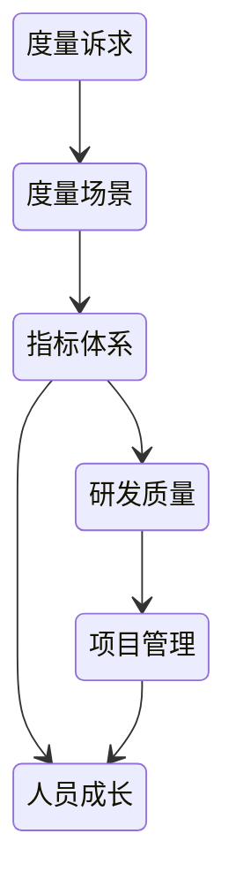
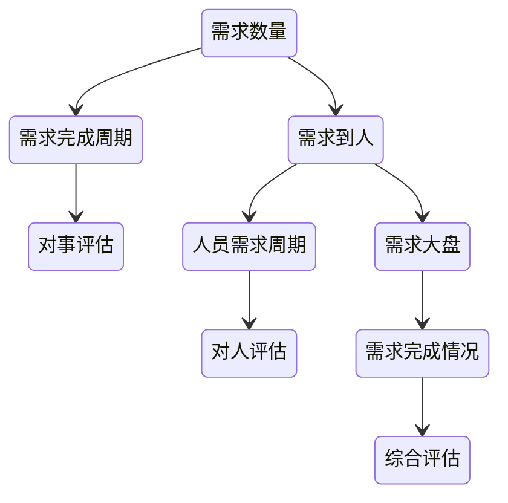
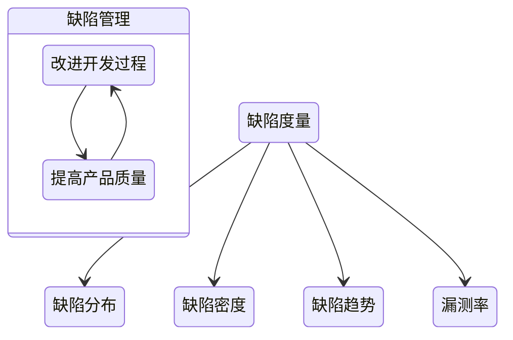
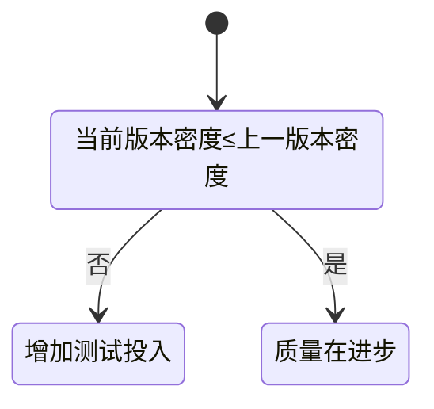
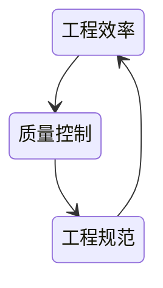
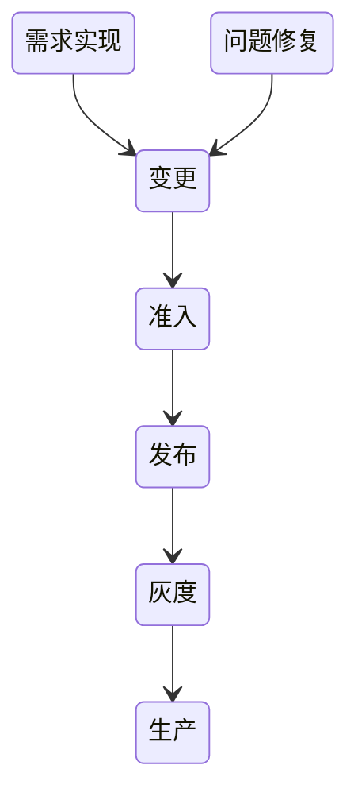

# 软件质量工程（Quality Engineering）

> **符合需求即质量，预防产生质量，检验不能产生质量。**
> 质量工程是一种系统性地在软件生命周期中规划、实施、度量和改进质量的工程活动，目标是让软件在复杂环境下持续稳定地满足用户与业务需求。

---

## 一、质量工程的理念

### 质量的本质

* **质量的定义**：质量是软件满足明确需求的程度。
* **预防优于检验**：测试只能发现缺陷，预防才能产生质量。
* **相对性原则**：质量是相对的，不能脱离用户、场景、成本与时间谈质量。
* **质量是系统性产物**：它不是单点的测试结果，而是架构、流程、文化、反馈共同作用的结果。

---

## 二、为什么需要质量工程

* **世界变化快**：业务迭代频繁，需求变化迅速。
* **软件复杂度高**：多模块、分布式、依赖多，问题传播快。
* **团队规模扩大**：人员流动快、经验断层明显。
* **风险成本上升**：线上事故、口碑、合规、资金损失。

---

## 三、质量属性模型（非功能性质量）

依据 ISO/IEC 25010 模型，可将软件质量拆解为以下八大维度：

| 分类        | 子属性            | 说明          |
| --------- | -------------- | ----------- |
| **功能适用性** | 完整性、正确性        | 是否实现预期功能    |
| **性能效率**  | 吞吐、响应、资源利用     | 系统性能与资源消耗   |
| **兼容性**   | 互操作性、共存性       | 能否与外部系统共存协作 |
| **可用性**   | 易用性、可学习性       | 使用与理解的便捷程度  |
| **可靠性**   | 可恢复性、可容错性      | 故障后的可用与自愈   |
| **安全性**   | 机密性、完整性、可追责    | 系统抵御风险的能力   |
| **可维护性**  | 可分析性、可修改性、可测试性 | 代码质量、扩展性    |
| **可移植性**  | 可适应性、可安装性      | 环境迁移与部署便利性  |

- 软件质量并非单一指标，而是以上多维属性的综合平衡。

---

## 四、质量工程做什么

* **高质量架构**：在SLA约束下设计系统架构。
* **小步快跑、持续交付**：通过小步试错建立正反馈闭环。
* **全链路质量管理**：覆盖开发、测试、发布、运维全过程。
* **故障管理与止损**：快速识别、分析、修正、复盘。
* **质量规范与流程建设**：标准化执行，降低人为差异。
* **知识沉淀与传承**：建立共享知识体系与经验库。

---

## 五、质量思维与反馈机制

### 架构师立场

架构师决定系统的基因，质量工程是架构设计的重要目标。

#### 质量经济学

* **要与不要，是个问题**：每个新增功能都伴随质量风险与维护成本。
* **成本与收益平衡**：控制质量成本，使其小于潜在损失。

| 成本类型       | 示例              |
| ---------- | --------------- |
| **预防成本**   | 测试自动化、代码审查、架构评审 |
| **鉴定成本**   | 测试执行、静态分析、审计    |
| **内部损失成本** | 缺陷返工、延期         |
| **外部损失成本** | 线上事故、客户投诉、品牌损害  |

#### 质量满意度

衡量客户与业务方对交付结果的整体满意度。

#### 正负反馈与熵控制

* 项目新增输入导致系统熵增。
* 建立**反馈机制**，通过数据与度量实现自我修正。
* 小步试错、快速反馈，持续推动正循环。

### 止损策略

* 理清现状 → 盘点数据 → 分析价值。
* 根据损害程度选择：

  * **保守治疗**：局部修复。
  * **刮骨疗伤**：结构性重构。
  * **断臂求生 / 告别**：淘汰无价值模块。

---

## 六、质量保障活动全景

| 阶段       | 质量活动            | 目标        |
| -------- | --------------- | --------- |
| **需求分析** | 需求评审、验收标准、优先级管理 | 减少需求偏差    |
| **设计阶段** | 架构评审、风险建模、接口定义  | 控制结构性风险   |
| **开发阶段** | 编码规范、单测、代码审查    | 保证实现质量    |
| **测试阶段** | 自动化测试、集成测试、性能测试 | 验证功能正确性   |
| **发布阶段** | 灰度发布、回滚验证、变更准入  | 控制上线风险    |
| **运维阶段** | 监控告警、故障复盘、SLA跟踪 | 保障系统稳定    |
| **改进阶段** | 数据度量、流程优化       | 持续改进与反馈闭环 |

---

## 七、度量体系

> 用数据证明质量的进步，用度量驱动改进。

### 度量体系结构

---

### 1. 需求管理度量

* 关注指标：需求周期、延期率、资源利用率、价值回报比。
* **复盘维度**：

  * 合理性（设计、优先级）
  * 完成度（周期、延期）
  * 价值（投入产出比）

---

### 2. 缺陷管理

| 指标       | 说明                 |
| -------- | ------------------ |
| **缺陷分布** | 各模块缺陷数量            |
| **缺陷密度** | 缺陷数 / 产品规模（千行代码）   |
| **缺陷趋势** | 各状态缺陷变化曲线          |
| **漏测率**  | 非QA发现缺陷数 / QA发现缺陷数 |

---

### 3. 代码质量跟踪

| 维度    | 指标              |
| ----- | --------------- |
| **人** | 提交人、评审人、代码活跃度   |
| **量** | 提交量、注释量         |
| **质** | 复杂度、不合规范数、单测覆盖率 |

---

### 4. 发布与变更度量

| 类别       | 指标                        |
| -------- | ------------------------- |
| **发布度量** | 发布次数、成功率、回滚次数、灰度接入率、紧急发布率 |
| **准入度量** | 卡点数、跳过数、风险阻断数             |

> 发布度量可以反馈研发质量波动；准入度量限制风险扩散。

---

## 八、质量管理与治理体系

### 质量控制

* **执行维度**：过程管理、阶段性检查。
* **人员维度**：培训与知识共享。
* **规范维度**：制定、优化开发与测试标准。

### 质量升级路径

| 阶段   | 目标        |
| ---- | --------- |
| 代码质量 | 代码规范、单测完善 |
| 服务质量 | 稳定性、性能    |
| 功能测试 | 快速恢复能力    |
| 线下质量 | 线上质量保障    |
| 模块质量 | 全链路质量     |

### 质量具化

定义质量场景，细化质量控制维度：

* 场景主体
* 场景任务
* 场景环境
* 变化管理

---

## 九、自动化与平台化实践

* **持续集成（CI）**：自动构建、单测、静态扫描。
* **[持续交付（CD）](/运维/持续交付.md)**：[灰度](/运维/灰度发布.md)、蓝绿部署、回滚策略。
* **质量门禁**：在流水线中建立质量阈值。
* **度量平台**：采集数据、可视化展示、自动预警。

---

## 十、质量文化与治理机制

* **左移质量**：问题提前暴露，开发阶段即发现。
* **右移质量**：线上监控、压测、混沌工程。
* **全员质量责任制**：质量不是QA的责任，而是团队共同的结果。
* **治理机制**：

  * 质量红线指标（错误率、回滚率、事故响应时间）
  * 定期质量评审与复盘
  * 质量指标纳入团队绩效与OKR

---

## 十一、全链路质量体系

* **全链路压测**：从入口到核心链路，验证容量与稳定性。
* **安全生产体系**：从设计到运维确保系统持续健康运行。

---

## 十二、总结

质量工程不是测试，而是：

> **一套以"系统性预防 + 数据化度量 + 持续反馈改进"为核心的工程体系。**

它贯穿需求、设计、开发、测试、运维的全生命周期，
通过**规范化流程、自动化工具、文化共识与经济思维**，
让软件系统在复杂环境中持续稳定地交付价值。

## 关联内容（自动生成）

- [/软件工程/软件工程.md](/软件工程/软件工程.md) 软件工程是质量工程的基础和前提，提供了完整的工程化方法论
- [/软件工程/软件设计/代码质量/代码质量.md](/软件工程/软件设计/代码质量/代码质量.md) 代码质量是质量工程的基础，直接影响软件的可维护性和稳定性
- [/软件工程/软件设计/代码质量/软件测试/软件测试.md](/软件工程/软件设计/代码质量/软件测试/软件测试.md) 本文档与软件测试相关，涵盖测试策略、自动化测试、性能测试等质量保障的核心实践
- [/软件工程/软件设计/代码质量/软件测试/自动化测试.md](/软件工程/软件设计/代码质量/软件测试/自动化测试.md) 质量工程中的自动化实践是提升测试效率和保障软件质量的关键环节
- [/软件工程/性能工程.md](/软件工程/性能工程.md) 性能是软件质量的重要属性之一，性能工程与质量工程相互关联
- [/软件工程/DevOps.md](/软件工程/DevOps.md) DevOps实践是实现质量工程全链路管理的重要手段
- [/运维/持续集成.md](/运维/持续集成.md) 持续集成是质量工程中实现早期缺陷发现和快速反馈的重要环节
- [/软件工程/架构/架构治理.md](/软件工程/架构/架构治理.md) 架构治理是质量工程的重要组成部分，影响系统的长期质量
- [/软件工程/软件设计/代码质量/代码审查.md](/软件工程/软件设计/代码质量/代码审查.md) 代码审查是质量工程中预防缺陷的重要实践
- [/软件工程/软件设计/代码质量/防错设计.md](/软件工程/软件设计/代码质量/防错设计.md) 防错设计体现了质量工程中"预防优于检验"的理念
- [/软件工程/架构/系统设计/混沌工程.md](/软件工程/架构/系统设计/混沌工程.md) 混沌工程是质量工程中验证系统韧性的重要方法
- [/运维/SRE.md](/运维/SRE.md) SRE理念与质量工程在保障系统稳定性方面有诸多共通之处
- [/软件工程/安全生产.md](/软件工程/安全生产.md) 安全生产是质量工程在运维阶段的重要体现

