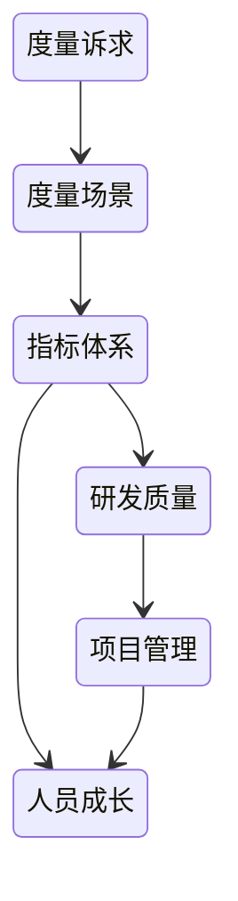

# 软件质量工程

> 质量工程是一种系统性地在软件生命周期中规划、实施、度量和改进质量的工程活动，目标是让软件在复杂环境下持续稳定地满足用户与业务需求。

## 质量工程的基础

### 四条基本命题

* **质量是被构建进去的，不是被检验出来的。** 测试只能发现缺陷，不能创造质量。
* **缺陷修复成本随阶段指数增长。** 预防缺陷的成本远低于发现并修复缺陷的成本。
* **软件系统的复杂度只会增加，不会自行减少。** 只要被修改，复杂度就会增加，除非主动干预。
* **质量是系统性产物。** 架构、流程、文化、度量反馈，缺一不可。

### 第一性原理

质量工程的第一性原理：**问题应在上游解决，而非下游承担后果。**

### 质量的本质

* **质量的定义**：质量是软件满足明确需求的程度。
* **预防优于检验**：测试只能发现缺陷，预防才能产生质量。
* **相对性原则**：质量是相对的，不能脱离用户、场景、成本与时间谈质量。
* **质量是系统性产物**：它不是单点的测试结果，而是架构、流程、文化、反馈共同作用的结果。

```
满足需求（定义性）
    ↓
  /          \
预防优于检验  相对性原则    ← 质量如何产生 + 在什么条件下成立
（机制性）     （边界性）
    \          /
     系统性产物            ← 质量的来源结构
```

## 适用边界

质量实践的适用性取决于四个维度，而非统一标准：

**业务关键性**：核心业务系统的质量缺陷可能导致重大损失，需要高保障；非核心功能可适度放松质量要求，优先保证正确性而非全面覆盖。

**规模约束**：大团队需要规范流程保证一致性；小团队应聚焦核心实践（代码评审、关键测试），而非流程建设。

**生命周期预期**：长期维护的系统需要前期投入（可维护性设计、自动化测试）；短期项目应避免过度工程。

**资源约束**：在约束条件下最大化质量价值。质量投入存在边际效益，当追加投入的收益递减时，应停止追加。

## 可测试性架构

**基本前提：**

- **可测试性差异可达数量级。** 同等复杂度的系统，验证成本可能相差百倍。这是架构问题，不是人员或工具问题。
- **质量保证无法克服不可测试的软件。** 再多的QA填补不了架构缺陷。
- **可测试性是设计出来的，不是测试出来的。** 必须在架构阶段纳入考量。

**原理层：**

- **控制与观测是测试的两大基石。** 难以控制则无法构造场景，难以观测则无法验证结果。
- **隔离是可控的前提。** 依赖决定耦合度，耦合度决定隔离难度，隔离难度决定测试成本。依赖注入是解耦手段。
- **边界决定可测试性的天花板。** 核心问题不是"如何测试"，而是"如何设计边界使测试成为可能"。
- **可测试性与可维护性同构。** 难以测试的设计，本质上是设计本身存在缺陷。

**方法论层：**

从"测试这个系统"转向"构建可测试的系统"：

| 维度 | 传统视角 | 可测试性视角 |
|------|---------|-------------|
| 问题 | 如何更有效地测试？ | 如何使测试成为可能？ |
| 介入点 | 开发完成后 | 架构设计阶段 |
| 关注 | 测试覆盖率 | 可控性、可观测性、边界清晰度 |

- **依赖是负资产，应最小化、可替换。** 显式优于隐式，抽象优于具体，注入优于创建。
- **复杂业务逻辑必须与基础设施解耦。** 业务逻辑为"核心"，IO操作为"外部"，两者通过端口连接。
- **可测试性是架构评审的核心维度。** 架构评审必须回答：边界在哪？依赖是什么？能否隔离？能否控制？能否观测？

## 质量属性模型

质量属性是把抽象的"质量"转化为可操作、可度量、可沟通的概念体系

软件质量可以拆解为以下八大属性：

| 分类        | 子属性            | 说明          |
| --------- | -------------- | ----------- |
| **功能适用性** | 完整性、正确性        | 是否实现预期功能    |
| **性能效率**  | 吞吐、响应、资源利用     | 系统性能与资源消耗   |
| **兼容性**   | 互操作性、共存性       | 能否与外部系统共存协作 |
| **可用性**   | 易用性、可学习性       | 使用与理解的便捷程度  |
| **可靠性**   | 可恢复性、可容错性      | 故障后的可用与自愈   |
| **安全性**   | 机密性、完整性、可追责    | 系统抵御风险的能力   |
| **可维护性**  | 可分析性、可修改性、可测试性 | 代码质量、扩展性    |
| **可移植性**  | 可适应性、可安装性      | 环境迁移与部署便利性  |

- 软件质量并非单一指标，而是以上多维属性的综合平衡。

## 质量工程做什么

* **高质量架构**：在SLA约束下设计系统架构。
* **小步快跑、持续交付**：通过小步试错建立正反馈闭环。
* **全链路质量管理**：覆盖开发、测试、发布、运维全过程。
* **故障管理与止损**：快速识别、分析、修正、复盘。
* **质量规范与流程建设**：标准化执行，降低人为差异。
* **知识沉淀与传承**：建立共享知识体系与经验库。

它们都是"系统性产物"这一基本命题的具体展开。

1. 没有单项能独立成立——架构再优秀，规范缺失也会失败
2. 没有短链因果——质量问题不是某个单点的失败
3. 必须协调运作——各自为战等于没有质量工程

## 质量经济学

质量经济学回答的是：在约束条件下，如何最大化质量价值。

### 核心原则一：质量投入的边际效益递增

越早投入，回报率越高。1小时架构评审避免的故障成本，远高于1小时救火的价值。

### 核心原则二：质量债务的利息效应

未修复的缺陷不会停止计息。随着时间推移，缺陷之间的耦合度增加，修复难度上升，利息越滚越大。

### 核心原则三：鉴定成本覆盖不了预防缺失

测试无法发现设计阶段的根本性缺陷。鉴定成本（测试）再高，也填补不了预防成本（上游建设）的缺失。

## 质量保障活动全景

全景是系统思维的具体化。全景是理解质量是贯穿全生命周期的连续活动的核心，任何一个环节的失误都会最终影响最终质量。

| 阶段       | 质量活动            | 目标        |
| -------- | --------------- | --------- |
| **需求分析** | 需求评审、验收标准、优先级管理 | 减少需求偏差    |
| **设计阶段** | 架构评审、风险建模、接口定义  | 控制结构性风险   |
| **开发阶段** | 编码规范、单测、代码审查    | 保证实现质量    |
| **测试阶段** | 自动化测试、集成测试、性能测试 | 验证功能正确性   |
| **发布阶段** | 灰度发布、回滚验证、变更准入  | 控制上线风险    |
| **运维阶段** | 监控告警、故障复盘、SLA跟踪 | 保障系统稳定    |
| **改进阶段** | 数据度量、流程优化       | 持续改进与反馈闭环 |

## 度量体系

> 用数据证明质量的进步，用度量驱动改进。

### 度量体系结构


```mermaid
stateDiagram-v2
  度量诉求 --> 度量场景
  度量场景 --> 指标体系
  指标体系 --> 研发质量
  指标体系 --> 人员成长
  研发质量 --> 项目管理
  项目管理 --> 人员成长
```

### 度量的层次

度量体系应覆盖软件生命周期的四个层次，每层关注不同的质量维度：

| 层次 | 度量焦点 | 回答的问题 |
|------|---------|-----------|
| **需求层** | 价值与效率 | 投入是否产出了正确的价值？ |
| **缺陷层** | 质量与稳定性 | 系统当前的质量状态如何？ |
| **代码层** | 可维护性与技术债 | 代码是否健康？技术债是否可控？ |
| **发布层** | 交付能力与风险 | 发布是否稳定可控？ |

## 自动化与平台化实践

* **持续集成（CI）**：自动构建、单测、静态扫描。
* **[持续交付（CD）](/运维/持续交付.md)**：[灰度](/运维/灰度发布.md)、蓝绿部署、回滚策略。
* **质量门禁**：在流水线中建立质量阈值。
* **度量平台**：采集数据、可视化展示、自动预警。

## 质量文化

质量文化是组织对质量的集体信念和行为模式。它决定了团队如何思考质量问题、如何做出质量决策。

* **左移质量**：将质量关注点前移到最早阶段——在需求分析阶段就开始思考质量，在设计阶段就嵌入质量防护。
* **右移质量**：将质量关注延伸到生产环境——通过监控、压测、混沌工程持续验证线上质量。
* **全员质量责任制**：质量不是QA团队的专属责任，每个环节的参与者都对质量有直接贡献和问责。

质量文化的核心转变：从"质量是测试的事"到"质量是每个人的事"。

## 质量治理机制

治理机制是质量文化的制度化约束，通过硬性规则确保质量标准被执行。

* **质量红线指标**：设定不可逾越的质量底线（如错误率上限、回滚率上限、事故响应时间上限），一旦触及立即触发整改。
* **定期质量评审与复盘**：周期性审视质量状态，识别趋势性风险，固化经验教训。
* **质量指标与绩效挂钩**：将质量表现纳入团队和个人的考核维度，使质量成为真实的优先级而非口号。

文化解决"愿不愿意"的问题，机制解决"必须执行"的问题。两者缺一不可：文化没有机制支撑会流于口号，机制没有文化支撑会引发对抗。

## 反模式与常见误区

**测试万能论**：认为"只要测试做得好，质量就有保证"。测试只能发现缺陷，不能创造质量。高质量是被构建进去的，不是被检验出来的。

**质量是QA的责任**：认为质量问题是测试团队的事。质量是全员责任，每个环节的失误都会最终反映到质量上。

**缺陷是测试人员的错**：出现问题后归咎于测试人员。软件错误来自各个过程（需求、设计、编码），测试只是确认存在错误，无法保证没有错误。

**过度追求质量**：质量投入存在边际效益。在非核心功能上追求极致质量，是另一种浪费。

**工具依赖**：认为引入工具就能解决质量问题。工具是支撑，流程和文化才是根本。

## 质量演进

### 质量工程的范式转移

质量工程的演进遵循一条清晰的主线：**从单点检验到系统预防，从局部优化到全链路治理。**

| 阶段 | 特征 | 局限 |
|------|------|------|
| **检验质量** | 事后把关，分离的测试部门 | 被动发现，缺陷修复成本高 |
| **统计质量** | 过程控制，抽样方法 | 依赖数据，忽视系统性因素 |
| **全面质量** | 全员参与，流程嵌入 | 落地成本高，易流于形式 |
| **质量工程** | 系统性预防，数据驱动，持续改进 | 需要组织级能力建设 |

### 驱动演进的三股力量

**复杂度增长**：软件系统规模扩大、分布式架构普及，问题传播速度远超人工响应能力。这迫使质量保障从"逐个排查"转向"系统性预防"。

**交付压力**：业务竞争加剧要求更快的迭代速度。质量与速度不再是取舍关系，而是必须同时满足的约束——"全速质量"（Quality at Speed）成为新常态。

**角色边界模糊**：DevOps 打破开发与运维的藩篱，质量责任随之扩散。全员质量责任制是这一趋势的必然结果。

## 关联内容（自动生成）

- [/软件工程/软件工程.md](/软件工程/软件工程.md) 软件工程是质量工程的基础和前提，提供了完整的工程化方法论
- [/软件工程/软件设计/代码质量/代码质量.md](/软件工程/软件设计/代码质量/代码质量.md) 代码质量是质量工程的基础，直接影响软件的可维护性和稳定性
- [/软件工程/软件设计/代码质量/代码审查.md](/软件工程/软件设计/代码质量/代码审查.md) 代码审查是质量工程中预防缺陷的核心实践
- [/软件工程/软件设计/代码质量/防错设计.md](/软件工程/软件设计/代码质量/防错设计.md) 防错设计体现了质量工程"预防优于检验"的第一性原理
- [/软件工程/软件设计/代码质量/软件测试/软件测试.md](/软件工程/软件设计/代码质量/软件测试/软件测试.md) 软件测试是质量工程发现缺陷、保障交付的核心手段
- [/软件工程/软件设计/代码质量/软件测试/自动化测试.md](/软件工程/软件设计/代码质量/软件测试/自动化测试.md) 自动化测试是质量工程提升效率、固化质量的关键实践
- [/软件工程/架构/系统设计/可用性.md](/软件工程/架构/系统设计/可用性.md) 可靠性是质量属性模型的核心维度
- [/软件工程/架构/架构治理.md](/软件工程/架构/架构治理.md) 架构治理是质量工程保障长期系统质量的顶层设计
- [/软件工程/DevOps.md](/软件工程/DevOps.md) DevOps是质量工程实现全链路管理的工程实践基础
- [/运维/持续集成.md](/运维/持续集成.md) 持续集成是质量工程早期发现缺陷、快速反馈的核心机制
- [/运维/SRE.md](/运维/SRE.md) SRE与质量工程在稳定性保障、度量驱动改进上高度共鸣
- [/软件工程/安全生产.md](/软件工程/安全生产.md) 安全生产是质量工程在运维阶段保障系统稳定的实践延伸

