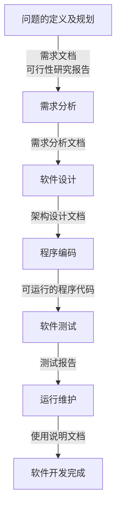

# 软件工程

工程方法：有目的、有计划、有步骤地解决问题的方法

- 想法：想法阶段通常是想要解决问题。最开始问题通常是模糊的，所以需要清晰地定义好问题，研究其可行性，检查是否有可行的解决方案
- 概念：概念阶段就是用图纸、草图、模型等方式，提出一些概念性的解决方案。这些方案可能有多个，最终会确定一个解决方案
- 计划：计划阶段是关于如何实施的计划，通常会包含人员、任务、任务持续时间、任务的依赖关系，以及完成项目所需要的预算
- 设计：设计阶段就是要针对产品需求，将解决方案进一步细化，设计整体架构和划分功能模块，作为分工合作和开发实施的一个依据和参考
- 开发：开发阶段就是根据设计方案，将解决方案构建实施。开发阶段通常是一个迭代的过程，这个阶段通常会有构建、测试、调试和重新设计的迭代
- 发布：将最终结果包括文档发布

## 软件过程

### 软件生存周期过程的概念

- 软件生存周期
- 软件生存周期过程（软件过程）

  > 系统地给出了软件开发所需的任务，回答了软件开发需要做哪些基本映射

### 软件生存周期过程的分类

- 基本过程
- 支持过程
- 组织过程
- 各过程关系

  

### 软件生存周期模型

与 软件开发模型

### 常见的软件生存周期模型

#### 瀑布模型

优点：

- 为项目提供了按阶段划分的检查点。
- 当前一阶段完成后，只需要去关注后续阶段。
- 可在迭代模型中应用瀑布模型。
增量迭代应用于瀑布模型。迭代1解决最大的问题。每次迭代产生一个可运行的版本,同时增加更多的功能。每次迭代必须经过质量和集成测试。
- 它提供了一个模板，这个模板使得分析、设计、编码、测试和支持的方法可以在该模板下有一个共同的指导。

缺点：

- 各个阶段的划分完全固定，阶段之间产生大量的文档，极大地增加了工作量。
- 由于开发模型是线性的，用户只有等到整个过程的末期才能见到开发成果，从而增加了开发风险。
- 通过过多的强制完成日期和里程碑来跟踪各个项目阶段。
- 瀑布模型的突出缺点是不适应用户需求的变化。

瀑布模型让让软件开发过程有序可控，同时也让分工写作成为可能，最重要的是提升了软件质量

#### 增量模型
#### 演化模型
#### 喷泉模型