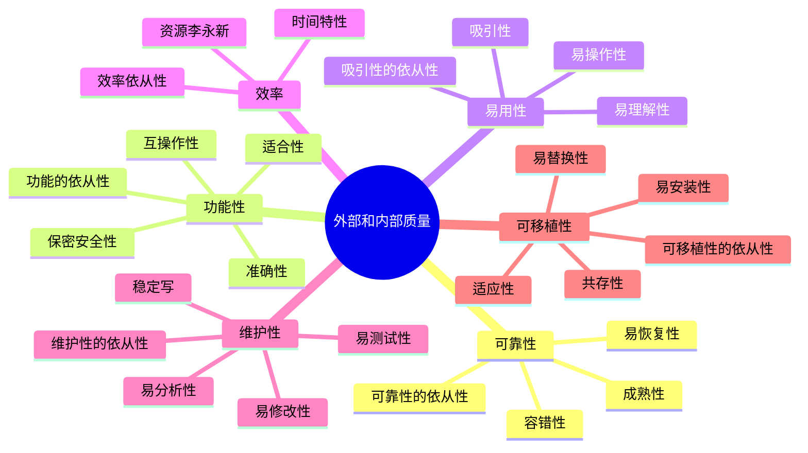

# 代码质量

软件质量：

代码特性之间的相互影响

维度1\维度2|正确性|可用性|效率|可靠性|完整性|适应性|精确性|健壮性
-|-|-|-|-|-|-|-|-
正确性|↑||↑|↑|||↑|↓
可用性||↑||||↑|↑|
效率|↓||↑|↓|↓|↓|↓|
可靠性|↑|||↑|↑||↑|↓
完整性|||↓|↑|↑|
适应性|||||↓|↑||↑
精确性|↑||↓|↑||↓|↑|↓
健壮性|↓|↑|↓|↓|↓|↑|↓|↑

- ↑：让它提升
- ↓：让它下降

高质量 = 好看(可读性/可维护性...) + 好用(健壮性/性能...)

如何得出高质量代码：

1. 做好顶层设计 良好的编码
2. 从垃圾代码 -> 重构 -> 优秀的代码

代码质量体系建设：规范定义实践(编码/重构) -> 质量度量(代码审查) -> 复盘 -> 回到实践

## 代码质量差的原因

## 代码防腐

- 信息隐藏：隐藏的本质是为了避免过多的依赖
- 持续改进：不要提前设计 持续地去响应变化
