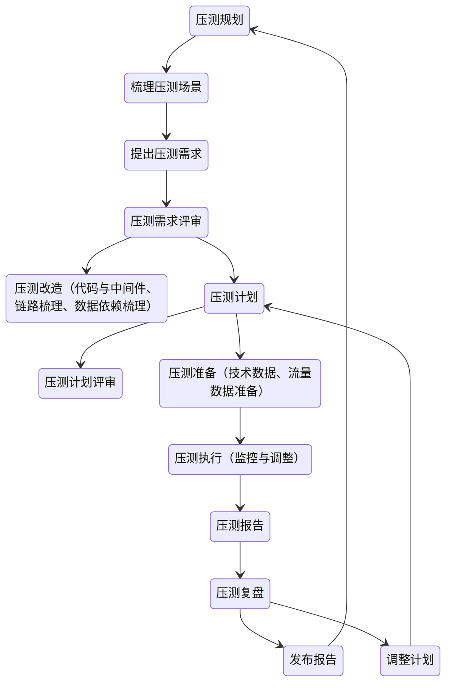

# 全链路压测

流量洪峰 -> 容量评估（极限水位，极限表现） -> 发现问题（隐患挖掘，瓶颈调优） -> 容量规划（资源规划，限流设定）

既要匹配真实的场景，并且也要隔离测试与生产的环境、数据

## 目标

- 逐步提升流量目标 朝最终目标前进
- 确保压测系统指标处于合理范围
- 保证压测时系统的稳定性、数据的一致性、以及压测停止后系统能恢复

## 场景

确定场景边界，进行场景细分，可以对单点压测，也可以对多个场景混合，以探索不同场景下的性能表现

- 重点业务
- 热点业务
- 二者关联的业务

## 改造

### 代码改造

- 隔离生产流量与测试流量

0. 在流量端点要考虑登录、鉴权、CSRF等问题
1. 在流量入口处对流量打标，对于流量的传递，可利用原有的链路追踪系统来标识全链路压测，而在代码内，同线程内可使用[ThreadLocal](/编程语言/JAVA/JAVA并发编程/并发工具类.md#ThreadLocal)来标识链路，跨线程则需要在并发工具相关的创建入口携带相关链路标识，以保证完整的链路追踪
2. 对于数据存储使用正常存储与影子存储隔离数据
3. 对于外部调用使用Mock

### 中间件改造

- 隔离数据与传递压测标识

最重要的做到数据的存储与读写隔离，同时需要能对压测请求进行封装，以进行链路状态的传递

## 数据隔离

### 基础数据

对于在线数据使用不同的存储隔离，离线数据由于一整套的复杂环境，可以考虑在压测期间不生产离线数据来达到目的

需要专门的库表同步工具来支撑影子存储与正常存储的环境一致性，影子数据也需要定时管理，保证与正式环境的一致性

### 中间数据

共享内存和缓存数据要对压测特殊处理，静态数据压测要避免修改，如果必须要改，那要针对压测单独设立静态数据

### 数据清理

对于基础数据不需要特意清理，只是要避免数据量过大影响后续压测

而中间数据最好设立超时时间，自动清理

压测结果数据定时清理，保证压测结果准确

## 流量过滤

自我过滤：发现压测流量，直接忽略

外部过滤：由外部在调用时决定忽略

## 场景设计

单场景覆盖，多场景混合

正向场景逆向场景（很少有人操作的场景）结合

采集线上用户行为，模拟真实操作

### 流量设计

流量多样化（真实的用户行为）与流量分层（不同操作的流量基数）

- 流量递进与瞬时流量
- 大流量长时间与小六六长时间
- 极限后持续压测与极限后减少流量

## 目标设定

压测目标的设定应是当前能达到的极限，并能不断向着大目标前进

验证优化效果：设置多种对照，如多组或者历史对照，以达到优化结果的确认

验证可用性：多场景验证，符合场景、失败场景，来验证总和可用

验证系统极限：对预期的极限进行验证，使用真实场景，并得要有资源保障

压测目标的调整：

- 根据场景调整压测量
- 根据系统表现调整 保障不大规模出错极限压测

## 数据准备

基础数据直接从真实环境拿过来

压测的流量数据则需要有相关配套工具来mocl生成，生成一整套符合系统约束的合法数据

设计到压测数据的存储都需要提前建设，压测的数据量级、分布要与线上一致

对于外部系统的数据，需要mock

## 执行

工具选型：性能高、易用、省钱 自研or开源or商业服务

### 监控与调整

- 感知系统极限
- 感知停止时机

监控指标是否在预期范围内 识别风险

根据表现的指标对中间件、数据库、应用、系统资源等进行调优

### 报告

#### 压力场景

描述压测的范围

- 业务场景
- 业务链路
- 压测模式
- 压测目标
- 时间
- 执行人

#### 链路状态

描述业务结果与链路状态

- 涉及应用
- 峰值QPS、峰值RT、平均RT
- 请求成功率与业务成功率

#### 压力信息

明确当前系统的抗压极限

- 流量峰值
- 并发峰值
- 压测时间
- 单机流量
- 集群流量
- DB压力

#### 压力调整

压测过程的压力变化情况

- 变化情况、变化原因、变化步长
- 起始流量、停止流量、停止原因

#### 异常信息

错误码、失败数、错误占比

### 复盘

回顾目标，发现做的不好的，分析原因，沉淀经验

针对目标哦达成情况，分析系统现状，预测系统未来空间

整理压测的问题清单，并提出相对应的修复计划，以改进下次优化

最后在这些经验下沉淀出系统、预案、资源等的相关改进
