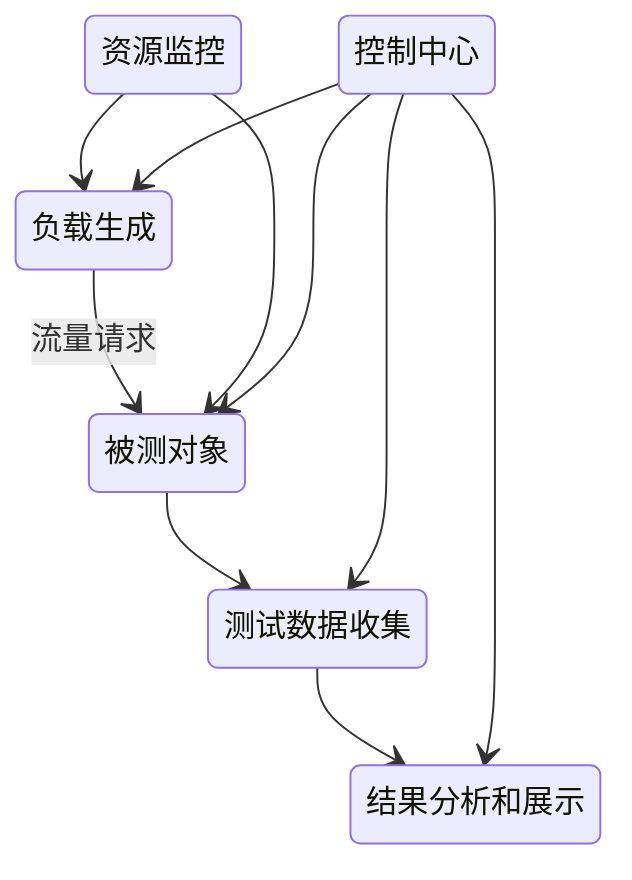

# 性能测试

针对系统的性能指标，建立性能测试模型，制定性能测试方案，制定监控策略，在场景条件之下执行性能场景，分析判断性能瓶颈并调优，最终得出性能结果来评估系统的性能指标是否满足既定值

## 目的

- 服务速度：延迟和吞吐率
- 可扩展性
- 稳定性
- 性能瓶颈

## 种类

1. 冒烟测试：在开发环境里执行的简单测试，以确定新的程序代码不出故障
2. 耐力测试：长时间测试具有预期负载量的系统，以验证系统的行为是否正常
3. 基准测试/性能回归测试：对比代码修改前后的数据，比较前后的性能结果
4. 负载测试：验证被测试系统或者程序是否可以处理预期的负载流量，并验证正常和峰值负载条件下的系统和程序行为
5. 断点测试：随着时间的推移而增大流量负载，同时监视系统的预定故障条件
6. 尖峰测试：确定系统在负载（比如用户请求数）突然变化时的系统行为
7. 可扩展性测试：确定一个程序和系统的非功能性特征能不能在变化的环境里合理扩展
8. 容量测试：用于确定一个单位容量能够支持的最大负载
9. 瓶颈测试：一种特殊的压力测试。它的目的是找到被测试系统和程序的最制约的资源类型
10. 压力测试：在负载增加到超过系统设计预期后观察和验证系统的行为

## 应用

- 能力验证：某系统能否在 A 条件下具有 B 能力
- 容量规划：如何才能使系统达到要求的性能和容量
- 性能调优：主要解决性能测试过程中发现的性能瓶颈的问题
- 缺陷发现：通过性能测试的各种方法来发现诸如内存泄露、资源竞争、不合理的线程锁和死锁等问题

## 性能指标

- TPS：最重要的是搞清楚 T 代表的是，接口测试场景下，T就是调用数，业务场景下，T就是一个原子业务操作
- RT：最重要的是分析一个操作背后涉及的链路，每条链路之间的具体RT，以此了解整体RT是如何得到的

$$
TPS=\frac{1000ms}{\text{响应时间}(\text{单位}ms)}*\text{压力机线程数}
$$

## 规划

1. 确定测试对象：除了测试对象本身，其他所有的模块和构件在整个性能测试的过程中都不能有任何性能瓶颈
2. 决定性能指标
3. 决定性能指标的度量
4. 决定测试的期望结果：期望从测试中得出什么样的结论，以此来决定测试结果是否可接受
5. 测试规划：不同种类的测试使用的负载、测试数据、黑盒白盒等
6. 执行：需要多次迭代执行
7. 分析

### 性能测试场景设计

性能测试需求最难的就是如何得到真实的用户访问负载模型

- 测试负载组成：虚拟用户脚本、并发数
- 负载策略：加减压策略、最大负载运行时间、延时策略
- 资源监控范围
- 终止方式：脚本出错处理、负载熔断机制
- 负载产生规划：数量、资源需求

## 工具

录制、回放定制的脚本，模拟多用户同时访问被测试系统（SUT）来产生负载压力，同时监控并记录各种性能指标，最后生成性能分析结果和报告

- 负载生成模块
- 测试数据收集模块
- 结果分析展示
- 资源监控模块
- 控制中心

1. web测试场景：JMeter、LoadRunner、Locust
2. 系统测试场景：UnixBench、Perf
3. 数据库测试场景：SysBench、mysqlslap
4. IO测试场景：ioZone、Bonnie++、dd
5. 网络测试场景：Netperf、Iperf
6. 移动测试场景：Appium、Monkey（安卓）、XCTest、Frank、KIF（IOS）

