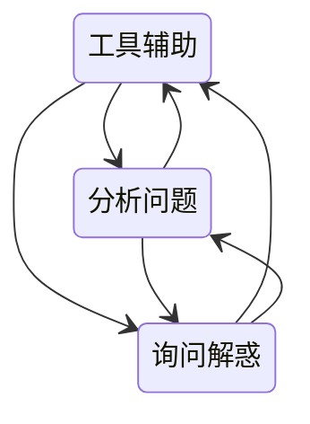

# 接口测试

还是通过设计输出来对契约完成验证

黑盒接口测试：

从单个接口的测试开始，保障单个接口的正确性和健壮性，然后通过单个接口的测试完成多个接口的业务逻辑串联，站在业务逻辑的角度完成业务逻辑的正确性检测

在接口测试中，可以通过单个接口测试完成了全部异常状态的覆盖；而在业务流程中，更需要关心业务流和数据流的关系，所以接口测试并不需要再过度关心如何用业务流的方法覆盖更多的代码逻辑异常
