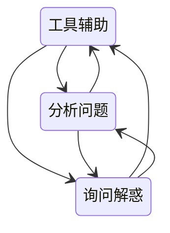

# 接口测试

还是通过设计输出来对契约完成验证

黑盒接口测试：



从单个接口的测试开始，保障单个接口的正确性和健壮性，然后通过单个接口的测试完成多个接口的业务逻辑串联，站在业务逻辑的角度完成业务逻辑的正确性检测

在接口测试中，可以通过单个接口测试完成了全部异常状态的覆盖；而在业务流程中，更需要关心业务流和数据流的关系，所以接口测试并不需要再过度关心如何用业务流的方法覆盖更多的代码逻辑异常

## 测试框架

测试框架的形成是在撰写大量测试脚本的过程中不断抽象封装出来的，然后，再用这个不断完善的框架，改写原有的测试脚本

## 测试数据

统一抽象，建立一个公共处理数据的方式以适配后期可能的存储方式扩展

## mock服务设计

- 简单
- 处理速度
- 轻量

## 服务测试

对于微服务来说，服务的拥有者应该负责测试代码的编写。测试运行的缓慢会影响修复错误的效率，从而影响开发

只对单个服务进行测试可以提高测试的隔离性，针对服务所需要的外部合作者，一般都是mock或者打桩

**契约测试**

侧重于验证服务提供者的参数定义是否符合消费者的期望

```groovy
org.springframework.cloud.contract.spec.Contract.make {
    request { // (1)
        method 'PUT' // (2)
        url '/fraudcheck' // (3)
        body([ // (4)
               "client.id": $(regex('[0-9]{10}')),
               loanAmount : 99999
        ])
        headers { // (5)
            contentType('application/json')
        }
    }
    response { // (6)
        status OK() // (7)
        body([ // (8)
               fraudCheckStatus  : "FRAUD",
               "rejection.reason": "Amount too high"
        ])
        headers { // (9)
            contentType('application/json')
        }
    }
}
```

**打桩**：为被测服务的一些请求创建一些预设的响应

**mock**：mock会验证请求是否被正确调用

引入mock可能会更加复杂，所以可以创建一个智能的打桩服务