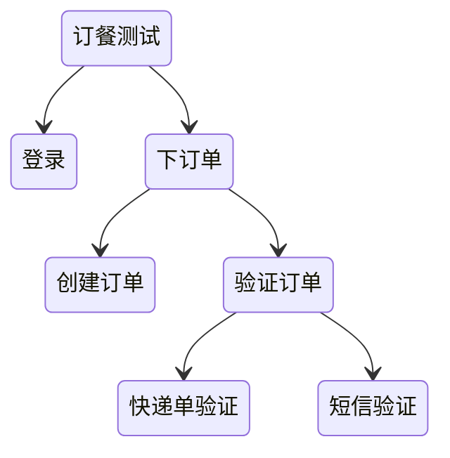

# 自动化测试

## 价值

- 自动化测试项目的最终交付价值是它产生的效益，也就是投入回报率比 ROI，ROI越高越值得自动化
- 自动化测试是用来做回归测试的
- 只有当功能模块稳定的时候，才开始自动化

小项目、项目的早期不适合自动化

ROI = 单次手工运行时间 * 运行次数 / 开发成本 + 维护成本

UI测试 -> 接口测试 -> 单元测试 ROI从低到高，在选择自动化的时候，一个功能模块，如果能在某一层获得更高的ROI，就只要测试该层就好

摊平开发成本：配置化读取测试用例执行，一份代码执行多次

降低维护成本：完善的测试脚本错误发现机制，及时恢复有问题的脚本

### 工具选择

1. 录制回放 产生自动化脚本的这种方法，优点是速度快、零编码，但规模一大很难维护，也无法集成到CICD中
2. 关键字驱动 配置驱动，降低了测试开发人员的技术要求。而且测试开发人员对代码还有了更多的逻辑控制能力
3. 模块库开发 系统沉淀好相关的测试能力，让顶层测试人员来调包进行开发
4. DSL
5. AI

ROI高的工具：

1. 满足需求
2. 社区活跃度高
3. 维护方便

### 规范先行

> Auto Gen Auto：根据配置描述自动化生成测试代码

用在接口比较多，提供一个接口的契约，生产消费方通过契约来约定如何交互，测试代码也能以此编写自动化测试

- openapi-generator
- Spring Clond Contract

### 介入开发运维

- 左移：在开发阶段就进行测试设计、测试工作与开发并行
- 右移：需求上线后，测试并不停止，持续地在生产环境中进行测试，及时发现异常，作为运维的补充

## 设计

### 测试模型

一个运行的测试任务，具备哪些方面：

1. Input&Output：测试 Job 的输入和输出是什么
2. DAO：测试 Job 应该用什么格式，怎么持久化自动化测试报告、日志、抓图等等
3. Depdedncy：测试 Job 的前置条件是什么，由谁来提供
4. TestData：测试 Job 的测试数据是什么结构，需要多少组
5. TestConfig：测试 Job 的运行时需不需要通过配置来调节？比如，健壮性、诊断性、环境信息等等
6. Document：测试 Job 的其它信息

### 编排

学习软件的模块开发，使用模块化编排测试：

### 驱动工具

## 度量

- 避免绝对数字
- 趋势比绝对值更有决策价值
- 避免指标单一

### 交付质量度量

- 交付速度，可以用发布的周期来度量
- 交付范围，可以用新增代码行数来度量
- 质量，用生产环境发现的 Bug 数量来度量

### 内建质量度量

可以划分成四个维度：需求质量、设计质量、开发质量和测试质量

## 测试设计模式

- page object
  - 把自动化测试代码以页面进行组织，将同一个页面上的所有信息，相关操作都放到一个类中
- 分层模式
  - 进行抽象

## 精准测试

通过自动化的手段对更新的代码进行范围判断，生成测试用例，自动执行