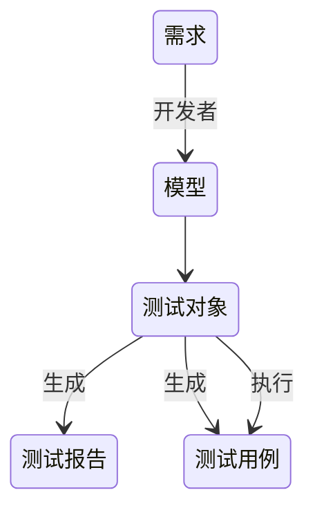

# 软件测试

测试的类型：

- 静态分析/动态测试
- 黑盒/白盒
- 手工/自动
- 技术测试（单元测试，非功能性测试（安全、性能））/业务测试（验收测试，探索性测试）

测试的4个阶段：

- 单元测试：是否符合功能性需求
- 集成测试：组件间是否能协同工作
- 验收测试：确认是否符合需求
- 系统测试

测试的4个内容：

- 测试计划活动
- 测试设计活动
- 测试实现活动
- 测试执行活动

测试人员会写代码的必要性：

- 生产问题复现
- 提升测试效率
- 问题定位
- 后续进阶
  - 自动化测试
  - 测试框架

下面一层的测试通常要比上面一层的测试多一个数量级，因为越往上的测试，反馈周期越长，出了错误就没有那么快可以解决

## 优秀的测试思维

- 敏感：能敏锐地透过现象看本质
- 好奇心：对于一件事情，不应该只浅尝表面，而应该朝着探索未知、探索深入的方向
- 乐观：要记住，编程不是全部，技术不是全部，试着空出一点时间，放松你的身心

## 测试全流程

- 需求阶段
  - 头脑风暴
  - 需求分析
- 设计阶段
  - 测试模块划分
  - 测试计划&测试用例
- 执行阶段
  - 冒烟测试
  - 执行测试
  - 测试总结
- 项目上线
- 自动化测试
- 监控

## 代码的可测性

单元测试 -> 研发人员自测 -> 集中测试 -> 回归测试

影响代码可测性因素：

- 设计是否良好
- [代码质量](/软件工程/软件设计/代码质量/代码质量.md)
- 是否测试驱动

## 目标

> 发现错误

*软件测试与软件调试*

## 过程

## 原则

> 对计算机软件进行测试前，首先需遵循软件测试原则，即不完全原则的遵守。不完全原则即为若测试不完全、测试过程中涉及免疫性原则的部分较多，可对软件测试起到一定帮助。因软件测试因此类因素具有一定程度的免疫性，测试人员能够完成的测试内容与其免疫性成正比，若想使软件测试更为流畅、测试效果更为有效，首先需遵循此类原则，将此类原则贯穿整个开发流程，不断进行测试，而并非一次性全程测试。

## 测试用例

测试用例是通过使用在测试计划中确定的测试技术，对于已确定的测试条件进行逐步推敲，精炼而设计出来的重点说明如何具体操作产生何种结果的文档

- 整体完备性：能够完全覆盖测试需求
- 等价类划分的准确性
- 等价类集合的完备性：保证所有可能的边界值和边界条件都已经正确识别

只有深入地理解软件的架构、实现的细节、引入覆盖率来度量测试用例，才能设计出足够优秀的测试用例

### 等价类划分法

是把所有的输入数据，即程序的输入域划分为若干部分（子集），然后从每一个子集中选取少数具有代表性的数据作为测试用例

只要从每个等价类中任意选取一个值进行测试，就可以用少量具有代表性的测试输入取得较好的测试覆盖结果，同时还要找出所有的无效等价类代表无效的输入

### 边界值法

通常边界值分析法是作为对等价类划分法的补充，这种情况下，其测试用例来自等价类的边界，通常选取正好等于、刚刚大于或刚刚小于边界的值作为测试数据

### 场景法

通过运用场景来对系统的功能点或业务流程的描述

### 错误推测法

根据经验或直觉推测程序中可能存在的各种错误，从而有针对性地编写检查这些错误的测试用例的方法

## 测试覆盖率

一类是面向项目的需求覆盖率，另一类是更偏向技术的代码覆盖率：

- 需求覆盖率：测试对需求的覆盖程度，最终目标是保证测试可以覆盖每个需求
- 代码覆盖率：行覆盖率、分支覆盖率、条件覆盖率

代码覆盖率反映的仅仅是已有代码的哪些逻辑被执行过了，哪些逻辑还没有被执行过，高的代码覆盖率不一定能保证软件的质量，但是低的代码覆盖率一定不能能保证软件的质量

## 白盒测试

- 控制流程图
- 路径测试
- 语句测试
- 分支测试
- 条件组合测试
- 循环的测试

## 黑盒测试

- 等价类划分：将需求合理划分片段，分成输入域的子集合，在子集合中，各个输入数据对于揭露软件中的错误都是等效的，并合理假定：测试某等价类的代表值就等于对这一类其他值的测试
  - 边界值分析：对等价类测试的补充 测试边界条件是否正确
- 判定表：输入复杂的逻辑体系和多种条件组合输入，进行判断
- 事务流测试

## 缺陷报告要素

- 缺陷标题：描述问题本质，不易过长
- 缺陷概述：提供更多概括性的缺陷本质与现象的描述
- 缺陷影响：需要测试人员对系统有较深的理解，描述引起的问题对用户或者对业务的影响范围以及严重程度
- 环境配置：为缺陷的重现提供必要的环境信息，只描述那些重现缺陷的环境敏感信息
- 前置条件：测试步骤开始前系统应该处在的状态，其目的是减少缺陷重现步骤的描述
- 重现步骤：最核心的内容，通常是从用户角度出发来描述的，每个步骤都应该是可操作并且是连贯的，所以往往会采用步骤列表的表现形式
- 预期结果、实际结果
- 优先级、严重程度：严重程度是缺陷本身的属性，通常确定后就不再变化，而优先级是缺陷的工程属性，会随着项目进度、解决缺陷的成本等因素而变动
- 变通方案（Workaround）
- 根因分析
- 附件

## 测试计划

### 测试范围

明确“测什么”和“不测什么”

### 测试策略

明确测试的重点，以及各项测试的先后顺序，还需要说明采用什么样的测试类型和测试方法

功能测试：主线业务的功能测试由于经常需要执行回归测试，通常应该先实现主干业务流程的测试自动化，还要评估被测软件的可测试性，如果有可测试性的问题，需要提前考虑切实可行的变通方案

兼容性测试：功能基本都稳定了，才会开始兼容性测试，需要考虑好适配哪些客户端

性能测试：需要在明确了性能需求（并发用户数、响应时间、事务吞吐量等）的前提下，结合被测系统的特点，设计性能测试场景并确定性能测试框架

### 测试资源

规划测试人员、规划测试环境

### 测试进度

主要描述各类测试的开始时间，所需工作量，预计完成时间，并以此为依据来建议最终产品的上线发布时间

### 风险评估

通常需求变更、开发延期、发现重大缺陷和人员变动是引入项目测试风险的主要原因，就要预估整个测试过程中可能存在的潜在风险，以及当这些风险发生时的应对策略

## 自测

确定好数据，执行过程，保存相关测试结果

正式提交测试前修复自测的这些问题，并将自测问题反映给QA，研发测试密切配合

### 计划

- 范围
- case
- 时间
- 顺序

### 内容

- 全部功能
- 主要边界
- 性能基线
- 异常

### 执行

- 找QA要测试case 在此基础上剪枝 测试主干
- 自测数据需要贴合真是场景
- 发现问题马上修复验证
- 最后回归 保障没有破坏
- 按计划完成 确保准时正式测试

## 系统测试

### 功能测试

### 压力测试

逐步增加流量 直至系统崩掉 得到流量的最佳状态及性能拐点

- 线下压测 小规模测试接口、组件级别的接口
- 线上压测（真实生产环境）
  - 模拟流量 mock 这种方式可能数据过于平均 不太能够接近真实
  - 线上导流 将线上的流量复制给测试
  - 集群/[全链路压测](/软件工程/软件设计/代码质量/软件测试/全链路压测.md)
  - 测试数据打标 测试标会在整个链路透传 把测试数据与真实数据隔离
    - 业务方对于测试流量需要做特殊处理
    - 安全方面需要放行测试流量 避免拦截
    - 根据测试标进行流量分发 将数据最终落在测试库
  - 测试场景读写混合 提前暴露问题
  - 数据准备时冷热数据都要考虑到

### 负载测试

得到某些指标在资源达到临界值时系统的最大负载量

### 稳定性测试

在主链路或者特定场景在一定负载条件下长时间运行 发现不稳定的因素或系统瓶颈

### 兼容测试

- 载体兼容
  - 设备 浏览器...
- 功能兼容
  - 历史功能兼容 使用习惯兼容 多端兼容
- 标准兼容

### 安全测试

- 漏洞扫描
- 权限安全
- 数据脱敏保护
- [渗透测试](/计算机网络/网络安全/渗透测试.md)

### 探索测试

### 回归测试

- 避免代码变更导致出现的问题

变更后验证的内容：

- 变更影响的范围
- 核心链路
- 红线
- 历史故障场景

回归的时机：功能冻结、Bug冻结、环境稳定与线上一致

### 众测

- 交给最终用户的补充性测试

## 移动端测试

- 安装卸载升级测试
- 耗电量与发热测试
- 流量测试：是要想办法减少 App 产生的流量
- 兼容性测试：有第三方的移动设备云测平台
- 弱网测试
- 中断测试
- 手势测试
- 权限测试
- 客户端性能
- 极限测试：在一些临界状态下的行为功能的验证测试，基本思路是需要找出各种潜在的临界场景，并对每一类临界场景做验证和测试
- 用户体验
- 交叉事件测试：App 执行过程中，有其他事件或者应用中断当前应用执行的测试，一般都是在真机手工测试

## 测试平台

- 无代码，直接上手
- 可以完成更多类型的测试
- 效率
- 节省硬件资源

## 测试数据

- On-the-fly：测试用例执行过程中，实时创建测试数据
  - 会导致试的执行时间比较长
  - 业务数据的连带，需要准备一连串的数据
  - 对测试环境的依赖性很强
- Out-of-box：测试用例执行前，事先创建好“开箱即用”的测试数据
  - 测试用例里要硬编码（hardcode）测试数据
  - 只能被一次性使用的测试数据不适合这种方式
  - 预埋”的测试数据的可靠性远不如实时创建的数据，很容易被修改

对于相对稳定的测试数据，往往采用 Out-of-box 的方式以提高效率。而对于那些只能一次性使用的测试数据，往往采用 On-the-fly 的方式以保证不存在脏数据问题

### 自动测试数据生成

- 根据输入数据类型，以及对应的自定义规则库自动生成测试输入数据，比如针对字符串就可以自动生成诸如 Null、SQL 注入、超长字符串、非英语字符等测试数据
- 对于需要组合多个测试输入数据的场景，测试数据自动生成可以自动完成多个测试数据的笛卡尔积组合，然后再以人工的方式剔除掉非法的数据组合，可以通过前置对非法数据的剔除步骤来避免参数组合爆炸

### 平台

将测试数据的准备服务化、平台化、标准化：

## 代码测试

### 常见代码错误

1. 语法特征错误
2. 边界行为特征错误：在执行过程中发生异常，崩溃或者超时
3. 经验特征错误：==写成=...
4. 算法错误
5. 部分算法错误：在一些特定的条件或者输入情况下，算法不能准确完成业务要求实现的功能

### 静态测试方法

- 人工静态：代码评审
- 自动静态：代码静态扫描

### 动态测试方法

- 人工动态：单元测试
- 自动动态：基于代码自动生成边界测试用例并执行，以捕捉潜在的异常、崩溃和超时

## 测试基础架构

- 简化测试执行流程
- 最大化机器利用率
- 测试执行并发能力
- 测试用例版本控制
- 简单的测试操作界面
- 与CI/CD集成

## 探索式测试

> 一种软件测试风格，强调独立测试工程师的个人自由和责任，其目的是为了持续优化其工作的价值，在整个项目过程中，将测试相关学习、测试设计、测试执行和测试结果解读作为相互支持的活动，并行执行

- 首先对软件的单一功能进行比较细致的探索式测试
- 往往会开展系统交互的探索式测试，这个过程通常会采用基于反馈的探索式测试方法：用所有可用的测试技术，以及基于对产品深入理解后的技术直觉，并结合上一次测试结果的反馈与分析结果，指导下一步的测试行动

## 精准测试

- 对传统测试的补充
- 通过可视化或者智能算法识别出测试未覆盖的点
- 数据可信度高：数据都是由系统自动录入和管理的
- 不直接面对产品代码：通过算法和软件实现对测试数据和过程的采集
- 是一种通用的测试分析系统，独立于任何测试平台

- 智能回归：算法只执行需要重新执行的回归测试
- 聚类分析：聚类数据可以很容易地发现测试用例的执行错误，同时能够展示测试用例的分布情况

## 基于模型的测试

- Model-Based-Testing

将测试用例的设计依托于被测系统的模型，并基于该模型自动生成测试用例的技术

