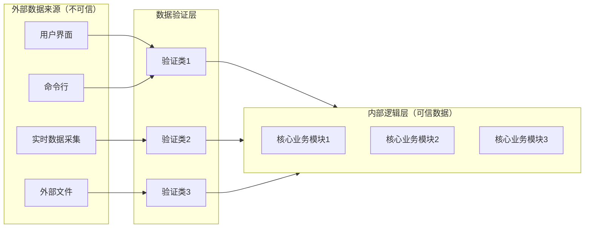

# 防御式编程

## 概述（Overview）
防御式编程（Defensive Programming）是一种软件设计哲学，旨在增强程序的**鲁棒性、可靠性和可维护性**。其核心目标是防止系统因不可信输入、异常状态或不可预知事件而崩溃，同时在保证正确性的前提下提供可恢复能力。

防御式编程不仅是单一编码技巧，而是**从输入验证、状态保护、运行时防护到自恢复治理的系统化方法论**。

---

## 防御式编程四层模型

| 层级 | 核心内容 | 工程实践示例 |
|------|---------|--------------|
| 输入验证层 | 清洗、校验外部不可信数据 | DTO 校验、Schema 检查、边界值验证 |
| 状态防御层 | 维护对象不变量、逻辑前置条件 | assert、invariant check、断言 |
| 运行时防护层 | 错误处理、异常传播、降级策略 | try-catch、重试机制、Fallback、Circuit Breaker |
| 自恢复与治理层 | 日志、监控、统一异常处理、自动恢复 | 结构化日志、SLO、探针、告警、熔断 |

> 通过此四层模型，防御式编程从**概念、代码到运维**形成闭环，提高系统健壮性与可观测性。

---

## 核心策略与方法

### 1. 输入验证（Validation）
- **目标**：隔离不可信数据，防止污染内部逻辑。
- **常用方法**：
  - 字段类型和边界检查
  - 格式校验（正则、schema）
  - 业务规则验证
- **设计原则**：
  - 不可信输入一律验证
  - 验证结果明确记录（日志/监控）

**示例：**

```java
if (userAge < 0 || userAge > 150) {
    throw new IllegalArgumentException("Invalid user age: " + userAge);
}
```

---

### 2. 状态防御（State Defense）
- **目标**：保证对象与系统状态的一致性。
- **核心工具**：
  - 断言（assert）
  - 不变量检查（invariant）
- **注意事项**：
  - 避免将业务逻辑嵌入断言
  - 开发环境启用，生产环境根据需求选择性启用

**示例：**

```java
assert a != 0 : "a cannot be zero";
```

> 断言用于捕获绝对不可能出现的状态，生产环境可以关闭以减少性能损耗。

---

### 3. 运行时防护（Error Handling & Exceptions）
- **目标**：在错误发生时，提供可控的响应策略。
- **策略分类**：

| 错误类型 | 推荐处理方式 | 注意事项 |
|-----------|------------|----------|
| 可修复数据错误 | 使用默认值、最近正确数据、最接近合法值 | 仅在不会影响业务正确性 |
| 临时系统错误 | 重试机制、延迟重试 | 避免无限循环 |
| 不可恢复错误 | 抛异常、Fail-fast、停止程序 | 保证程序安全性 |

- **异常处理原则**：
  - 异常必须携带完整上下文信息
  - 禁止空 catch
  - 对未捕获异常使用统一处理机制
  - 配合日志与监控进行治理

**示例：**

```java
try {
    processData(data);
} catch (DataFormatException e) {
    log.error("Invalid data format", e);
    throw e; // 或进行降级处理
}
```

---

### 4. 程序隔离（Program Isolation）
- **目标**：将不可信组件与核心业务逻辑隔离，减少传播风险。
- **实现模式**：
  - 数据验证层（Validation Layer）
  - DTO/VO 与内部模型分离
  - 边界防护（Boundary Objects / Anti-Corruption Layer）

**示例架构图（Mermaid）**：



---

### 5. 自恢复与辅助治理
- **目标**：在生产环境中尽量自动恢复，减少人工干预。
- **实践方法**：
  - 开发环境增加 fail-fast 测试逻辑
  - 生产环境保证错误可自恢复
  - 日志、监控、告警配合防御策略
- **原则**：
  1. 保留关键检查
  2. 尽量避免阻塞或崩溃

---

### 6. 防御与性能的平衡
- **原则**：
  - 保留检查重要错误的代码
  - 避免过度防御导致性能和复杂度增加
  - 静态分析、类型系统、合约式编程可减少运行时检查需求

---

## 防御式编程现代趋势
- **云原生与自动恢复**：
  - 利用探针、自动重启、熔断机制实现自愈
- **类型系统与静态分析**：
  - Null safety、不可变对象、合约式检查
- **可观测性驱动的防御**：
  - 指标监控、告警策略
  - 错误发生频率与影响范围分析
- **契约与合约式接口**：
  - OpenAPI、GraphQL schema 提前约束输入输出

---

## 总结
防御式编程是一种**从概念到工程实践的系统化方法论**。通过四层模型、错误分类、程序隔离和治理机制，可以在保证正确性与鲁棒性的同时，降低复杂度和运行风险。现代系统趋势强调可观测性、自动恢复和静态分析，使防御式编程不仅是编码技巧，更是**软件设计与运维的完整体系**。

## 关联内容（自动生成）

- [/软件工程/架构/系统设计/可观测性.md](/软件工程/架构/系统设计/可观测性.md) - 可观测性是防御式编程的重要组成部分，特别是自恢复与治理层中的监控、日志、告警等实践，与防御式编程的第四层模型紧密相关
- [/编程语言/JAVA/高级/异常.md](/编程语言/JAVA/高级/异常.md) - 详细阐述了Java异常体系，与防御式编程中运行时防护层的异常处理策略密切相关，包括异常分类、性能开销、系统设计中的异常处理等内容
- [/软件工程/微服务/服务治理/服务容错.md](/软件工程/微服务/服务治理/服务容错.md) - 涵盖了防御式编程中运行时防护层的关键技术，包括断路器模式、舱壁隔离、重试机制、熔断降级等策略，是防御式编程在分布式系统中的具体实现
- [/软件工程/架构/系统设计/可用性.md](/软件工程/架构/系统设计/可用性.md) - 涵盖了熔断、降级、限流等与防御式编程运行时防护层相关的技术，以及系统可用性保障的完整体系
- [/软件工程/领域驱动设计.md](/软件工程/领域驱动设计.md) - 包含了防腐层（Anti-Corruption Layer）概念，与防御式编程中程序隔离的边界防护模式密切相关，用于隔离外部不可信模型对内部系统的影响
- [/软件工程/软件设计/代码质量/防错设计.md](/软件工程/软件设计/代码质量/防错设计.md) - 与防御式编程相辅相成的设计理念，都关注系统的健壮性和错误处理，防错设计更侧重于预防错误的发生
- [/软件工程/架构/Web前端/前后端分离.md](/软件工程/架构/Web前端/前后端分离.md) - 涉及前后端双层输入验证，与防御式编程的输入验证层直接相关
- [/计算机网络/网络安全/Web安全.md](/计算机网络/网络安全/Web安全.md) - 涵盖输入验证安全，与防御式编程中输入验证层的安全考虑密切相关
- [/软件工程/软件设计/代码质量/编码规范.md](/软件工程/软件设计/代码质量/编码规范.md) - 包含异常处理和日志规范，是防御式编程实施的重要指导
- [/软件工程/架构/系统设计/网关.md](/软件工程/架构/系统设计/网关.md) - 网关作为系统入口，承担着输入验证、熔断、重试等防御式编程的关键职责
